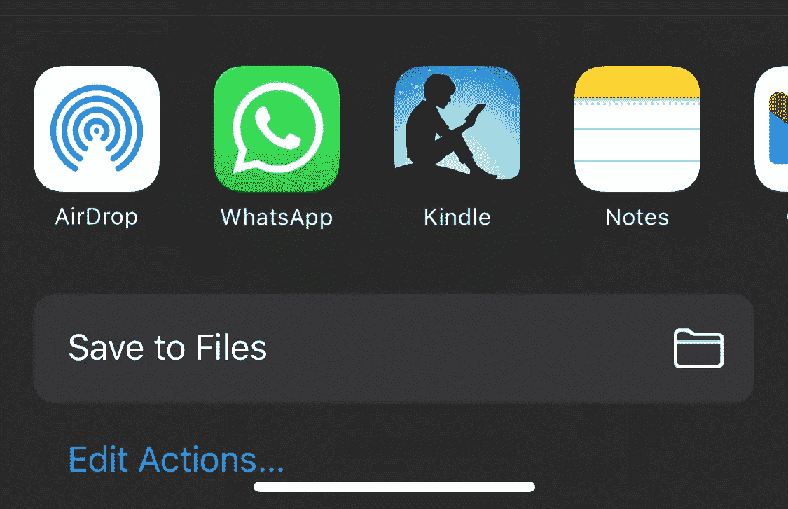
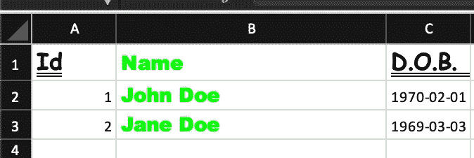

# 使用 React Native 生成和共享 Excel 风格的电子表格

> 原文：<https://betterprogramming.pub/generate-and-share-excel-styled-spreadsheets-using-react-native-e2034492c234>

## 创建一个生成和共享电子表格的 React 本地 Expo 应用程序


米卡·鲍梅斯特在 [Unsplash](https://unsplash.com?utm_source=medium&utm_medium=referral) 上的照片

# 为什么要用 ExcelJS？

如果你正在阅读这篇教程，也许你已经谷歌过“生成 excel react native”这个短语，并且和我一样，找到了[这个 StackOverflow 问题](https://stackoverflow.com/questions/51309125/react-native-how-to-create-excel-file-from-code)或者[这个故事](https://rushikeshvidhate.medium.com/export-data-to-excel-with-react-native-bc43fd10f681)。这些资源很好地总结了如何在 React Native 应用程序上使用 [SheetJS](https://github.com/SheetJS/sheetjs) 生成 Excel 文件。

然而，在我的例子中，我想设计一些行的样式并给单元格添加颜色来突出显示值。虽然专业版的 [SheetJS](https://github.com/SheetJS/sheetjs) 允许样式化你的电子表格，也许你想要一个免费的替代品。这可以通过 [ExcelJS](https://github.com/exceljs/exceljs) 实现。

如果你不需要造型并且满足于 [SheetJS](https://github.com/SheetJS/sheetjs) 的基本特性，我推荐你使用它，因为它似乎有很好的支持并且易于使用。如果您需要为电子表格添加样式，请遵循本教程。

# 创建您的项目

如果您已经有了一个 React 原生项目，或者熟悉使用 Expo 创建项目，那么您可以跳过这一节，直接跳到 Excel 生成。

我假设你有 Xcode 和一个 iOS 模拟器/设备，如果你是为 iOS 开发，或者 Android Studio 和一个 Android 模拟器/设备。如果您想要运行应用程序并查看更改，这些是必需的。要在您的设备上运行该应用程序，您可以在 [iOS](https://apps.apple.com/us/app/expo-go/id982107779) 或 [Android](https://play.google.com/store/apps/details?id=host.exp.exponent&hl=en&gl=US) 上安装 Expo 应用程序。在您的设备上运行该应用程序就像扫描二维码一样简单。

如果您从未使用 Expo 创建过项目，您可以使用 npm 在终端上安装 Expo CLI it:

```
npm install — global expo-cli
```

安装后，您可以使用 Expo CLI 创建一个项目:

```
expo init react-native-excel-style
```

您可以选择空白模板。我选择了打字稿。

在生成的项目文件夹中，您可以使用以下命令运行它:

```
npm start
```

在终端上，您可以通过按`a`在已安装的 Android 模拟器上运行项目，或者通过按`i`在 iOS 模拟器上运行项目。如前所述，你也可以通过扫描二维码在你的设备上运行它。您应该会看到这样的屏幕:


启动项目

现在我们已经有了一个正在运行的项目，让我们开始生成一个 Excel。

# 设置我们的应用程序

首先，让我们安装将用于生成 Excel 文件的依赖项，然后在下一步中共享它。在终端上运行:

```
npm install exceljs
expo install expo-file-system
expo install expo-sharing
```

现在我们可以开始写代码了。首先更改导入，并创建一个样式表来放置我们要创建的按钮:

用于生成 Excel 电子表格的导入、样式表和应用程序组件

至于 App 组件，我们添加了一个暂时不做任何事情的按钮。我们的简单应用程序应该是这样的:


只有一个按钮的应用程序，现在什么也不做

# 生成可共享的 Excel

让我们创建一个函数，该函数生成带有样式的 Excel 并返回 uri。该函数将创建一个名为“YourFilename.xlsx”的文件。要共享一个文件，我们不能直接共享它，需要将它存储在设备上，并获取一个本地 uri。由于我们不需要永久存储文件，我们可以将它存储在设备的缓存中，使用函数`FileSystem.cacheDirectory`获取缓存路径。

函数生成带有样式的 Excel 电子表格，并将 uri 返回到缓存目录

我们添加了一些信息，如创建者姓名、创建和修改日期。然后，我们添加一个名为“我的工作表”的工作表。在创建的工作表上，我们添加名为“Id”、“Name”、“D.O.B”的列，每个列都有不同的宽度。在您的应用程序中，您可以根据您的数据命名列，并添加包含您的数据项的行。

创建列之后，我们继续添加 2 行测试值。现在，对于有趣的部分，我们只能使用 [ExcelJS](https://github.com/exceljs/exceljs) ，我们添加**样式。在第一行，我们将字体改为漫画字体。为了进一步展示一些样式，我们将第二列的字体改为绿色。这些风格只是在 [ExcelJS](https://github.com/exceljs/exceljs) 的 GitHub 页面上可以看到的一些例子。根据这些示例，您可以根据自己的需要设置电子表格的行和单元格的样式。**

为了完成文件生成，我们使用函数`writeBuffer`，因为我们不能在 React Native 上使用 ExcelJS 的`writeFile`。然后我们将这个缓冲区转换成一个`base64`字符串。我们使用这个字符串以我们之前选择的文件名写入本地缓存，然后返回 uri。

# 共享文件

如果您需要生成一个 Excel 电子表格，可能您的用户希望与客户共享一些数据，所以让我们开始吧。幸运的是， [React Native 的世博会让这一切变得简单](https://docs.expo.dev/versions/latest/sdk/sharing/)。让我们创建一个调用我们刚刚创建的`generateShareableExcel`函数的函数:

函数来共享生成的 Excel 文件

获得 uri 后，我们调用 Expo 的`shareAsync`。我们需要为一个 Excel 文件设置合适的`mimeType`和`UTI`。当调用这个函数时，可以使用可用的应用程序在 iOS 和 Android 设备上共享生成的文件，如 iOS 上的电子邮件、WhatsApp 甚至隔空投送。

**测试我们的应用**

为了测试我们的功能，让我们将 App 组件上不执行任何操作的按钮更改为以下内容:

```
<Button title=’Generate Excel’ onPress={shareExcel} />
```

如果我们运行应用程序并按下按钮，我们应该会看到以下内容:


在 iOS 模拟器上打开共享对话框

由于这个视频是在 iOS 模拟器上录制的，我们没有看到太多的选项。但在设备上，我们应该可以看到我们已经安装的应用程序，我们可以用来分享，如隔空投送，WhatsApp 和 Gmail。



iOS 设备上的共享选项

如果我们在 Android 模拟器上运行该应用程序，我们可以看到 Gmail 和 Drive 等选项。在 Android 设备上运行它应该会给你你已经安装的应用程序。


在 Android 模拟器上打开共享对话框

如果我们将生成的文件发送到我们的电子邮件并下载，当我们在 Excel 上打开它时，应该会看到以下内容:



下载我们生成的 Excel 文件

正如我们所看到的，我们添加的样式正在工作。现在您可以继续修改这段代码，生成您自己的带有样式的电子表格，并共享它们:)

# 结论

如果你想看看整个项目，请查看 [GitHub repo](https://github.com/rolisanchez/react-native-excel-style) 。

感谢阅读！