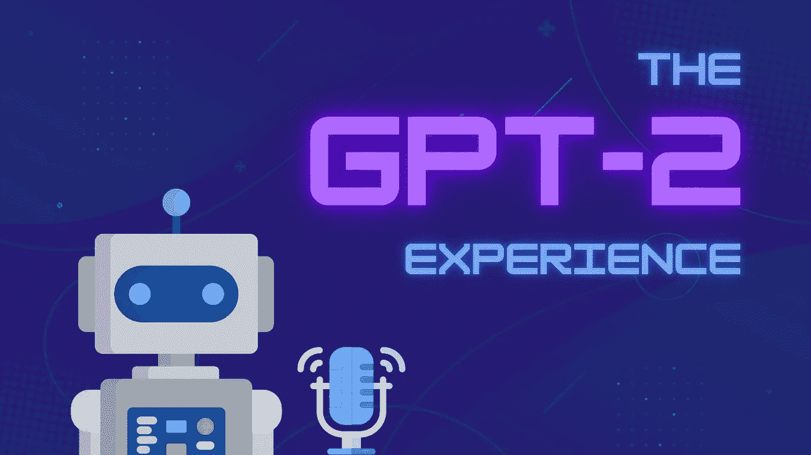

# 使用 GPT-2 和谷歌 WaveNet 制作对话播客

> 原文：<https://betterprogramming.pub/generate-conversational-podcasts-with-gpt-2-and-google-wavenet-1dc9c2edc3ef>

## 永远听你最喜欢的播客

*作者图片*

GPT-2 已经进行了许多生殖实验，从栩栩如生的聊天机器人到复制 Twitter 个人资料。

来自 OpenAI [博客](https://openai.com/blog/better-language-models/)，GPT-2 是一个大型的基于 transformer 的语言模型，拥有 15 亿个参数，在 800 万个网页的数据集上进行训练。

随着播客的风靡，如果我们可以用 GPT 2 和文本到语音生成逼真的对话会怎么样？

下面是我根据埃隆·马斯克关于乔·罗根的经验对 GPT-2 进行微调后得出的一个例子:

这个教程的所有文件都可以在[这里](https://github.com/thesanjeetc/PodcastGenerator)找到，减去微调的模型。

# 准备笔录

截至发稿时，埃隆·马斯克已经完成了三集《乔·罗根的经历》——也就是八个多小时的对话！

微调的一个重要部分是通过遵循特定格式和清除随机伪像来标准化输入文本。对于播客抄本来说，这意味着要清楚地区分主持人和嘉宾的对话，并删除时间戳。

由于文字记录来自不同的网站，因此有许多不一致之处。这是一个文件中的[原始抄本](https://raw.githubusercontent.com/thesanjeetc/PodcastGenerator/main/transcriptsOriginal.txt)。

通过一点点[正则表达式](https://regexr.com/)的魔力，我们可以很容易地清理它，得到[想要的输出](https://raw.githubusercontent.com/thesanjeetc/PodcastGenerator/main/transcriptsFormatted.txt)。代码如下:

# 与 GPT-2 展开对话

现在是时候开始全新的从未说过的对话了。

我们将使用`[gpt-2-simple](https://github.com/minimaxir/gpt-2-simple)`库与 GPT 2 号一起工作。我为这个教程创建了一个简化的 Colab [笔记本](https://colab.research.google.com/drive/1jaJB6Zbo2Ulb22CQzShpcJJWjF4VXDTk#scrollTo=I0knKJEmS4dg)——关于更深入的讨论，请参见 Max Woolf 的精彩博文。

## 设置

安装所需的库并运行导入。

## 火车

1.  为了保存和加载模型，最好安装您的驱动器。将格式化的抄本文件拖到您的主驱动器文件夹中。
2.  确保您在`Runtime > Change runtime type`之前拥有 GPU 运行时。
3.  似乎“中型”1.5GB 模型最适合我们生成对话对话的用例。由于内存限制，较大的模型不能在 Colab 空闲层上进行微调。代码如下:

现在是时候微调 GPT-2 了——这需要一些时间，所以赶紧喝杯咖啡☕️.吧完成后，模型将保存到您的驱动器中以备将来使用。以下是该任务的代码:

## 产生

1.  出于演示目的，重新启动运行时，重新运行导入并从 Drive 加载回您的模型。
2.  现在是时候开始对话了。请随意试验参数。请注意——它有时会变得相当疯狂！

我发现，在挑选对话进行监管时，用批量生成的文本保存文件要容易得多。

# 使用 Google WaveNet 添加语音

在撰写本文时，谷歌 WaveNet 似乎仍然以 API 的形式提供了最逼真的声音。你可以尝试不同的声音参数[这里](https://cloud.google.com/text-to-speech/#section-2)。

1.  `pip install --upgrade google-cloud-texttospeech`
2.  按照这些步骤设置凭证[。](https://cloud.google.com/text-to-speech/docs/libraries#setting_up_authentication)
3.  用所需参数更新`config.json`并运行`speak.py`。

仅此而已。现在你有能力听埃隆·马斯克无休止地谈论他的想法了！

# 结束语

这是一个非常有趣的兼职项目。我创造了许多有趣的对话，甚至发表了一些播客:

[**埃隆·图斯克**](https://rickandmorty.fandom.com/wiki/Elon_Tusk)——图斯克拉公司首席执行官

这种设置有很大的实验空间，从不同的客人微调到不同的声音，甚至多个角色在一个小组中交谈。

最近，OpenAI 发布了包含 1750 亿个参数的[GPT-3](https://openai.com/blog/openai-api/)——比 GPT-2 大 17 倍！然而，在撰写本文时，它只能通过私有的 beta API 访问，生成长格式文本可能会变得非常昂贵。所以目前来看，GPT-2 似乎最适合这个用例。

倾听 GPT 2 号和它自己之间的对话会令人毛骨悚然地把你吸引进去。栩栩如生的声音让幻觉栩栩如生——内容生成的未来是什么？

感谢阅读。