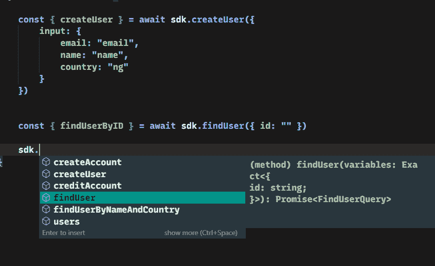
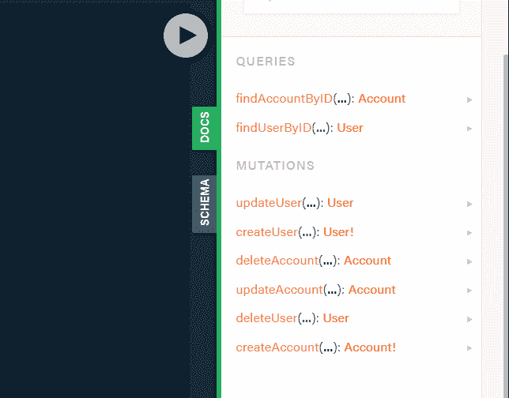
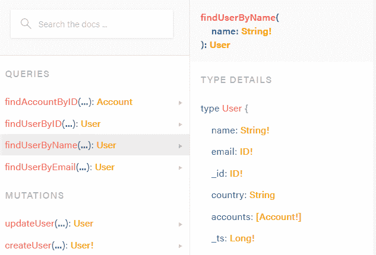
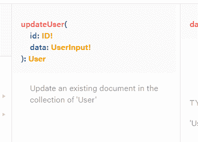
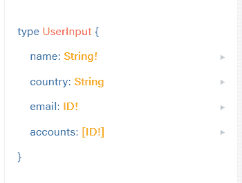
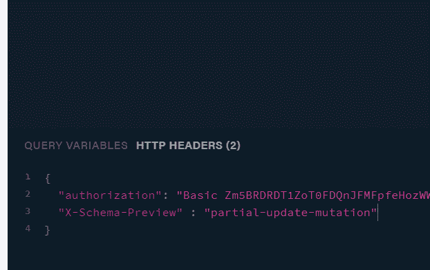
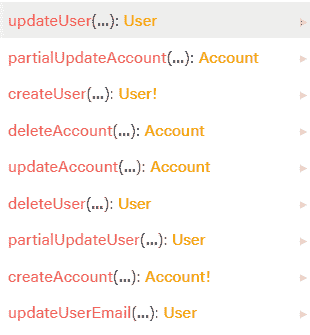
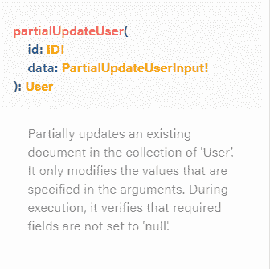
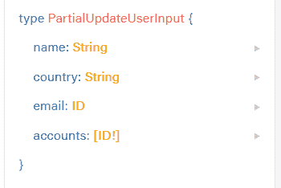

# 为动物群生成完全类型化的 GraphQL 客户端

> 原文：<https://betterprogramming.pub/generate-fully-typed-graphql-clients-for-fauna-843ee7736ea>

## 立即改进您的 GraphQL 游戏


图片由作者提供

无服务器技术席卷了整个开发世界。有了它，您再也不必管理基础架构，几乎可以毫不费力地进行扩展以满足不断增长的需求，而且计费可以在函数调用级别上精确完成。

[动物界的](https://fauna.com/)价值主张就在这里。它是极少数无服务器数据库之一。有了[动物群](https://fauna.com/)，你永远不必考虑服务器管理，你的数据分布在全球，提供给最近地区的客户。动物的成本随着你而增长。它有一个非常慷慨的免费层，允许您以最小的风险开始构建。

原生 GraphQL 查询支持也是 Fauna 的关键卖点之一。Graphql 是一种非常方便的查询语言。所有的操作都被输入和验证，多个查询和变化可以很容易地通过一个网络调用进行批处理和发送。动物群还允许通过 FQL 定制业务逻辑；是原生 API。

最重要的是，由于 GraphQL 的类型化特性，可以创建代码生成工具来从 GraphQL 模式和操作中生成代码。

这就是这篇文章的内容。在本文中，我们将学习如何从 Fauna GraphQL 模式创建 TypeScript GraphQL 客户端。

**先决条件**

1.  节点. js
2.  以打字打的文件
3.  Graphql
4.  Graphql [代码生成器](https://graphql-code-generator.com/)
5.  一个免费的[动物账户](https://dashboard.fauna.com/accounts/register)
6.  [动物外壳](https://docs.fauna.com/fauna/current/integrations/shell/index.html)

本文假设您对前三者相当了解。

# 为什么不手工编写客户端代码？

举个例子吧。假设您使用流行的 [graphql-request node](https://www.npmjs.com/package/graphql-request) 库从一个假想的 GraphQL API 中获取了一些用户，其模式如下:

使用 graphql-request 库将如下所示:

这种方式是:

*   耗时，因为您必须手动编写所有内容。每次架构更改时，返回值和查询变量的 TypeScript 定义都必须同步
*   容易忘记用户查询的数据类型，尤其是如果字段经常变化

这个问题的解决方案是 Graphql 代码生成器。对于本文，我们将使用 Graphql 代码生成器来完成以下工作:

1.  从您的动物群 GraphQL 模式、操作和片段中生成类型脚本类型
2.  在您定义的 GraphQL 操作(查询和变异)上生成一个完全类型化的包装函数

这是本教程的最终结果:



设置此配置的好处包括:

1.  它为 GraphQL 操作提供了智能感知和自动完成功能。
2.  每当您创建或修改操作和 GraphQL 模式时，同步生成的客户机的工作量就会减少很多。
3.  生成的 TypeScript 客户端不必包含在单元测试中。因为它是由已经通过单元测试的工具生成的，所以可以相信返回类型是正确的。

我们将介绍使用您的 Fauna 模式生成 GraphQL 客户端的步骤，但是本教程可以推广到您选择的任何 GraphQL API。

**以下是高级步骤:**

1.  创建动物群 GraphQL 规范—我们需要告诉动物群数据应该是什么样的。
2.  在步骤 1 中导入 Graphql 规范后，导出由 Fauna 生成的 Graphql SDL。
3.  将 GraphQL 客户端生成器指向从步骤 2 中获得的 SDL 文件。
4.  写一些 GraphQL 操作，生成客户端。

在开始之前，我们将设置我们的项目，创建一个新文件夹，并在这个文件夹中用`npm init`初始化一个新的节点项目。

现在我们准备开始了。

# 1.创建动物群图表规范

我们将为一个假想的用户银行账户数据库构建一个简单的客户端。它将存储用户的一些个人信息。用户将能够拥有多个银行账户，数据库将支持贷记和借记指定的银行账户。

首先，让我们创建一个 GraphQL 规范文件，上传到 Fauna。

在项目的根目录下，创建一个名为`Fauna`的文件夹，并在其中创建一个名为`datamodel.graphql` 的文件:

```
mkdir faunadbtouch faunadb/datamodel.graphql
```

将 GraphQL 规范复制到这个文件中(`datamodel.graphql`)。

请注意，`User` 类型与`Account` 类型是一对多关系，因为有`accounts` 数组字段。我们还在`Account` 类型上指定了一个 owner 字段，以保持对关联的`User` 类型的引用。`@relation`指令表明`Account`和`User`实体之间存在双向关系。我们对`email`字段施加了一个唯一的约束，确保两个用户不能有相同的电子邮件。

# 2.导入 Graphql 规范文件

## 创建一个新的动物数据库

首先，我们需要安装动物外壳:

```
npm i -g fauna-shell
```

接下来，使用以下命令验证 fana-shell:

```
fauna cloud-login
```

创建新数据库:

```
fauna create-database tutorial
```

创建一个管理密钥，该密钥将允许 API 以编程方式使用动物群:

```
fauna create-key tutorial
```

复制生成的密码——我们以后会用到它。

## 导入 datamodel.graphql

现在我们可以将`datamodel.graphql`文件导入到新创建的数据库中。

我们将使用`[https://graphql.fauna.com/import](https://graphql.fauna.com/import)`端点将我们创建的模式导入到数据库中。

运行以下命令:

```
curl -u <key-secret>: [https://graphql.fauna.com/import](https://graphql.fauna.com/import) — data-binary “@./faunadb/datamodel.graphql”
```

我们还可以用一个脚本来更新`package.json`文件，以运行该命令:

```
“scripts”: {
   “fauna-upload”: “curl -u <key-secret>: [https://graphql.fauna.com/import](https://graphql.fauna.com/import) --data-binary \”@./faunadb/datamodel.graphql\””
}
```

然后运行:

```
npm run fauna-upload
```

一旦完成了这些，就创建了基于模式的集合和索引。您可以使用以下命令查看这些内容:

```
fauna shell tutorialPaginate(Union(Collections(),Indexes()))
```

您应该得到类似于以下内容的结果:

```
{data: [Collection(“Account”),Collection(“User”),Index(“unique_User_email”),Index(“account_owner_by_user”)]}
```

现在让我们来看一下模式动物群为我们导入的数据模型生成的模式。转到 [graphqlbin](https://www.graphqlbin.com/v2/new) ，使用`[https://graphql.fauna.com/graphql](https://graphql.fauna.com/graphql)`作为端点 URL。

在“标题”选项卡中添加授权标题:

```
{“Authorization”: “Bearer <secret>”}
```

动物群会自动为您创建一些查询和突变:



Fauna 基于导入的模式生成一个基本的 CRUD API。

但是如果我们想要的不仅仅是这些基本操作，比如说您想要通过电子邮件或姓名来查找用户，只需在模式文件中添加一个`Query`类型:

然后通过运行模式上载脚本来更新模式:

```
npm run fauna-upload
```

一旦您完成了这些，您将会看到 fauna 已经创建了与 GraphQL 文件中定义的查询相匹配的新查询。



让我们再深入一点:

比方说，我想找到一个具有特定名称和国家的用户。以下是如何做到这一点:

```
findUserByNameAndCountry(name: String!, country:String!): User
```

如果您想让所有用户而不是单个用户满足该条件:

```
findUsersByNameAndCountry(name: String!, country:String!): [User]
```

如果您想获得数据库中的所有用户:

```
users: [User]
```

那么这是如何工作的呢？

Fauna 检查名称、查询参数和返回类型，然后基于这些生成必要的查询索引。

让我们查看用以下命令创建的索引:

动物群创建索引，其名称与`datamodel.graphql`文件中定义的操作名称相关。索引允许使用它们的字段来检索文档，例如`User`集合中的电子邮件和名称。

因此，不能对不存在的字段使用 GraphQL 操作参数:

```
**findUserByAge(age: Int!):User**
```

动物群会对此进行类似的抱怨:

*   架构没有通过验证。违规:"
*   对象“用户”没有名为“年龄”的字段。(第 25 行，第 18 列):"
*   " findUserByAge(年龄:Int！):用户"

# 突变呢？

动物群已经产生了一些变异，但是这些变异的问题是，为一个类型指定的所有不可为空的字段都是强制的:



那么，如果你想更新一个用户的电子邮件，而不必指定姓名，该怎么办呢？

这可以通过两种方式实现:

1.  添加一个`partial-update-mutation`标题
2.  使用`@resolver`指令的自定义解析器

## 使用部分更新变异标头

最简单的方法是通过指定一个头文件`X-Schema-Preview`来启用`partial-update-mutation`模式预览。像这样:



现在，当您检查 GraphQL docs 选项卡时，您会注意到出现了新的变化:



## 使用@resolver 指令

一个更可靠的替代方案是使用`@resolver`指令。`@resolver`指令允许您将 FQL 函数附加到 GraphQL 操作上。FQL 函数类似于 MySQL 中的存储过程。

```
type Mutation {**updateUserEmail(id:ID!, email: ID!): User @resolver**}
```

这指定了`updateUserEmail` 突变与一个与该突变同名的用户定义函数相关联。

为了简洁起见，这篇文章不会深入到 FQL，但是官方的[文档](https://docs.fauna.com/fauna/current/api/fql/)可以很好地帮助你了解最新情况。

现在转到命令行，进入数据库 shell:

```
fauna shell tutorial
```

我们将创建一个名为`updateUserEmail` **:** 的用户自定义函数

我们使用`CreateFunction` 来创建新的用户自定义函数。它接受一个带有名称和正文字段的对象。body 字段总是包装在查询函数中的 lambda 函数。lambda 函数的第一个参数是一个字符串数组，其值必须对应于与`@resolver`指令相关的变异的输入。

让我们利用这个机会创造两个新的突变:

```
type Mutation {updateUserEmail(id: ID!, email: ID!): User @resolver***# New*****creditAccount(id:ID!, value: Float!): Account @resolver****debitAccount(id:ID!, value: Float!): Account @resolver**}
```

然后我们将创建它们相应的 FQL 函数:

`**creditAccount**` **:**

`**debitAccount**`:

# 3.生成 TypeScript SDK

现在是文章的核心:让我们使用 [graphql-codegen](https://graphql-code-generator.com/docs/plugins/typescript) 创建一个完全类型化的 TypeScript SDK。

首先，我们将安装 npm 库及其依赖项:

```
npm install — save graphql graphql-requestnpm install — save-dev @graphql-codegen/cli @graphql-codegen/typescript-graphql-request @graphql-codegen/typescript-operations @graphql-codegen/introspection
```

更新您的`package.json` scripts 对象，以包含用于生成代码的脚本:

在项目目录的根目录下创建一个名为`fauna-sdk.yml`的文件，内容如下:

documents 字段指定一个搜索模式来查找包含 GraphQL 操作的 GraphQL 文件。第 8 行指定生成的 SDK 应该在`./generated/sdk.ts` **中创建。**

如果使用部分变异，记得在`fauna-sdk.yml`的头部分添加`X-Schema-Preview`头。

目前，我们的文件夹结构应该是这样的:

```
.├── faunadb│ ├── datamodel.graphql├── fauna-sdk.yml├── package.json
```

我们快完成了。让我们指定一些 GraphQL 操作。我们将把这些操作放在查询和突变文件夹中:

每个操作都写在一个单独的文件中，但这是可选的——如果方便的话，您可以使用单个文件。

现在运行代码生成脚本:

```
npm run faunasdk-gen
```

生成一个新文件`./generated/sdk.ts`

# 4.使用 SDK

下面是使用 SDK 的方法:

您使用 Fauna 的 graphql 端点创建了一个 graphql-request 客户端:

`[https://graphql.fauna.com/graphql](https://graphql.fauna.com/graphql)`

这个网址是固定的，永远不会改变。在命令行中，输入以下命令来创建服务器密钥:

```
fauna create-key tutorial server
```

使用`fauna_key` 变量的这个键，就完成了。

现在，只要您的动物数据模型发生变化，只需运行:

```
npm run fauna-upload && npm run faunasdk-gen
```

如果只有您的 GraphQL 操作文件发生了变化，只需运行:

```
npm run faunasdk-gen
```

如果您的开发涉及非常频繁的更改，您可能应该将这些命令附加到一个文件监视器上，并让它在后台运行。这样，您的 GraphQL 客户端将始终保持同步。

# 结论

祝贺你到达这篇文章的结尾。期望看到您的 GraphQL 开发工作流的巨大生产力增益。这个工作流程是可以通用的，但是 vana 的原生 Graphql 接口有一定的协同作用。

在 [GitHub](https://github.com/scroobius-pip/autogenerated-fauna-clients) 上找到教程报告

感谢阅读！