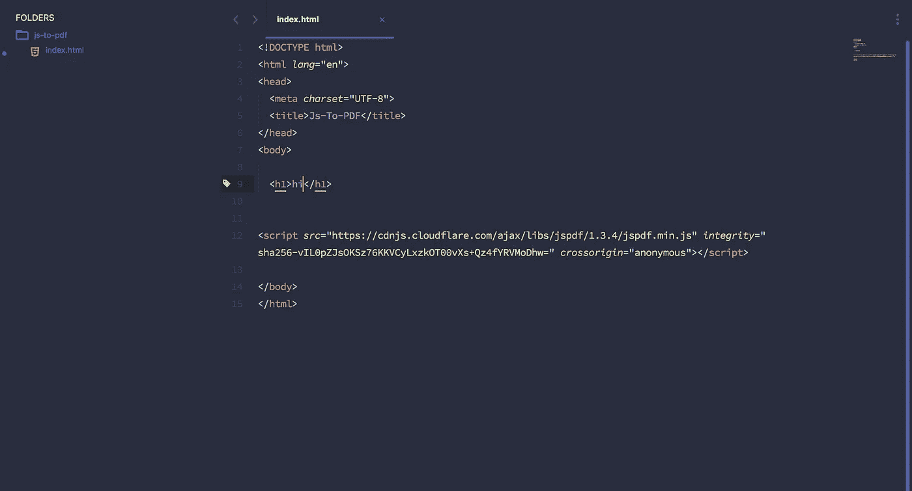
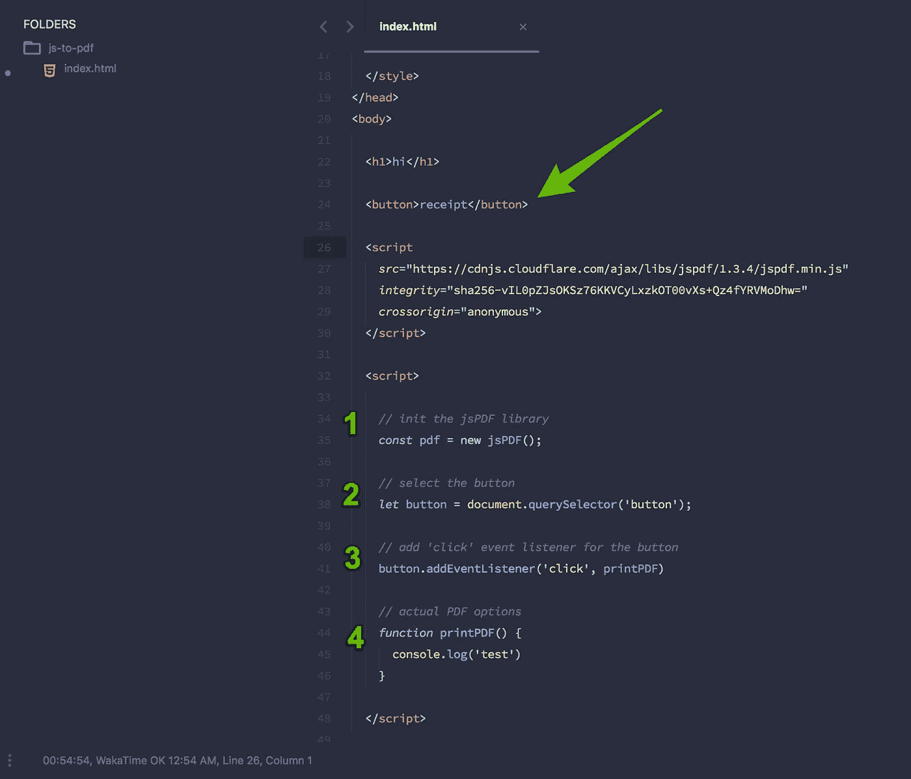
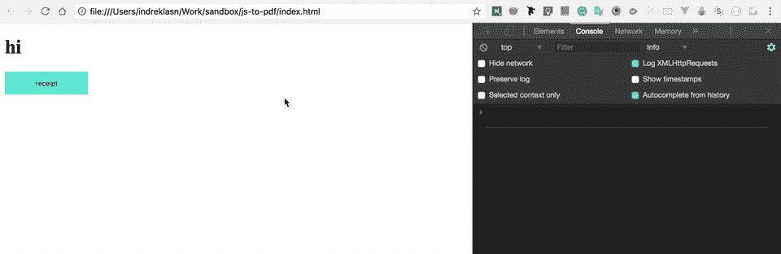
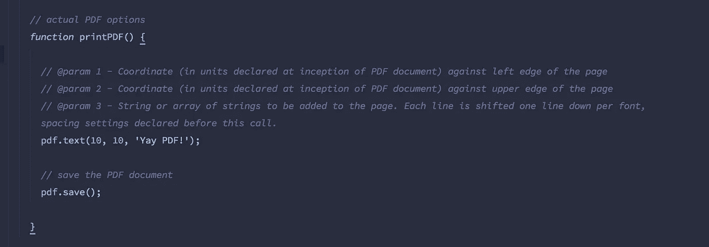
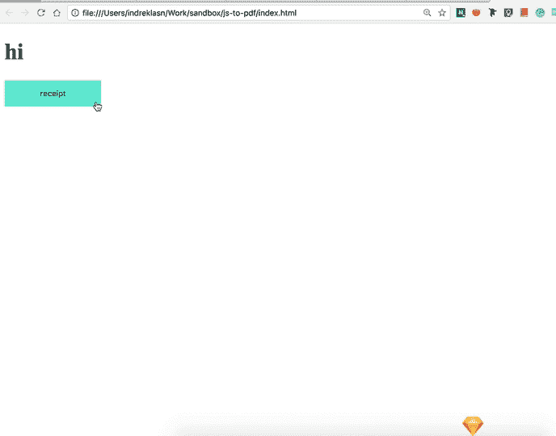
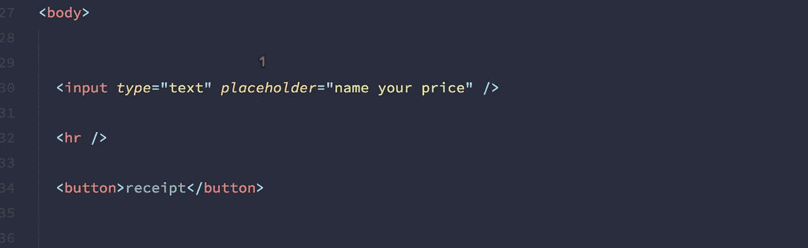
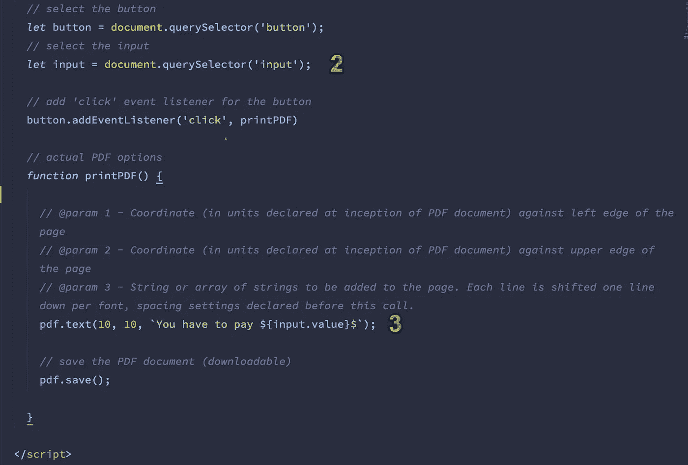

# 如何用 JavaScript 生成 PDF 发票

> 原文：<https://betterprogramming.pub/generate-pdf-invoices-with-javascript-c8dbbfb56361>

## 只用几行代码创建一个 PDF


作者照片。

假设你写了一个购物车。购物车已经快完成了，但是还缺少一样东西:寄出购物发票！大多数情况下，发票以[可移植文档格式(PDF)](https://en.wikipedia.org/wiki/Portable_Document_Format) 发出。

为什么是 PDF？这里有一个相当简单的答案:PDF 易于使用，几乎任何设备都可以阅读这种格式的文档。

让我们开始吧！

假设您非常了解 JavaScript 的基础知识，让我们从制作我们的小项目目录开始。打开您的终端，写下以下命令:

```
$ mkdir js-to-pdf && cd js-to-pdf
```

不言自明。我们创建项目并导航到项目文件夹。

接下来，让我们制作`index.html` 文件:

```
$ touch index.html
```

在`[jsPDF](https://cdnjs.com/libraries/jspdf)` [包](https://cdnjs.com/libraries/jspdf)的帮助下，我们可以从客户端生成 pdf。



这是我们目前拥有的。

*注意:在现实场景中，我们会使用* `*NPM*` *来安装我们的依赖项。这是一堂关于 jsPDF 库的课。*

好了，我们写点代码吧。



我们添加了一个`<button></button>`，这样我们就有了一个“get receipt”按钮。

1.  我们把图书馆扩建了，这样我们就可以使用和参考它。
2.  然后我们选择`button`。
3.  接下来，我们为`button`添加`'click'`事件监听器，并传递`printPDF`回调。之所以是`printPDF`而不是`printPDF()`是因为我们不想在页面加载时立即触发回调。我们想在有人点击按钮时触发`printPDF`功能！
4.  最后，我们添加了一个名为`printPDF`的函数。这是真正的 PDF 选项所在。
5.  哦，把这些样式添加到`<head>`:

让我们用自己喜欢的浏览器打开我们的`index.html`。是的，所有人！



# JS 转 PDF 时间！

那么这是如何工作的呢？嗯，原来很简单！

让我们用我们心爱的`printPDF`函数，在里面包装一些简单的额外函数:



为了节省空间，我添加了解释说明。

好，我们来测试一下！点击我们的按钮！



哇，就这么简单！没什么好害怕的。我们有了第一份 PDF 文件。

目前，我们的 PDF 是非常静态的。它没有互动性，而且永远都是一样的。来加点互动性吧！

1.  在我们可以放置值的地方添加`input`。
2.  用 Javascript 选择`input`。
3.  吐出`text()`方法里面的`input`值。



好，我们来测试一下！


有用！酷！如果你想了解更多关于格式化 pdf 的信息，请前往[文档](http://rawgit.com/MrRio/jsPDF/master/docs/)。

如果你想让你的 JavaScript 能力更上一层楼，我推荐阅读你不知道的 JS 系列丛书 [*。*](https://amzn.to/2LSDpG6?source=post_page---------------------------)

一如既往，感谢您的宝贵时间。保持牛逼！

[源代码](https://github.com/wesharehoodies/js-to-pdf)在 GitHub 上有。