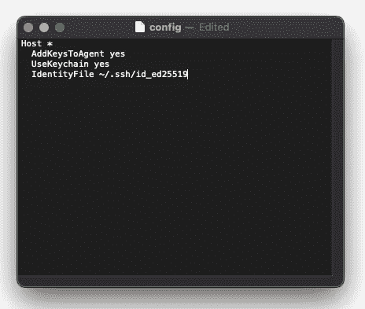
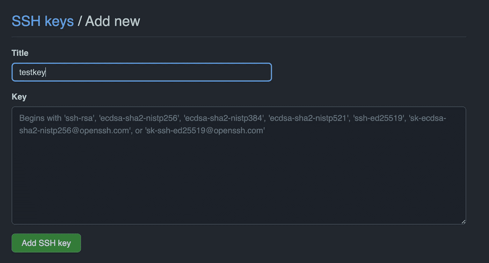

# 生成 SSH 密钥并修复 Mac 上的权限问题

> 原文：<https://betterprogramming.pub/generate-ssh-keys-and-fix-permission-issue-on-mac-2d1cb79a8e55>

## 快速有效地在 SSH 密钥之间切换


在 [Unsplash](https://unsplash.com/s/photos/github?utm_source=unsplash&utm_medium=referral&utm_content=creditCopyText) 上 [Praveen Thirumurugan](https://unsplash.com/es/@praveentcom?utm_source=unsplash&utm_medium=referral&utm_content=creditCopyText) 拍摄的照片

我不止一次遇到过关于当前 SSH 密钥的权限问题。每当我试图通过 git push 或 pull 访问 GitHub 库时，就会出现这个错误。我尝试了一些我在网上找到的解决方案，但无济于事。

我想我现在已经找到一个持续有效的了！

> 如果你想跳过包含错误描述和 ssh 密钥的部分，只需进入文章底部的修复权限部分。

错误是这样的…

```
git@github.com: Permission denied (publickey)
fatal: Could not read from remote repository. Please make sure you have the correct access rights and the repository exists.
```

让我们先回顾一下为什么会出现这个错误。

# 错误的存储库引用

第一个问题可能是存储库本身不存在。您不能提取、提取或推送不存在的回购协议！这就是为什么不存在的回购可能是问题所在。

然而，我认为这并不常见——人们可能会认为开发人员了解他们试图与之交互的回购。也许他们拼错了什么，但我认为第二个原因更有可能是原因。

# 错误的 SSH 密钥

当我说“坏的”SSH 密钥时，我指的是一个没有被正确引用或者正被错误的 repo/GitHub 帐户使用的密钥。不管是什么原因，我想我已经找到了一个非常有效的解决这些冲突键的方法，这个方法叫做`[ssh-add](https://www.ssh.com/academy/ssh/add)`。

# SSH 密钥

`ssh-add`是将 [SSH 私钥](https://www.ssh.com/ssh/identity-key)添加到 SSH 认证代理中的命令，实现与 [SSH](https://www.ssh.com/ssh/) 的单点登录。这很有用，因为在 GitHub 上，您可以使用 [SSH keys](https://jdblischak.github.io/2014-09-18-chicago/novice/git/05-sshkeys.html) 来标识自己，而不需要每次都输入用户名和密码。

这些密钥提供了一种安全有效的方法来验证您的 GitHub 凭证以及与 GitHub repo 相关的权限。在我深入研究`ssh-add`之前，让我快速介绍一下如何生成 SSH 密钥，如果您还没有的话。

> 如果你想跳过这一部分，只需转到文章底部的修复权限部分。

# 创建一个 SSH 配置文件

这个文件是存放 SSH 密钥的地方，以后会引用它。您还可以在这里指定与您的 ssh 密钥相关的各种属性，包括它应该使用什么 URL(或“主机”)、“身份文件”(即 SSH 密钥本身的路径)、是否使用 keychain 等。

如果你已经有了，你可以跳过这一步。如果你没有，你可以在你的终端中用下面的命令创建一个。

```
touch ~/.ssh/config
```

这将在 Mac 上的`ssh`目录下创建`config`文件。创建之后，您可以添加第一组 SSH 关键参数。请参见下面的配置文件示例:



现在不要太担心其他属性。让我们只关注`IdentityFile`的财产。生成 SSH 密钥后，它将存放在这里。通过使用 SSH 配置，您可以更无缝地找到并使用您需要的任何密钥——如果您有多个 SSH 密钥或 GitHub 帐户，这肯定会很方便。

稍后会有更多的介绍。

# 生成您的 SSH 密钥

现在您已经准备好了您的配置文件，让我们生成密钥本身(它将在`IdentityFile`被访问)。在您的终端中，使用您的帐户电子邮件运行以下命令。

```
ssh-keygen -t ed25519 -C "*your_email@example.com*"
```

或者，如果你使用的是传统系统，你可以使用`rsa`而不是`ed25519`格式。按回车键。这将生成文件。

当提示您“输入保存密钥的文件”时，只需按 Enter 键。这接受默认文件位置(即`IdentityFile`的位置)。然后您会得到第二个提示，要求您输入密码。这个[密码短语](https://docs.github.com/en/authentication/connecting-to-github-with-ssh/working-with-ssh-key-passphrases)可以是您喜欢的任何内容。

# 添加您的密钥

现在您已经有了密钥和配置文件，让我们将密钥添加到 ssh 代理中。您可以通过使用以下命令打开代理来实现这一点:

```
eval "$(ssh-agent -s)"
```

如果代理成功打开，您应该在终端中看到一个`Agent pid …`。代理打开后，您可以使用下面的命令添加新生成的密钥。

```
ssh-add ~/.ssh/id_ed25519
```

你可以在`ssh-add`后面加上`-K`来使用上面的命令，但是这对我不起作用。对我有用的是没有`-K`的命令。我们一会儿再回来讨论`ssh-add`。

# 向 GitHub 添加 SSH 密钥

最后一步是向 GitHub 添加 SSH 密钥。为此，只需复制 SSH 密钥的`.pub`版本。这是您的 SSH 密钥的[公共版本，将允许您的本地 SSH 代理与您的 GitHub 连接。使用下面的命令复制这个公钥。](https://kb.iu.edu/d/aews)

```
pbcopy < ~/.ssh/id_ed25519.pub
```

或者，您可以导航到 SSH 密钥在 finder 中的存储位置，在文本编辑器中打开它，并以这种方式复制它。一旦密钥被复制，转到 GitHub 上的 [SSH 密钥部分，点击 New SSH Key。现在您可以添加一个标题，并将您复制的 SSH 密钥粘贴到它们各自的文本字段中。](https://github.com/settings/keys)



添加名为“testkey”的新 SSH 密钥的示例

点击添加 SSH 密钥，就可以了！

> 要更深入地了解 SSH 密钥的生成和添加，请查看 GitHub 文档。

# 修复权限

现在您已经了解了如何生成和添加 SSH 密钥，让我们回到权限问题。

对我来说，这个问题突然出现是因为我有两个 GitHub 帐户(有不同的 SSH 密钥)。理论上，我的 ssh 配置文件应该已经处理好了，因为我区分了两台主机(一台包含我的个人 GitHub 帐户，一台包含我的公司 GitHub)。

我不太确定为什么仅仅这样不能解决问题。根据我的研究，SSH 代理应该能够识别各个 GitHub 远程中使用的 URL(一些包含公司名称，另一些包含我的个人 GitHub 用户名)。

*如果任何人有任何进一步的建议，为什么这两个主机不能被区分开来，请留下评论！我还想补充一点，我有我公司 Gitlab 账户的第三个 SSH 密钥。在我的公司 GitHub 和 Gitlab 之间切换从来没有给我带来任何问题。*

为什么我的两个 GitHub SSH 密钥不合作…

我不知道。

也许我会重访它，并就此写一篇文章！现在，让我们看看我找到的解决方案。

# 解决方案

尽管我的 ssh 配置不能正常工作，但我能够重用`ssh-add`来手动更改为我目前想要使用的任何 SSH 密钥。我只需要提供我想要使用的 SSH 密钥的位置(`IdentityFile`)，然后`git push — set-upstream ...`就可以如我所愿地进行拉/取/推了！

以下是步骤:

```
> ssh-add ~/.ssh/id_YOUR_KEY
> git push --set-upstream YOUR_REMOTE
```

如果这个解决方案对你不起作用，也许其他[](https://stackoverflow.com/questions/2643502/git-how-to-solve-permission-denied-publickey-error-when-using-git)**中的一个可能会有帮助！**

*你有别的解决方法吗？或者知道为什么我的 ssh 配置文件可能无法工作吗？请在评论中告诉我！*

*[***升级您的免费 Medium 会员资格***](https://matt-croak.medium.com/membership) *并接收各种出版物上数千名作家的无限量、无广告的故事。这是一个附属链接，你的会员资格的一部分帮助我为我创造的内容获得奖励。**

**您也可以通过电子邮件* *订阅，每当我发布新内容时，您都会收到通知！**

# *参考*

*[](https://stackoverflow.com/questions/2643502/git-how-to-solve-permission-denied-publickey-error-when-using-git) [## Git:如何解决使用 Git 时权限被拒绝(publickey)错误？

### 当您正在访问 SSH URL(读/写)而不是 Git 只读 URL，但是您没有…

stackoverflow.com](https://stackoverflow.com/questions/2643502/git-how-to-solve-permission-denied-publickey-error-when-using-git)  [## SSH 中的身份密钥是什么？

### 身份密钥是用于授予对服务器的访问权限的私钥。它们是一种，用于公共场合…

www.ssh.com](https://www.ssh.com/ssh/identity-key) [](https://www.ssh.com/ssh/) [## SSH 安全外壳主页，由 SSH 协议发明者塔图·伊洛宁维护。SSH 客户端、服务器…

### 这是 SSH(安全外壳)协议、软件和相关信息的起始页。SSH 是一个软件…

www.ssh.com](https://www.ssh.com/ssh/) [](https://jdblischak.github.io/2014-09-18-chicago/novice/git/05-sshkeys.html) [## GitHub 的 SSH 密钥

### 目标解释什么是 SSH 密钥生成您自己的 SSH 密钥对将您的 SSH 密钥添加到您的 GitHub 帐户了解如何…

jdblischak.github.io](https://jdblischak.github.io/2014-09-18-chicago/novice/git/05-sshkeys.html) [](https://docs.github.com/en/authentication/connecting-to-github-with-ssh/working-with-ssh-key-passphrases) [## 使用 SSH 密钥密码- GitHub 文档

### 有了 SSH 密钥，如果有人能够访问您的计算机，攻击者就可以访问使用该密钥的所有系统…

docs.github.com](https://docs.github.com/en/authentication/connecting-to-github-with-ssh/working-with-ssh-key-passphrases) [](https://kb.iu.edu/d/aews) [## 设置 SSH 公钥认证以连接到远程系统

### 使用 SSH 公共密钥认证来连接到远程系统是一种健壮的、比登录更安全的替代方法…

kb.iu.edu](https://kb.iu.edu/d/aews) [](https://github.com/settings/keys) [## 一起打造更好的软件

### 此时您不能执行该操作。您已使用另一个标签页或窗口登录。您已在另一个选项卡中注销，或者…

github.com](https://github.com/settings/keys) [](https://docs.github.com/en/authentication/connecting-to-github-with-ssh/generating-a-new-ssh-key-and-adding-it-to-the-ssh-agent) [## 生成新的 SSH 密钥并将其添加到 ssh-agent - GitHub 文档中

### 您可以使用 SSH(安全外壳协议)访问和写入 github.com 上的存储库中的数据。当您通过…连接时

docs.github.com](https://docs.github.com/en/authentication/connecting-to-github-with-ssh/generating-a-new-ssh-key-and-adding-it-to-the-ssh-agent) [](https://stackoverflow.com/questions/2643502/git-how-to-solve-permission-denied-publickey-error-when-using-git) [## Git:如何解决使用 Git 时权限被拒绝(publickey)错误？

### 当您正在访问 SSH URL(读/写)而不是 Git 只读 URL，但是您没有…

stackoverflow.com](https://stackoverflow.com/questions/2643502/git-how-to-solve-permission-denied-publickey-error-when-using-git)*