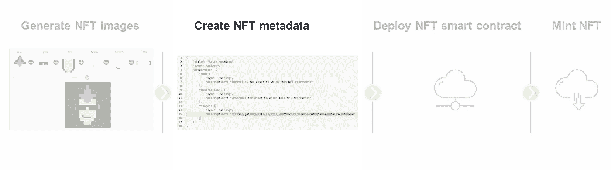
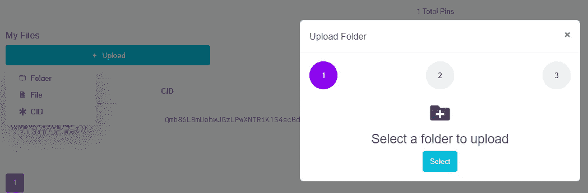
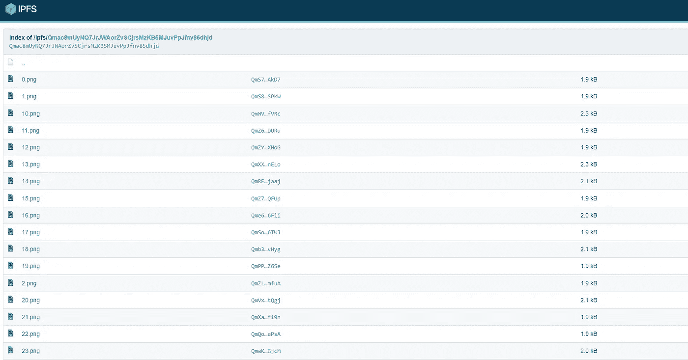
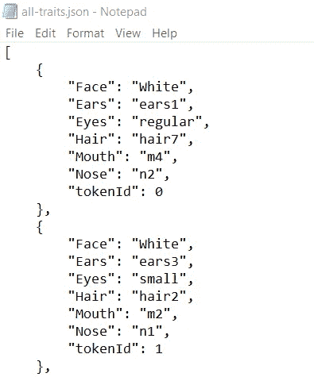
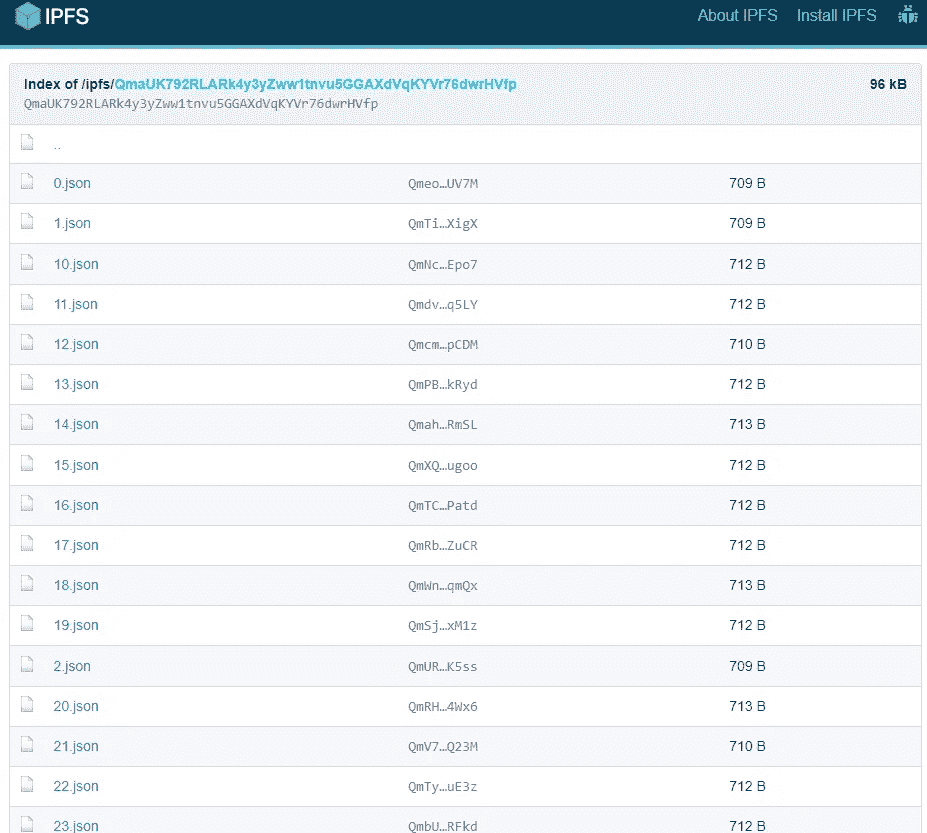
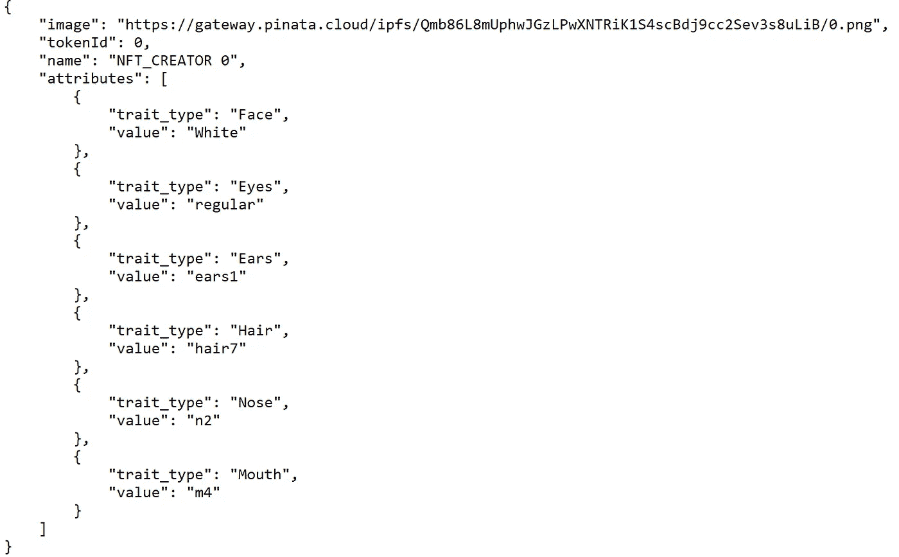

# 生成您的 NFT 元数据

> 原文：<https://betterprogramming.pub/generate-your-nft-metadata-11a878c082b9>

## NFT 元数据，NFT 智能合同的关键元素

NFT sub punk # 93 创造了这个系列

这是 NFT 创造者系列四部曲的第二部:

1.  [*生成 NFT 图像*](/create-your-own-nft-collection-with-python-82af40abf99f)
2.  [**生成 NFT 元数据**](/generate-your-nft-metadata-11a878c082b9)
3.  [*部署 NFT 智能合约*](/how-to-deploy-nft-smart-contracts-9271ce5e91c0)
4.  [*NFT 明廷*](/mint-your-own-nfts-with-web3-js-f32f7b1cd8cc)

NFT 创造者系列的第二部分

# 什么是 NFT 元数据？

NFT 元数据是 NFT 的核心。它是一个 JSON 文档，通常包含以下内容:

*   NFT 的名字
*   NFT 的描述
*   链接到托管图像
*   特征
*   …

这个 NFT 元数据将成为您的 NFT 智能合同的输入，您将在第三方在以太坊网络上部署该合同。

https://docs.opensea.io/docs/metadata-standards NFT 元数据示例(来源:

# 将你的 NFT 图片上传到云端

上传图像到区块链是非常昂贵的，因为它们的尺寸很大。

最佳实践是只上传你的图像链接到区块链，并把你的图像存储在星际文件系统中(稍后会详细介绍)。

Pinata 允许你使用 [IPFS](https://docs.ipfs.io/concepts/what-is-ipfs/) (星际文件系统)免费上传 NFT 图像。这是一个分布式文件共享系统。

注册一个免费账户，然后**将你的 NFT 图片文件夹**上传到 pinata cloud。

我将我的项目命名为“NFT 创造者”,但也可以随意选择不同的名字。

Pinata 允许你一次上传整个文件夹

如果上传成功，您应该能够看到您上传的文件，如下所示:

点击你的项目并复制链接。

这是您的“基本 URL”，您以后会需要它。

*我的项目的基础 URL 是*[*https://gateway . pinata . cloud/ipfs/qmb 86 l8 muphwjgzlpwxntrik 1s 4 scbdj 9 cc 2 sev 3s 8 ulib*](https://gateway.pinata.cloud/ipfs/Qmac8mUyNQ7JrJWAorZvSCjrsMzKB5MJuvPpJfnv85dhjd)

# 生成 NFT 元数据

## 所有特征. json

在 NFT 创造者系列的第一部分中，你已经创建了一个名为“所有图像”的列表，指定了每个图像的特征。

简单地说，使用 json.dump()函数将这个列表转储到一个. json 文件中。

all-traits.json 文件

## [token_id]。json

接下来，您想要创建一个特定的。每个图像的 json 文件:

*   加载 all_traits.json
*   指定您之前在 Pinata 网站上复制的图像的“基本 URL”。一定要在末尾多加一个“/”！
*   指定您的项目名称
*   在 all_traits 上循环。json 字典使用了 keys 访问器并输出一个单独的。每个独特的 NFT 图像的 json 文件。

例如，对于此图像，您将收到以下内容。json 文件:

# 将元数据上传到 pinata

将生成的元数据上传到 Pinata，上传方式与上传图像的方式相同。

# NFT 元数据示例

下面您可以找到 tokenID 0 的 NFT 元数据文件的示例和相应的图片。

在本系列的下一部分中，您将学习如何部署 NFT 智能合约。

编程快乐！

NFT 图像令牌 ID 0

令牌 ID 为 0 的 NFT 元数据

# 路标

1.  [*用 Python*](/create-your-own-nft-collection-with-python-82af40abf99f) 创建自己的 NFT 收藏
2.  [**创建 NFT 元数据**](/generate-your-nft-metadata-11a878c082b9)
3.  [*部署 NFT 智能合约*](/how-to-deploy-nft-smart-contracts-9271ce5e91c0)
4.  [*NFT 明廷*](/mint-your-own-nfts-with-web3-js-f32f7b1cd8cc)

# 资源

1.  [以太坊开发者资源| ethereum.org](https://ethereum.org/en/developers/)
2.  [GitHub—unique network/sub punks:加密朋克游戏的基质重制](https://github.com/UniqueNetwork/substrapunks)
3.  [GitHub—benyaminahmed/NFT-image-generator](https://github.com/benyaminahmed/nft-image-generator)