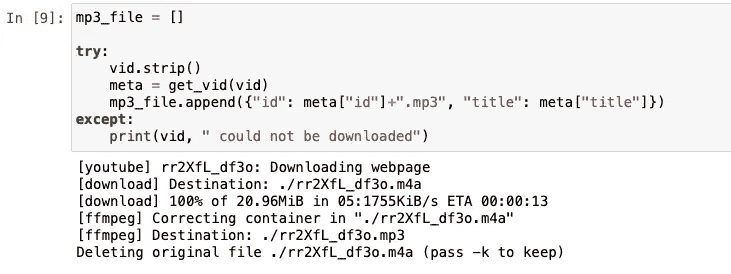
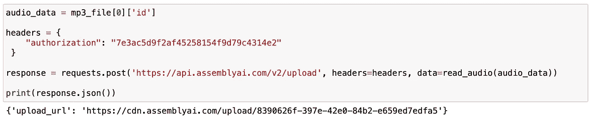
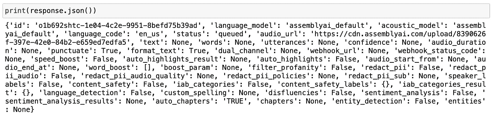
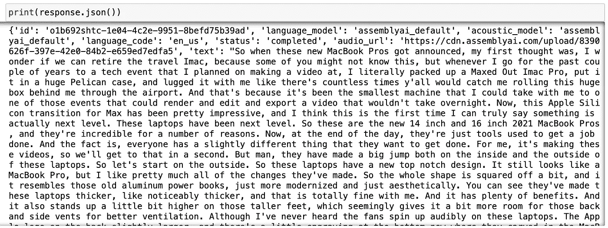
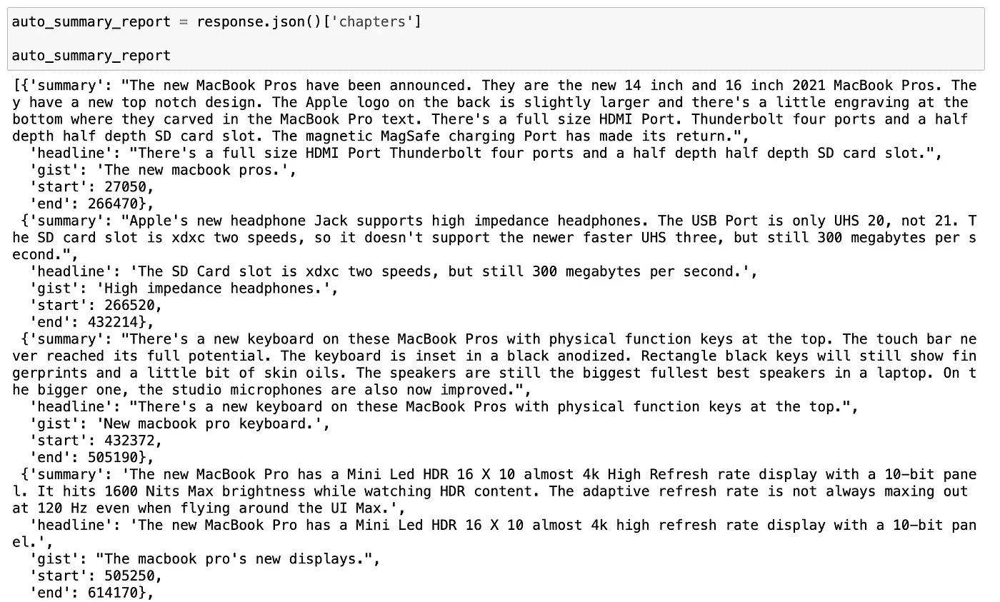
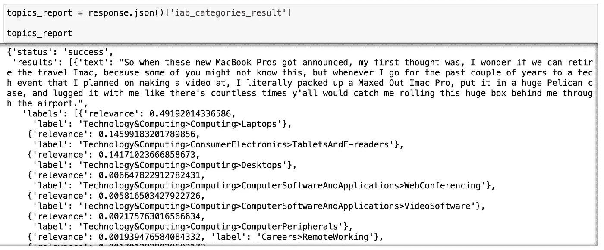

# 使用 Python 生成产品评论视频的自动反馈

> 原文：<https://betterprogramming.pub/generating-automated-feedback-of-product-review-videos-using-python-db1cc72ed8b7>

## 动手深度学习项目


照片由[乔治·米尔顿](https://www.pexels.com/photo/young-diverse-ladies-recording-vlog-about-makeup-products-on-smartphone-6953993/)从佩克斯拍摄

在本文中，我们将学习如何使用编程将产品评论视频转换为自动化的产品反馈。我们将利用机器学习和一些 python 库的力量。观看产品评论视频大部分时间都很耗时。尤其是当你看了第 10 个关于你想购买的产品的视频时。

我完全了解那种感觉——我也在做同样的事情。在购买有价值的资产之前，我通常会在 YouTube 上观看许多内容创作者的评论视频。我想确保我买的东西符合我的标准。这个产品可以是一个简单的猫喂食器，一个高科技的笔记本电脑，甚至可能是一辆自动驾驶汽车。

在购买之前，对产品的不同意见会很有帮助。我们可以看到它在现实生活中的样子和功能；我们也听取对该产品有一些经验的人的意见。长话短说，看这么多视频的过程很耗人。这就是编写自动化产品反馈程序的想法。

希望你会喜欢这个项目，让我们开始吧！

## 目录

*   *入门*
*   *第一步——图书馆*
*   *步骤 2——下载产品评论视频*
*   *第 3 步—带分析的音频转录*
*   *最后一步—检查结果*

# 入门指南

对于这个项目，我们将使用 AssemblyAI 的[语音转文本 API](https://www.assemblyai.com) 。我们将通过使用在线云平台来节省时间和精力，而不是重新发明轮子。语音转文本 API 还为我们提供了一些在转录时可以使用的强大功能，比如主题检测。我们将在本文的第三步对此进行更深入的探讨。

API 提供了一个免费的试用版，我们可以从中了解它的一些功能。创建帐户后，我们将使用唯一的 API 密钥进行访问。这把钥匙将成为我们个人电脑和云之间的桥梁。

# 步骤 1 —库

我们将需要这个项目的多个 python 库。其中一些库是内置的，这意味着它们已经和 Python 一起安装了。而且有些是第三方库，也就是说我们要先安装再用。这也取决于 Python 的版本。

以下是我们需要的库列表:

*   要求
*   [计]系统复制命令（system 的简写）
*   时间
*   json
*   操作系统（Operating System）
*   urllib
*   youtube-dl

在这些库中，必须安装`youtube-dl`。Youtube-dl 是一个用于下载不同格式视频的库。我们需要它来下载产品评论视频。[这里的](https://github.com/ytdl-org/youtube-dl)是这个包的 Github 库。

我们将使用 PIP python 库管理器来安装它。太简单了；下面是在终端窗口中运行的代码:

```
pip install youtube-dl 
```

安装完成后。我们可以继续创建新的 Jupyter 笔记本。然后，我们将它们导入到我们的程序中。

```
import requests
import sys
import time
import json
import os
import urllib.request
import youtube_dl
```

# 步骤 2 —下载产品评论视频

是时候选择产品评论视频了。我选择了马克斯·布朗利的 M1 马克斯 Macbook Pro 评论。

我们将把视频的链接赋值给一个变量。

```
vid = "[https://www.youtube.com/watch?v=rr2XfL_df3o](https://www.youtube.com/watch?v=rr2XfL_df3o)"
```

设置 youtube-dl 下载格式的参数:

```
ydl_opts = {
    "format": "bestaudio/best",
    "postprocessors": [{
        "key": "FFmpegExtractAudio",
        "preferredcodec": "mp3",
        "preferredquality": "192",
    }],
    "outtmpl": "./%(id)s.%(ext)s",
}
```

这里有一个简单的函数来获取视频:

```
def get_vid(id):
    with youtube_dl.YoutubeDL(ydl_opts) as ydl:
        return ydl.extract_info(id)
```

让我们将视频下载为 mp3 音频文件。

```
mp3_file = []try:
    vid.strip()
    meta = get_vid(vid)
    mp3_file.append({"id": meta["id"]+".mp3", "title": meta["title"]})
except:
    print(vid, " could not be downloaded")
```



作者图片

完美！我们的产品评论准备好了。它应该作为音频文件下载到 jupyter 笔记本所在的文件夹中。

让我们进入下一步，真正的奇迹发生了。

# 步骤 3 —带分析的音频转录

有趣的部分来了！

我们将把录音转换成文本格式。不仅如此——我们还会得到一份全文的分析报告。在这个分析中，我们将看到评论者在他们的视频中谈到的要点。

让我们先把我们的音频文件上传到 AssemblyAI 的云端。转录将在云中进行，因此在转换过程中不会使用 CPU 或 RAM 内存。是不是很酷？

## **读取音频功能**

```
def read_audio(audio_data, chunk_size=5242880):
    with open(audio_data, 'rb') as _file:
        while True:
            data = _file.read(chunk_size)
            if not data:
                break
            yield data
```

## **上传音频到云端**

```
audio_data = mp3_file[0]['id']headers = {
    "authorization": "API Key goes here."
 }response = requests.post('[https://api.assemblyai.com/v2/upload'](https://api.assemblyai.com/v2/upload'), headers=headers, data=read_audio(audio_data))print(response.json())
```

当我们打印出响应时，我们将看到上传录音的 URL 地址。



图片由[作者](https://lifexplorer.medium.com)提供。

## **语音转文字功能**

现在，我们将用两个特征进行转录。其中一个叫做 [Auto Chapters](https://docs.assemblyai.com/audio-intelligence#auto-chapters-summarization) ，它将音频划分为口语主题，并创建每个划分的摘要。为深度学习的力量干杯！

我打开的第二个功能是 [IAB 类别](https://docs.assemblyai.com/audio-intelligence#topic-detection-iab-classification)。它返回到整个音频的整体主题。API 已经训练预测了 698 个主题。这可能是有帮助的，尤其是如果我们想要在多个视频链接上批量运行这个产品评论程序。

```
speech_to_text_api = "[https://api.assemblyai.com/v2/transcript](https://api.assemblyai.com/v2/transcript)"data = {
    "audio_url": "The upload URL from the previous step goes here.",
    "auto_chapters": "TRUE",
    "iab_categories": "TRUE",}headers = {
    "authorization": "API Key goes here.",
    "content-type": "application/json"
}response = requests.post(speech_to_text_api, json=data, headers=headers)print(response.json())
```



图片由[作者](https://lifexplorer.medium.com)提供。

正如我们在下面看到的，我们的语音转文本请求正在排队。id 键是我们的请求 id。我们将需要它来检查请求的状态并获得结果。

# 最后一步—检查结果

我们可以通过运行以下代码块来检查请求的状态:

```
request_url = "[https://api.assemblyai.com/v2/transcript/](https://api.assemblyai.com/v2/transcript/o1b692shtc-1e04-4c2e-9951-8befd75b39ad) request id goes here."headers = {
    "authorization": "API Key goes here. "
}response = requests.get(request_url, headers=headers)print(response.json())
```

当请求完成时，我们将看到类似这样的内容:



图片由[作者](https://lifexplorer.medium.com)提供。

这本字典中有如此多的键值。找到我们需要的东西可能很困难，但是我们可以通过一些基本的过滤来访问特定的值。

例如，汽车章节结果在*章节*章节*下。*

## 自动摘要报告

```
auto_summary_report = response.json()['chapters']auto_summary_report
```



图片由[作者](https://lifexplorer.medium.com)提供。

那么，你有什么想法？

我们的程序为音频中讨论的每个部分创建了简短的摘要。阅读这几段文字让我们对产品有了一个清晰的了解，也了解了产品评论视频的内容。

在结束本教程之前，我们先来看看预测的题目。

## 预测主题报告

```
topics_report = response.json()['iab_categories_result']topics_report
```



图片由[作者](https://lifexplorer.medium.com)提供。

AssmeblyAI 的深度学习模型仅仅从一句话就已经预测了一些话题。正如我们在上面看到的，技术和计算项下得分最高的结果是笔记本电脑。

恭喜你。在本实践教程中，我们学习了如何使用 Python 构建一个程序，从视频中创建关于产品的自动反馈。

这会节省我们很多时间！这类项目是机器学习和人工智能在我们日常生活中的一个伟大应用。希望你喜欢这个项目，今天学到了一些新的东西。