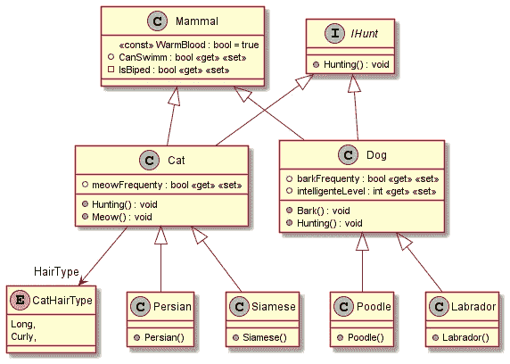
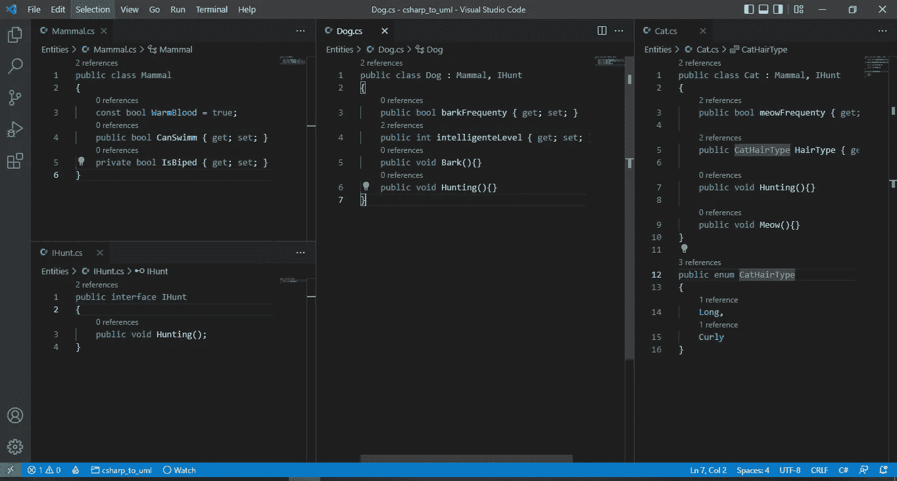
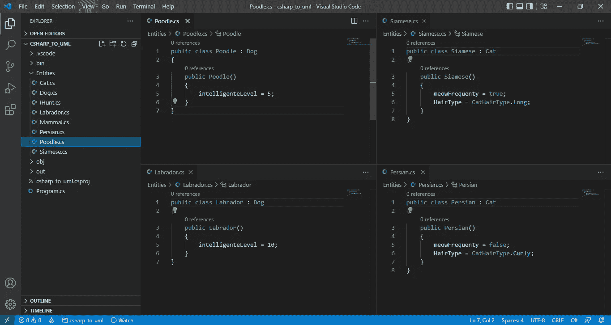
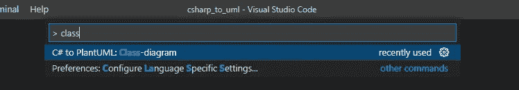
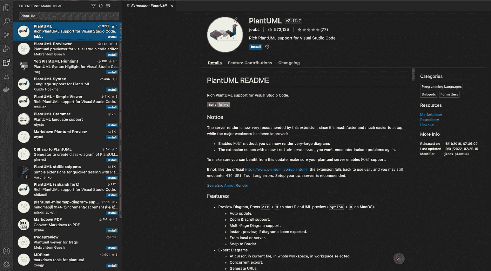
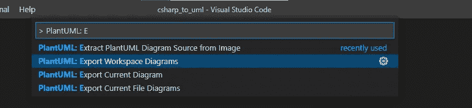
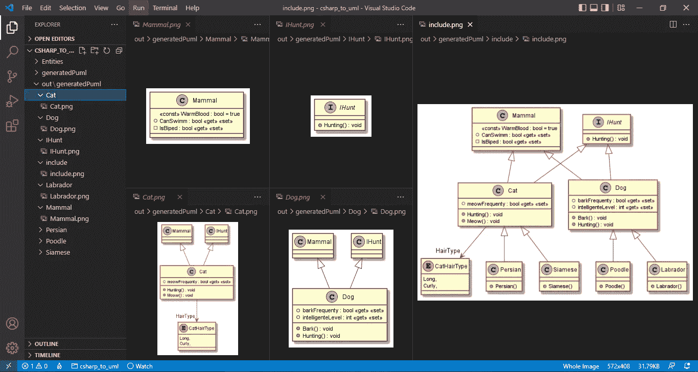

# 为生成类图。网络核心

> 原文：<https://betterprogramming.pub/generating-class-diagrams-for-net-core-c4913db9398b>

## 在 Visual Studio 代码中直接使用 PlantUML

Visual Studio 代码中生成的类图

UML 类图是记录系统、检查和理解类之间的关系、计划重构以及在团队内部传播知识的一种非常好的方式。

虽然拥有类图会带来很多好处，但是手动生成它们是一项痛苦而艰巨的任务，幸运的是，我们可以使用工具来自动生成它们

# Visual Studio 类设计器

Visual Studio 类设计器是一个很棒的非常灵活的生成类图的工具，它允许拖放单个或多个。cs 文件直接保存到图中，它会自动同步。cs 文件或图中。

正如我们所看到的，使用类设计器有许多优点，但不幸的是，它不存在于 Visual Studio 代码中，甚至在 Visual Studio 中，它也不支持。网芯。

# PlantUML

PlantUML 是一个开源工具，允许从纯文本生成许多类型的 UML 图，它使用一种特定的语言，你可以学习并开始在许多不同的编辑器中创建你的图。

幸运的是，有许多扩展和插件可以从源代码中自动生成 PlantUML，在下一节中，我将展示如何使用 C#生成 PlantUML 和图表。Net 核心直接放在 Visual Studio 代码中。

# 创建示例类

为了生成图表，我将创建一些组件，如类、接口、枚举、公共和私有属性、构造函数和常量。

我创建这些组件只是为了举例说明生成图工具是如何工作的，所以请不要关注这些类和它们的内容。

基类、接口和枚举:

哺乳动物、狗、猫类和 IHunt 接口

派生类和文件夹结构:

狗和猫儿童班

# 从代码中生成 PlantUml

我们可以使用 [PlantUml 图生成器](https://github.com/pierre3/PlantUmlClassDiagramGenerator)工具从代码中生成 PlantUml。

首先，通过运行命令`dotnet tool install --global PlantUmlClassDiagramGenerator --version 1.2.4`的 Nuget 包安装工具

接下来，执行命令来搜索。cs 文件并生成。运行这些命令参数的 puml 文件非常简单，可以在[工具文档](https://github.com/pierre3/PlantUmlClassDiagramGenerator#usage)中查看。

该命令将在根目录下生成一个文件夹，其中包含所有。puml 单个文件和`include.puml`文件，并将它们放在一起。

打印日志，生成输出文件夹。puml 文件

或者，您可以使用 Visual Studio 代码来生成文件，而无需自定义生成过程。

Visual Studio 代码生成一个图表选项

# 读取 PlantUML 文件

为了读取 PlantUML 文件，我们将需要使用`[vscode/plantuml](https://marketplace.visualstudio.com/items?itemName=jebbs.plantuml)`扩展，一旦安装，它将在 ide 中提供一些选项，用于将`.puml`文件导出为图像。

若要安装它，请在 Visual Studio 代码市场中搜索该扩展:

市场中 VSCode 的 PlantUML 扩展

然后，重新加载 IDE 并选择`PlanUml: Export Workspace Diagrams`选项。它将打开一个对话框，询问您想要使用的图像格式，然后生成一个包含所有导出的图表图像的输出文件夹:

导出工作区图表选项

图表格式选项

正如我们所看到的，它生成了一个`./out`文件夹，其中每个单独的类都有一个图表，而所有的类都在一个单独的图像文件中。

包含所有生成文件和完整类图的文件夹结构

还有许多其他选项我没有在这里介绍，您可以查看工具文档并探索所有其他可用的特性。

请记住，我们不需要将这仅仅局限于 C#代码，PlantUML 是一个开放源代码的倡议，因此已经存在其他实现来支持其他语言。

我希望这篇文章能帮助你和你的团队生成漂亮有用的类图，感谢你的阅读，下次再见。