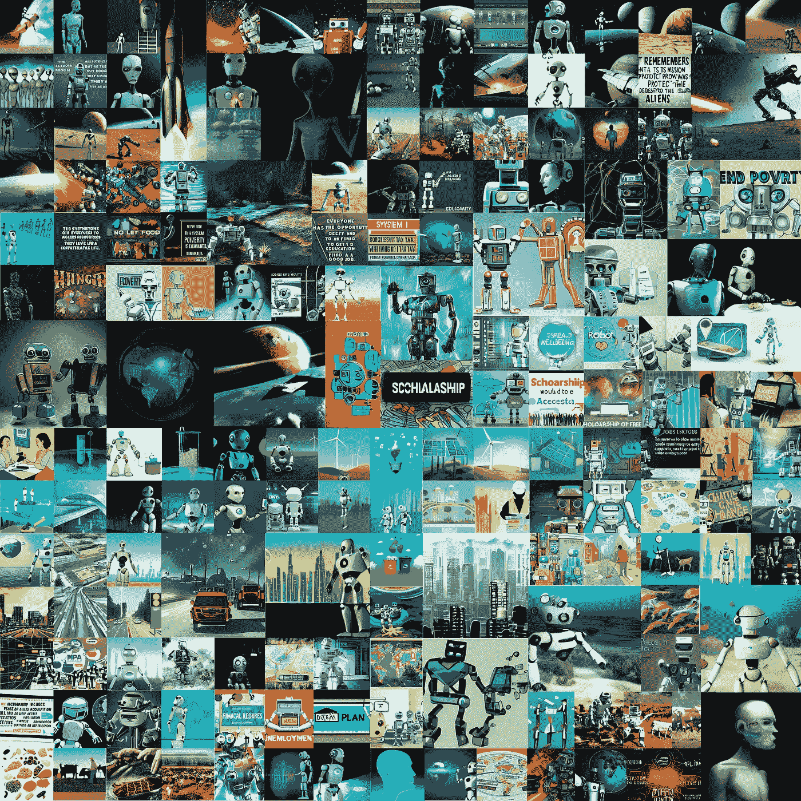
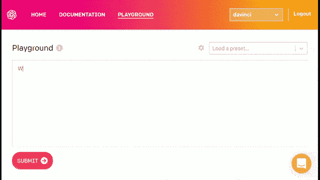
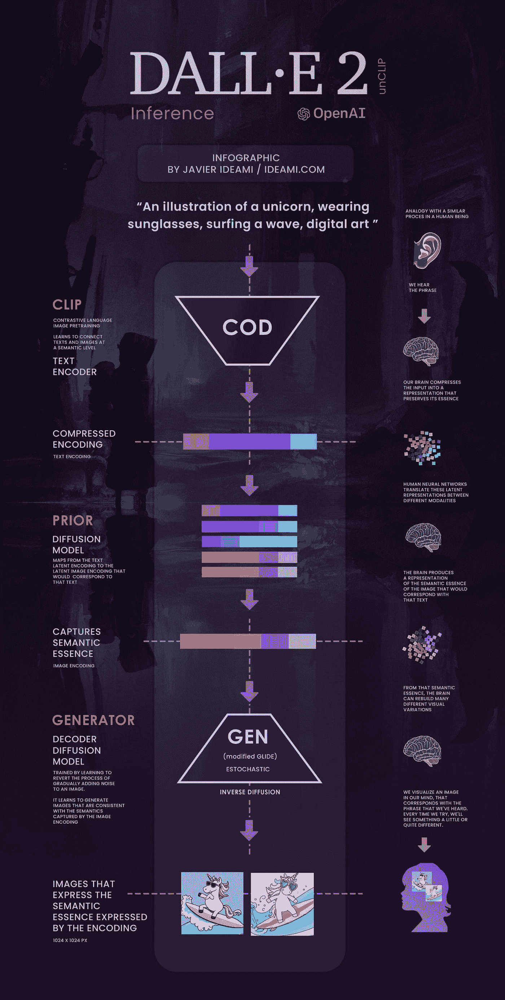
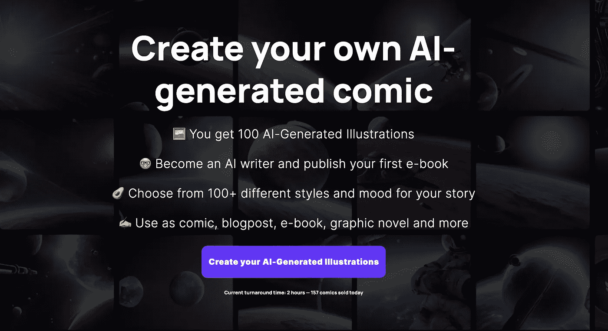
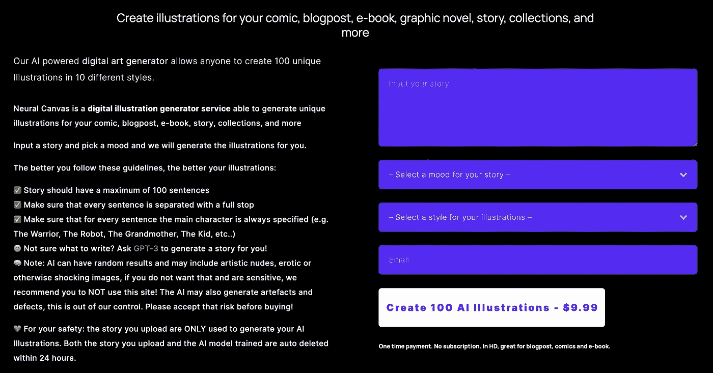
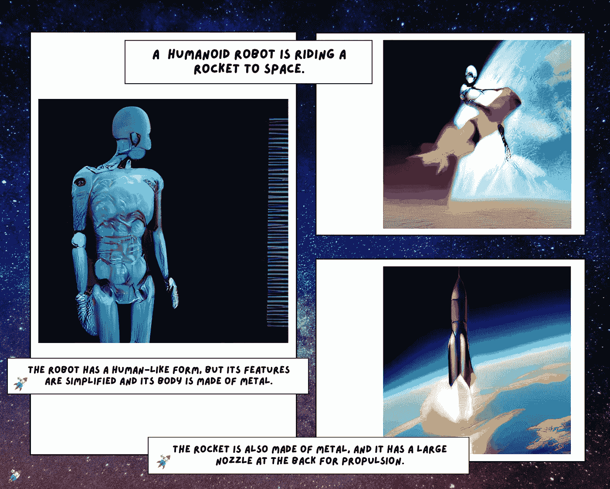
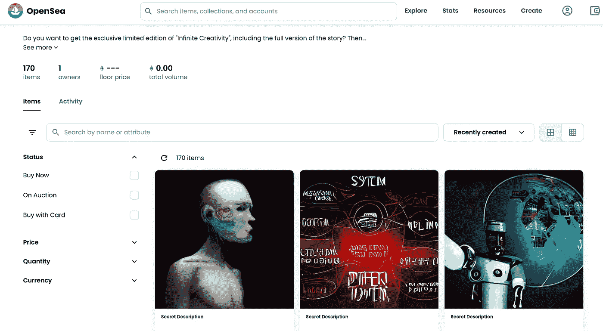

# 用深度神经网络生成图形小说——DALL-E Flow+GPT-3

> 原文：<https://betterprogramming.pub/generating-graphic-novels-with-deep-learning-7100d870e75a>

## 电脑能生成漫画小说吗？



一幅拼贴画，有 170 幅插图，是用 Dalle-Flow 从 GPT 3 的文本提示中生成的。

阅读这篇文章，了解更多关于我如何使用深度神经网络生成完全由计算机编写和插图的科幻图形小说的旅程。

深度学习领域的最新进展证明，计算机能够生成创造性内容。

在本文中，我们将讨论以下主题:

*   **讲故事的人:GPT-3 ✍️**
*   **插图画家:达尔-弗劳尔🎨**
*   **出版商:神经画布🧠**
*   **电子书:无限创意∞**

> *AI 并不能替代人类的创造力，但它赋予了人类的感官以发现未知的能力*

## ****讲故事的人:GPT-3 ✍️****

**生成式预训练转换器 3 是一个[自回归](https://en.wikipedia.org/wiki/Autoregressive_model) [语言模型](https://en.wikipedia.org/wiki/Language_model)，它使用深度学习来产生类似人类的文本。**

**这是 GPT-n 系列中的第三代语言预测模型，由旧金山人工智能研究实验室 OpenAI 创建。**

**GPT-3 的完整版本具有 1750 亿个机器学习参数的容量。GPT-3 生成的文本质量如此之高，以至于很难确定它是否是由人类书写的。**

**我们使用这项技术从一些输入开始产生一个故事。**

****

**OpenAI 游乐场示例**

## ****插画师:达尔**流🎨**

**[DALL E Flow](https://github.com/jina-ai/dalle-flow) 是从文本提示生成高清图像的交互式工作流程。**

**首先，它利用 [DALL E-Mega](https://github.com/borisdayma/dalle-mini) 生成候选图像，然后调用 [CLIP-as-service](https://github.com/jina-ai/clip-as-service) 根据提示对候选图像进行排序。**

**首选的候选对象被馈送到 [GLID-3 XL](https://github.com/Jack000/glid-3-xl) 进行扩散，这通常会丰富纹理和背景，然后通过 [SwinIR](https://github.com/JingyunLiang/SwinIR) 升级到 1024x1024。**

**DALL E Flow 是在客户端-服务器架构中使用[纪娜](https://github.com/jina-ai/jina)构建的，这赋予了它高可伸缩性、无阻塞流和现代 Pythonic 接口。**

**对于这个项目，我们没有使用 OpenAI 的 [DALLE 2，因为我们仍然在他们的等待名单上。然而，我们对目前为止从 DALL E Flow 获得的结果感到满意！](https://openai.com/)**

****

**一张解释文本到图像模型与人脑相比如何工作的信息图。**

## ****出版商:神经 Canvas🧠****

**[神经画布](https://neuralcanvas.io/)是我们构建的平台，结合了 GPT-3 和 DALL E Flow 的力量。**

**我们的平台通过一个简单的界面，允许最终用户生成独特的故事和插图，提供最少的文本输入，同时自动存储和保护其在区块链的知识产权。**

> **例如，漫画小说[**【无限创意】**](https://neuralcanvas.io//#illustrations) 的每一章都只有一句话！**

****

**神经画布登录页面**

**神经画布插画师将生成 100 幅插图，几个小时后您将在您的电子邮件地址上收到。**

****

**花 9.99 美元创作 100 幅人工智能插图**

**该平台仍处于测试阶段，我们刚刚发布了我们的演示。**

****生成 100 幅插图** [**此处**](https://neuralcanvas.io/) **。****

## ****第一本电子书:无限创意∞****

***无限的创造力*多亏了神经画布，才在几个小时内完成了写作和插图。**

**这个故事分为 30 章，讲述了一个人形机器人进入太空，试图寻找解决重大全球问题的方法，包括联合国的可持续发展目标。**

****

**《无限创意》中的一个片段**

**作者通过神经画布首先生成了所有 170 幅插图，然后在区块链中自动铸造它们。**

****

**火箭 AI“无限创意”NFT 集锦截图**

**这代表了作者的知识产权在区块链受到保护的方式，也是从他们的书赚钱的一种网络 3 方式。**

> **每一幅 NFT 作品都是独一无二的，让买家可以看到完整的故事。**

```
****Want to Connect?**Hope you enjoyed this article and [feel free to get in touch](http://info@rocketai.io).**
```