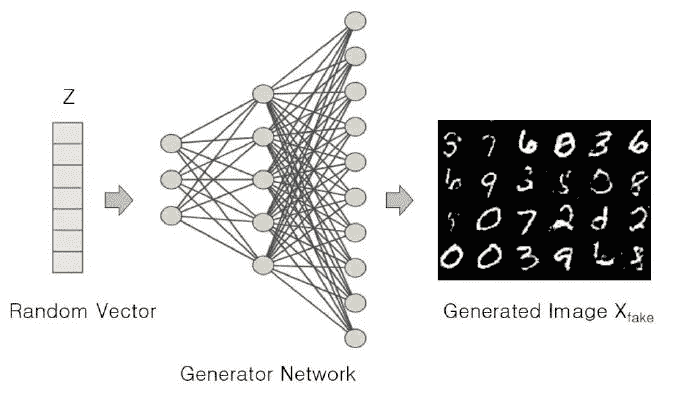
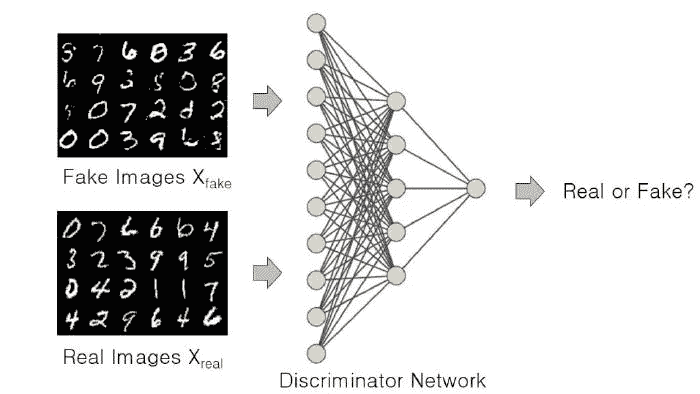
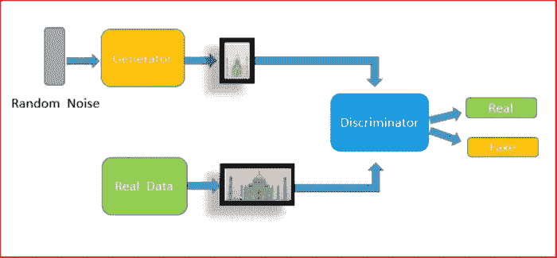
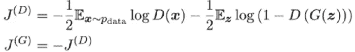
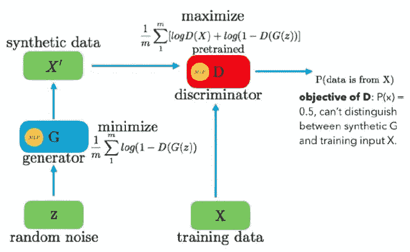
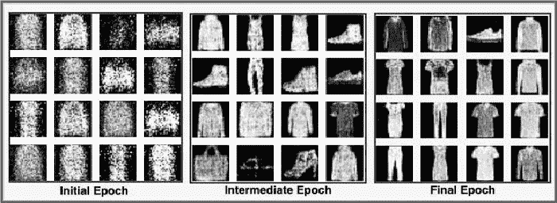

# 利用深度学习生成图像

> 原文：<https://betterprogramming.pub/generating-images-with-deep-learning-2e73043427e4>

## 学习如何使用人工智能生成新的图像，如人脸或艺术


作者图片

我们正处于人工智能时代，它正以令人难以置信的速度前进。如果只是说人工智能现在正在自动化人工智能，那将是非常诚实的。这篇文章探讨了我刚刚提到的惊人事实的细节。

人工智能进步的速度令人难以置信，根据埃隆·马斯克的说法，已经接近指数级，计算机视觉也取得了一些令人兴奋的突破。通过创建一个名为 GANs 的算法，著名的深度学习研究人员 Ian Goodfellow 将传统的计算机视觉转变为新的计算机视觉。嗯，我创造了这些名字“传统的”和“新的”，而不是 CV 社区，看到了在为几个计算机视觉问题产生数据方面的巨大转变。

# 传统和新的计算机视觉

传统的计算机视觉涉及通过下载、清理、渲染并将其存储到数据库中来创建大型数据集，或者手动捕捉图片、制作视频并使其能够被网络使用。这种技术给研究人员和开发人员带来了巨大的挑战，特别是在时间、资源和产生的数据质量不达标的情况下。

事实上，新的计算机视觉让人松了一口气，减轻了迄今为止收集最佳数据集的巨大负担。现在，gan 用于生成与有限可用数据具有相同特征的数据。从而将研究人员从收集和管理数据的繁忙工作中解放出来。

# GANs 是如何工作的？

GANs 这个时髦词的概念就是两个神经网络相互竞争。这些竞争的神经网络以这样一种方式执行分配的任务，即学习可用数据中存在的概率分布。基于这样的概率分布，生成具有与训练数据相同特征的逼真数据。

# 两个竞争的神经网络

这些竞争网络被称为生成器和鉴别器。生成器网络学习训练数据中的模式并生成图像，而鉴别器检查生成的图像的真实性，即，它决定生成的图像是否属于训练集。简而言之，它检查生成的图像是“真”还是“假”

# 发电机

当给定一组随机值或噪声时，发生器在执行一系列非线性计算后产生一个新的假图像，并将其传递给鉴别器。它这样做是因为它希望被鉴别器声明为真实的。简单来说，生成器的目标是创建图像来撒谎而不被识破，即愚弄鉴别者。



发电机网络，[信用点](https://learnopencv.com/introduction-to-generative-adversarial-networks/#why)

# 鉴别器

鉴别器的目标是处理来自生成器的图像(假图像如下所示)并识别它们是假的。它的作用是二元分类器。它需要两个输入:真实图像(来自训练数据)和来自生成器的生成图像。它对它们进行比较，并判断它们是否来自同一个分布。“真实”意味着它们来自同一个分布，而“虚假”则表明它们属于不同的分布。



甄别网络，[学分](https://learnopencv.com/introduction-to-generative-adversarial-networks/#why)

# GAN 的训练和收敛

GAN 的训练以交替的方式进行，即，当鉴别器正在学习将生成的图像真正分类为“真实”或“虚假”时，生成器保持不变，即，捕捉生成器的缺陷，并且鉴别器保持不变，而生成器正在学习愚弄鉴别器(生成器试图使其虚假生成的图像被鉴别器分类为真实)。这种来回训练允许 GAN 模型收敛，否则这将变得难以处理。这种训练有助于克服训练有素的生成者和训练不足的鉴别者之间的无赢局面，反之亦然，否则这是不可避免的。

发生器性能的提高恶化了鉴别器的性能，因为它不能容易地区分真假。如果发生器工作正常，鉴别器有 50%的准确度。实际上，鉴别器做的和扔硬币做预测没什么不同。

这使得收敛在整体上是不可能的:鉴别器的反馈对于发生器来说变得非常没有意义。如果在鉴别器达到一个给出完全随机反馈的点之后继续训练 GAN，那么生成器就开始对垃圾(误导性反馈)进行训练，自身质量就崩溃了。

因此，交替训练对 GANs 的收敛有着至关重要的意义。



甘架构，[学分](https://www.analyticsvidhya.com/blog/2021/04/generate-your-own-dataset-using-gan/)

# 甘斯背后的数学

现在我们更深入地挖掘甘斯的数学基础。

GAN 由两个神经网络组成:生成器`G`和鉴别器`D`，它们在一起学习训练数据集的未知分布时相互竞争。我们的目标是生成器生成与训练数据不可区分的图像。

因此，生成器的权重应该使得生成器生成鉴别器不能识别为假的假图像。这使得该优化成为最小-最大优化问题，其中我们希望发生器的权重最小化鉴别器正确分类真假样本的速率(成本函数`J(D)`，如下所示)。我们需要鉴别器的权重来最大化这个速率。由于在这种情况下使用了二元类分类，所以我们使用二元交叉熵函数作为我们的成本函数。



成本函数 J(D)中的第一项表示输入鉴别器的真实数据，鉴别器想要最大化预测的对数概率，表明数据是真实的。第二项表示生成器生成的假图像，`G`。这里，鉴别器想要最大化预测零的对数概率，显示数据是假的。另一方面，生成器寻求最小化鉴别器正确的对数概率。这个权衡的平衡点就是这个优化问题的解，也就是鉴频器损耗的鞍点。



`D()`是给定图像属于训练数据`X`的概率。对于发电机，我们希望最小化`log(1-D(G(z))`，即当`D(G(z))`为高时，那么`D`认为`G(z)`就是`X`，这使得`1-D(G(z))`非常低。我们想把这个最小化，这个更小。对于鉴别器，我们希望最大化`D(X)`和`(1-D(G(z)))`。所以`D`的最佳状态会是`P(x)=0.5`。然而，发生器`G`应进行训练，以便为鉴别器`D`产生结果，从而`D`无法区分`z`和`X`。

我们称之为最小-最大优化的原因在于，鉴别器试图最大化目标，而生成器试图最小化目标。由于这种最小化和最大化，我们说它是最小-最大。它们都通过交替梯度下降来一起学习。

# GANs 的实施

本节将在编码中实现 GAN，看看它是如何先于理论基础工作的。为此，我们将使用 TensorFlow 库。正在使用的版本是 TensorFlow v2.3.0 和 Keras v2.4.3。

你可以自己写代码，也可以在 [Google colab](https://colab.research.google.com/drive/1v8tDvBFBRoN3BL9xECyAY_6ryfue7s41?usp=sharing) 上访问完整代码。

[](https://colab.research.google.com/drive/1v8tDvBFBRoN3BL9xECyAY_6ryfue7s41?usp=sharing) [## 完整源代码

### 编辑描述

colab.research.google.com](https://colab.research.google.com/drive/1v8tDvBFBRoN3BL9xECyAY_6ryfue7s41?usp=sharing) 

# 导入包

需要一些库，让我们通过这些导入来获得它们:

```
import os
import time
import numpy as np
import tensorflow as tf
from tensorflow.keras import layers
import argparse
from IPython import display
import matplotlib.pyplot as plt
# %matplotlib inline
from tensorflow import keras
```

# 数据加载和预处理

```
(x_train, y_train), (x_test, y_test) = tf.keras.datasets.fashion_mnist.load_data()
x_train = x_train.reshape(x_train.shape[0], 28, 28, 1).astype('float32')
x_train = (x_train - 127.5) / 127.5 # Normalize the images to [-1, 1]
# Batch and shuffle the data
train_dataset = tf.data.Dataset.from_tensor_slices(x_train).\
shuffle(60000).batch(args.batch_size)
```

我们使用`tf_keras`数据集模块来加载时尚 MNIST 数据集。该模块加载现成的数据。由于不需要标签来解决这个问题，所以我们只使用训练图像`x_train`。我们对图像进行整形，并将其转换为 float32(数据默认为 uint8 格式)。

然后，我们将从`[0, 255]`到`[-1, 1]`的数据归一化。最后，我们构建 TensorFlow 输入管道。简而言之，`tf.data.Dataset.from_tensor_slices`被输入了训练数据，经过重组，分割成张量，允许我们在训练期间访问指定批量的张量。随机播放中的缓冲区大小参数会影响随机播放的随机性。

# 创建发电机网络

我们向发生器提供从正态分布采样的 100 维噪声矢量。接下来，我们定义输入层，形状为(100，)。在 TensorFlow 中，线性层的默认权重初始化器是`he_uniform`。

批规范层的动量值更改为 0.1(默认值为 0.99)。

最后，我们使用`tf.reshape`将 784-D 张量整形为(批量大小，28，28，1)，其中第一个参数是输入张量，第二个参数是张量的新形状。最后，我们通过传递生成器函数的输入和输出层来创建模型。

# 创建鉴别器网络

鉴别器是仅由完全连接的层组成的二元分类器。所以，鉴别器期望一个形状张量(批量大小，28，28，1)。但是鉴别器功能仅由致密层组成。因此，我们将张量整形为一个形状向量(批量大小，784)。最后一层有 sigmoid 激活函数，使输出值介于 0(假)和 1(真)之间。

# 损失函数

```
binary_cross_entropy = tf.keras.losses.BinaryCrossentropy()
```

这是二元交叉熵损失。

以下是发生器和鉴频器各自的损耗。

# 发电机损耗

```
def generator_loss(fake_output):
  gen_loss = binary_cross_entropy(tf.ones_like(fake_output), fake_output)
  return gen_loss
```

# 鉴频器损耗

```
def discriminator_loss(real_output, fake_output):
  real_loss = binary_cross_entropy(tf.ones_like(real_output), real_output)
  fake_loss = binary_cross_entropy(tf.zeros_like(fake_output), fake_output)
  total_loss = real_loss + fake_loss
  return total_loss
```

# 【计算机】优化程序

```
generator_optimizer = tf.keras.optimizers.Adam(learning_rate = args.lr, beta_1 = args.b1, beta_2 = args.b2 )
discriminator_optimizer = tf.keras.optimizers.Adam(learning_rate = args.lr, beta_1 = args.b1, beta_2 = args.b2 )
```

我们使用 Adam Optimizer 来优化生成器和鉴别器，它有两个参数:

1.  `2e-4`的学习率。
2.  β系数:`b1`和`b2`。

这些计算反向传播过程中梯度的移动平均值。

# 训练回路(训练 GAN 的所有功能组合)

`train_step`功能是整个 GAN 训练的核心。因为在这里，我们结合了上面定义的所有训练函数。

`@tf.function`将`train_step`函数编译成可调用的张量流图。此外，减少了培训时间。整个培训过程包括以下步骤:

*   首先，我们从正态分布中对噪声进行采样，并将其输入到发生器中。
*   发生器产生假图像，这些图像被输入鉴别器。鉴别器也给出真实图像。
*   鉴别器将图像(来自生成器)分类为真实的(来自训练集)或伪造的(由生成器生成)
*   对于这些模型中的每一个，计算损失:gen_loss 和 disc_loss。
*   计算梯度后，使用 Adam 优化器更新生成器和鉴别器参数。

# 培养

终于，我们可以坐下来看魔术的时候到了。但是请等一下。您必须将两个参数(训练数据和时期数)传递给上面的函数。给它那些，运行程序，放松，看看 GANs 能为你做什么。

# 结果

下面显示了三个图像网格，每个网格包含 16 个图像，这些图像是由生成器在训练的三个不同阶段生成的。你可以看到，最初，发生器产生噪声图像。但是随着训练的进行，生成器会改进并开始生成看起来更真实的时尚图像。



我们的网络生成的图像

# 摘要

简而言之，我们开始介绍甘，为什么我们需要他们，他们的优势，和他们的直觉。然后我们深入挖掘，了解了 GAN 的组成部分，即发生器和鉴别器。然后详细讨论了两个最重要的方面:训练策略和 GAN 的目标函数。

最后，我们在 TensorFlow 框架中用时尚 MNIST 数据集实现了一个 GAN，并取得了令人惊讶的结果。

这都是关于甘和用他们生成图像。这个领域正以惊人的速度前进。但是我相信这篇文章已经为您提供了如此多的关于 GANs 的理论和实践知识，您可以很容易地跟上正在进行的进步和改进。

记住，你可以在[谷歌实验室](https://colab.research.google.com/drive/1v8tDvBFBRoN3BL9xECyAY_6ryfue7s41?usp=sharing)找到所有这些代码的工作示例。

感谢阅读。