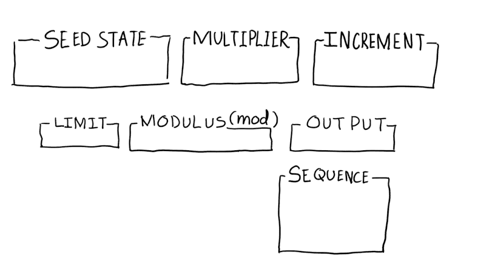
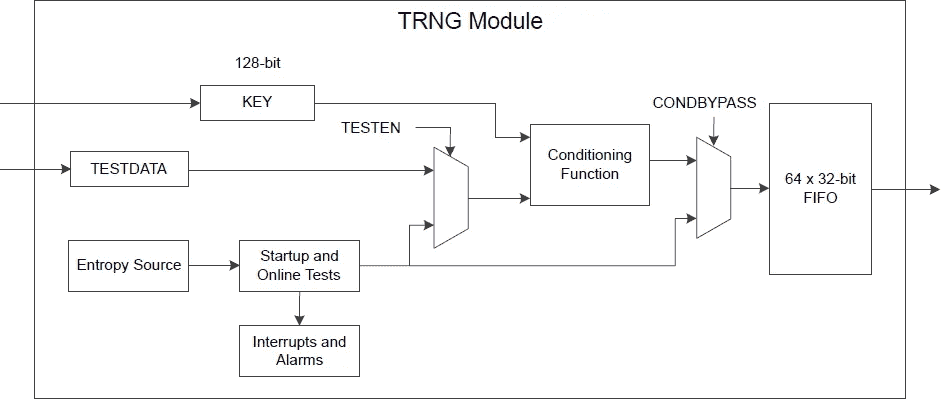

# 生成随机数比你想象的要困难得多

> 原文：<https://betterprogramming.pub/generating-random-numbers-is-a-lot-harder-than-you-think-b121c3e75d08>

## 计算机如何做出随机决策


由[马库斯·克里斯蒂亚](https://unsplash.com/@krisetya?utm_source=medium&utm_medium=referral)在 [Unsplash](https://unsplash.com?utm_source=medium&utm_medium=referral) 拍摄的照片

电子游戏中的速度赛跑者、赌徒和密码破译者有什么共同之处？它们依赖于随机数。从随机播放音乐到加密整个互联网，随机数是现代生活中至关重要的一部分。在大多数情况下，我们依赖计算机来为我们生成它们。

这让我想知道:*计算机实际上是如何产生随机数的？如果你像我一样，你在代码中的某个地方使用过随机数生成器。编程语言使它变得非常容易。比如在 Ruby 中，你需要做的就是调用`[rand](https://ruby-doc.org/core-3.0.0/Random.html#method-i-rand)`。*

从表面上看，创建随机数似乎很简单。毕竟，电脑上的数字是一堆 1 和 0。计算机只需要随机选择一个 1 或 0，并根据需要重复多次。

作为一个人类，我可以很容易地做到这一点。

```
100101011010010110001101
```

好了，我做到了。

*注:我很清楚有一场关于* [*人类是否真的可以随机*](https://philosophy.stackexchange.com/questions/1961/are-people-capable-of-generating-a-random-number) *的争论。这超出了本文的范围。*

但这仍然留下了一个问题，计算机如何偶尔在 1 和 0 之间做出决定？

答案是相当复杂的。它深入研究了递归算法、计算机硬件和一些混沌理论等主题。

如果您对此感兴趣，那么让我们开始吧。

# 计算机是如何产生随机数的？

对“计算机如何产生随机数”的简单回答就是*他们不行。*至少，不是靠自己。

人类创造计算机是为了成为我们所不具备的东西——完全符合逻辑的机器。随机性不是他们的天性。毕竟，您不希望服务器自发地决定不遵循您的应用程序中的逻辑，是吗？

从本质上讲，计算机是简单的机器，它接收数据，然后将数据发送出去。为了让计算机生成随机数，它们需要一个外部随机源。该来源将根据您想要使用的随机数发生器的类型而有所不同。

我敢肯定，最后一句话引起了一些困惑的表情。*你说的“类随机数发生器”是什么意思？不都是一样的吗？*

不完全是。有两种主要类型的随机数发生器。

注意:这些随机数生成器的名字很长，写起来很繁琐。我会尽可能使用他们的缩写。

## 伪随机数发生器


由[米克·豪普特](https://unsplash.com/@rocinante_11?utm_source=medium&utm_medium=referral)在 [Unsplash](https://unsplash.com?utm_source=medium&utm_medium=referral) 上拍摄

最常见的随机数发生器是伪随机数发生器。它被称为*伪随机*，因为它不产生“真”随机数。

根据[维基百科](https://en.wikipedia.org/wiki/Random_number_generation#Computational_methods):

> “PRNGs 是一种算法，可以自动创建具有良好随机属性的长串数字，但最终序列会重复。”

尽管 PRNGs 遵循一种模式，但这种模式是人类无法感知的。这使得它们对于大多数用例来说“足够好”，比如视频游戏。

伪随机数发生器需要两样东西才能工作:

1.  一种随机数生成算法
2.  一粒种子

用于 PRNGs 的初始算法是[线性同余生成器](https://en.wikipedia.org/wiki/Linear_congruential_generator)。这些是递归算法，使用前一个答案来生成下一个答案。这就是为什么这些算法需要一个“种子”或起始值。你可以把种子想象成随机的片段。



图片来源: [UnityChain](https://www.unitychain.io/blog/random-number-generation-and-their-use-cases/)

然而，[梅森扭转器](https://en.wikipedia.org/wiki/Mersenne_Twister)已经取代了线性同余发生器，并且仍然是今天最流行的 PRNG 算法。

虽然伪随机数实际上不是随机的，但使用它们有很多原因。首先，它们制作起来既快又便宜。此外，由于 PRNGs 只是算法，您可以测试它们并确保它们总是按预期工作。

这就是为什么 PRNGs 是大多数(如果不是全部)编程语言的默认数字生成器。

但是伪随机数生成也有它的缺点。伪随机数之所以有效，是因为在未经训练的人看来，它们是随机的。然而，如果你知道一个特定的 PRNG 序列的种子，你就可以预测接下来会出现哪些数字。

这个漏洞经常被视频游戏中的超速者利用，他们称之为 [*操控 RNG*](https://aldelaro5.wordpress.com/2018/09/09/controlling-luck-in-video-games-an-explanation-of-the-rng-manipulation-on-pokemon-colosseum-and-xd/) 。他们使游戏运行可预测，尽可能快地击败它。幸运的是，如果一个视频游戏的种子受到损害，这不是什么大不了的事情。没有伤害也没有犯规。

但是有时候预测随机数更重要。例如生成安全密钥。

如果攻击者想出用于创建 [TLS 证书](https://protonmail.com/blog/tls-ssl-certificate/)中的 [RSA 密钥](https://en.wikipedia.org/wiki/RSA_(cryptosystem))的种子，他们就有可能解密网络流量。这意味着他们可以通过互联网获取密码和其他私人信息。

在这些情况下，我们需要一种更安全的方法来产生随机数。

## 真随机数生成器(TRNGs)


照片由[Magnus eng](https://unsplash.com/@magnusengo?utm_source=medium&utm_medium=referral)在 [Unsplash](https://unsplash.com?utm_source=medium&utm_medium=referral) 上拍摄

正如你可能猜到的，[真正的随机数](https://en.wikipedia.org/wiki/Hardware_random_number_generator#Uses)是不可预测的，并且不遵循一种模式。

但是计算机是如何做到这一点的呢？

正如我之前提到的，计算机需要一个外部随机源。对 PRNG 来说，那是一颗种子。在 TRNG 的例子中，它是 [**熵**](https://en.wikipedia.org/wiki/Entropy_(computing)#Hardware-originated_entropy) 。

混沌理论和热力学远远超出了本文的范围。只要说熵是纯粹的未过滤的混沌就够了。而这种混乱最好的来源就是电脑本身。

虽然计算机不能随机运行，但组成它的*部件*可以。计算机是一个复杂的系统，有许多活动部件和易变部件。[热噪声](https://en.wikipedia.org/wiki/Thermal_noise)、[光电效应](https://en.wikipedia.org/wiki/Photoelectric_effect)等量子现象无时无刻不在发生。你没想到我们会谈到量子力学吧？

计算机硬件不是熵的唯一来源。也可以使用用户自己的鼠标和键盘移动。

但是如果不加以控制，这种混乱将毫无用处。令人欣慰的是，硬件工程师已经知道如何做到这一点。通过使用由硬件芯片和组件组成的复杂电路，计算机可以将这种物理噪声转换为数字 1 和 0。



一个实数发生器图表布局— [图片来源](https://silabs-prod.adobecqms.net/community/mcu/32-bit/knowledge-base.entry.html/2019/01/31/what_is_the_trngtr-agCe)

TRNGs 最明显的一个用例是数字赌博。掷骰子、洗牌和轮盘赌都依赖于不确定性。虽然它经常被用于民意调查，军事征兵，陪审团选择，以及随机性被用作一种公平的方法。

实际上，TRNGs 的用例非常有限，因为它们有自己的缺陷。首先，它们很慢。虽然有所不同，但 TRNGs 每秒只能产生有限的位数。

此外，TRNGs 并不总是可靠的。计算机需要足够的熵来创建真正的随机数。但是关于随机性，它是随机发生的。空闲的或新的服务器将不能像活动的服务器那样创建高质量的数字。

当使用 TRNGs 创建加密密钥时，这种不可靠性会带来安全风险。2012 年，一篇名为 [Ron 是错的，Whit 是对的](https://eprint.iacr.org/2012/064.pdf)的研究论文发现数千个 SSL 密钥是不安全的。虽然根本原因未知，但通常理论上认为是错误的随机数生成的结果。

## 密码安全的伪随机数发生器


照片由 [Adi Goldstein](https://unsplash.com/@adigold1?utm_source=medium&utm_medium=referral) 在 [Unsplash](https://unsplash.com?utm_source=medium&utm_medium=referral) 上拍摄

由于 PRNGs 和 TRNGs 的弱点，密码学家提出了一种称为[密码安全伪随机数生成](https://en.wikipedia.org/wiki/Cryptographically-secure_pseudorandom_number_generator)的混合方法。这种方法的目的是在保证 TRNGs 安全的同时提高 PRNGs 的速度。

CSPRNG 理论上很简单。它使用一个高质量的熵源来产生一个种子，然后将其输入到一个算法中，该算法然后产生安全的随机数。更简单地说，它使用一个 TRNG 来创建一个 PRNG 的种子。如果操作正确，CSPRNG 可以确保种子是真正随机的，并且 PRNG 不会被破坏或逆向工程。

Unix 和 Linux 系统上的`[/dev/random](https://en.wikipedia.org/wiki//dev/random)` 就是一个例子。

尽管 CSPRNGs 有很多好处，但就像科技行业的其他事情一样，安全性永远无法得到保证。

# 离别的思绪

当我第一次开始为这篇文章做研究时，我最初认为这将是一个快速的努力。我误以为随机数很容易产生。我不是唯一一个。

事实上，我和许多其他软件开发人员都不理解生成随机数的复杂性，这证明了设计该系统的架构师。从设计芯片将噪声转换成数据的硬件工程师，到用简单易用的 API 获取数据的内核和编程语言开发人员。

写这样的文章帮助我认识到作为现代软件工程师，我们站在多么高的巨人之上。

下次你玩视频游戏、用 shuffle 听音乐或者只是在你的代码中生成一个随机数时，我希望你能更好地理解发生在引擎盖下的魔法。