# 使用 AWS 和 Python 生成令人惊叹的 PDF 报告

> 原文：<https://betterprogramming.pub/generating-stunning-pdf-reports-with-aws-and-python-a47274afe03d>

## 用 Amazon Web Services 和 Python 构建一个完整的 PDF 生成系统

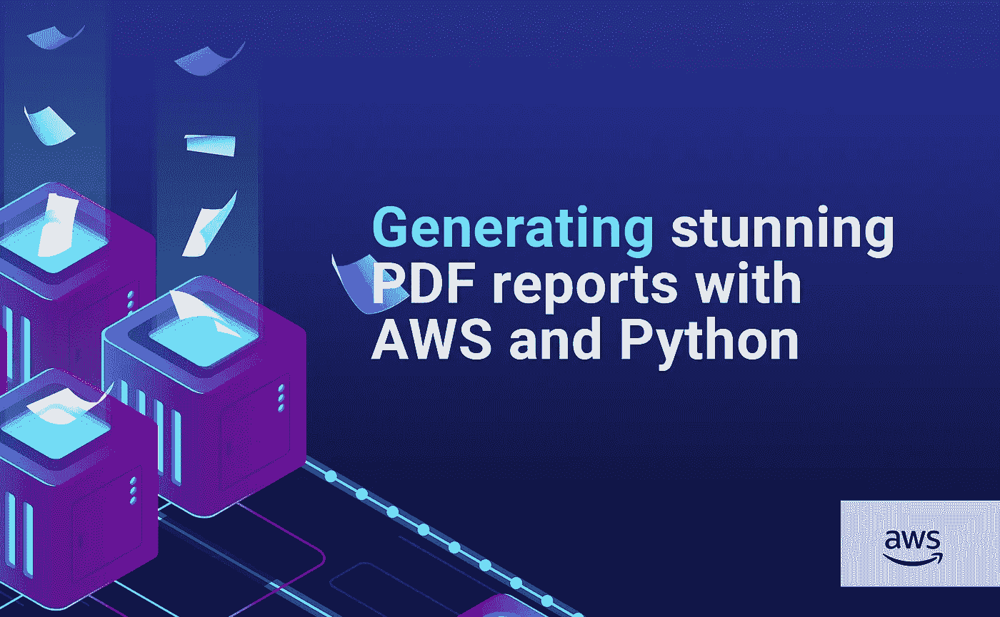

插图由 [Gianca Chavest](https://www.instagram.com/niimde/) 绘制

几年前，我参与了一个为小公司和企业家设计的项目。这是一个典型的 [SaaS 应用](https://en.wikipedia.org/wiki/Software_as_a_service)，带有用户注册和登录机制；用户可以在平台上记录公司的产品、订单和销售额。然后，他们可以看到许多令人惊叹的图表和预测，并下载成 PDF 格式的报告。

从技术角度来看，整个项目非常传统，但报告生成部分非常有趣，我将在本文中分享它。

# 要求

*   在此期间，我在亚马逊上使用一个可扩展的无服务器架构，所以我需要让 PDF 生成在**λ**上工作。
*   我已经开发了整个业务核心(计算、预测等)。)使用 **Python** ，所以我就尽量找 Python 的解决方案。
*   PDF 报告必须与平台上显示的内容**相似或具有**相同的视觉识别:样式、颜色、字体等。

# 工作区

我首先想到使用 PDF 生成库，例如像 [HTML2PDF](https://pypi.org/project/html2pdf/) 或 [FPDF](https://pypi.org/project/fpdf/) 。但是几年前，这些库非常有限:生成的 pdf 在视觉上很差，图表也有点难看。

然后，我想知道我是否可以用我需要的所有精彩的视觉东西来构建一个 HTML 模板，“拍一张照片”，然后“粘贴”到 PDF 中。好消息:有了库[木偶师](https://pptr.dev/)和它的 Python 等价物 [Pyppeteer](https://pypi.org/project/pyppeteer/) 这是可能的。

按照这个想法，我们将做以下事情:在 Lambda 上运行一个浏览器实例，转到 HTML 模板，用用户数据填充它，生成一个 PDF 文件，并将其保存在 S3 桶中。

这将是我们应用的最终架构:

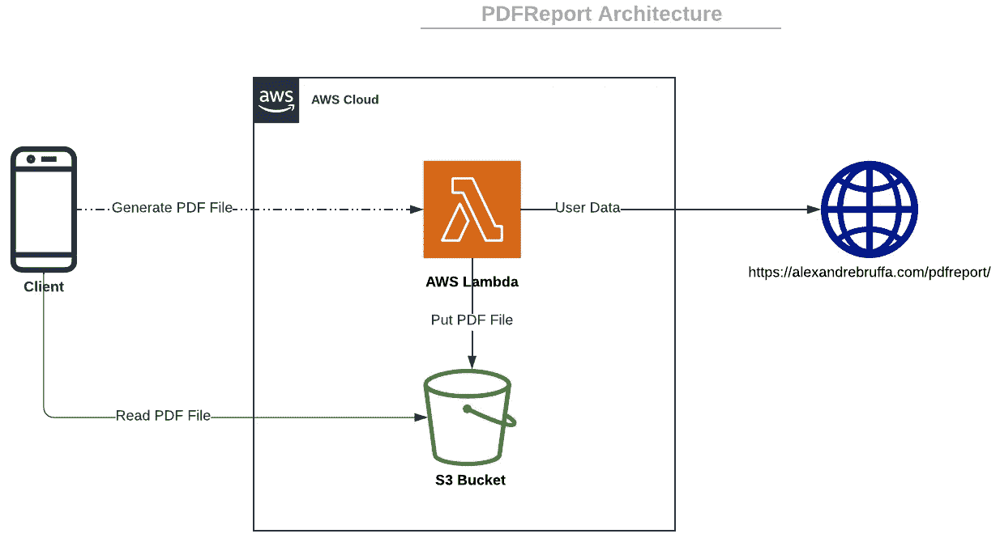

本文将关注 Lambda 部分和 PDF 生成；我假设我们已经有了用户数据。如果您想与 Cognito、API Gateway + Authorizer 和 RDS 数据库进行很好的集成，我邀请您阅读我以前的文章:

 [## 我如何使用 Unity3D 和 AWS 构建酒店平台

### 使用 Amazon Web Services 构建一个完整的可扩展云架构

better 编程. pub](/how-i-built-a-hotel-platform-with-unity3d-and-aws-22bd3c315d81) 

# HTML 模板

## 构建模板

首先，我们需要生成一个好看的 HTML 模板。因为我既不是设计师也不是前端开发人员，对我来说一个很好的选择是购买一个 HTML 模板，比如便宜又漂亮的[框格模板](https://spruko.com/demo/sash/sash/html/index.html)。

经过一些 HTML、CSS 和 Javascript 的破解，我获得了这个没有用户数据的虚拟模板:

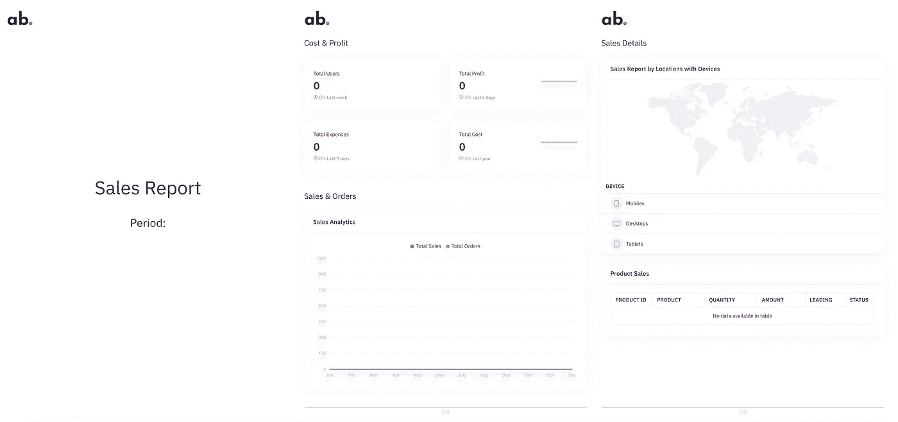

没有用户数据的 HTML 模板

**提示 1** :尽可能地创建一个轻量级的模板，位于一个快速主机上，不需要加载大图片或大文件。此外，PDF 文件将在调用[加载事件](https://developer.mozilla.org/es/docs/Web/API/Window/load_event)后创建，因此避免异步加载和缓存资源。

在 Chrome 控制台中，异步加载和缓存资源显示在红线之后:

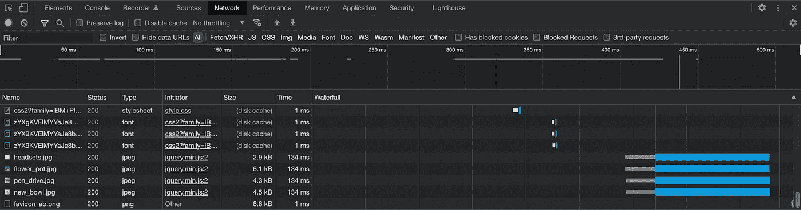

Chrome 控制台

**提示 2**:PDF 报告的每一页都可以用一个固定大小的容器来表示。例如，如果 PDF 报告将具有 [A4 格式](https://en.wikipedia.org/wiki/ISO_216)，则容器将具有以下样式:

**提示 3** :我们将要创建的 PDF 文件可能会有颜色失真的问题。在这种情况下，有必要使用[打印颜色调整属性](https://developer.mozilla.org/en-US/docs/Web/CSS/print-color-adjust)强制获得准确的颜色。

**提示 4** :避免图表动画。每个图表库都有自己的方法，下面是如何使用 **Chart.js** 库来完成的:

## 用数据填充模板

好了，现在让我们用数据填充模板。做这件事有许多方法。

**➡️查询字符串的方法**

一种简单的方法是通过 URL 将数据作为查询字符串发送。我选择发送一个名为`**data**`的大 JSON 参数，并通过 [URLSearchParams](https://developer.mozilla.org/en-US/docs/Web/API/URLSearchParams) 接口接收它。由于本地 Javascript 或 JQuery，如果模板支持的话，可以很容易地用数据填充模板。

看起来[很棒](https://alexandrebruffa.com/pdfreport/?data=%7B%22general%22%3A%7B%22company%22%3A%22PowerReportS.A.%22%2C%22period%22%3A%22Q12022%22%7D%2C%22sales%22%3A%7B%22chart%22%3A%5B19%2C15%2C17%2C14%2C13%2C15%2C16%5D%2C%22total%22%3A%2244%2C278%22%2C%22evolution%22%3A5%7D%2C%22leads%22%3A%7B%22chart%22%3A%5B45%2C23%2C32%2C67%2C49%2C72%2C52%2C55%2C46%2C54%2C32%2C74%2C88%2C36%2C36%2C32%2C48%2C54%5D%2C%22total%22%3A%2267%2C987%22%2C%22evolution%22%3A0.75%7D%2C%22profit%22%3A%7B%22chart%22%3A%5B14%2C17%2C12%2C13%2C11%2C15%2C16%5D%2C%22total%22%3A%22%2476%2C965%22%2C%22evolution%22%3A0.9%7D%2C%22cost%22%3A%7B%22chart%22%3A%5B28%2C56%2C36%2C32%2C48%2C54%2C37%2C58%2C66%2C53%2C21%2C24%2C14%2C45%2C0%2C32%2C67%2C49%2C52%2C55%2C46%2C54%2C130%5D%2C%22total%22%3A%22%2459%2C765%22%2C%22evolution%22%3A-0.6%7D%2C%22transactions%22%3A%7B%22chart1%22%3A%5B100%2C210%2C180%2C454%2C454%2C230%2C230%2C656%2C656%2C350%2C350%2C210%5D%2C%22chart2%22%3A%5B200%2C530%2C110%2C110%2C480%2C520%2C780%2C435%2C475%2C738%2C454%2C454%5D%7D%2C%22geo%22%3A%7B%22markers%22%3A%5B%7B%22latLng%22%3A%5B40.3%2C-101.38%5D%2C%22name%22%3A%22USA%22%7D%2C%7B%22latLng%22%3A%5B28.644800%2C77.216721%5D%2C%22name%22%3A%22India%22%7D%2C%7B%22latLng%22%3A%5B-12.04318%2C-77.02824%5D%2C%22name%22%3A%22Peru%22%7D%5D%2C%22countries%22%3A%5B%22USA%22%2C%22India%22%2C%22Peru%22%5D%2C%22mobiles%22%3A%5B%2217%25%22%2C%2222%25%22%2C%2211%25%22%5D%2C%22desktops%22%3A%5B%2234%25%22%2C%2276%25%22%2C%2258%25%22%5D%2C%22tablets%22%3A%5B%2256%25%22%2C%2283%25%22%2C%2266%25%22%5D%7D%2C%22products%22%3A%5B%7B%22id%22%3A%22%2398765490%22%2C%22slug%22%3A%22headsets%22%2C%22name%22%3A%22Headsets%22%2C%22quantity%22%3A%221%2C895%22%2C%22amount%22%3A%22%246%2C721.5%22%2C%22country%22%3A%22Peru%22%2C%22status%22%3A5.2%7D%2C%7B%22id%22%3A%22%2376348798%22%2C%22slug%22%3A%22flower_pot%22%2C%22name%22%3A%22FlowerPot%22%2C%22quantity%22%3A%225%2C719%22%2C%22amount%22%3A%22%2435%2C7863%22%2C%22country%22%3A%22India%22%2C%22status%22%3A3.2%7D%2C%7B%22id%22%3A%22%2323986456%22%2C%22slug%22%3A%22pen_drive%22%2C%22name%22%3A%22PenDrive%22%2C%22quantity%22%3A%22789%2C123%22%2C%22amount%22%3A%22%245%2C896%2C437%22%2C%22country%22%3A%22USA%22%2C%22status%22%3A15.8%7D%2C%7B%22id%22%3A%22%2387456325%22%2C%22slug%22%3A%22new_bowl%22%2C%22name%22%3A%22NewBowl%22%2C%22quantity%22%3A%222%2C856%22%2C%22amount%22%3A%22%2417.98%22%2C%22country%22%3A%22Peru%22%2C%22status%22%3A-5.5%7D%5D%7D)！

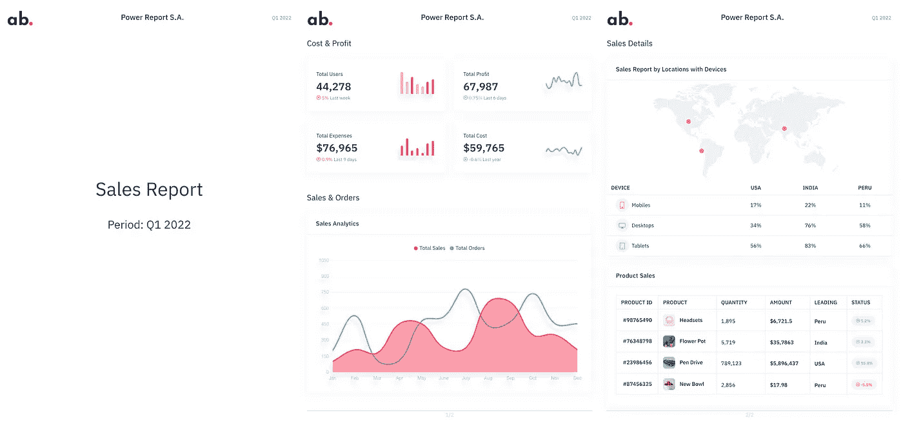

包含用户数据的 HTML 模板

**注意**:网络浏览器限制 URL 的最大长度(Chrome 浏览器[2MB](https://chromium.googlesource.com/chromium/src/+/main/docs/security/url_display_guidelines/url_display_guidelines.md#URL-Length))。如果您需要发送更多的数据，我强烈建议您使用 localStorage 方法。

**➡️本地存储方法**

[本地存储](https://developer.mozilla.org/en-US/docs/Web/API/Window/localStorage)允许在网络浏览器会话中存储数据。我们将按如下方式读取数据:

# 服务器端实现

## S3

S3 是一个静态内容的可扩展存储服务，我们将在那里存储由 Lambda 生成的 PDF 文件。

➡️ **斗**

我们创建一个新的存储桶(又名存储库)。

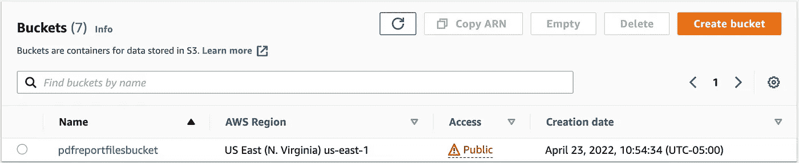

➡️ **斗策**

我们编辑存储桶策略，只允许存储桶内容被读取。

## λ层

Lambda 是一个很棒的无服务器服务，允许运行代码让 Amazon 为你管理服务器资源。但是在编写 lambda 函数之前，我们需要创建一个 Lambda 层，提供所有必要的资源来生成 PDF。

**➡️浏览器**

我们将使用 Chrome，这是全球使用最多的浏览器。AWS Lambda 没有官方版本的 Chrome，但希望这个世界上有一些英雄，比如 [Marco Lüthy](https://github.com/adieuadieu) 给了我们——仅仅是凡人——一份美妙的礼物:AWS Lambda 的无头 Chrome 版本。

我们在这里下载了一个稳定的版本[并解压。](https://github.com/adieuadieu/serverless-chrome/releases/tag/v1.0.0-55)

➡️·皮佩尔

这是棘手的部分:我们需要做一些修改来让 Pyppeteer 在 Lambda 上工作。我们在 [Pypi](https://pypi.org/project/pyppeteer/) 上下载 Pyppeteer 的最新可用版本，并打开`**__init__.py**`文件。

由于未知的原因，库**版本**使 Pyppeteer 在 Lambda 上崩溃，所以我们注释了整个相应的块，并用硬编码的版本号替换它:

lambda 函数上唯一可写的目录是 [tmp 目录](https://aws.amazon.com/blogs/compute/choosing-between-aws-lambda-data-storage-options-in-web-apps/)，所以我们通过硬编码 Pyppeteer 的主目录来改变它:

**注意**:我们可以使用 Pyppeteer [启动器](https://miyakogi.github.io/pyppeteer/reference.html#launcher)的`**userDataDir**`选项来设置正确的目录，但是这样做我们移除了`**AppDirs**`依赖和其他嵌入的依赖。

**➡️属地**

Pyppeteer 有以下依赖关系: [pyee](https://pypi.org/project/pyee/) 、 [tqdm](https://pypi.org/project/tqdm/) 和 [websockets](https://pypi.org/project/websockets/) 。我们下载这些库，并把它们放在与 headless chromium 和 Pyppeteer 相同的文件夹中。

**➡️ Zip 文件**

我们正在构建的配置仅适用于 Python 版本≤ 3.7，因此我们的层和函数将与 Python 3.7 兼容。

我们将 headless chromium 和库放在一个包含以下子目录的目录中:`**lib > python3.7 > site-packages**`并最终压缩它。

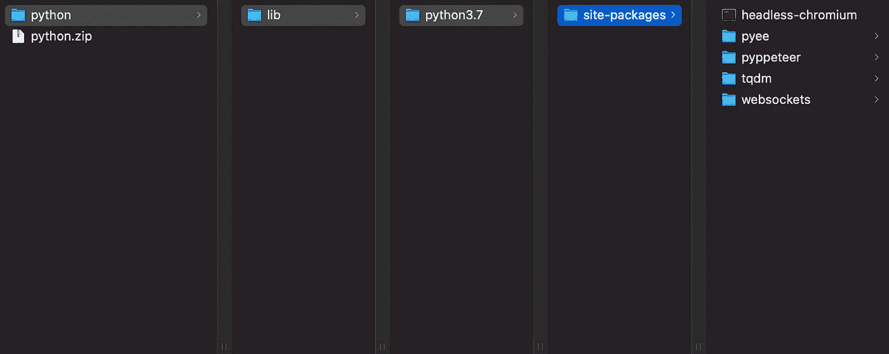

**➡️上传到图层**

太好了！我们最终可以创建一个新的 Lambda 层:我们上传之前创建的 zip 文件，并选择`**Python 3.7**`作为兼容的运行时。

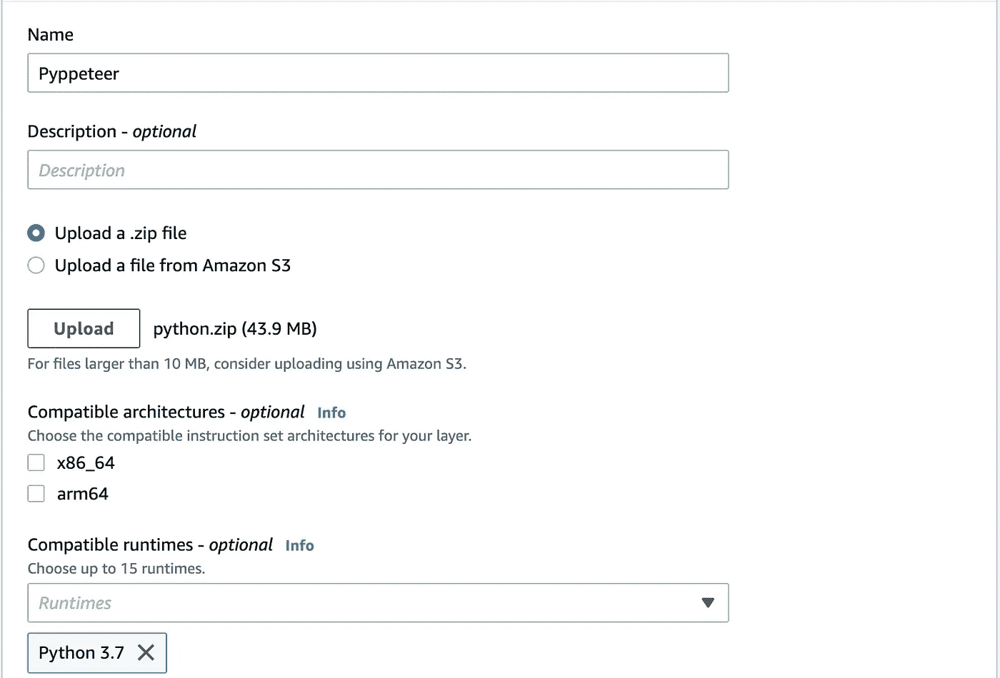

我们的层准备好了！！

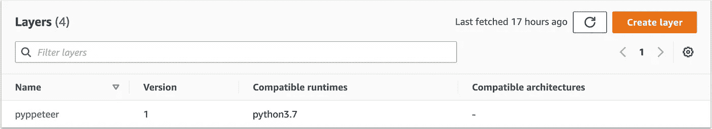

## λ函数

**➡️创建函数**

我们创建一个新的 Lambda 函数，运行时使用`**Python 3.7**`。

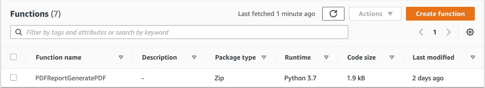

**➡️将 Pyppeteer 层添加到函数中**

在编码之前，我们必须将之前创建的层添加到函数中:

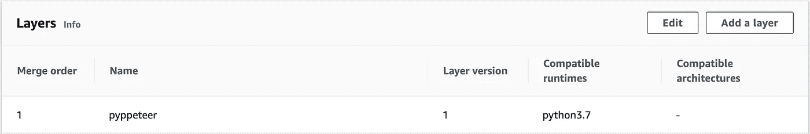

**➡️编码功能🚀**

现在最激动人心的部分，让我们来编码功能！

**注意事项**:

*   我们假设我们已经有了`data`和`user_id`值。如果你想与其他 AWS 服务进行很好的集成，你可以查看我以前的文章。
*   我们创建一个唯一的 PDF 文件名、用户 id 和实际日期的连接。
*   我们使用 [urllib](https://docs.python.org/3/library/urllib.html) 库的 [quote](https://docs.python.org/3/library/urllib.parse.html#urllib.parse.quote) 函数对数据进行编码，然后可以成为 URL 的一部分。
*   我们使用 [Pyppeteer 文档](https://miyakogi.github.io/pyppeteer/reference.html#debugging)中指定的 [asyncio](https://docs.python.org/3/library/asyncio.html) 库。
*   Lambda 将我们上传的文件保存在`/opt`目录中，所以我们启动无头 Chromium 调用`/opt/python/lib/python3.7/site-packages/headless-chromium`，这要感谢 [launch](https://miyakogi.github.io/pyppeteer/reference.html#launcher) 函数的`executablePath`选项。
*   我们使用 [goto](https://miyakogi.github.io/pyppeteer/reference.html#pyppeteer.page.Page.goto) 函数访问 HTML 模板，使用 [pdf](https://miyakogi.github.io/pyppeteer/reference.html#pyppeteer.page.Page.pdf) 函数生成 pdf 内容。
*   我们使用 [boto3](https://boto3.amazonaws.com/v1/documentation/api/latest/index.html) 库的 [put_object](https://boto3.amazonaws.com/v1/documentation/api/latest/reference/services/s3.html#S3.Client.put_object) 函数将我们的 PDF 文件存储在我们创建的 S3 桶中。

**➡️功能提示**

我提供了一些可以在异步函数中使用的精彩技巧:

*   如果要检索浏览器控制台显示的消息，使用[控制台事件](https://miyakogi.github.io/pyppeteer/reference.html#page-class)和[控制台消息类](https://miyakogi.github.io/pyppeteer/reference.html#consolemessage-class)，
*   如果您在生成的 pdf 中看到一些像素化的内容，请使用`[setViewport](https://miyakogi.github.io/pyppeteer/reference.html#pyppeteer.page.Page.setViewport)` [函数](https://miyakogi.github.io/pyppeteer/reference.html#pyppeteer.page.Page.setViewport)的`**deviceScaleFactor**`参数。默认值为 1.0。
*   如果您想使用 localStorage 方法，请转到页面，使用[评估函数](https://miyakogi.github.io/pyppeteer/reference.html#pyppeteer.page.Page.evaluate)将数据值插入 localStorage，然后再次转到页面。
*   默认情况下，生成的 PDF 文件具有信函格式。您可以通过`**format**`选项进行改变。

**➡️功能作用**

我们转到与该函数相关联的角色，添加`**AmazonS3FullAccess**`策略，这样我们的函数就可以编写在 bucket 中生成的 PDF 文件。

**➡️功能设置**

我们的 Lambda 函数将运行一个 Chromium 实例，因此可能需要几秒钟的时间并使用后续内存。

我发现在分配了 2048Mb 内存的情况下，一个 PDF 文件在大约 3.5 秒内生成并写入一个桶中，因此我们将函数超时值更改为 5 秒。

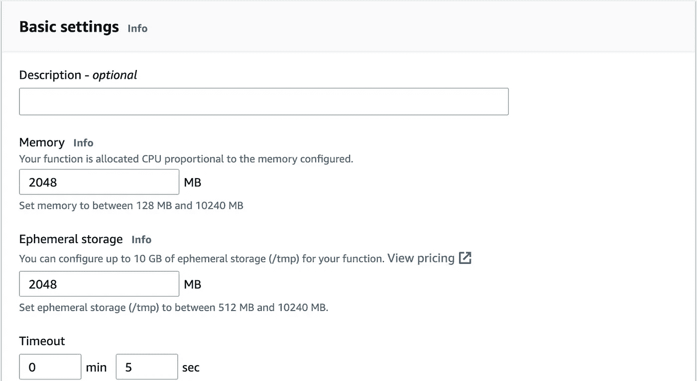

# 决赛成绩

[这是](https://drive.google.com/file/d/1Ot5pbaFsQQHUIETvjOPPQmZLd6DRzRLN/view)[https://alexandrebruffa.com/pdfreport/](https://alexandrebruffa.com/pdfreport/)上托管的模板生成的 PDF 的示例。它拥有我们需要的一切:令人惊叹的图表、自定义字体、颜色和图片上的用户数据。它也有可选的文本和嵌入的链接。

如果你尝试按照这篇文章生成 PDF，请在评论中给我看你的 PDF 文件，我会很高兴看到它们！

# 结束语

本文向您展示了如何在 AWS Lambda 上从 HTML 模板生成令人惊叹的 PDF 文件。我们了解了 AWS Lambda 层、Pyppeteer 库和一些我们在途中发现的新奇事物。

在我的研究过程中，我发现了这篇由 Rafael Brand 撰写的[媒体文章](https://medium.com/limehome-engineering/running-pyppeteer-on-aws-lambda-with-serverless-62313b3fe3e2)，它可能对我的文章有所帮助。

本文中显示的所有 id 和令牌都是假的或过期的，如果您试图使用它们，您将无法建立任何连接。

特别感谢 [Gianca Chavest](https://www.instagram.com/niimde/) 设计了这幅令人惊叹的插图。