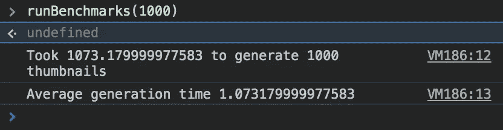

# 在客户端动态生成缩略图

> 原文：<https://betterprogramming.pub/generating-thumbnails-dynamically-on-the-client-12637cfe6a97>

## 当你无法控制后端和缩略图时，客户端缩略图生成可以提高你的 UX

客户端计算

我将以一个免责声明开始:在服务器端生成缩略图几乎总是最好的。它速度很快，不会在多个客户端上重复计算。在大多数情况下，我可能会创建一个云函数来生成各种尺寸的缩略图，并将其设置为由存储事件触发(例如，将图像保存到 AWS S3)。

然而，**我为客户端缩略图生成提供了一个案例，当**:

1.  你不能控制你的应用程序的后端
2.  通过使用缩略图，你的用户体验会得到显著改善

以我和我的合作伙伴正在开发的混合移动应用程序为例，它可以帮助皮肤科医生拍摄和管理病人的照片。后端由诊所的 EHR 提供，因此应用程序只能通过过时的网络 API 与之交互，因此没有内部控制。这是一个照片管理应用程序，所以缩略图很普遍，在用户体验中发挥着重要作用。然而，将全尺寸图像渲染为缩略图是计算密集型的(特别是在移动环境中)，我们注意到这造成了很多 UI 延迟。

因此，我们决定尝试动态的客户端生成，我们对结果很满意。动态位意味着我们在加载照片时动态生成缩略图。我在下面提供了一个简化的要点，说明我们如何在浏览器环境中做到这一点(在我们的混合应用程序中是 webview):

对我的手的照片运行一些性能测试产生了以下结果:

基准测试结果

我的手(原版)

因此，动态缩略图生成平均来说相当快，肯定比我预期的要快。有些缩略图需要 2-3 毫秒，但平均需要 1.07 毫秒。也就是说，我鼓励你用上下文和你将使用的实际图像进行测试。那个手的图像很小，所以它会比高清的要快得多。

> 动态缩略图生成结果相当快…肯定比我预期的要快。

动态生成缩略图并不是我们考虑的唯一选择。每当保存照片时，我们可以将缩略图和原始照片一起存储在 EHR 中。然而，这是有问题的，因为没有办法将它们标记为隐藏的，所以它们会塞满医生的桌面界面。此外，没有什么可以阻止无意中的删除(我们的情况类似于您的用户每天直接查看和编辑您的 S3 存储桶)。

或者，我们可以在客户端或服务器端生成缩略图，并将它们存储在我们*控制的外部系统中。然而，由于负责存储医疗照片的安全和责任问题(更不用说将新的外部系统与 EHR 同步的额外麻烦)，这一点被排除在外。*

> 在你无法控制后端的情况下，客户端缩略图生成是值得考虑的，缩略图可以提高你的 UX。

总之，动态缩略图生成(或一般的客户端生成)通常不是最好的方法。但是，如果你无法控制后台，缩略图可以改善你的 UX，那么*是值得考虑的。*