# 使用 Tuist 生成 Xcodeproj

> 原文：<https://betterprogramming.pub/generating-xcodeprojs-with-tuist-4f11134e9f5a>

## iOS 开发工具

## 去掉不可读的 xcodeproj 文件，向可读的项目配置文件问好


汉娜·莫里斯在 [Unsplash](https://unsplash.com?utm_source=medium&utm_medium=referral) 上的照片

您是否曾经创建过对 iOS 应用程序项目的`xcodeproj`文件进行更改的拉取请求(PR)/合并请求(MR)？


很可能会有两个以上的 iOS 开发团队同时对`xcodeproj`文件进行修改。

例如，两者都可以创建新文件。在这种情况下，当两个人都修改同一个文件时，您可能会创建冲突的更改。此外，xcodeproj 文件不可读。查看带有 xcodeproj 文件中的更改的 PRs 很难理解。

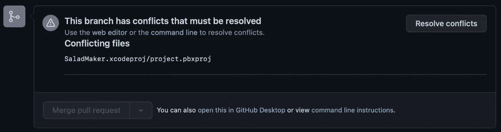

在单独的分支中创建文件后，xcodeproj 中的 Git 冲突

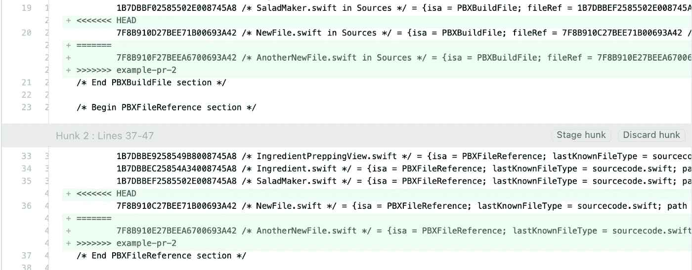

相互冲突的路线

我们有什么办法可以摆脱`xcodeproj`的文件吗？不幸的是，对于 iOS 应用程序开发来说，没有简单的方法可以摆脱这些`xcodeproj`文件。

然而，我们可以使用 [Tuist](https://github.com/tuist/tuist) 从可读性更好的配置文件中轻松生成 xcodeproj 文件。

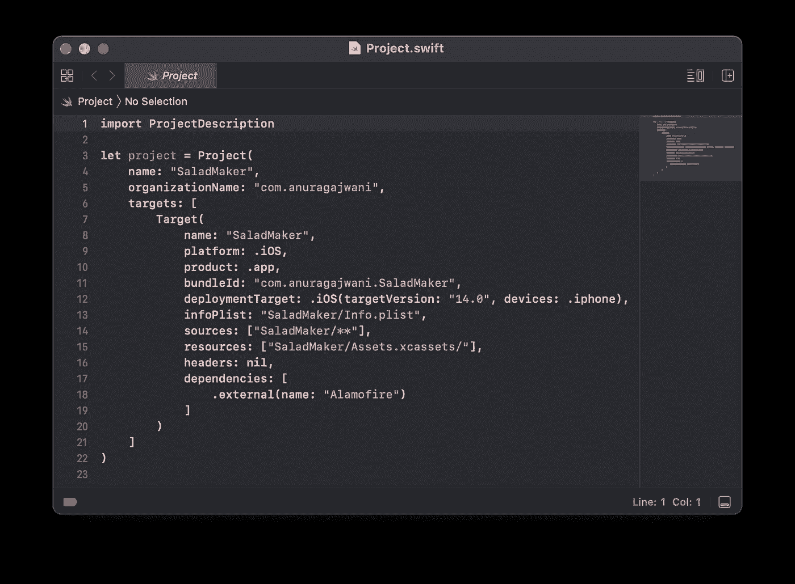

Project.swift 示例

[Tuist](https://tuist.io) 允许你将你的项目配置保存在一个名为`Project.swift`的 Swift 文件中。 [Tuist](https://tuist.io) 然后根据`Project.swift`中的 Swift 代码生成`xcodeproj`文件。

这类似于 [Swift 包管理器](https://www.swift.org/package-manager/)的`[Package.swift](https://developer.apple.com/documentation/swift_packages/package)`。

在这篇文章中，我将向你展示如何通过一个示例项目来使用 [Tuist](https://tuist.io) 。然后我将展示如何使用 [Tuist](https://tuist.io) 将 [Swift 包](https://developer.apple.com/documentation/swift_packages)添加到 iOS 应用程序目标。接下来，我将向您展示如何使用 [Tuist](https://tuist.io) 缓存模块。最后，我将介绍如何更改构建设置。

*我在这篇文章中使用了 Swift 5.6 和 Xcode 13.3。*

# 如何将 iOS 应用程序项目转换为使用 Tuist

在本节中，我们将从安装 [Tuist](https://tuist.io) 开始。

然后我们将下载一个已经存在的应用程序。

最后，创建一个 [Tuist](https://tuist.io) 项目配置文件，删除现有的 xcodeproj 文件，并使用 [Tuist](https://tuist.io) 生成 xcodeproj 文件。

以下是我们将要采取的步骤:

1.  安装[按钮](https://tuist.io)
2.  下载入门包
3.  将项目转换为使用 [Tuist](https://tuist.io)

我们开始吧！

## 1.安装[按钮](https://tuist.io)

只有安装 [Tuist](https://tuist.io) 的方法(写的时候)。打开终端并运行以下命令:

```
curl -Ls [https://install.tuist.io](https://install.tuist.io) | bash
```

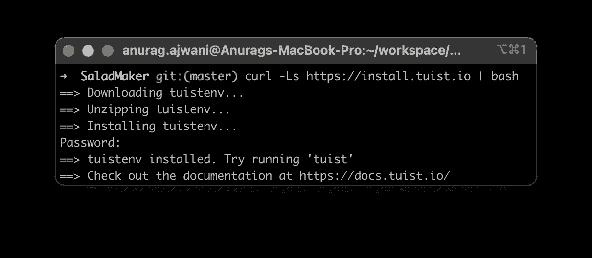

推斯特安装

## 2.下载入门包

让我们下载一个已经存在的 iOS 应用程序项目。打开终端并运行以下命令:

```
cd $HOME
curl https://github.com/anuragajwani/tuist-tut/archive/starter.zip -o starter.zip -L -s
unzip -q starter.zip
cd tuist-tut-starter
open -a Xcode SaladMaker.xcodeproj
```

运行应用程序以查看它的运行情况。

## 3.将项目转换为使用 [Tuist](https://tuist.io)

为了生成 xcodeproj 文件，我们必须在名为`Project.swift`的文件中声明项目结构、目标和配置。首先让我们看看项目目标及其在当前 xcodeproj 中的配置:

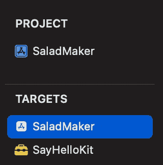

Xcode 项目结构

`SaladMaker`项目由两个目标组成:

1.  `SaladMaker` iOS 应用
2.  `SayHelloKit`框架

`SaladMaker`的源代码位于一个名为`SaladMaker`的目录中。`SayHelloKit`的源代码位于一个名为`SayHelloKit`的目录中。这两个目标都支持 iOS 14 及以上版本。`SayHelloKit`框架由`SaladMaker`应用程序使用。

接下来让我们创建`Project.swift`文件。在终端中运行以下命令:

```
cat > Project.swift <<-EOF
import ProjectDescriptionlet project = Project(
    name: "SaladMaker",
    organizationName: "com.anuragajwani",
    targets: [
        Target(
            name: "SaladMaker",
            platform: .iOS,
            product: .app,
            bundleId: "com.anuragajwani.SaladMaker",
            deploymentTarget: .iOS(targetVersion: "14.0", devices: .iphone),
            infoPlist: "SaladMaker/Info.plist",
            sources: ["SaladMaker/**"],
            resources: ["SaladMaker/Assets.xcassets/"],
            dependencies: [.target(name: "SayHelloKit")]
        ),
        Target(
            name: "SayHelloKit",
            platform: .iOS,
            product: .framework,
            bundleId: "com.anuragajwani.SayHelloKit",
            deploymentTarget: .iOS(targetVersion: "14.0", devices: .iphone),
            sources: ["SayHelloKit/**"],
            settings: .settings(base: ["GENERATE_INFOPLIST_FILE": "YES"])
        )
    ]
)
EOF
```

上面我们已经创建了一个名为`SaladMaker`的项目，有两个目标；`SaladMaker` iOS 应用和`SayHelloKit`框架。我们已经详细说明了每一项:

*   目标名称
*   捆绑标识符
*   它所服务的平台
*   产品类型
*   它的源代码在哪里
*   它的资产在哪里(图像、文本文件和其他非代码文件)

注意，我们还为框架目标声明了一个构建设置。不要担心这一点，我们将在这篇文章的“如何改变构建设置”一节中回到这一点。此外，我们已经声明`SaladMaker`应用程序依赖于`SayHelloKit`:

```
dependencies: [.target(name: "SayHelloKit")]
```

接下来，让我们删除`SaladMaker.xcodeproj`，并告诉 Tuist 为项目生成 xcodeproj 文件。运行以下命令:

```
rm -rf SaladMaker.xcodeproj && tuist generate
```

[Tuist](https://tuist.io) 会自动为你打开 Xcode。运行应用程序，它应该像以前一样运行。

就这样，我们现在从 31 行 Swift 代码中生成了 500 多行不可读的 xcodeproj！

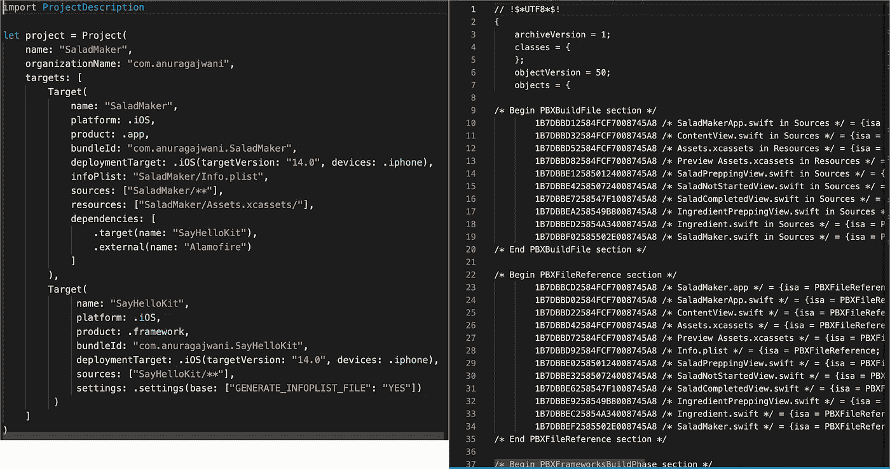

比较 Project.swift 与 Xcodeproj 文件

# 使用 Tuist 时如何添加 Swift 包

大多数应用程序使用开源库来帮助或加速开发。有多种方法可以导入开源库。最流行的方法之一是使用依赖管理器。iOS 开发中最流行的依赖项管理器之一是 [Swift 包管理器](https://developer.apple.com/documentation/swift_packages)。

在这一节中，我将向您展示如何导入 iOS 开发中使用的一个流行的开源库: [Alamofire](https://github.com/Alamofire/Alamofire) 。

在终端中，在项目的根目录下运行以下命令:

```
mkdir Tuist && cd Tuist
cat > Dependencies.swift <<-EOF
import ProjectDescriptionlet dependencies = Dependencies(
    swiftPackageManager: [
        .remote(url: "[https://github.com/Alamofire/Alamofire](https://github.com/Alamofire/Alamofire)", requirement: .upToNextMajor(from: "5.0.0")),
    ],
    platforms: [.iOS]
)
EOF
```

为了让我们在使用 [Tuist](https://tuist.io) 的项目中使用第三方外部依赖项，我们必须在项目根目录下名为`Tuist`的目录下名为`Dependencies.swift`的文件中声明这些依赖项。

**注意**在`Dependencies.swift`中声明的依赖关系必须支持 [Swift 包管理器](https://www.swift.org/package-manager/)。

我们现在可以告诉 [Tuist](https://tuist.io) 通过在项目的根目录下运行以下命令来获取这些外部依赖项:

```
tuist fetch
```

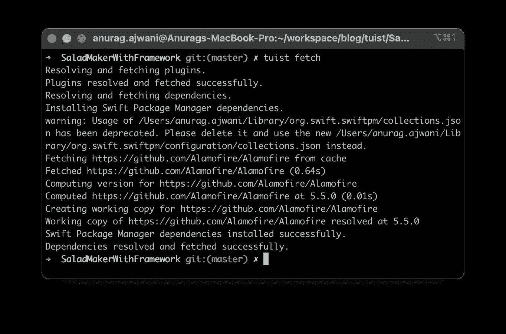

获取外部依赖关系

我们还没有告诉 [Tuist](https://tuist.io) 我们想在`SaladMaker`应用中使用 [Alamofire](https://github.com/Alamofire/Alamofire) 。让我们接下来做那件事。打开`Project.swift`并将`SaladMaker`的依赖项更改为如下:

```
dependencies: [
    .target(name: "SayHelloKit"),
    .external(name: "Alamofire")
]
```

接下来让我们告诉 Tuist 重新生成 xcodeproj 文件。在终端中运行以下命令:

```
tuist generate
```

我们现在准备在`SaladMaker`应用程序中使用 Alamofire:

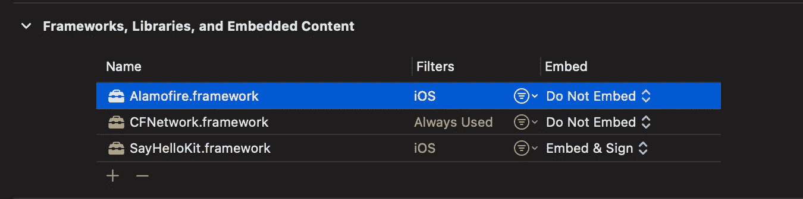

SaladMaker 的链接框架和库

# 如何缓存模块

开发 iOS 应用程序时，Xcode 将编译所有源代码，作为构建过程的一部分，包括其第三方依赖项。例如在`SaladMaker`应用中，我们开始使用 [Alamofire](https://github.com/Alamofire/Alamofire) 。我们不太可能需要修改 [Alamofire](https://github.com/Alamofire/Alamofire) 代码。然而 Xcode 会在开发过程中一遍又一遍地构建 Alamofire。

此外，我们可能会开发某些不需要我们的`SayHelloKit`模块的功能。同样，Xcode 会一遍又一遍地构建它很多次。

如果我们可以构建一次，然后在开发过程中重用构建或编译后的表单，会怎么样？换句话说:我们能缓存模块吗？

在本节中，我们将了解:

1.  如何缓存外部第三方依赖关系
2.  如何缓存项目模块

## 1.如何缓存外部第三方依赖关系

我们可以缓存 [Alamofire](https://github.com/Alamofire/Alamofire) 和其他第三方依赖项(在`Dependencies.swift`中声明),并在开发过程中的应用构建过程中使用它们的编译形式。为此，请运行以下命令:

```
tuist cache warm --dependencies-only
```

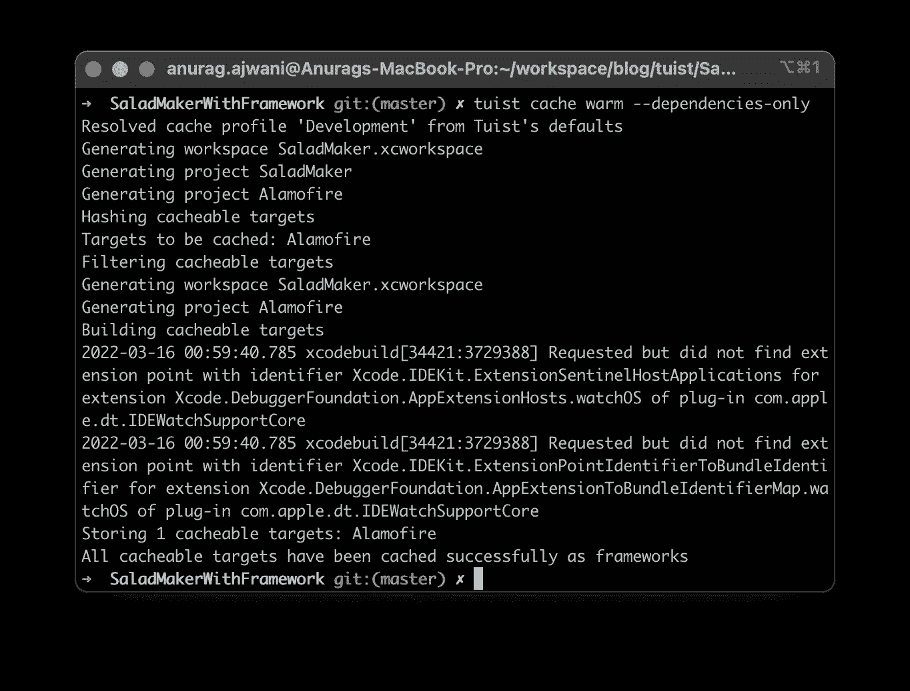

缓存外部依赖项

[Tuist](https://tuist.io) 将构建并缓存 [Alamofire](https://github.com/Alamofire/Alamofire) 。接下来，我们需要告诉 Tuist 重新生成项目，它会自动使用缓存的 [Alamofire](https://github.com/Alamofire/Alamofire) 。运行以下命令:

```
tuist generate
```

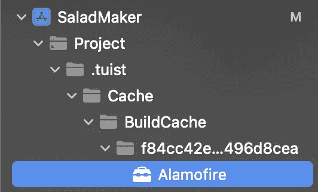

使用缓存的外部依赖项

## 2.如何缓存项目模块

我们也可以缓存自己的模块。如果我们知道我们不会对某些模块进行任何更改，那么缓存这些模块也是值得的。这有助于加速我们正在构建的特性的开发过程。要缓存`SayHelloKit`,运行以下命令:

```
tuist cache warm SayHelloKit
```

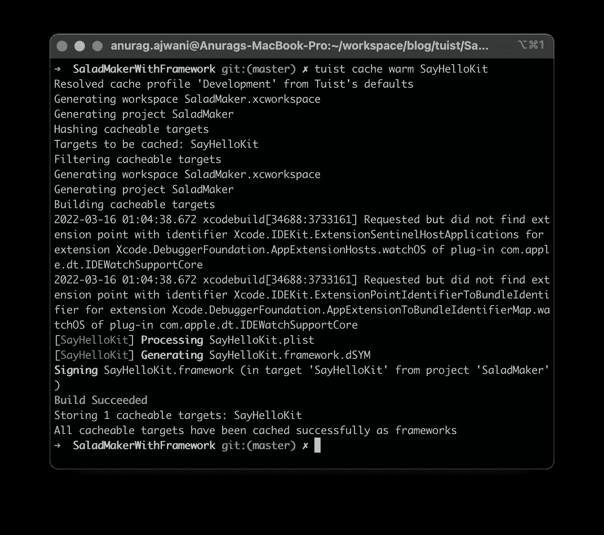

缓存 SayHelloKit

如果我们只想完成`SaladMaker`目标，那么我们必须告诉 Tuist 我们只想开发该目标:

```
tuist generate SaladMaker
```

然后，Tuist 将用这些依赖项的缓存版本替换其依赖项。

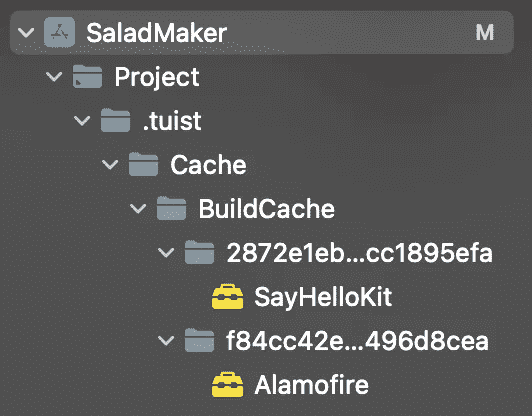

使用缓存的 SayHelloKit

# 如何更改生成设置

默认情况下， [Tuist](https://tuist.io) 会设置 xcodeproj 默认构建设置，或者根本不指定，并允许 Xcode 设置默认值。

然而，在某些情况下，我们可能希望根据我们的应用程序特定的需求来调整构建设置。Tuist 允许我们指定您想要为目标设置的任何构建设置。假设我们想禁用我们的`SaladMaker`应用程序的位代码。打开`Project.swift`，在`SaladMaker` app 目标声明的末尾添加以下一行:

```
 ...
    dependencies: [
        .target(name: "SayHelloKit"),
        .external(name: "Alamofire")
    ]**,**
    **settings: .settings(base: ["ENABLE_BITCODE": "NO"])**
)
```

让我们再次告诉 Tuist 重新生成 xcodeproj 文件:

```
tuist generate
```

查看行动中的变化:

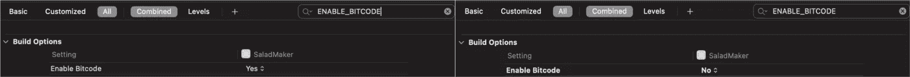

SaladMaker 上禁用的位代码

# 摘要

在这篇文章中，我们了解到:

*   如何使用 [Tuist](https://tuist.io) 生成 Xcodeprojs
*   使用 [Tuist](https://tuist.io) 如何消费 Swift 套餐
*   使用 [Tuist](https://tuist.io) 时如何更改构建设置
*   使用 [Tuist](https://tuist.io) 时如何添加构建阶段
*   如何使用 [Tuist](https://tuist.io) 缓存模块

使用 [Tuist](https://tuist.io) 可以进行很多配置。确保[检查规格和文件](https://docs.tuist.io/tutorial/get-started)。

# 最后的想法

你可以在[我的 Github repo tuist-tuit](https://github.com/anuragajwani/tuist-tut)中找到这篇文章的源代码:

[](https://github.com/anuragajwani/tuist-tut) [## GitHub - anuragajwani/tuist-tut

### 这个项目演示了如何使用 DispatchQueue 并发执行任务。该项目是伴随我的博客…

github.com](https://github.com/anuragajwani/tuist-tut) 

几周前我报道了[如何使用 Xcodegen](/generating-xcodeprojs-with-xcodegen-7d291cfc2f46) 生成 Xcodeproj。 [Xcodegen](https://github.com/yonaskolb/XcodeGen) 以 YML 格式声明项目。 [Tuist](https://tuist.io) 在 Swift 中声明项目。两者都可以利用 [Swift 软件包](https://www.swift.org/package-manager/)。然而， [Tuist](https://tuist.io) 不会以传统方式将 [Swift 包](https://www.swift.org/package-manager/)添加到项目中，然后由 Xcode 管理。 [Tuist](https://tuist.io) 构建依赖图，这样它就可以在上面添加功能，比如模块缓存。

如果你只想生成 Xcodeproj 文件，那么这取决于你的格式偏好(YML vs Swift)。就我个人而言，我更喜欢 Xcodegen 的 T0，因为在我看来，它比 Tuist 的 T1 更具可读性。然而，图伊斯特还能提供更多。

```
**Want to Connect?**For more on iOS development follow me on [Twitter](https://twitter.com/anuragajwani?source=post_page---------------------------) or [Medium](https://anuragajwani.medium.com/introduction-to-concurrency-in-ios-using-grand-central-dispatch-gcd-8280b57a91ec?source=post_page---------------------------).
```