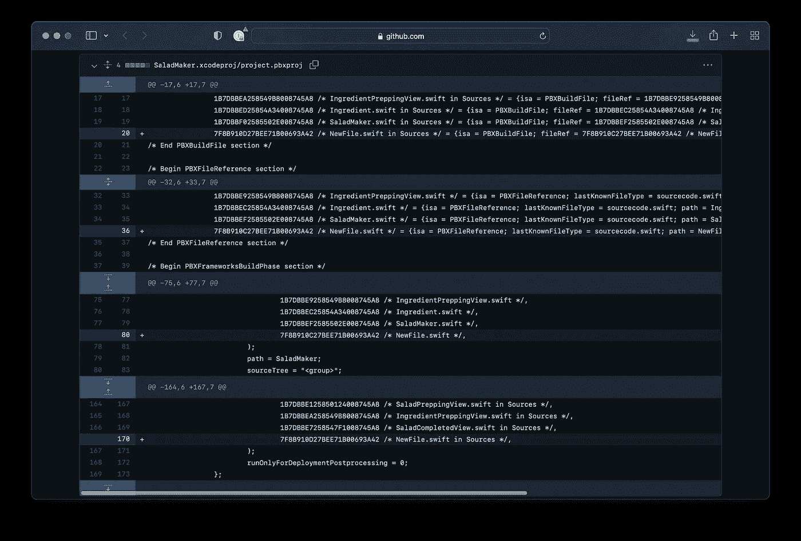
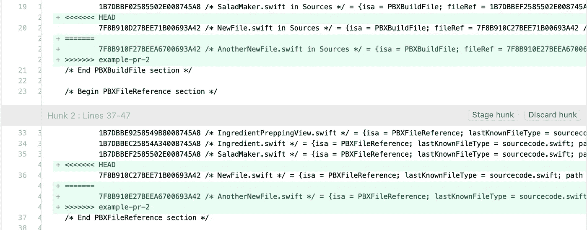
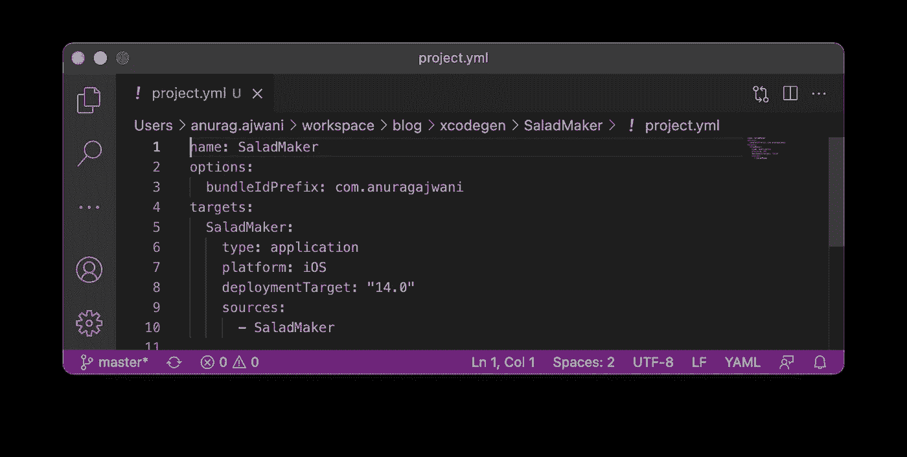
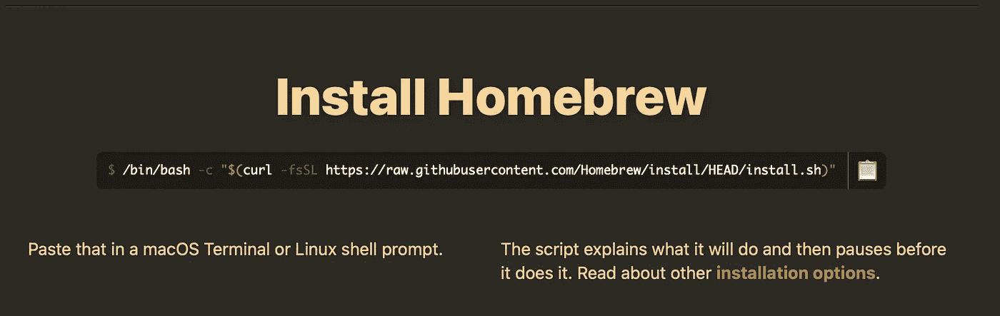
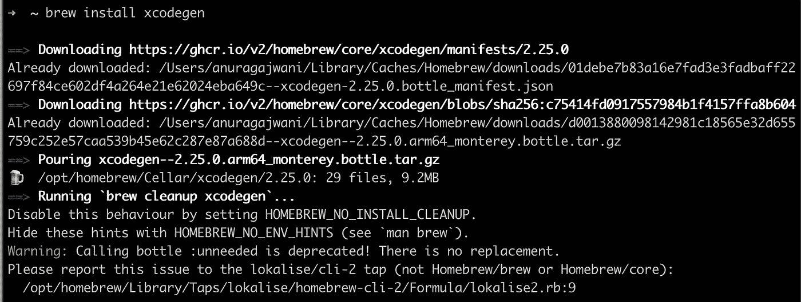
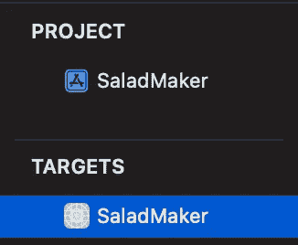
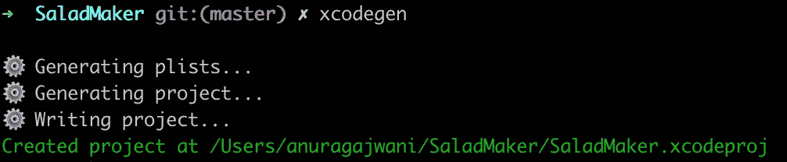
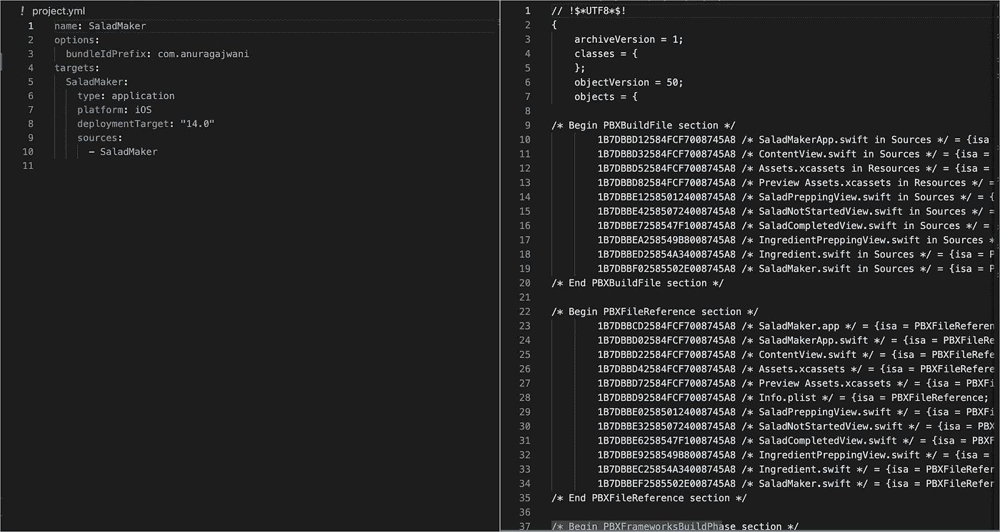
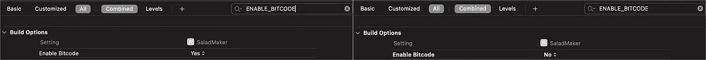

# 使用 Xcodegen 生成 xcodeproj

> 原文：<https://betterprogramming.pub/generating-xcodeprojs-with-xcodegen-7d291cfc2f46>

## iOS 开发工具

## 去掉不可读的 xcodeproj 文件，向可读的项目配置文件问好


斯文·米克在 [Unsplash](https://unsplash.com?utm_source=medium&utm_medium=referral) 上的照片

您是否曾经创建过对 iOS 应用程序项目的`xcodeproj`文件进行更改的拉取请求(PR)/合并请求(MR)？



难以理解的差异

很可能会有两个以上的 iOS 开发团队同时对`xcodeproj`文件进行修改。

例如，两者都可以创建新文件。在这种情况下，当两个人都修改同一个文件时，您可能会创建冲突的更改。此外，xcodeproj 文件不可读。查看带有 xcodeproj 文件中的更改的 PRs 很难理解。


xcodeproj 中的合并冲突



xcodeproj 中的合并冲突

我们有什么办法可以摆脱`xcodeproj`的文件吗？不幸的是，对于 iOS 应用程序开发来说，没有简单的方法可以摆脱这些`xcodeproj`文件。

然而，我们可以使用 [Xcodegen](https://github.com/yonaskolb/XcodeGen) 从可读性更好的配置文件中轻松生成 xcodeproj 文件。



简单的 Xcodegen project.yml 文件

[Xcodegen](https://github.com/yonaskolb/XcodeGen) 允许你将你的项目配置保存在一个 [YAML](https://en.wikipedia.org/wiki/YAML) 格式的文件中。 [Xcodegen](https://github.com/yonaskolb/XcodeGen) 然后根据 [YAML](https://en.wikipedia.org/wiki/YAML) 文件生成`xcodeproj`文件。

在这篇文章中，我将向您展示如何采用一个简单的示例项目来使用 [Xcodegen](https://github.com/yonaskolb/XcodeGen) 。然后我将展示如何使用 [Xcodegen](https://github.com/yonaskolb/XcodeGen) 添加 [Swift 包](https://developer.apple.com/documentation/swift_packages)。最后，我将介绍如何为您的目标更改构建设置。

对于本文，我使用了 Swift 5.5.2 和 Xcode 13.2.1。

# 如何转换 iOS 应用程序项目以使用 Xcodegen

在这一节中，我们将从安装 [Xcodegen](https://github.com/yonaskolb/XcodeGen) 开始。

然后我们将下载一个已经存在的应用程序。

最后，创建一个 [Xcodegen](https://github.com/yonaskolb/XcodeGen) 项目配置文件，移除现有的 xcodeproj 文件，使用 [Xcodegen](https://github.com/yonaskolb/XcodeGen) 生成 xcodeproj 文件。

以下是我们将要采取的步骤:

1.  安装 [Xcodegen](https://github.com/yonaskolb/XcodeGen)
2.  下载入门包
3.  将项目转换为使用 [Xcodegen](https://github.com/yonaskolb/XcodeGen)

我们开始吧！

## 1.安装 Xcodegen

安装 [Xcodegen](https://github.com/yonaskolb/XcodeGen) 有多种方式。然而，在本教程中，我们将使用[自制软件](https://brew.sh)来安装 [Xcodegen](https://github.com/yonaskolb/XcodeGen) 。家酿是一个软件包管理系统。对于 macOS 来说，它是一个非常受欢迎的工具。如果您还没有安装它，那么继续这样做。遵循[家酿](https://brew.sh)在其网站 [brew.sh](https://brew.sh) 上的安装说明。



brew.sh 中的家酿安装说明

一旦[自制软件](https://brew.sh)安装完毕，让我们安装 [Xcodegen](https://github.com/yonaskolb/XcodeGen) 。在终端中运行以下命令:

```
brew install xcodegen
```



终端中的 Xcodegen 安装

## 2.下载入门包

让我们下载一个已经存在的 iOS 应用程序项目。打开终端并运行以下命令:

```
cd $HOME
git clone [https://github.com/anuragajwani/SaladMaker](https://github.com/anuragajwani/distributing-static-lib-xcframework-cocoapods/archive/starter.zip)
cd SaladMaker
open -a Xcode SaladMaker.xcodeproj
```

## 3.将项目转换为使用 Xcodegen

在我们为 [Xcodegen](https://github.com/yonaskolb/XcodeGen) 创建 [YAML](https://en.wikipedia.org/wiki/YAML) 文件之前，让我们先分析一下 xcodeproj 文件中的项目结构。



首先，我们有一个名为`SaladMaker`的项目，它包含一个目标。单一目标是 iOS 平台的一个应用，也叫做`SaladMaker`。项目的源文件和资产位于一个名为`SaladMaker`的目录下。这款应用的最低部署目标是 iOS 14。

让我们为 Xcodegen 创建 YAML 文件。在终端运行以下命令，替换`<YOUR_NAMESPACE>`:

```
cat > project.yml <<-EOF
name: SaladMaker
options:
  bundleIdPrefix: com.<YOUR_NAMESPACE>
targets:
  SaladMaker:
    type: application
    platform: iOS
    deploymentTarget: "14.0"
    sources:
      - SaladMaker
EOF
```

接下来，让我们删除`SaladMaker.xcodeproj`，在项目的根目录下运行 [Xcodegen](https://github.com/yonaskolb/XcodeGen) 。运行以下命令:

```
rm -rf SaladMaker.xcodeproj && xcodegen && open SaladMaker.xcodeproj
```



运行 xcodegen 命令

[Xcodegen](https://github.com/yonaskolb/XcodeGen) 将读取`project.yml`文件，并根据`project.yml`的内容生成一个`xcodeproj`。

我们来分解一下`project.yml`的内容。`name`属性是项目名称。属性在整个项目中应用配置设置。在这种情况下，所有目标标识符都将以`com.<YOUR_NAMESPACE>`为前缀(您可以在这里更改为自己的标识符)。默认情况下， [Xcodegen](https://github.com/yonaskolb/XcodeGen) 会生成包前缀+目标名称的包标识符(即`com.anuragajwani.SaladMaker`)。

接下来，我们有了`targets`属性。这应该是不言自明的。所有目标都将在该属性下指定。我们有我们的`SaladMaker`目标，其中的`type` `application`为`iOS` `platform`。我们将最小部署目标设置为`14.0`，并通过指定`sources`属性来设置源文件和资产。

Xcodegen 允许大量定制和配置。查看 YML 文件的[完整规范。](https://github.com/yonaskolb/XcodeGen/blob/master/Docs/ProjectSpec.md#options)

就是这样！我们已经从一个超过 350 行代码的复杂`xcodeproj`文件发展到 10 行代码。



project.yml vs xcodeproj

记得告诉 [git，一旦准备好使用](https://www.atlassian.com/git/tutorials/saving-changes/gitignore) [Xcodegen](https://github.com/yonaskolb/XcodeGen) 就忽略 xcodeproj 文件。我不会讨论如何做到这一点，因为 git 超出了本文的范围。

此外，所有成员在更改分支时都应记得运行`xcodegen`命令。

# 如何使用 Xcodegen 添加 Swift 包

大多数应用程序使用开源库来帮助或加速开发。有多种方法可以导入开源库。最流行的方法之一是使用依赖管理器。iOS 开发中最流行的依赖项管理器之一是 [Swift 包管理器](https://developer.apple.com/documentation/swift_packages)。

在这一节中，我将向您展示如何导入 iOS 开发中使用的一个流行的开源库: [Alamofire](https://github.com/Alamofire/Alamofire) 。

打开顶层的`project.yml`后，在`options:`部分添加以下内容:

```
packages:
  Alamofire:
    url: [https://github.com/Alamofire/Alamofire](https://github.com/Alamofire/Alamofire)
    majorVersion: 5.5.0
```

上面我们在项目级别添加了这个包。然而，我们还没有将 [Alamofire](https://github.com/Alamofire/Alamofire) 与我们的 [SaladMaker](https://github.com/anuragajwani/SaladMaker) 应用目标联系起来。让我们接下来做那件事。在`SaladMaker`目标下增加以下内容:

```
dependencies:
  - package: Alamofire
```

您的`project.yml`应该如下所示:

```
name: SaladMaker
options:
 bundleIdPrefix: com.anuragajwani
**packages:
  Alamofire:
    url:** [**https://github.com/Alamofire/Alamofire**](https://github.com/Alamofire/Alamofire) **majorVersion: 5.5.0**
targets:
  SaladMaker:
    type: application
    platform: iOS
    deploymentTarget: "14.0"
    sources:
      - SaladMaker
    **dependencies:
      - package: Alamofire**
```

接下来，运行 [xcodegen](https://github.com/yonaskolb/XcodeGen) ，然后在 Xcode 中打开`SaladMaker.xcodeproj`。在终端中运行以下命令:

```
xcodegen && open SaladMaker.xcodeproj
```


添加了 Alamofire 作为依赖项。

就这样，我们准备在[萨拉德马克](https://github.com/anuragajwani/SaladMaker)中使用[阿拉莫菲尔](https://github.com/Alamofire/Alamofire)。

# 如何更改生成设置

默认情况下， [Xcodegen](https://github.com/yonaskolb/XcodeGen) 会设置 xcodeproj 默认构建设置或者根本不指定，并允许 Xcode 设置默认值。

然而，在某些情况下，我们可能希望根据我们的应用程序特定的需求来调整构建设置。Xcodegen 允许我们指定您想要为目标设置的任何构建设置。假设我们想要禁用我们的 [SaladMaker](https://github.com/anuragajwani/SaladMaker) 应用程序的位代码。打开`project.yml`，在 [SaladMaker](https://github.com/anuragajwani/SaladMaker) 目标下添加以下内容:

```
settings:
  ENABLE_BITCODE: NO
```

您的`project.yml`现在应该如下所示:

```
name: SaladMaker
options:
  bundleIdPrefix: com.anuragajwani
packages:
  Alamofire:
  url: [https://github.com/Alamofire/Alamofire](https://github.com/Alamofire/Alamofire)
  majorVersion: 5.5.0
targets:
  SaladMaker:
    **settings:
      ENABLE_BITCODE: NO**
    type: application
    platform: iOS
    deploymentTarget: "14.0"
    sources:
      - SaladMaker
    dependencies:
      - package: Alamofire
```

再次运行 [xcodegen](https://github.com/yonaskolb/XcodeGen) 命令生成一个新的 xcodeproj:

```
xcodegen && open SaladMaker.xcodeproj
```

查看行动中的变化:



在 project.yml 中设置位代码设置之前和之后

# 摘要

*   [Xcodegen](https://github.com/yonaskolb/XcodeGen) 简化了复杂的读取项目配置 YAML 文件中的 xcodeproj 文件。
*   拉取请求/合并请求更容易阅读和理解
*   `project.yml`的冲突更容易解决

您可以使用 [Xcodegen](https://github.com/yonaskolb/XcodeGen) 对项目进行大量配置。确保[检查规格](https://github.com/yonaskolb/XcodeGen/blob/master/Docs/ProjectSpec.md#dependency)。

# 最后的想法

Xcodeproj 文件已经存在很长时间了。随着时间的推移，他们并没有变得更好。我不知道苹果是否正在努力为 iOS 应用程序和其他应用程序目标替换这些。

然而，苹果公司也有积极的迹象。例如，对于 Swift 软件包，苹果放弃了 xcodeproj 文件，转而使用可读性更好的`[Package.swift](https://developer.apple.com/documentation/swift_packages/package)`文件。Xcode 可以将这些文件作为包的项目配置文件读取。

目前，像 [Xcodegen](https://github.com/yonaskolb/XcodeGen) 这样的工具允许在一定程度上远离`xcodeproj`文件。 [Xcodegen](https://github.com/yonaskolb/XcodeGen) 并不是唯一的工具。我将在未来介绍其他工具并进行比较。

```
**Want to Connect?**For more on iOS development follow me on [Twitter](https://twitter.com/anuragajwani?source=post_page---------------------------).
```