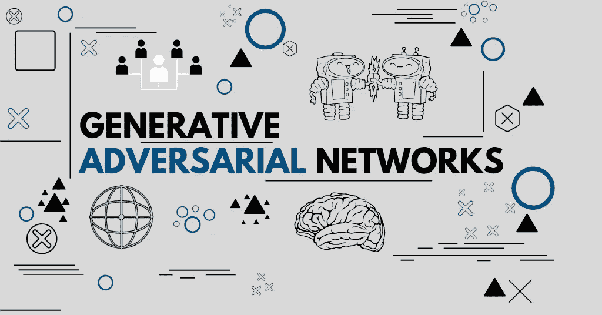
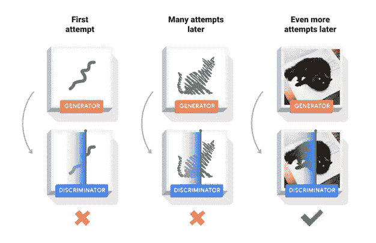
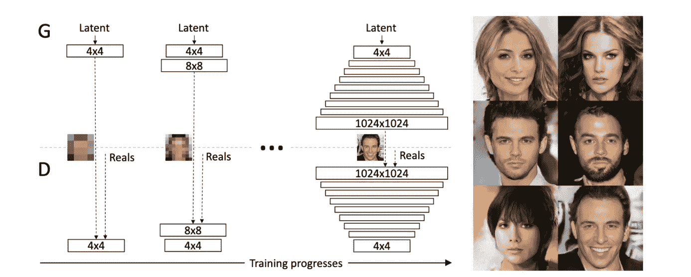
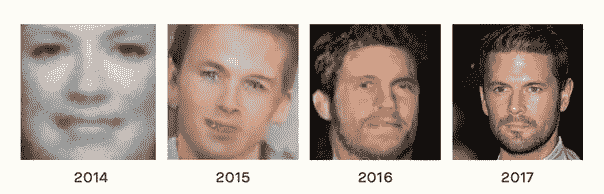
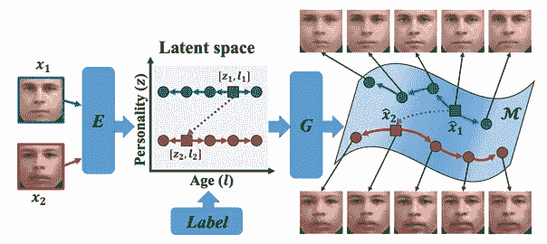
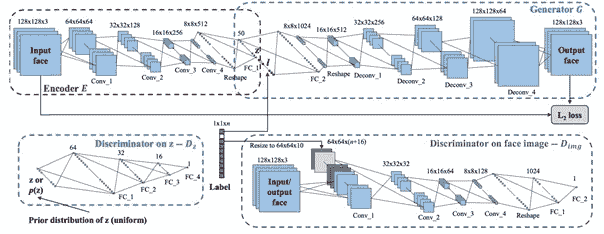
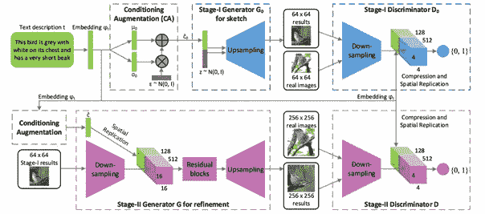
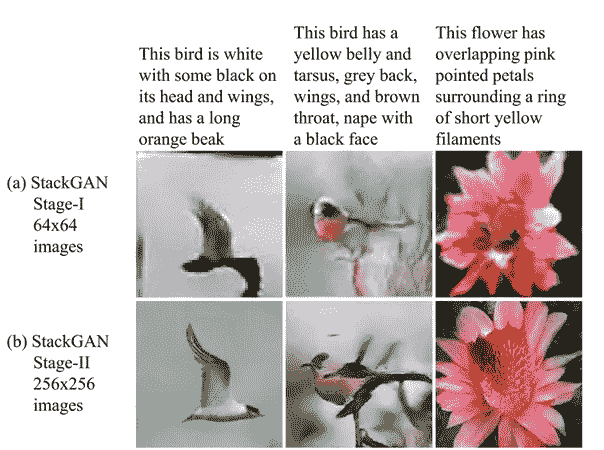
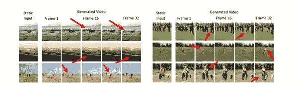
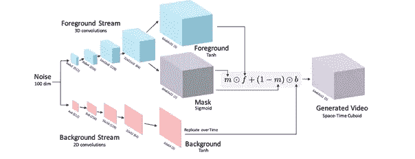

# 生成性对抗网络与人工智能创造现实

> 原文：<https://betterprogramming.pub/generative-adversarial-networks-creating-reality-with-ai-59fbb5b113c0>

## 探索甘的过去、现在和未来

最近，我们看到各种工具越来越受欢迎，这些工具自动创建从未存在过的人、物体或场景的图像，或者通过添加它们从未有过的品质来修改现有物体的表示。

这种解决方案的一个典型例子是 FaceApp。该应用程序可以拍摄一个人的照片，并创建带有额外功能的面部图像。例如，它可以添加胡须，使人看起来更老或更年轻，或者添加通常不存在的面部特征。

所有这一切都要归功于生成性对抗网络(GAN)。今天，我想探讨一下这个话题，让大家熟悉一下 GAN 及其相关技术。

# GAN——生成性对抗网络

首先，我们来研究一下 GAN 背后的机制。想象两个独立的神经网络:第一个被称为*鉴别器*被训练识别图像，而第二个被称为*生成器*学习如何生成图像。

两个模型都基于博弈论进行博弈。生成器的目标是欺骗鉴别器，而鉴别器试图阻止它使用真实和人工(生成)图像的样本作为武器。

随着双方的学习，他们在游戏中变得更加熟练。发生器产生更准确的图像，鉴别器在区分真假样品方面变得更好。当生成器生成的伪造图像如此逼真以至于鉴别器不再能够辨别它们时，生成模型被认为是经过完全训练的。这意味着该模型已经能够生成高度逼真的按需图像。

GAN 是由 Ian Goodfellow 和他的团队在 2014 年发明的。他们一起发表了[一篇有趣的研究论文](https://arxiv.org/abs/1406.2661)描述这个概念。

# 更高的稳定性、速度和分辨率—增强 GAN

甘虽然具有破坏性，但也面临着挑战。生成的图像很清晰，但分辨率较低，不够多样。尽管正在进行研究和开发，学习过程仍然缺乏稳定性。

甘出现三年后，泰罗·卡拉斯和他的团队想出了一种新的网络训练方法，并在他们的作品“[为了提高质量、稳定性和变化而逐步培养甘”](https://arxiv.org/abs/1710.10196)中描述了这种方法该方法包括在训练发生器和鉴别器时对它们的不断改进。

研究人员开始使用低分辨率图像训练网络模型，通过应用连续层逐渐提高分辨率。增量方法允许学习机制首先发现图像分解的大规模结构，然后关注每个图像的更细粒度的细节，而不是一次性学习所有内容。这种方法在生成高度逼真的人脸图像方面取得了一些惊人的成果。

此外，该机制显著减少了训练时间，根据目标分辨率的不同，训练时间从 2 倍减少到 6 倍。由于生成图像的高照片真实感，该方法还加速了该技术的发展并导致其新的应用。

下面的图片摘自[一篇关于人工智能和人工智能发展的研究论文](https://arxiv.org/pdf/1802.07228.pdf)，最好地展示了 Karras 的突破如何在过去几年里影响了 GANs 的发展。

# 年龄增长

现在让我们来讨论一下最新的应用热潮——年龄增长/回归。2017 年，就该主题开展了多项研究。[在其中一篇文章中，](https://trace.tennessee.edu/utk_graddiss/5257/)田纳西大学的一组研究人员提到了*条件对抗自动编码器* (CAAE)的使用。

与目前可用的模型不同，CAAE 机制不需要大量收集不同年龄的人脸图像作为输入。取而代之的是，它假设每张脸都可以用多维度来表示，我们可以通过导航选定的维度来使它看起来更老或更年轻，而不会导致任何特征的损失。

条件对抗自动编码器

CAAE 网络由两个鉴别器组成，可以提供不同年龄的任何人脸的难以置信的逼真表现。

CAAE 图

# 条件对抗性自动编码器是如何工作的？

*“E”*编码器将人脸图像映射到“*z”*矢量(个性)。通过将' *l'* 年龄标签添加到' *z'* 向量，它还创建了一个新的潜在向量*【z，l】*，为生成器' *G.'* 提供输入

编码器和生成器都基于输入和输出面之间的差异' *L2'* 进行更新。' *Dz'* 鉴别器对'*z '*施加均匀分布，而鉴别器' *Dimg'* 要求输出人脸对于给定的年龄标签是照片级真实可信的。

你可以在这里找到这个机制的详细解释以及描述它的研究论文[。](https://arxiv.org/pdf/1702.08423.pdf)

CAAE 在任何给定的时间点(年龄)提供高度逼真的人脸进展，这导致其在人脸识别系统、娱乐和营销中的广泛应用。

# 文本到照片的翻译

我想提到的 GAN 的另一个令人兴奋的应用是从文本生成图像的能力，这些图像描述了它们应该表示的内容。

2016 年，张寒在他的一部作品《 [StackGAN:利用堆叠生成对抗网络进行文本到照片的逼真图像合成](https://arxiv.org/abs/1612.03242)》中提出了使用 GAN 进行文本到照片翻译的概念。现在，我们称他的发现为*堆叠生成对抗网络* (StackGAN)。

StackGAN 网络可以从文本描述中生成分辨率为 256 x 256 px 的照片级真实感图像。这一复杂的过程包括两个阶段:

斯塔克甘过程

第一阶段 GAN(图的上半部分)根据提供的文本描述，绘制一个对象的原始形状，并对其应用颜色，从而生成一个低分辨率的图像。

第二阶段 GAN 将此图像和原始描述作为输入，生成具有逼真细节的高分辨率图像。此外，它可以消除第一阶段产生的各种故障和像差，并通过添加微小而重要的细节来完善图像。

下面是该方法的一个示例:

# 生成视频

最近，我一直在考虑在电影制作中使用甘。想象一下，有一天，整个电影将由人工智能生成，并实时交付给我们。你会得到你所期待的电影，根据你的独特品味量身定制，电影角色将能够表演任何没有特效的特技。

正在进行研究以实现这一愿景。2016 年，Carl Vondrick 发表了一篇题为“[用场景动态](https://arxiv.org/pdf/1609.02612.pdf)生成视频”的研究论文，他在论文中描述了一种由他开发的机制，可以一个接一个地动态生成电影帧。

为了实现这一点，Vondrick 使用了 GAN 和时空卷积架构，可以将每个场景的前景从背景中分离出来。

Vondrick 发明的技术仍然需要一些工作，但我们已经可以想象它在未来会带来的机会。

# 未来可能的氮化镓应用

在不久的将来，氮化镓几乎可以有无限的应用。它将提高娱乐、机器设计、建筑、销售和广告等众多任务和流程的效率。以下是一些可能的情况。

## 娱乐

事情是这样的:你进入你的网飞账户，获得专门为你生成的内容。没有场景和演员是真实的——他们从来没有存在过——但是他们是如此的真实，以至于你无法把他们和真实的东西区分开来。对我们现实的逼真再现赋予了角色人类无法拥有的技能和能力，并允许他们在没有任何 CGI 的情况下做不可思议的事情。

因此，尽管整部电影非常逼真，但其制作时间和成本却大幅下降。更进一步，当基于人工智能的解决方案掌握了所有人类特征和手势时，它将能够按需动态地创建令人惊叹的图片。

## 建筑和室内设计

第二个例子是 GAN 在工程和建筑上的应用。这里我们至少可以想象几个实际的用例。例如，让我们假设你想设计或重新装修你的公寓。

首先，你打开一个手机应用程序，通过智能手机镜头扫描你的公寓。然后，你选择设计风格。底层机制生成实时预览，显示设计在您的空间中的外观。同时，它为您提供了设计中使用的家具和电器的列表，以及价格表和可以购买所有物品的商店。

在建筑中，我们可以应用类似的解决方案来更快地生成计划和可视化，并且比目前由人类制作的计划和可视化具有更高的细节水平。

## 电子商务

电子商务是另一个可以大大受益于 GAN 的行业。想象一个在线时尚企业。作为顾客，你可以把你的照片上传到商店的应用程序上，然后足不出户就可以虚拟试穿各种服装，看看自己穿起来会是什么样子。这种解决方案允许更容易和更快地做出决策；一些品牌已经在他们的电子商店中实现了。

## 3D 设计和模型

GAN 也为 3D 设计和建模提供了巨大的机会。目前手动执行的所有设计过程都可以通过创成式模型实现自动化。

当我们将它们与 3D 打印结合起来时，我们将能够为各种物体和设备的设计和制造建立一个完全自主的系统。它将如何工作？这很简单。您将启动一个应用程序，告诉系统您需要什么输出，然后等待它创建想要的工件。