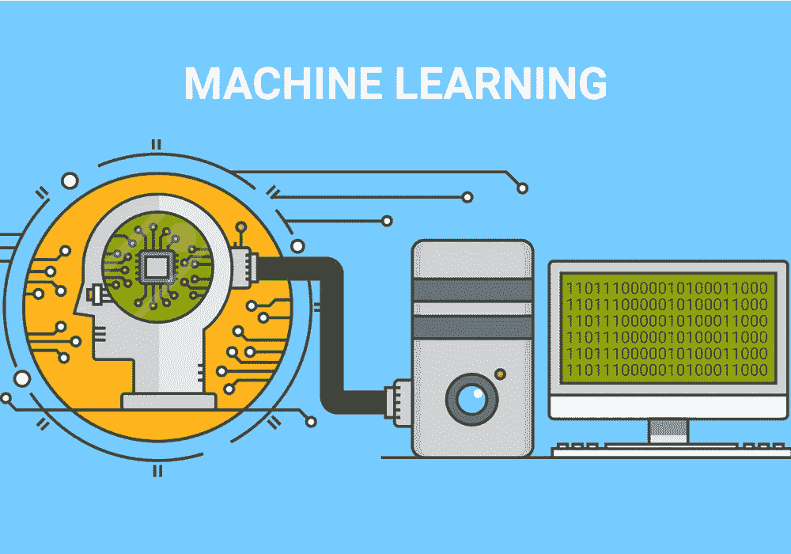
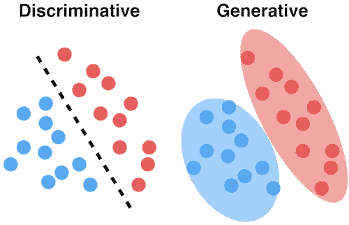

# 机器学习中的生成模型与判别模型

> 原文：<https://betterprogramming.pub/generative-vs-discriminative-models-d26def8fd64a>

## 了解差异以及它们对您的机器学习项目可能意味着什么

图片来源:[大学习博客](https://www.mygreatlearning.com/blog/5-common-mistakes-while-working-with-machine-learning-algorithms/)

你知道吗，在机器学习中，模型可以分为几类，比如生成式和判别式模型，参数式和非参数式模型，基于树的和非基于树的模型。

本文的重点是生成模型和判别模型之间的区别。

# 生成模型

图片来源:【https://dataisutopia.com/blog/discremenet-generative-models 

生成模型是这样的模型，其中焦点是数据集中各个类的分布，并且学习算法倾向于对数据点的基本模式/分布进行建模。这些模型在理论上使用了联合概率的直觉，创建了给定特征(*x*)/输入和期望输出/标签( *y* )同时存在的实例。

生成模型使用概率估计和似然性来建模数据点，并区分数据集中的不同类别标签。这些模型能够生成新的数据实例。然而，它们也有一个主要的缺点。异常值的存在在很大程度上影响了这些模型。

## 机器学习生成模型的例子

*   朴素贝叶斯(以及通常的贝叶斯网络)
*   隐马尔可夫模型
*   线性判别分析(LDA)，一种降维技术

# 判别模型

判别模型，也称为*条件模型*，倾向于学习数据集中类别/标签之间的边界。与生成模型不同，这里的目标是找到将一个类与另一个类分开的*决策边界*。

因此，虽然生成模型倾向于对数据点的联合概率进行建模，并且能够使用概率估计和最大似然来创建新的实例，但是判别模型(正如字面意思)通过对条件概率进行建模来分离类别，并且不对数据点进行任何假设。它们也不能生成新的数据实例。

与生成模型不同，判别模型具有对异常值更稳健的优势。

然而，一个主要的缺点是*错误分类问题*，即将数据点错误分类。

这两种模型之间的另一个关键区别是，生成模型侧重于解释数据是如何生成的，而判别模型侧重于预测数据的标签。

机器学习中的判别模型的例子有:

*   逻辑回归
*   支持向量机
*   决策图表
*   随机森林

# 结束注释

我试图分享这两种不同类型的分类算法是如何工作的。如需深入了解，请参考以下链接。

感谢您的阅读！

# 资源

 [## 背景:什么是生成模型？

### “生成性对抗网络”这个名称中的“生成性”是什么意思？“生成性”描述了一类…

developers.google.com](https://developers.google.com/machine-learning/gan/generative)  [## 判别模型

### 判别模型，也称为条件模型或反向模型，是一类有监督的机器学习模型

en.wikipedia.org](https://en.wikipedia.org/wiki/Discriminative_model)  [## 生成模型

### 在统计分类中，包括机器学习，两种主要的方法被称为生成方法和学习方法

en.wikipedia.org](https://en.wikipedia.org/wiki/Generative_model)