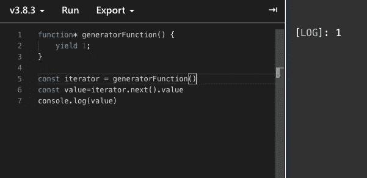
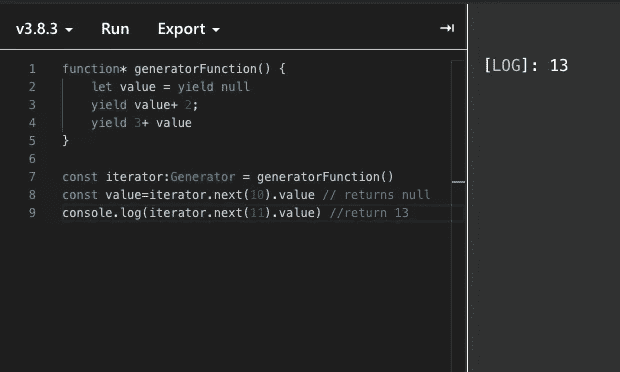
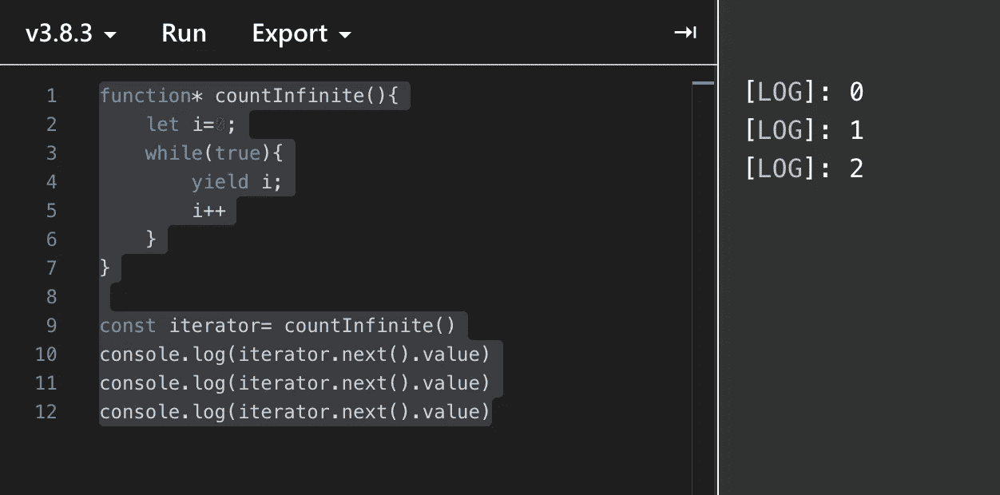
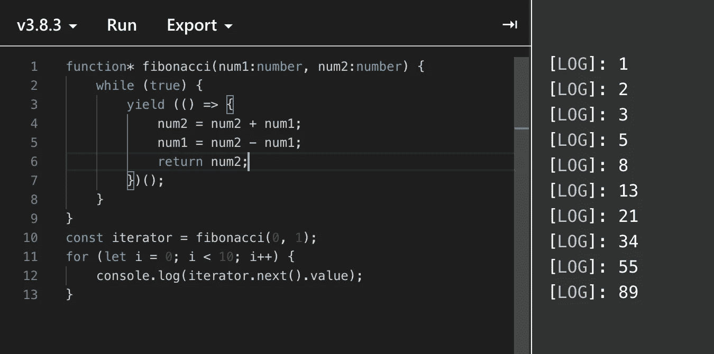

# JavaScript 中的生成器函数

> 原文：<https://betterprogramming.pub/generator-functions-in-javascript-571ba4cda69e>

## 一直等到准备好继续的功能


马修·费尼在 [Unsplash](https://unsplash.com/s/photos/wait?utm_source=unsplash&utm_medium=referral&utm_content=creditCopyText) 上拍摄的照片

在 ES6 中，EcmaScript 发布了一种处理函数的新方法。在本文中，我们将看看它们，以及如何以及在什么地方使用它们

# **什么是发电机功能？**

生成器函数是一种特殊类型的函数，允许您暂停它们的执行，以便以后随时恢复它们。

他们也简化了迭代器的创建，但是我们将在后面讨论。让我们先简单地通过一些例子来了解它们是什么。

创建一个生成器函数很简单。`function*`声明(`function`关键字后跟一个星号)定义了一个生成器函数。

```
function* generatorFunction() {
   yield 1;
}
```

现在，在生成器函数中，我们不使用返回语句，而是使用一个`yield`来指定从迭代器返回的值。现在，在上面的例子中，它将返回值 1。

当我们像普通的 ES6 函数一样调用生成器函数时，它并不直接执行函数，而是返回一个`Generator`对象。

`Generator`对象包含`next()`、`return`和`throw`，它们可以用来与我们的生成器函数进行交互。它的工作原理与`iterator`类似，但你对它有更多的控制权。

让我们通过一个例子来看看如何使用`generatorFunction`。现在，正如我之前告诉你的，我们得到了`next()`。

`next()`方法返回一个具有两个属性的对象，`done`和`value`。您还可以向`next`方法提供一个参数，以便向生成器发送一个值。让我们看一个例子。



对生成器函数调用 next 后的输出

现在，正如我前面所说的，我们也可以通过`next`将值传递给生成器函数，该值可以在`generator`函数中使用。让我们看看另一个例子是如何工作的。



通过 next 将值传递给生成器函数

在这里，当您获得生成器时，您没有可以将值推送到的`yield`。所以，首先你必须通过调用生成器上的 next 来达到一个收益。它会一直返回`null`。

你可以传递参数或者不传递参数，这都没有关系，它总是会返回`null`。一旦你这样做了，你就有了一个`yield`，你可以通过`iterator.next()`推送你的值，这将有效地用通过`next`传递的输入代替`yield null`。

然后，当它找到另一个`yield`时，它返回给生成器的消费者，也就是我们这里的`iterator`。

现在，我们来简单谈谈`yield`关键词。它看起来像 return 一样工作，但却很强大，因为 return 只是在函数被调用后从函数中返回一个值。

它也不允许你在普通函数中的`return`关键字之后做任何事情，但是在我们的例子中，`yield`做的远不止这些。它返回一个值，但是当你再次调用它时，它将移动到下一个`yield`语句。

`yield`关键字用于暂停和恢复发生器功能。`yield`返回一个对象，它包含一个`value`和`done`。

`value`是对生成器函数求值的结果，`done`表示我们的生成器函数是否已经完全完成，其值可以是`true`或`false`。

我们也可以在生成器函数中使用`return`关键字，它将返回相同的对象，但不会再进一步，并且永远不会到达`return`之后的代码，即使在那之后有六个`yield`。

因此，使用`return`时你需要非常小心，并且只有在你确定发生器功能的工作已经完成时才能使用。

# 生成器功能的使用

现在，生成器函数可以非常容易地简化迭代器的创建、递归的实现和更好的异步功能。让我们看一些例子。



计数无穷大示例

在上面的例子中，这是一个无限循环，但是它只会被执行我们在迭代器上调用`next`的次数，因为它保留了它继续计数的函数的先前状态。

这只是一个非常基本的例子，说明了如何使用它，但我们可以在生成器函数中使用更复杂的逻辑，从而提供更多的功能。



斐波那契数列示例

在上面的例子中，我们实现了一个没有任何递归的斐波那契数列。生成器功能真的很强大，只是受限于你自己的想象。

生成器函数的另一个很大的优势是它们确实是内存高效的。我们创造所需的价值。

在一个普通函数的例子中，我们生成了很多值，甚至不知道我们是否会用到它们。然而，对于生成器函数，我们可以推迟计算，只在需要的时候使用它。

在使用生成器功能之前，请记住一些事情。如果已经访问了某个值，则不能再次访问该值。

# 结论

迭代器函数是在 JavaScript 中做很多事情的一种非常好且有效的方式。使用生成器函数还有许多其他可能的方法。

例如，使用异步操作可以变得容易。由于生成函数可以随着时间的推移发出许多值，所以它也可以用作可观测值。

我希望这篇文章能帮助你了解一些关于`generator`函数的知识，并让我知道你还能用`generator`函数做些什么。