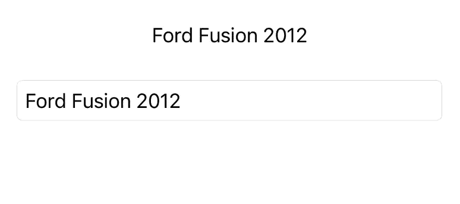
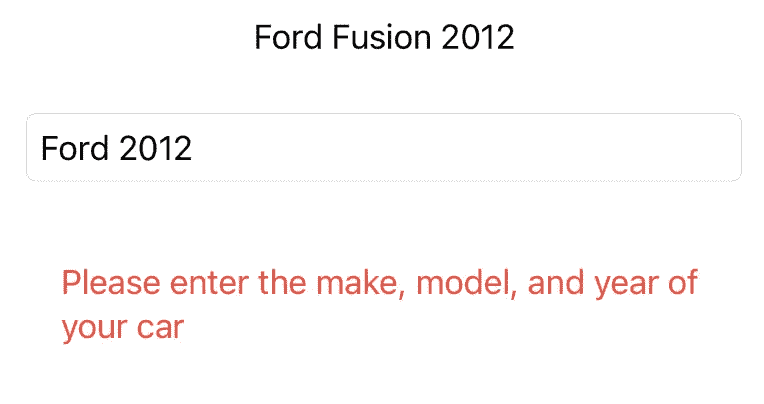

# SwiftUI 中的通用文本字段

> 原文：<https://betterprogramming.pub/generic-text-field-in-swiftui-aca764ac93d4>

## 创建带有绑定而不是字符串的文本字段。

照片由 [Kari Shea](https://unsplash.com/@karishea?utm_source=unsplash&utm_medium=referral&utm_content=creditCopyText) 在 [Unsplash](https://unsplash.com/s/photos/computer?utm_source=unsplash&utm_medium=referral&utm_content=creditCopyText) 上拍摄

SwiftUI 提供了大量工具来创建复杂的应用程序。然而，一些人们可能认为是基本的工具目前却不见了。一个这样的工具是一个可编辑的文本字段，它接受一个对象而不是一个字符串的绑定，比如一个 Int、Float 甚至一个自定义对象。

幸运的是，Swift 为我们提供了创建通用文本字段的工具，该字段可以绑定到任何类型的对象。在我们检查代码之前(完整的代码在底部)，我们必须首先确定使用通用文本字段必须满足的两个先决条件。

第一个先决条件是能够将自定义对象与字符串相互转换。为了将它转换成字符串，您的自定义对象必须符合`CustomStringConvertible`。为了将它从字符串转换，您必须提供一个函数。

这个函数应该接受一个字符串作为参数，并返回一个可选的类型值。对于许多内置类型来说，这很简单，比如对于 float: `return Float(inputString)`。对于自定义类型，您必须修改自己的转换函数。

自定义对象的转换函数示例如下:

第二个先决条件是当文本字段中的文本无效时显示一个视图。您可以提供带有错误消息的简单文本视图，也可以提供更复杂的视图。每当文本字段转换返回 nil 时，就会出现此视图。

请注意，没有使用视图堆叠，所以如果`GenericTextField`在`VStack`中，它将垂直显示，或者在`HStack`中，它将水平显示。

一旦这两个先决条件都满足，您就可以使用下面的`GenericTextField`。

在 VStack 中使用此代码会导致以下结果:

GenericTextField 在运行。顶部文本显示存储在`carInformation`中的当前对象。左边是有效转换，右边是无效转换。

`GenericTextField`的完整代码可以在下面找到。对`TextField` 的任何样式更改都必须在`GenericTextField`类内部完成。

我希望本教程和代码对您有所帮助。请在您的任何代码中随意使用`GenericTextField`!