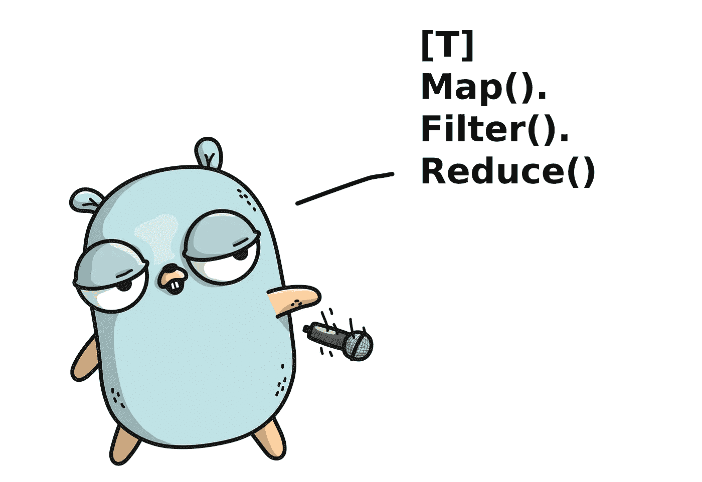

# Go 中的泛型:我们到了吗？

> 原文：<https://betterprogramming.pub/generics-in-go-are-we-there-yet-af851c35ba0>

## 围棋向多范式语言过渡的探索



随着泛型的到来——这一特性无疑已经将 Go 社区分割开来——Go 最终从一种绝对命令式语言转变为一种多范式语言。但是我们到了吗？这是大家一直在等待的泛型实现吗？

在本文中，我将利用我在 Go 中开发的[functional Map/Reduce Api](https://github.com/pscosta/go-strm)[1]来尝试回答这些问题。我将详细说明我发现的更多限制的问题和语言设计决策，并给出一些克服它们的变通方法。这一切，在 Go 1.18 探索泛型威力的同时！

那么，仿制药呢？

一些人认为，Go 过于简单的咒语不太符合泛型允许创造性大脑做的事情。但是就像口语一样，编程语言不是静态的结构，而是随着时间的推移而发展的。工程师们今天正在解决的计算问题，肯定与我们 20 年前用来解决的不一样，所以我们用来解决这类问题的工具自然也在发展。

有几个具体的例子说明语言进化是如何被外部因素驱动的。随着多核的出现，不需要低级锁定原语就能实现并行计算的更好的抽象诞生了:像 Goroutines 或其他“轻量级线程”构造这样的概念现在已经被许多编程语言所支持。

随着区块链的出现，智能合约越来越重要，这表明它的概念在编程中没有强有力的对等物。它可以通过类来模拟，但它可能对人们习惯于思考它的方式非常有害([见一个有缺陷的 DEFI 智能合约中编写的错误如何花费数百万](https://www.cnbc.com/2021/08/11/over-600-million-dollars-was-stolen-in-a-massive-defi-hack.html) [2】)。然后坚固发生了。

围棋也不例外。随着 Go 越来越多地被用在大型后端来执行非常普通的任务，扩展它的特性集是非常必要的。

作为一个干净代码的倡导者和函数式编程的狂热爱好者，我认为 Go 中的新泛型是一个很好的机会，可以用全新的更好的方式做同样的事情。函数式编程范式也变得越来越流行，因为它是实现这一目标的一个很好的工具，因为它做到了以下几点:

*   鼓励不可变的状态
*   避免共享状态上的竞争情况
*   支持并行执行较小且定义明确的任务
*   提高可读性
*   减少样板代码

现在让我们深入探讨一下我在实现这个[功能图/Reduce API](https://github.com/pscosta/go-strm) 时遇到的一些限制，并尝试回答一个重要的问题:我们到了吗？

# 缺少额外的类型参数

与高阶函数不同，Go 中的方法可能不接受额外的类型参数。这可能是 1.18 泛型实现中最缺少的特性，因为它不允许在 Map/Reduce API 中进行适当的链接。

以下面的类型为例，目标是创建一个由内部的`slice[T]`支持的包装器`Stream[T]`结构，为其元素提供映射、过滤和归约方法。

```
type Stream[T any] struct {
   slice      []T
}
```

下面是期望的`Map`方法，旨在应用形式`Stream[IN] -> Stream[OUT]`的转换。

```
func (s *Stream[IN]) Map[IN any, OUT any](f func(IN) OUT) *Stream[OUT]
```

这将允许流上的方法链接，动态地改变其泛型类型，如:

```
strm.Of(“Hey!”, “Hello!”, “Hi!”).
     Map(func (s string) int { return len(s) }).
     Filter(func (i int) bool { return i > 1 }).
     ToSlice()
```

然而，由于没有办法在方法定义中指定`OUT`类型，因此必须编写以下代码:

```
func Map[IN any, OUT any](s *Stream[IN], f func(IN) OUT) *Stream[OUT]
```

使得底层的链接语法可读性更差:

```
strm.Map(
       strm.Of(“Hey!”, “Hello!”, “Hi!”),
       func (s string) int { return len(s) },
).
Filter(func (i int) bool { return i > 1 }).
ToSlice()
```

这种限制背后的原因是什么？正如我们将看到的，这与 Go 中类型和接口实例化的工作方式有关。

在 Go 中，`Interfaces`是隐式实现的。类型通过实现其方法而不是显式声明来实现接口。

此外，Go 中没有类型擦除。在诸如 Kotlin 或 Java 之类的语言中，泛型类型约束是在编译时强制执行的，但实际的类型信息在运行时会被丢弃。在 Go 中，所有泛型类型在使用时都必须被急切地实例化。

举以下例子:

简单来说，只要声明了`var Box[string]`，编译器也会实例化，如下所示:

```
Box[string]
Box[string].store(string)Storage[string]
Storage[string].store(string)
```

这意味着编译器必须拥有要被推断的泛型类型参数的所有信息，并用具体的参数替换，从而在运行时完全定义可用类型的整个范围。

回到我们的流示例，假设下面的代码片段是有效的，Go 编译器不仅要实例化显式声明的`Stream[string]`，还要实例化从`Map`调用中推断出的`Stream[int]`。

```
strings := []string{“Hey!”, “Hello!”, “Hi!”}Stream[string]{slice: strings}.
     Map(func (s string) int { return len(s) })
```

然而，这种类型的推理还没有在方法中实现，因为在这种情况下需要增加复杂性。允许方法在没有类型推断支持的情况下接受额外的类型参数，会破坏类型实例化规则和`Interfaces`的隐式实现。

关于如何支持这一点，有几个建议，要么在运行时进行推理，要么简单地将这些方法视为顶级函数。不管选择哪种技术解决方案，我相信未来的版本会解决这个问题。

# **无通用专业**

简而言之，没有办法用具体的类型参数重载泛型函数或方法。

通过允许泛型类型的具体变化，这可以部分减轻上面讨论的方法的附加类型限制。

再次回到`Stream[string]`的例子，让我们想象我们想要为一些可数类型编写一个`Sum`函数的不同专门化:一个用于返回所有整数之和的`Stream[int]`,另一个用于连接所有字符串的`Stream[string]`。

以上根本不可能。一般来说，方法很少支持泛型。它们不能被重载，也不能接受额外的类型参数或进一步的类型约束。

作为一种肮脏的变通方法，可以使用一些代价高昂的反射来在运行时确定泛型类型，决定如何处理它，最后进行一系列强制转换，以便仍然遵守方法擦除:

```
strm.Of("a", "b", "c").Sum()
// returns -> abc strm.Of(1, 2).Sum() 
// returns -> 3strm.Of(Person{"Tim", 3}, Person{"Tom", 4}).Sum() 
// returns -> { 0} the zero value for Person struct type
```

这确实有效，但这并不是一个人想要实现的东西。

# 兰姆达斯太冗长了

简洁的 lambda 表达式对于有效表达函数范式至关重要，因为它们被广泛用作函数输入表达式，并且经常被链接在一起。

让我们来看一些 lambdas 如何用其他语言表达的例子:

这是围棋中的一个λ:

```
// Go
Map(func (a int, b int) int { 
     return a + b
})
```

Go 指定 lambdas 具有与常规函数完全相同的语法，除了实际的函数名。这迫使显式使用`func`和`return`关键字，以及冗余的输入和输出类型声明。

将它们链接在一起时，符号变得更糟:

```
Map(func(it string) int { 
     return len(it) 
}).
Filter(func(it int) bool { 
     return it > 10 
}).
Reduce(func(a int, b int) int { 
     return a + b 
})
```

其中大部分样板文件可以简化为:

```
Map((it string) -> len(it)).
Filter((it int) -> it > 10).
Reduce((a int, b int) -> a + b)
```

或者更简单，比如在 Kotlin 或 Groovy 中，使用隐式参数(通常是`it`):

```
Map(len(it)).
Filter(it > 10).
Reduce((a, b) -> a + b)
```

轻量级语法不仅删除了不必要的重复，而且最重要的是，通过删除所有混淆真正重要的操作的样板文件，提高了代码的可读性。

# **零值问题**

当前的 1.18 Go 泛型实现没有简单的方法来表示泛型类型参数的零值。

假设您正在收缩一个泛型`[T any]`类型的`slice`，并且需要对删除的元素进行垃圾收集。通常，人们只需将这些元素设置为`nil`，或者只需将`slice`类型的零值赋给它们。下面是使用泛型类型的方法:

```
func delete[T any](slice []T, idx int) {
   for j := idx; j < len(slice); j++ {
      var t T
      slice[j] = t
   }
   slice = slice[:idx]
}
```

由于没有办法写入或返回`T`的零值，这必须在两个语句中完成:首先声明一个`T`类型的变量——被编译器隐式赋值给泛型类型的零值——然后在一个新语句中执行赋值。

```
var t T
slice[j] = t
```

自然的想法是在类似于`slice[j] = nil`的赋值中使用`nil`，并希望编译器足够聪明，能够将它转换为不可空类型(如 int 或 strings)的零值，或者甚至尝试类似于泛型类型`T`的空构造函数(如`slice[j] = T{}`)。但是这里也没有运气。

我肯定不记得有哪种情况下这可能是一个阻碍，但它肯定感觉像一个未经打磨的粗糙边缘。

# **哈希问题**

在围棋中比较事物是…嗯…复杂的。

像`ints`、`strings`、`booleans`、`pointers`和`channel`这样的原始类型是可以比较的，也就是说运算符`==, !=`适用于这些类型。`Slice` s，`Map` s，和函数都不是。包含不可比较类型的结构也是不可比较的。

当试图定义断言或要求`Identity`概念的真正通用函数时，缺乏比较某些数据结构的本机方法——不管 Go lang devs 提出的有效动机如何(我在这里不讨论)—都成为一个严重的限制。

我将展示几个例子，说明这种限制如何在诸如`Stream[T].Contains()`或`Stream[T].Distinct()`这样的方法上变得明显，以及克服这种限制所需的技巧。

这里有一个关于`Contains()`的天真而有问题的版本:

```
func (s *Stream[T]) Contains(element T) bool {
   for _, a := range s.slice {
      if a == element {
         return true
      }
   }
   return false
}
```

编译器立即返回:

*无效操作:a ==元素(运算符==未在 T 上定义)*

由于主流结构已经定义为`Stream[T any]`以支持所有类型**，** `T`不实现可比性。

Go 的反射包再一次拯救了我们。以下是可能的加密代码:

它是这样做的:

1.检查类属`T`是否确实是可比类型之一:

```
reflect.TypeOf((*T)(nil)).Elem().Comparable()
```

2.一旦断言了泛型类型是否可比较，它们就被转换为`any`**(`interface{}`的可互换别名)，这样编译器就不会抱怨在泛型类型`T`上使用了`==`运算符。**

**那么不可比的类型呢，比如`slice`或者包含`slice`的结构？**

**如果我们试图比较它们，我们肯定会得到一个运行时的恐慌。这里有一个可能的解决方法:**

**显然，`reflect.DeepEqual()`实现了预期的行为。文档中对切片的描述如下:**

> **" DeepEqual 报告 x 和 y 是否“完全相等”，定义如下:
> 当满足以下所有条件时，切片值完全相等:
> 它们都为零或非零，它们具有相同的长度，
> 并且它们要么指向同一基础数组的相同初始项"**

**因此，人们很自然地开始思考默认情况下没有这种行为背后的原因。不管那种推理，当把泛型和`Map`放在一起时，这种语言设计决策变得更加受限。Go 不允许不可比较的类型作为`Map` s 的键。**

**如果我们试图使用一个泛型`T`作为映射键，例如`map[T]string`，编译器会报错:**

> **无效的映射键类型:比较运算符==和！=必须为密钥类型完全定义**

**那我们现在的`Stream[T].Distinct()`呢？**

**在 go 世界中，去重复数据结构的首选是在`Map`中索引数据(利用散列值是非常廉价的操作的事实)，然后拒绝任何重复的键。**

**如果一些数据结构本身不是可散列的，那么就不可能实现一个通用的`.Distinct()`方法，或者至少是开箱即用的。**

**这里有一个可能的解决方法:**

**这里使用的技巧在于为不可比较的类型显式生成一个自定义哈希值，并将其用作映射键。幸运的是，有很多简单的方法可以做到这一点，在这个例子中，我使用了流行的 [hashstructure](https://github.com/mitchellh/hashstructure) [4]包。**

**另外，请注意结构`map[any]struct{}`。这将允许后台`Map`接受任何种类的密钥，同时存储一个不需要任何额外空间的空`struct{}`。**

**我想还不算太糟，但还是很乱。**

# ****递归实例化循环****

**这里有一个简单的用例:在一个`Stream[things]`上应用批处理，并使它成为一个`Stream[[]things]`。可能很直白吧？**

**不完全是。结果是这个`T -> []T`转换，即使是在同一个类型`T`之上，也会触发一个意外的实例化循环。**

**以下面的`Stream[T].Chunked(batchSize)`方法为例，目标是将`T`中的一个`slice`按照提供的批次大小批量分成更小的片，例如:`[1, 2, 3, 4]`对于一个`batchSize = 2`变成`[[1, 2] [3, 4]]`。**

**下面是一个简单的实现:**

**下面是意外的编译错误:**

> **。/strms_test.go:1:10:实例化周期:
> 。/strms_test.go:1:13: T 实例化为[]T**

**这种循环错误的根本原因再次与 Go 的类型实例化机制有关。正如我们之前所看到的，一旦声明了所有类型及其方法，Go 就会急切地实例化它们。**

**当一个`Stream[string]`被实例化时，方法`*Stream[string].Chunked(int): *Stream[[]string]`也被实例化。它的返回类型`*Stream[[]string]`本身是一个新类型，这又将实例化`*Stream[[]string].Chunked(int): *Stream[[][]string]`，以此类推，形成一个实例化循环。**

**打破这个循环的解决方案可以简单到将`Chunked()`返回类型改为`[][]T`而不是`*Stream[[]T]`，或者将`[]T`包装在新的结构中。对于提供一致的`*Stream -> *Stream`功能 API 来说，这两种解决方案都不理想，因为我们放弃了期望的返回类型契约。**

**再一次，这感觉像是在泛型实现过程中被匆忙或忽略的事情，但我仍然相信随着泛型 API 的稳定，它会在未来的版本中得到处理。**

# **结论**

**我希望我已经说得很清楚了，一个简洁明了的函数式 Map/Reduce API 在 Go 中仍然不能完全实现。虽然大多数函数范式技术仍然是可能的，使许多丰富的函数成为现实，但缺乏对方法中附加类型参数的支持是非常有限的。**

**一方面，Go 仍然是一门非常年轻的语言，我确实看到了很大的改进空间。我遇到的大多数限制通常与固有的实现复杂性有关，而不是与某些语言规范不兼容有关。**

**另一方面，在某些情况下，令人印象深刻的是，旧语言可以很好地支持新的范例，而这些范例并不是为它们设计的。Go 仍处于起步阶段，如果算上一个非常活跃、受过良好教育的社区，它肯定会发展得很好。**

**我也认为更加“宽容”，允许用多种方式做同样的事情，最终是好的，因为更多拥有不同技能的人会采用 Go。**

**最终，就像莱纳斯·托沃兹曾经说过的，“只要有足够的眼球，所有的错误都是肤浅的。”**

**关于最初的问题:我们到了吗？嗯……不完全是，但我们肯定是朝着正确的方向前进。**

# **参考**

**[1]—[Go-strm:Go 中丰富的 Map/Reduce API，PS Costa](https://github.com/pscosta/go-strm)
【2】—[在迄今为止最大的 DeFi 黑客攻击之一中，超过 6 亿美元被盗](https://www.cnbc.com/2021/08/11/over-600-million-dollars-was-stolen-in-a-massive-defi-hack.html)
【3】—[Go 规范:允许方法# 49085](https://github.com/golang/go/issues/49085)
【4】—[https://github.com/mitchellh/hashstructure](https://github.com/mitchellh/hashstructure)**