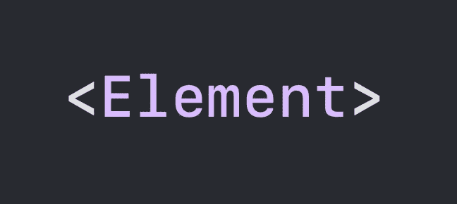

# 在 Swift 中学习泛型

> 原文：<https://betterprogramming.pub/generics-in-swift-2cd549c53075>

## 知道它是什么，如何使用它们，何时使用



作者图片

# 什么是泛型？

泛型编程是一种在维护类型安全的同时编写可重用代码的技术。这是一种叫做“参数多态性”的多态性多态性意味着使用一个接口或名称来处理多种类型。

主要有三种不同类型的多态性:

*   即席多态性。我们可以定义多个同名但类型不同的函数，称为临时多态。
*   亚型多态性。如果一个函数期望一个 C 类，我们也可以传入 C 的一个子类，这叫做子类型多态性。
*   参数多态性。如果一个函数有一个泛型参数，我们可以用不同的类型传递它。这被称为参数多态性。

# 为什么我们需要泛型

原因之一是代码少。与其这样写:

```
func square(value: Int) -> Int{…}
func square(value: Double) -> Double {…}
func square(value: Float) -> Float {…}
```

我们可以这样写:

```
func square<T>(value: T) -> T {…}
```

这样，我们可以编写单个函数，而不是编写多个函数来处理不同的参数类型(函数重载)。这里`T`代表类型。你可以把任何东西放在那里；不一定是`T`，我们放什么也没关系。该功能也可以定义为:

```
func square<PutAnythingHere>(value: PutAnythingHere) -> PutAnythingHere {…}
```

这意味着如果你传递一个类型为`x`的对象给这个函数，它将返回一个类型为`x`的对象。

# 为什么不用呢？

```
func square(value: Any) -> Any{}
```

这不好，也不会起作用，因为我们可以传递任何类型，也可以返回任何类型，这没有意义。

我们使用泛型来表达和限制一个类使用哪种类型。例如，当我们声明一个数组时，我们这样声明它:

```
var arr: Array<Int>
arr = [1,2,3,4,5]
```

这意味着`arr`是一个整数数组。这样，我们就不能在这个数组中插入除整数以外的任何东西。我们可以定义一个整数数组，因为 array 有一个如下定义的泛型类型:

```
public struct Array<Element> {…}
```

如果您真的想要一个可以容纳任何项目的异构数组，那么您可以将其定义为:

```
var arr: Array<Any>
arr = [1, “Two”, 5.8, Car(), Calendar(), OperationQueue()]
```

这是你应该避免的事情，除非你真的知道你在做什么，因为它可能会打开一个蠕虫的罐子。原因是如果你想使用数组中的元素，你需要像这样强制展开它们:

```
var obj0 = arr[0] as! Int
var obj1 = arr[1] as! String
var obj2 = arr[2] as! Double
var obj3 = arr[3] as! Car
var obj4 = arr[4] as! Calendar
var obj5 = arr[5] as! OperationQueue
```

你看这是多么有问题和危险。感觉你的 app 随时可能崩溃。像这样简单的代码可能会导致崩溃:

```
var obj0 = arr[0] as! String
```

```
error: Execution was interrupted, reason: signal SIGABRT.
Could not cast value of type ‘Swift.Int’ (0x1b9ac80b8) 
to ‘Swift.String’ (0x1b9ac6258).
```

因此，在创建数组时，请坚持使用泛型类型。

# 如果我们想处理特定类型的子集呢？

我们上面的 square 函数是有问题的，因为我们可以传递任何类型给它。如果我们传递一个字符串呢？

```
func square<T>(value: T) -> T {…}
square(“Some string here”)
```

字符串没有方块，所以这没有任何意义。我们需要将泛型进一步限制为数字类型，如下所示:

```
func square<T: Numeric>(value: T) -> T {…}
```

这样，我们只能传递类型符合数字协议的值。我们知道所有的数值都有平方，所以我们的函数现在有了正确的限制，没有人可以传递没有意义的东西。如果我们试图把它叫做:

```
square(“Some string here”)
```

编译器在下面给出了这个错误，并且不允许它发生:

```
function ‘square(value:)’ requires that ‘String’ conform to ‘Numeric’
```

我们通过将泛型类型限制为符合协议来限制它。我们也可以使用一个类，将泛型类型限制为特定类的子类。

```
 class SomeClass {
 var name: String = “class name”
}

func printClassName<T: SomeClass>(value: T) {
 print(value.name)
}

class SomeSubClass: SomeClass {}

printClassName(value: SomeSubClass())
//prints:
//class name
```

# 更大范围内的泛型

函数和方法不是唯一的泛型类型。我们也可以有泛型结构、类和枚举。

## **例 1**

让我们创建一个使用泛型类型的堆栈结构。我们需要用一个我们命名为`Object`的类型来定义这个堆栈，所以我们只能用同一个类型来定义`push`、`pop`和`peek` 。

```
 struct Stack<Object> {
 private var objects: [Object] = []

 mutating func push(object: Object) {
   objects.append(object)
 }

 mutating func pop() -> Object? {
   return objects.popLast()
 }

 func peek() -> Object? {
   return objects.last
 }
}
```

这里我们定义了一个 struct，它应该有一个预定义的对象类型。例如，一个函数堆栈将是这样的:

```
typealias Work = () -> Void
var stack: Stack<Work> = Stack()
stack.push {…}
```

这里，我们将堆栈限制为一个`Work`函数堆栈。我们只能将函数压入堆栈，特别是别名为`Work`的函数，它不接收任何参数，也不返回任何内容。我们可以这样调用堆栈中的函数:

```
while let work = stack.pop() {
 work()
}
```

## **例 2**

让我们创建一个 SwiftUI `View`，它接收另一个`View`作为子视图。SwiftUI 中的`View`是一个协议，所以我们需要定义一个符合`View`协议的 struct，并将一个子视图作为同样符合`View`协议的泛型类型传递。

```
struct SomeView<Content: View>: View {
 let subview: Content
 var body: some View {
   subview
 }
}
```

我们可以通过传递一个`Text`或一个`Image`作为子视图来创建一个`SomeView`的实例，因为`Text`和`Image`都符合`View`协议，就像这样:

```
let someView = SomeView(subview: Text("some text…"))
let anotherView = SomeView(subview: Image("some_image"))
```

## **例 3**

以下是 Swift 中`Optional`的定义:

```
enum Optional<Wrapped> { 
 case none 
 case some(Wrapped)
}
```

`Optional`是通用类型。当我们为 Wrapped 选择一个值时，我们得到一个具体的类型。比如可选的< Int >或者可选的< UIView >都是具体类型。

当我们想把一个泛型类型转换成一个具体类型时，我们必须为每个泛型参数选择一个具体类型。

在整个 Swift 标准库中使用泛型。例如:

*   像数组、集合和字典这样的集合。
*   `Optional`使用通用参数对其包装类型进行抽象。
*   `Result`有两个通用参数——一个代表成功的值，另一个代表错误。
*   `Unsafe[Mutable]Pointer`是它所指向的内存类型的总称。
*   路径在其根类型和结果值类型上都是通用的。

# 具有关联类型的协议

关联类型是用作协议一部分的类型的占位符名称。关联类型的实际类型直到协议被采用后才被指定。它是在协议中声明的泛型类型。这就是我们如何在协议中使用泛型。

如果我们想定义我们的`Stack`协议而不是一个结构，该怎么办？让我们试试。如果我们写下下面一行:

```
protocol Stack<Object>
```

编译器给出这个错误，并告诉我们如何在协议中使用泛型。以下是消息:

```
An associated type named ‘Object’ must be declared in the protocol ‘Stack’ 
or a protocol it inherits
```

那么，我们如何将堆栈定义为一个协议呢？像这样:

```
protocol Stack {
 associatedtype Object

 mutating func push(object: Object)
 mutating func pop() -> Object?
 func peek() -> Object?
}
```

唯一不同的是，我们没有将其定义为`protocol Stack<Object> {…}`，而是将其定义为`protocol Stack { associatedtype Object }`。现在，让我们创建一个符合`Stack`协议的`Stack`结构。

```
 struct WorkStack: Stack {
  typealias Object = Work
  private var objects: [Work] = []

  mutating func push(object: @escaping Work) {
   objects.append(object)
  }

  mutating func pop() -> Work? {
   return objects.popLast()
  }

  func peek() -> Work? {
   return objects.last
  }
}
```

在`WorkStack`中，我们可以删除 typealias 行，因为编译器可以从函数声明中推断出关联的类型，并理解关联的类型是`Work`。所以，我们可以这样定义它:

```
struct WorkStack: Stack {
 private var objects: [Work] = []

 mutating func push(object: @escaping Work) {
   objects.append(object)
 }

 mutating func pop() -> Work? {
   return objects.popLast()
 }

 func peek() -> Work? {
   return objects.last
 }
}

//We can create an instance of WorkStack and use it like this:
var workStack = WorkStack()
workStack.push {…}
while let work = workStack.pop() {
 work()
}
```

我们可以创建符合`Stack`协议的其他栈，如`IntStack`、`StringStack`、`CarStack`等。，就像我们上面做的那样。但是如果我们想要创建一个符合`Stack`协议的通用堆栈，它可以是任何特定类型的堆栈，该怎么办呢？我们可以这样实现它:

```
struct MyStack<Item>: Stack {
 private var objects: [Item] = []

 mutating func push(object: Item) {
   objects.append(object)
 }

 mutating func pop() -> Item? {
   return objects.popLast()
 }

 func peek() -> Item? {
   return objects.last
 }
}

//With MyStack, we can create a stack of any type.
var carStack = MyStack<Car>()
carStack.push(Car())
```

这太棒了。现在我们可以创建任何类型的堆栈。如果我们扩展一个现有的类来符合一个带有关联类型的协议会怎么样？例如，扩展数组以符合`Stack`协议。我们可以这样做:

```
extension Array: Stack {
 mutating func push(object: Element) {
   self.append(object)
 }

 mutating func pop() -> Element? {
   return self.popLast()
 }

 func peek() -> Element? {
   return self.last
 }
}
```

上面，我们使用数组的通用类型`Element`作为`Stack`协议的关联类型`Object`。编译器推断`Array.Element == Stack.Object`。记住`Array`和`Stack`是如何声明的:

```
public struct Array<Element> {…}
protocol Stack { 
 associatedtype Object 
 …
}
```

# 具有主要关联类型的协议

如果我们将一堆`Work`实例传递给一个函数会怎么样？如果我们写下面的代码会发生什么？(关键词`inout`是修改我们传递的栈，与我们的主题无关)。

```
func executeStack(stack: inout Stack) {
  ...
}
```

我们得到这个错误:

```
Use of protocol ‘Stack’ as a type must be written ‘any Stack’
```

这里我们可以使用`any`或者`some`关键字。这两者的区别是另一个话题。如果我们把它写成`some Stack`，它意味着符合协议`Stack`的东西。让我们试着像这样调用函数:

```
func executeStack(stack: inout some Stack) {
 while let work = stack.pop() {
   work()
 }
}
```

对于上面的代码，编译器给出以下错误:

```
Cannot call value of non-function type ‘(some Stack).Object’
```

这很容易理解，因为编译器不知道堆栈中的项目是它可以调用的“函数”。为了让编译器明白，我们需要像这样声明它:

```
func executeStack<T: Stack>(stack: inout T) where T.Object == Work {
 while let work = stack.pop() {
   work()
 }
}
```

上面，我们告诉编译器参数栈符合`Stack`协议，其中它的`Object`，是`Work`的一个实例。这个可以，但是有点丑。我们也可以这样定义(有一个条件):

```
func executeStack(stack: inout some Stack<Work>){
 while let work = stack.pop() {
   work()
 }
}
```

条件是我们需要声明我们的`Stack`协议的主要关联类型，就像这样:

```
protocol Stack<Object> {
 associatedtype Object
 …
}
```

上面，`Stack<Object>`告诉编译器`Object`是`Stack`协议的主要关联类型。

假设我们想合并两个堆栈。下面是我们如何声明这样做的函数:

```
func merge<Item>(stack1: some Stack<Item>, 
 stack2: some Stack<Item>) -> some Stack<Item> {
 …
 return mergedStack
}
```

# 带有 Where 子句的扩展

我们在上面的例子中使用了 where 子句，这是不必要的，因为我们有一个使用主关联类型的更好的替代方法，上下文扩展需要 where 子句。

假设我们想为我们的`MyStack`编写一个扩展来添加编码自身的功能。也许我们想把它保存到磁盘上。要进行编码，堆栈及其项目必须符合`Encodable`协议。我们是这样定义的:

```
extension MyStack: Encodable where Item: Encodable {
 func encode() -> Data? {
   try? JSONEncoder().encode(self)
 }
}
```

如您所见，我们使用了`where`子句将关联类型限制为可编码。因此，这个扩展只适用于它们和它们的项目可编码的`MyStack`实例。对于所有其他人来说，这个扩展是不存在的。

例如，因为`String`符合`Encodable`协议，我们可以这样使用它:

```
var stringStack = MyStack<String>()
stringStack.push(object: “a string”)
print(stringStack.encode())
```

```
prints: Optional(20 bytes)
```

有时，我们可能需要关联的类型是一个特定的类型，而不是遵循一个协议。例如，如果我们只想为关联类型为`Work`的堆栈编写一个扩展，我们可以这样声明:

```
extension MyStack where Item == Work {
 mutating func execute() {
   while let work = self.pop() {
     work()
   }
 }
}
```

从 Swift 5.7 开始，也可以使用尖括号来编写:

```
extension MyStack<Work> {
 mutating func execute() {
   while let work = self.pop() {
     work()
   }
 }
}
```

where 子句可以有多种限制。大概是这样的:

```
extension Foo where T: Sequence, T.Element == Character {
 func specialCaseFoo() { … }
}
```

# 泛型类型别名

泛型类型别名允许您为现有的标称泛型类型提供名称，或者为非标称类型(例如元组、函数等)提供名称。)和泛型参数。

```
typealias StringDictionary<T> = Dictionary<String, T>
typealias DictionaryOfStrings<T : Hashable> = Dictionary<T, String>
typealias IntFunction<T> = (T) -> Int
typealias Vec3<T> = (T, T, T)
typealias BackwardTriple<T1,T2,T3> = (T3, T2, T1)
```

# 实施细节

关于 Swift 中泛型的实现细节，可以看[这个](https://www.youtube.com/watch?v=ctS8FzqcRug)视频。