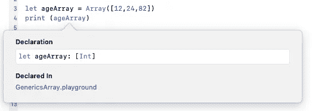
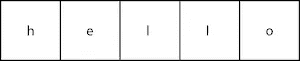
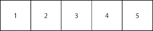
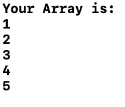
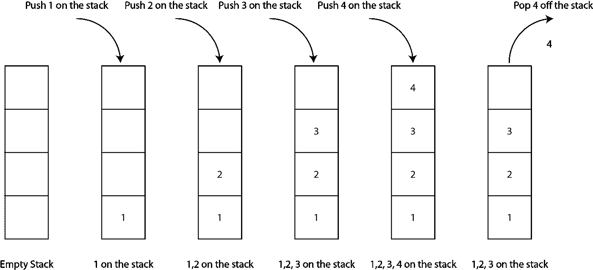
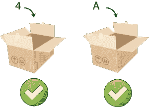
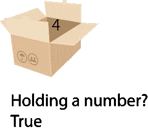

# Swift 中的泛型

> 原文：<https://betterprogramming.pub/generics-in-swift-aa111f1c549>

## 如何使用 Swift 的这一“神奇”功能？有什么优势？


[timJ](https://unsplash.com/@the_roaming_platypus?utm_source=unsplash&utm_medium=referral&utm_content=creditCopyText) 在 [Unsplash](https://unsplash.com/s/photos/generic?utm_source=unsplash&utm_medium=referral&utm_content=creditCopyText) 上拍照

泛型用于减少代码重用，并实现问题的抽象。有人说这是 Swift 的高级功能，但我不同意。一旦你习惯了，这就变得很容易了(正如我们将要看到的)。

难度:简单| **普通** |挑战

# **先决条件**

对 Swift 中的功能和方法有一些基本的了解。

# **术语**

*泛型*:可重用的函数和类型，可以与任何类型(或某种类型的子集)一起工作。

*方法签名*:方法名和用于函数的参数列表的组合。

# 为什么它很重要——以及数组如何使用泛型

泛型是一个强大的特性，也是在面试中经常被问到的一个特性，以试图发现你知识的广度。

您已经使用了泛型:数组允许您接受任何类型并保存它们，而不必为每个类型指定不同的数组类型。Swift 的类型推断意味着这一切感觉相当无缝和容易。

例如，我们可以将朋友的年龄放入一个数组中，Swift 会将类型推断为`[Int]`。

我们可以通过按下键盘上的*选项*并点击如下定义的`ageArray`来查看该类型。



我们可以使用 struct 创建一个版本(因为，嘿，这就是 Apple 对其数组所做的)，也就是说，您可以拥有一个包含一系列字符的数组:



保存字符串的数组的可视化效果

或者，以完全相同的方式设置数组，一个整数数组:



保存整数的数组的可视化

无论你用什么方法创建一个整数数组，都会发生这种情况:

```
let intArray = Array([1,2,3,4,5])
```

或者包含以下内容的字符数组:

```
let chrArray = Array([“h”,”e”,”l”,”l”,”o”])
```

# 让我试试——仿制药

我们可以创建这样一个数组(用一个有创意的名字，我在这里选`MyArray`)。

现在，这里有很多关于`CustomStringConvertable`(以及与之匹配的描述)，而`T`代表任何类型，所以我们可以在数组中使用整数或字符数组。

为什么不试着制作自己的版本呢？我的意思是把上面的代码复制+粘贴到一个操场上。老实说，这是个好主意。

# 制作通用混凝土

这在*编译时完成。*这意味着你得到了编译时类型安全和上面显示的可爱的推论。

好东西。

# 一个简单的功能使想法具体化

有许多简单的函数可以使用泛型。可能没有这个简单。

我们希望打印 Swift 提供的任何类型的通用数组，但是在显示数组内容列表之前，要有一段很好的介绍:“您的数组是:”这样的话。

所以，如果你输入这个函数`[1,2,3,4,5]`,它会把下面的内容写到控制台:



我们函数的输出

但是请记住，这需要适用于所有类型的阵列。

事实证明这是(可以预见的)可能的。

我们再次使用了一个*泛型类型参数* ( `T`)，所以我们的函数可以接受任何类型——但是我们当然希望它是一个数组。

因此，我们在函数头中放了一个`<T>`，让 Swift 知道我们的函数是通用的，然后坚持让我们函数的用户给我们一个输入`[T]`。

然后，在函数内部，我将选择使用一个快速的`.forEach`(你可以使用一个简单的`for`循环——继续，你知道你想要的)来打印结果。事情是这样的:

如果你不想输入这个，顺便说一下，在页面底部有一个不错的 Git repo。但是我不想太宠你…

## **T 可以是任何类型？**

没错。`T`是一种占位符，当我们运行程序时，它被替换为具体类型。也就是说，在运行时。

这就是泛型的神奇之处——你不需要事先知道类型，因此可以写一些非常漂亮的东西。这肯定是你想做的事吧？

# 两个通用参数怎么样

没问题。我们可以有一个接受两个值的类型签名。

请注意，我们还返回了泛型类型。

顺便提一下，注意我们已经用*约束了*泛型类型。`T`必须是可比较的(这就是`<T: Comparable>`所表明的)，通过约束泛型类型，你可以做各种各样的好事。但是从现在开始，继续向上…

那是什么？您的意思是您需要不同类型的多个参数？好的。

# 不同类型的多个泛型参数怎么办

很难找到这个的好用途。我知道，因为我找不到好的用途(举个简单的例子)。

但关键是，Swift 有可能使用多种通用类型。

# 我们如何使用它——一堆我做的东西

可以创建一个接受所有类型元素的堆栈。

提醒一下，弹出和弹出堆栈的工作方式如下:



现在，在这个实现中，为了防止堆栈下溢，我们只在堆栈中没有元素时返回`nil`。至于堆栈溢出，为什么不直接找个网站问这个问题呢？

至于实现，堆栈接受一个*泛型* 参数，这意味着它可以接受整数、双精度、浮点或字符。

有*限制吗？*是的——您不能混合使用这些类型。

这意味着我们首先要声明堆栈的类型。这一切意味着什么？在这里，我们创建了一个堆栈`Character`，并将`“A”`弹出到堆栈上。

其他限制呢？如果我们想实现一个“peek”函数，显示栈顶的项目而不移除它，那该怎么办？

事实证明没有问题，我们可以使用 Swift favorite，它是一个扩展。

如果你想知道如何实现栈的整数版本，你可以看看下面的 Git repo，它已经为你实现了。

# 泛型类型的子类化

可能吗？当然是啦！

这里，我们描述了一个可以神奇地保存单一类型元素的容器。我们可以添加整数或字符，因为我们的 holder 可以包含泛型类型。



持有人类型的表示

太棒了。但是如果我们想创建一个这种类型的子类，知道它是否保存了一个整数呢？

如果我们问这个`CleverHolder`它是否包含一个数字，它将返回一个布尔值来确认或否认这个事实。



聪明的持有者的代表

我们如何用代码来写呢？其实也不是太大的问题。看一看:

# 这些东西在用吗？

嗯，是的。想出一个在这样的教程中使用的最小的例子是很棘手的，但是将一个类型约束到一个协议对我的个人测验应用帮助无穷。让我给你一个函数签名:

现在，我使用一个协议将类型约束到我的问题协议，但总体思路是，我向我的问题类询问具有特定类型的当前问题(因此 UI 知道如何显示它)。然后它返回问题(或者不返回，视情况而定)。

听着，不管怎样，它帮了我很多。如果你有任何问题，请联系我。

# 结论

仿制药？作为编程语言中的工具，它们真的很重要。就创建伟大的软件而言，它确实是你应该使用的东西，或者至少应该在你的工具包里。

# 回购链接

一如既往，这里是给你的[链接](https://github.com/stevencurtis/SwiftCoding/tree/master/Generics)，祝你好运！

[](https://github.com/stevencurtis/SwiftStack) [## 史蒂夫·库蒂斯/斯威夫特斯塔克

### 此时您不能执行该操作。您已使用另一个标签页或窗口登录。您已在另一个选项卡中注销，或者…

github.com](https://github.com/stevencurtis/SwiftStack)