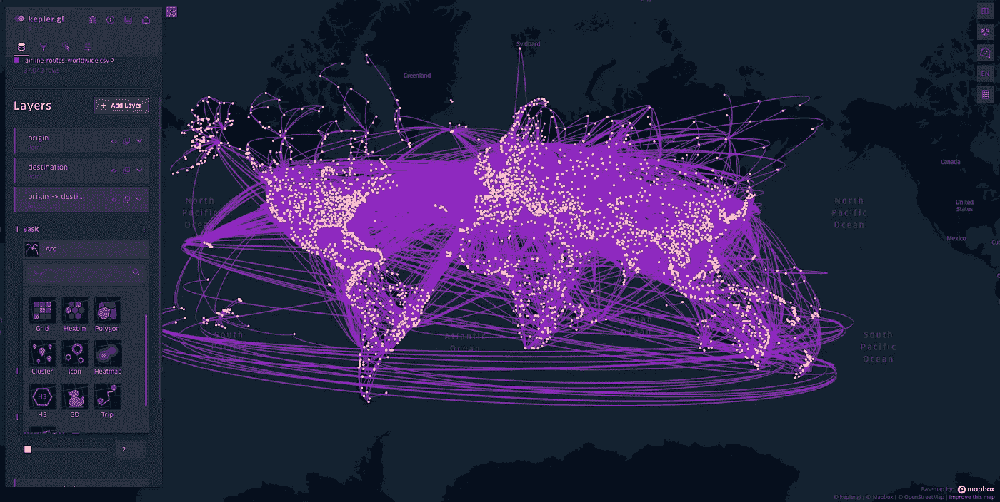
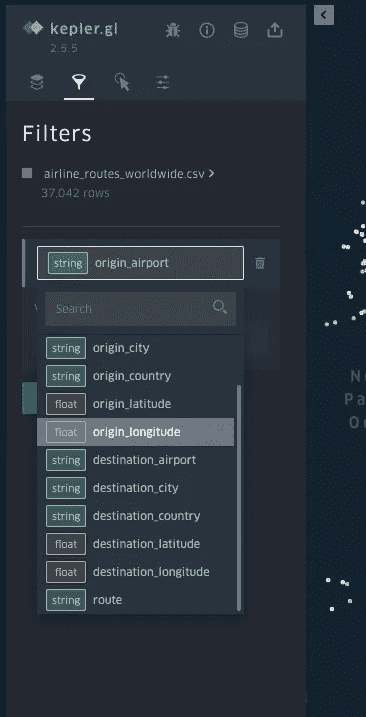

# 用 Kepler.gl 实现 Python 地理数据可视化

> 原文：<https://betterprogramming.pub/geo-data-visualization-with-kepler-gl-fbc15debbca4>

## 在几分钟内启动并运行 Python web 服务


在 [Unsplash](https://unsplash.com?utm_source=medium&utm_medium=referral) 上由 [Killian Cartignies](https://unsplash.com/@kikisad?utm_source=medium&utm_medium=referral) 拍摄的照片

如果您曾经处理过任何类型的地理数据，那么您应该知道仅仅盯着 CSV、表格或 JSON 格式的数据并不是非常有用。你需要把它放在地图上，以便查看它并找出任何模式。这可能不是收集见解的全部方式的结束，你仍然需要做适当的分析或/和运行你的 ML 模型，但这是绝对必须的。

# **开普勒. gl 是什么？**

Kepler.gl 是优步的开源项目(GitHub [link here](https://github.com/keplergl/kepler.gl) )，用于创建高性能和数据无关的 web 应用程序。它建立在 [Mapbox](https://www.mapbox.com) 之上，可以处理大型数据集，在配置想要可视化的内容和方式方面提供了很大的灵活性。

它使用图层作为基本构建模块，允许您创建交互式地图，您可以添加、移除、显示和隐藏图层，以及更改图层的外观。这是一个超级基本的例子，使用了来自 [data.world](https://data.world) 的公共飞行数据集:



正如你所看到的，你可以布置网格，点，拱门/线，多边形，甚至做一个 3D 地图。您可以通过多种方式进行非常精细的过滤(在数据集允许的范围内):



我在这里展示的数据集只有 37，042 行，但我已经用数百万行进行了测试，它处理得相当好。地理计算经过 GPU 加速以获得更好的性能。

[这里](https://eng.uber.com/keplergl/)也是优步工程博客上的一篇很棒的文章，里面有很多关于如何表示数据的例子和更多关于开普勒的细节。

# 开普勒. gl 的使用方法？

*   在他们的 [**演示页面**](https://kepler.gl/demo) 上传一个数据集——如果你想看看这是什么，或者如果你需要一个一次性的快速方法来可视化适量的非敏感数据，这是一个好办法。
*   作为一个 [**react 组件**](https://docs.kepler.gl/docs/api-reference/get-started)——如果你想把这个功能嵌入到你现有的项目中，这会给你很多控制权(对状态、数据流、外观等)。只是做:

```
npm install kepler.gl
```

*   作为一个 [**python 模块**](https://docs.kepler.gl/docs/keplergl-jupyter)——如果你是一个非前端专家，你需要快速完成工作，除了地图之外没有太多花哨的 UI 组件，这就是你要的。首先，运行:

```
pip install keplergl
```

这最后一个是我将快速浏览的内容，以演示如何快速启动并运行一个令人印象深刻的 MVP 应用程序，并向不耐烦的利益相关者或客户展示您的数据。

# 使用开普勒的 Python 模块创建 web 应用程序

我将做一些快速的假设——假设你对 python、pandas 和 fast API 有所了解(不需要成为专家也能理解)。

## 1)让我们导入我们需要的内容:

```
import uvicorn
import pandas as pd
from keplergl import KeplerGl 
from fastapi import FastAPI
from fastapi.responses import HTMLResponse
```

## 2)加载您的数据:

```
# load a csv file
df = pd.read_csv('my_data.csv')
# or a json file
df = pd.read_json('my_data.json')
```

现在，这可能会超过一个文件，所以只需要在一个循环中这样做，并像这样组合每个文件产生的`dataframes`:

```
all_data = pf.concat([all_data, df])
```

## 3)初始化 Kepler.gl 映射:

```
kepler = KeplerGl(config=my_map_config)
```

这里的配置是您可能需要做一点调整，以便正确地适应您的任何用例。

要做到这一点，至少对于纯粹的表示方面来说，最好的方法是使用笔记本来快速加载数据并根据需要进行定制，然后导出配置并将其应用到您的项目中。从更实用的角度来看，您也可以手动或以编程方式调整相关参数。

配置示例如下所示:

```
config = {
  "version": "v1",
  "config": {
     "visState": {
        "filters": [
            {
              "**dataId**": ["my_data"],
              "id": "11111",
              "**name**": ["some_col_name"],
              "type": "multiSelect",
              "value": [],
              "enlarged": False,
              "plotType": "histogram",
              "animationWindow": "free",
              "yAxis": None,
              "speed": 1,
            }
        ],
        "layers": [
            {
              "id": "22222",
              "type": "point",
              "config": {
                  "**dataId**": "my_data",
                  "label": "my_data",
                  "color": [30, 150, 190],
                  "highlightColor": [252, 242, 26, 255],
                  "isVisible": True,
                  "visConfig": {
                      "radius": 5,
                      "fixedRadius": False,
                      "opacity": 0.8,
                      "outline": False,
                      "thickness": 2,
                      "strokeColor": None,
                       ...
                   },
                   "hidden": False
              }
           }  
         ],
         "interactionConfig": {
             "tooltip": {
                 "fieldsToShow": {
                     "my_data": [
                         {"name": "col_1", "format": None},
                         {"name": "col_2", "format": None}  
                    ]
                 },
                 "compareMode": False,
                 "compareType": "absolute",
                 "enabled": True,
             },
             "brush": {"size": 0.5, "enabled": False},
             "geocoder": {"enabled": False},
             "coordinate": {"enabled": False},
         },
         "layerBlending": "normal",
         "splitMaps": [],
         "animationConfig": {"currentTime": None, "speed": 1},
     },
     "mapState": {
         "bearing": 0,
         "dragRotate": False,
         "latitude": 40.710394,
         "longitude": -74.000288,
         "pitch": 0,
         "zoom": 12.41,
         "isSplit": False,
     },
     "mapStyle": {
         "styleType": "dark",
         "topLayerGroups": {},
         "visibleLayerGroups": {
             "label": True,
             "road": True,
             "border": False,
             "building": True,
             "water": True,
             "land": True,
             "3d building": False,
         },
         "threeDBuildingColor": [
             9.665468314072013,
             17.18305478057247,
             31.1442867897876,
         ],
         "mapStyles": {},
      },
  },
}
```

基本上，有三个主要部分— `visState`、`mapState`和`mapStyle`。

`**MapState**`用于定义你每次重新加载页面时在世界地图上的起始位置，即起始/默认位置。

`**MapStyles**`设置 KeplerGl 应用程序的一般主题。它有几个预设选项可用，如黑暗，静音夜，光，静音光和卫星。

`**VizState**`是比较有意思的一个。它定义了 ***层*** (无论是点、六边形、线等)以及每个层使用的数据集——注意，我用粗体显示了 dataId，这是您将数据与配置绑定的方式，将在下一节中显示一个示例。您还可以定义 ***过滤器*** ，这些过滤器可以应用于一个或多个集合，并基于数据集中一个或多个字段。此外，在这里你可以定义你想要在工具提示(或者其他交互式选项)中显示什么以及如何显示。

## 4)把你的数据传给开普勒

```
# the name here should match the dataId in the config
kepler.add_data(data=all_data, name="my_data")
```

## 5)将地图转换成 HTML

```
kepler_html = kepler._repr_html_()
```

## 6)启动您的应用程序并返回生成的 HTML

```
app = FastAPI()@app.get("/")
async def index():
   return HTMLResponse(content=kepler_html, status_code=200)if __name__ == "__main__":
   uvicorn.run("web_app:app", host="X", port="X")
```

## 7)从中获得乐趣

..感谢您的阅读！