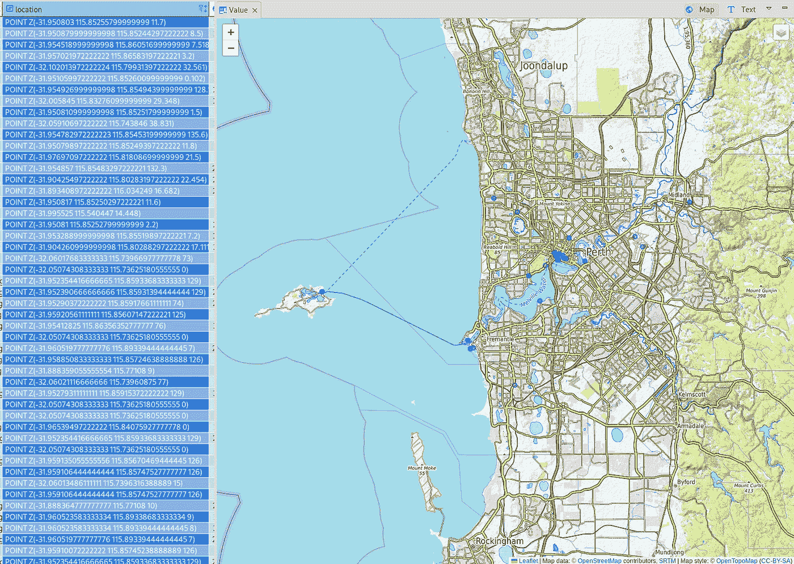
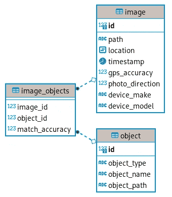
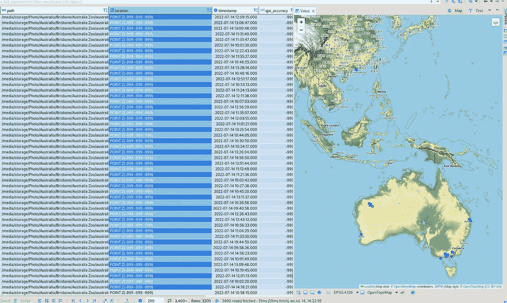

# 使用 Python 创建支持地理定位的照片管理器

> 原文：<https://betterprogramming.pub/geolocation-enabled-photo-manager-using-pytho-df6e2b75a06e>

## 在这篇博文中，我使用 Python 和 PostGIS 数据库创建了一个应用程序来帮助排序我的照片库。



在 DBeaver CE 中查看的数据库记录显示了距离珀斯市 50 公里以内的照片位置。

# 问题陈述

我最近在笔记本电脑上重新安装了操作系统，并将不同设备上的各种备份照片放在一个位置。由此产生的文件夹看起来像一个绝对的混乱。不同的手机和其他设备有不同的备份，其中一些具有非常复杂的文件夹结构。而且除了几个专题文件夹名，所有照片都是完全没有排序的。

我真的对手工分类不感兴趣，并认为这将是一个编写我一直在考虑的照片管理应用程序的好机会。我对这个应用程序有以下要求:

*   它必须接受命令行参数，这样我才能在 bash 脚本中使用它
*   它必须基于一个数据库来存储所有必要的信息
*   我需要能够通过日期和位置排序和定位照片
*   我希望能够识别照片中的人和各种物体，并根据这些来过滤照片

在这篇博文中，我将展示如何从照片中提取必要的元数据，创建和填充 PostGIS 数据库，并能够按位置查询图像。

# 提取元数据

在之前的博文中，我描述了如何从照片中提取和使用地理位置数据:

[](/visualising-photo-geolocation-data-using-python-73ac47059112) [## 使用 Python 可视化照片地理定位数据

### 让我们利用 exif 和 follow Python 包

better 编程. pub](/visualising-photo-geolocation-data-using-python-73ac47059112) 

主要的区别是，在那个例子中，我在 Jupyter 笔记本上运行代码，但是对于这个项目，我需要将它转换成一个更加模块化的代码。如果你想详细了解地理位置数据是如何存储在照片中的，以及需要做哪些处理，请参考上面链接的帖子。

代码的第一部分是一个简单的 dataclass，它将查找指定文件夹中的所有图像文件。这里我使用`attrs`模块来实现 dataclass，因为它比标准库 data class 有更好的性能。我还缓存了该属性，这样每次调用它时就不会重新计算。

该类默认搜索所有常见的(和一些不常见的)图像扩展，但这种行为可以在创建实例时改变。

下一部分是负责从图像中实际提取元数据的类。特别是，我将提取以下元数据:位置(纬度、经度、高度)、时间戳、gps_accuracy、照片的方向以及相机/手机的品牌和型号。这里，在大多数情况下，我所有照片的 gps_accuracy 和照片的方向都是空白的，但我仍在提取它，以防将来会有用。

坐标被转换成十进制使用相同的函数，我在以前的博客文章中使用，所以你可以参考那里的更多细节。

除了主`MetadataExtractor`类，我还定义了几个数据类作为接口，以实现一致的数据格式并简化输入。dataclass `RawCoordinates`用于存储从图像中提取的原始坐标，其中纬度和经度以整数元组(弧度的度、分和秒)的形式存储，并附有相关的半球参考。

最终的输出数据存储在一个`PhotoData`类对象中，该类对象的大多数参数都带有预定义的值。您可以将它们设置为您喜欢的任何值，但只需确保纬度和经度的默认值在(-180，180)范围之外。

所以这负责所有的元数据提取。对于我在几十个文件夹中收集的大约 10，000 张照片，数据提取需要大约 25 秒。

# PostGIS 数据库

## 安装

这里的首要任务是在 localhost 上建立一个 PostgreSQL 数据库。我正在使用 Fedora，所以我使用了以下官方文档:

 [## 一种数据库系统

### postgresql 服务器使用两个主要配置文件 sudo gedit/var/lib/pgsql/data/pg _ HBA . conf 和 edit host…

docs.fedoraproject.org](https://docs.fedoraproject.org/en-US/quick-docs/postgresql/) 

对于 Windows，可在以下位置获得设置说明:

[](https://www.microfocus.com/documentation/idol/IDOL_12_0/MediaServer/Guides/html/English/Content/Getting_Started/Configure/_TRN_Set_up_PostgreSQL.htm) [## 在 Windows 上设置 PostgreSQL 数据库

### 使用导航打开主题要将媒体服务器与 PostgreSQL 数据库一起使用，您必须下载并安装 PostgreSQL…

www.microfocus.com](https://www.microfocus.com/documentation/idol/IDOL_12_0/MediaServer/Guides/html/English/Content/Getting_Started/Configure/_TRN_Set_up_PostgreSQL.htm) 

一旦完成，您还需要安装 PostGIS 扩展，在普通的 Linux 发行版上可以使用:

`sudo dnf install postgis`

`sudo apt install postgis`

对于 Windows，您可以从以下官方网站下载安装程序:

[](https://postgis.net/windows_downloads/) [## Windows 下载

### 如果您在使用这些包(安装程序和 buildbot 二进制文件)时需要帮助，请询问我们的用户邮件列表。如果…

postgis.net](https://postgis.net/windows_downloads/) 

最后，我们使用`psql`创建一个新的数据库，添加一个 PostGIS 扩展，并创建一个运行脚本的用户，在我的例子中这个用户叫做`gis`:

`sudo -U postgres psql`

现在，一旦进入`psql`提示:

```
CREATE DATABASE photo;
CREATE USER gis WITH PASSWORD gis;
\connect photo
CREATE EXTENSION postgis;
ALTER SCHEMA public OWNER TO gis;
```

这通常就足够了，但是如果您不断遇到认证问题，您可能需要编辑 PostgreSQL 配置文件(如上述指南中所述)并将`ident`登录方法更改为`md5`。

## 创建模式

目前，我正在创建一个只有 3 个表的相对简单的模式。核心表“image”将保存关于照片的所有关键信息，包括路径和所有提取的元数据。它还通过一个中间表与“对象”表有多对多的关系。未来的“对象”表将包含照片中识别的对象的信息，并允许按对象/人进行搜索和过滤。



示例数据库模式。

“image”表还有一个对图像路径的独特约束，因为我想避免数据的意外重复。

我们将使用`sqlalchemy`和`geoalchemy2`来创建模式。对于位置数据，我们将使用来自`geoalchemy`的`Geometry`类型。这里，由于我们有 3D 坐标，我们不能使用常规的`POINT`对象，而是需要`POINTZ`，它专门存储第三个坐标中的高度数据:

“object”表将是未来博客文章的重点，目前，它将简单地存储一个惟一的 id、一种类型的对象(汽车、人等)。)、对象的名称以及我们将与之匹配的对象的单独存储的提取图像的路径。

此外，请注意我创建的`Settings`类，在它变得麻烦之前，将所有的应用程序设置保存在一个地方。目前，它只包含连接字符串，但是将来可以很容易地添加其他设置。

运行这个 db_schema 脚本应该会创建一个如上图所示的模式。

## 数据库 API

最后，我们需要创建一个 API 来简化与数据库的交互。我们将再次使用`sqlalchemy`，在这个阶段，我们只需要一种方法就可以将数据填充到数据库中。

API 方法将获取一个`PhotoData`对象列表，从它们创建新记录，并在运行完整个列表后提交会话。以前，我对缺失数据使用默认值，以避免类型提示中不必要的复杂性。现在，当填充数据时，我正在检查这些默认值，并在最终的数据库记录中将它们设置为`NULL`。

我们现在可以测试结果。为此，我们在`db_api.py`中添加了以下代码。代码将首先从选定的文件夹中获取图像路径，然后我们创建一个`MetadataExtractor`类的实例，并从图像中获取所有元数据。最后，我们将所有数据上传到数据库:

# 想象结果

既然一切都已说了，做了，我们可以可视化我们的数据。我推荐使用 [DBeaver](https://dbeaver.io/) ，因为它附带了免费的地图服务，并且适用于大多数操作系统。

在“图像”表中，双击“位置”列中的一个值将在右侧显示一个映射扩展，您可以在其中选择几个可用的映射引擎之一。

在我的例子中，选择一个记录子集显示了下面的映射:



数据库中照片子集的位置。

看起来我在澳大利亚拍了一些照片，也在香港拍了一些。

我们也可以开始搜索和过滤数据。例如，我可能想要查看从西澳大利亚珀斯市中心 100 公里范围内拍摄的所有照片。为此，PostGIS 提供了大量预定义的可用功能。

在这种情况下，我将使用`ST_DistanceSphere()`来计算地球表面球面上两点之间的距离。完整的查询将是:

```
SELECT * FROM image WHERE ST_DistanceSphere(location, 'POINTZ(-31.95 115.86 0)') <= 100000
```

其中(-31，95，115.86，0)是珀斯市中心的坐标。

结果是:


华盛顿珀斯附近的照片位置。

现在我们知道这一切都在按预期工作，我们可以添加一个 API 方法，它将完成过滤出所需图片并将结果复制到磁盘上的一个文件夹中的关键部分。新方法的代码如下:

目前，我们只能按位置和日期范围搜索照片，因此该方法需要输入位置和离位置的距离、开始/结束日期，最后是要复制搜索结果的文件夹。

当创建一个`query`时，我们使用相同的`ST_DistanceSphere`函数来查找从一个特定位置到我们传递输入位置参数的位置的距离。

现在使用这种方法，我们可以通过运行以下命令在数据库中复制与以前相同的搜索结果:

```
api = DbApi()res = api.select_files_and_output(location=(-31.95, 115.86, 0), distance_km=100)
```

唯一不同的是，现在定位的照片将被复制到`/home/pavel/Pictures/temp`。

# 结论

正如开始提到的，我还计划添加搜索特定对象/人的功能，并以类似的方式输出结果，几周后我将在另一篇博客文章中分享。

现在，我希望这篇文章展示一些与 PostGIS 数据库和图像地理定位数据交互的实际工作示例。

代码库位于以下位置:

[](https://github.com/pavelcherepan/gisterical/tree/master) [## GitHub-pavelcherepan/gisterial at master

### 此时您不能执行该操作。您已使用另一个标签页或窗口登录。您已在另一个选项卡中注销，或者…

github.com](https://github.com/pavelcherepan/gisterical/tree/master)