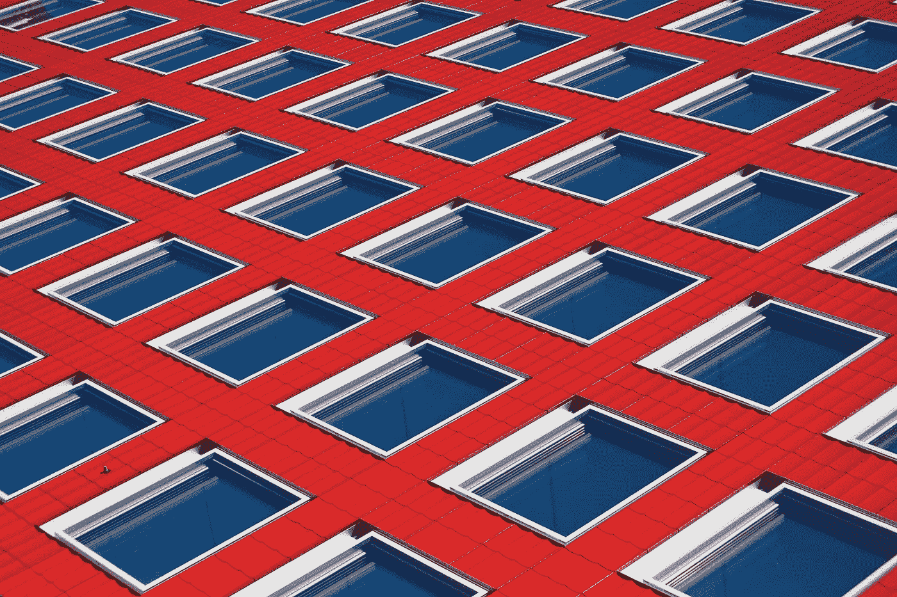
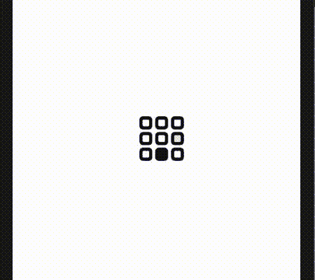
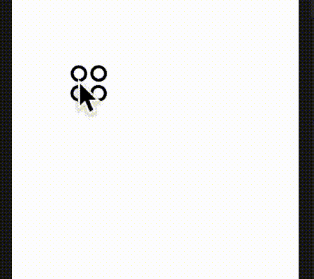
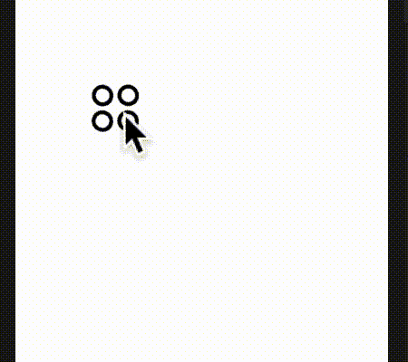
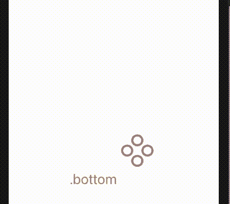

# Swift 2.0 中的几何效果

> 原文：<https://betterprogramming.pub/geometryeffect-in-swift-2-0-6a7b2fbdb134>

## 了解新的几何效应

照片由[里卡多·戈麦斯·安吉尔](https://unsplash.com/@ripato?utm_source=unsplash&utm_medium=referral&utm_content=creditCopyText)在 [Unsplash](https://unsplash.com/s/photos/patterns?utm_source=unsplash&utm_medium=referral&utm_content=creditCopyText) 上拍摄

我必须承认，我通常不会在夏天的 WWDC 公告上投入太多时间，但通常会等到秋天。不过，今年感觉有点不一样，不一样无疑是因为它是在线的。我真希望他们能再次这么做。

接下来，SwiftUI 2.0 为 WWDC 2020 带来了许多变化。我不禁看到了一些新的视图修改器，看起来好像是为 2021 年出现的新 iOS 笔记本电脑设计的，尽管不是所有的。有一个特别引起了我的注意:`matchedGeometryEffects`。

在我前几周发表在《更好的编程》上的一篇文章中，我展示了如何通过改变框架对齐来宏观管理视图的对齐。新的`matchedGeometry`视图修改器看起来也会对这些对齐产生相当大的影响。让我们快速浏览一下。

`matchedGeometry`到底是做什么的？你能看出下面两个视频的区别吗？

使用框架对齐视图，而不匹配几何图形

将视图与匹配几何图形的框架对齐

这是相同的代码，唯一的区别是在后者上运行匹配的几何效果。它基本上是动画从一个位置切换到另一个位置，同时交换图像。这里的区别很微妙，尽管你能看出来。

如果我们开始使用更多的动画，我们可以看到更戏剧性的效果。在第二个例子中，我放大了框架，同时将对齐方式从左上改为居中，而没有匹配第一个 gif 中的几何图形。乱七八糟。

在框架上缩放，并在不匹配几何图形的情况下更改视图的对齐

在第二个 gif 中，我用匹配的几何图形实现了相同的代码。这令人印象深刻。

缩放框架并使用几何图形匹配更改视图的对齐方式

正如你所看到的，在这种情况下，它产生了巨大的差异，一点也不微妙。也可以在多个视图上使用不同的锚来匹配几何图形，如此处所示。

将文本与图像对齐+文本与框架对齐+几何图形对齐

这就把我带到了今天一篇超短文章的结尾。请看看代码，我决定把它放在最后。

这段代码是一个不能在几何视图中工作的动画的例子！

这是你正在看的前两个动画 gif 例子的代码。

这是九格网格:

这是缩放四圆视图背后的代码:

最后，这是带有地理匹配元素的双文本和图像视图背后的代码:

继续编码，保持冷静。