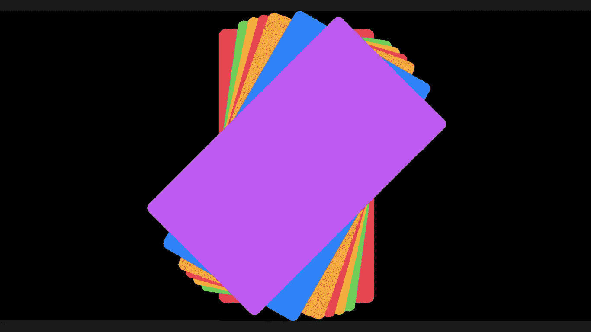
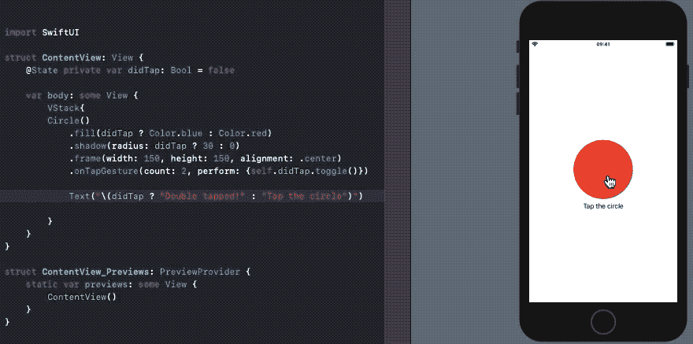
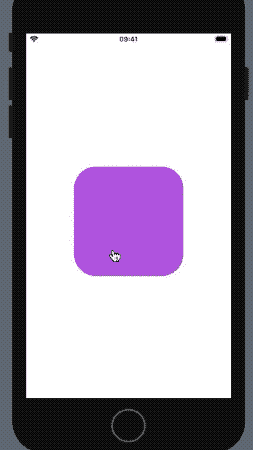
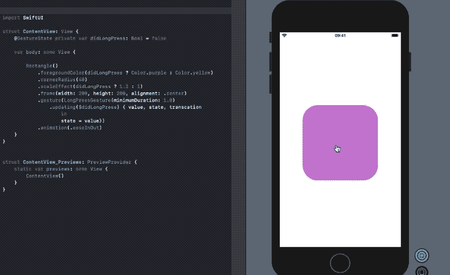
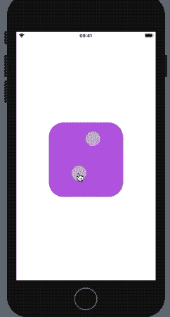
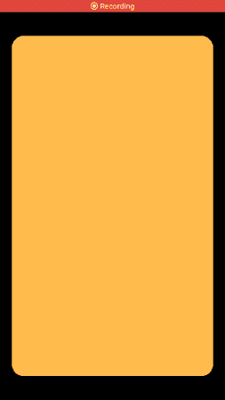

# SwiftUI 中的手势

> 原文：<https://betterprogramming.pub/gestures-in-swiftui-e94b784ecc7>

## 像在 Tinder 中一样滑动，创建一个手势状态属性包装器，等等



这是我在创作这件作品时创作的

手势识别负责侦听特定的触摸输入序列，并做出相应的反应。我们可以从这些交互中定义动作，甚至组成多个按顺序或同时工作的手势。

`GestureState`是一个属性包装器，仅适用于手势。它负责在手势改变时更新状态的属性值，并在手势完成后将其重置为初始值。

`GestureState`是不可变的属性，不像`State`。

目前，SwiftUI 支持五种手势修改器:

*   [点击手势](https://developer.apple.com/documentation/swiftui/tapgesture)
*   [长按手势](https://developer.apple.com/documentation/swiftui/longpressgesture)
*   [拖拽手势](https://developer.apple.com/documentation/swiftui/draggesture)
*   [放大手势](https://developer.apple.com/documentation/swiftui/magnificationgesture)
*   [旋转手势](https://developer.apple.com/documentation/swiftui/rotationgesture)

然而，我们仍然可以创建自己的自定义手势，或者将上述手势结合起来进行复杂的交互。以下是用于以不同方式组合手势的三种复合类型:

*   `Simultaneous` —所有的手势模式与此类型一起工作
*   `Sequenced` —对手势进行排序，使得第二个手势在第一个手势结束之前不会收到任何事件
*   `Exclusive` —当只有一个手势成功时使用

# 我们的目标

*   在接下来的几节中，我们将学习每个简单的手势修饰符。随后，我们从几个手势中创建一个复合手势。
*   此外，我们将编写一个滑动视图的手势，这在约会应用程序中相当常见，如 Tinder。

# 点击手势

当指定数量的点击发生在它所连接的视图上时,`TapGesture`结束。以下 SwiftUI 示例在`Circle`上添加了一个`TapGesture`，并在手势完成后更改颜色和阴影:

```
 @State private var didTap: Bool = false

    var body: some View {

        Circle()
            .fill(didTap ? Color.blue : Color.red)
            .shadow(radius: didTap ? 30 : 0)
            .frame(width: 150, height: 150, alignment: .center)
            .gesture(TapGesture()
                .onEnded {_ in
                    self.didTap.toggle()
                }
            )
        }
```

要设置双击/多击手势，只需将`TapGesture()`更改为`TapGesture(count : 2)`。

或者，我们可以直接在`Circle`上使用`onTapGesture{}`闭包，如下图所示:



# 长按手势

当用户按下视图一段时间后,`LongPressGesture`结束。下面的代码将`LongPressGesture`添加到一个矩形上。手势完成后，视图会显示一个缩放效果。

```
struct ContentView: View {
    @State private var didLongPress: Bool = false

    var body: some View {

        Rectangle()
            .foregroundColor(Color.purple)
            .cornerRadius(40)
            .scaleEffect(didLongPress ? 1.2 : 1)
            .frame(width: 200, height: 200, alignment: .center)
            .gesture(LongPressGesture(minimumDuration: 1.0)
                .onEnded({_ in self.didLongPress.toggle() }))
            .animation(.easeInOut)
    }
}
```



# 使用手势状态长按

在上图中，为了回到初始位置，您需要再次长按或者通过在`onChanged`功能中添加切换来调整代码。这可以通过使用`GestureState`来简化，如下所示:

```
struct ContentView: View {
 **@****GestureState** private var didLongPress: Bool = false

    var body: some View {

        Rectangle()
            .foregroundColor(Color.purple)
            .cornerRadius(40)
            .scaleEffect(didLongPress ? 1.2 : 1)
            .frame(width: 200, height: 200, alignment: .center)
            .gesture(LongPressGesture(minimumDuration: 1.0)
                .**updating($didLongPress)** { value, state, transcation                         in
                    state = value})
            .animation(.easeInOut)
    }
}
```

`updating`函数负责返回事件期间的瞬态事件。一旦手势结束，`GestureState`将重置为初始值，从而带来一个不错的缩放效果。



长按颜色开关的放大/缩小效果

在我们完成接下来的三个手势之前，让我们先排除一个重要的障碍:

## 手势的顺序至关重要

对于您计划同时使用长按和点击手势的情况，顺序很重要。放置在`TapGesture`之后的`LongPressGesture`将允许两者独立工作，反之，颠倒它们将导致`TapGesture`被忽略，如下所示:

```
.onTapGesture {print("This will work")}
.onLongPressGesture(minimumDuration: 0.1){print("This will work")} .onLongPressGesture(minimumDuration: 0.1){print("This will work")}
.onTapGesture {print("**This would not be recognised**")}
```

# 拖拽手势

一个`DragGesture`可以用来刷卡(例如在地图或 Tinder 中垂直或水平)。以下代码显示了一个这样的 SwiftUI 示例:


在上面的代码中，`onChanged`事件包含拖动值，从中我们可以确定当前的属性，如大小、宽度、高度等。我们使用了 height 属性来改变矩形的`offset`。`onEnded`事件将大小重置为初始值。

# 放大和旋转手势

这是两个手势，工作方式与`DragGesture`相似。放大手势的`onChanged`事件返回一个`CGFloat`值，该值可用于相应地缩放视图，而旋转手势返回一个`Angle`属性值，该属性值在`rotationEffect`上使用以产生旋转。

下面的代码演示了放大和旋转手势同时工作的情况:

```
struct ContentView: View {
    @State var magnificationValue: CGFloat = CGFloat(1)
    @State var rotationValue: Angle = .zero

    var body: some View {

        Rectangle()
            .foregroundColor(Color.purple)
            .cornerRadius(40)
            .scaleEffect(magnificationValue)
            .rotationEffect(rotationValue)
            .frame(width: 200, height: 200, alignment: .center)
            .gesture(MagnificationGesture()
            .onChanged { value in
            self.magnificationValue = value
            }
            .simultaneously(with: RotationGesture().onChanged { value in
                    self.rotationValue = value
            }))

    }
}
```

我们在 SwiftUI 实时预览中获得了以下结果:



# 构建一个类似火绒的滑动手势

左右滑动接受和拒绝是当今约会应用的规范。在本节中，我们将使用 SwiftUI 来完成这项工作。

为了创建一个可滑动的交互，我们将利用`DragGesture`，它在某个部分被拖动后具有旋转效果。在下面的代码中，我们在一个`ZStack`中添加了一些矩形卡片，每个卡片上都设置了手势修改器:

当拖动结束时，我们检查所走的距离。基于此，我们决定它是否通过刷卡阈值。此外，还有规模效应。

`SwipeObserver`类负责根据手势交互更新状态。`EnvironmentObject`在`SceneDelegate`类中以如下方式被实例化:

```
UIHostingController(rootView: contentView.environmentObject(SwipeObserver()))
```

以下代码跟踪每张卡片的拖动状态，并相应地更新 SwiftUI `body`:

```
class SwipeObserver : ObservableObject{

    @Published var cards = [Cards]()

    init() {

        self.cards.append(Cards(id: 0, drag: 0, degree: 0, color: Color.purple))
        //Skipping for brevity  
    }

    func update(id : Cards,value : CGFloat,degree : Double){

        for i in 0..<self.cards.count{

            if self.cards[i].id == id.id{

                self.cards[i].drag = value
                self.cards[i].degree = degree
            }
        }
    }
}
```

每张卡都有阻力和度数状态:

```
struct Cards : Identifiable {var id : Int
var drag : CGFloat
var degree : Double
var color : Color}
```

因此，我们在应用程序中得到以下结果:



# 结论

SwiftUI 手势——以及动画和过渡——可以创建一些非常身临其境的用户体验。

我们使用了不同种类的手势，并看到了`GestureState`在处理与指定视图的瞬时交互中所扮演的角色。随后，我们做了一个同时旋转和放大的复合手势。

我们演示了可滑动的视图手势，就像在 Tinder 中做的那样，就像蛋糕上的糖衣一样。它的源代码可以在这个 [GitHub 库](https://github.com/anupamchugh/iowncode)中找到。

这一次到此为止。我希望你喜欢 SwiftUI 视图的手势交互。