# 使用 Google Sheets 和 Apps 脚本自动提醒生日

> 原文：<https://betterprogramming.pub/get-birthday-notification-emails-with-google-sheets-and-apps-script-2745866c63a9>

## 你所需要的只是一个谷歌账户，一些基本的谷歌表单知识和一些 JavaScript

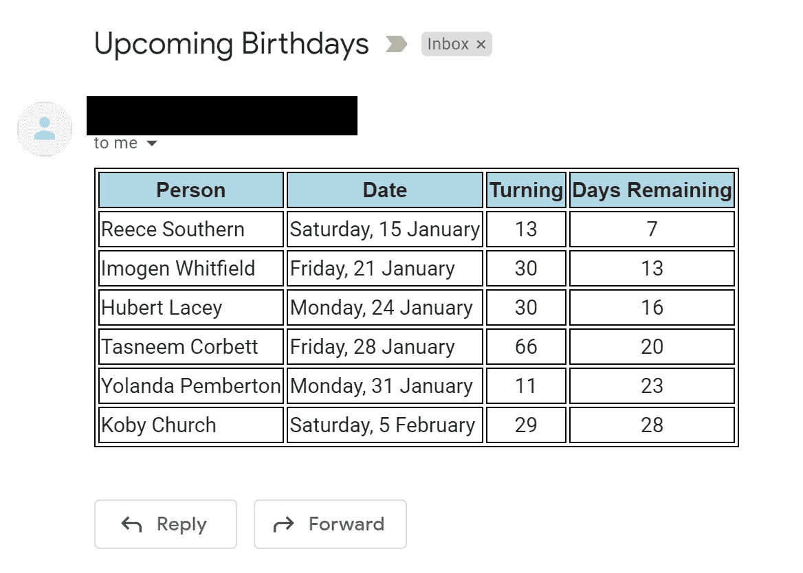

即将到来的生日的电子邮件输出

我最近想构建一个简单的自动化解决方案，可以通知我即将到来的生日。我知道我可以相对容易地用 Python 做这件事，但是我最近听说 Google Sheets 提供了通过他们自己的 Google Apps 脚本平台发送电子邮件的功能。

> G [oogle Apps Script](https://developers.google.com/apps-script) 是一个基于云的 JavaScript 平台，可以让你集成和自动化跨谷歌产品的任务。

这为我在一个地方提供了我需要的所有功能。我可以用人们的出生日期来监控我的电子表格，并定期发送通知邮件。通过一点阅读和谷歌的一些帮助，我能够设置两个独立的通知邮件。

1.  在接下来的 30 天内，每周一早上都会收到一封关于即将到来的生日的电子邮件。
2.  在某人生日的那天发邮件提醒我祝福他们。

不需要太多的麻烦，看看下面的步骤，为即将到来的生日自动发送电子邮件:

**第一步:**在浏览器中打开 Google Sheets

**第二步:**创建一个名为`Birthdays`的工作表，并为`Name` 和`Birthdate`添加一列。

**步骤 3:** 为了使事情变得简单，使用公式添加四个附加列:

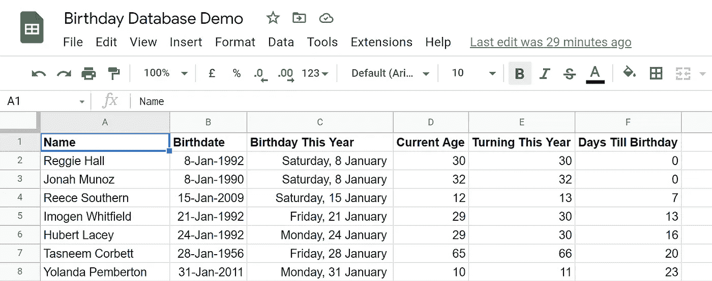

谷歌表生日数据库设置

`Birthday This Year`我将它设置为他们今年的生日:

```
=DATE(YEAR(TODAY()),month(B2),day(B2))
```

`Current Age` 即他们当天的年龄:

```
=DATEDIF(B2,TODAY(),”Y”)
```

`Turning This Year` 他们今年将满多少岁:

```
=IF(C2>TODAY(),D2+1,D2)
```

`Days Till Birthday` 离自己的生日还有多久:

```
=IFERROR(DATEDIF(TODAY(),D2,”D”), DATEDIF(TODAY(),DATE(year( D2)+1,month(D2), day(D2)),”D”))
```

**步骤 4:** 将带有日期的列格式化为可读性更好的数据格式。

**步骤 5:** 创建一个名为`Birthdays`的命名范围，它将引用生日表，但不包括标题。这将使我们以后的工作更容易，因为我们可以在应用程序脚本代码中引用这些命名的范围。


为生日设置命名范围

步骤 6: 创建一个名为`Emails`的新工作表。在这里，我们得到了需要在电子邮件中发出的具体数据。

**第七步:**添加计算单元格，查看未来 30 天内是否有即将到来的生日。

```
=IF(COUNTIF(Birthdays!D:D,”<=30")>0,TRUE(),FALSE())
```

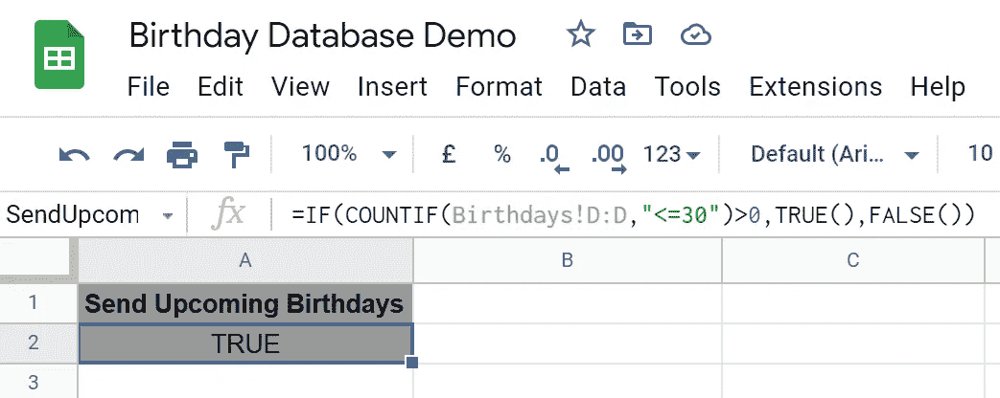

设置单元格以查看即将到来的生日

**步骤 8:** 对我们的生日命名范围执行[查询](https://support.google.com/docs/answer/3093343?hl=en)，以提取未来 30 天内的生日。Google Sheets 中的这个查询函数是一种简单的方法，可以执行类似 SQL 的查询，从指定的范围中提取数据。在此函数中，您使用大写字母来引用命名范围中的列。我提取了`Name`、`Birthday This Year`、`Turning This Year`和*、*、`Days Till Birthday`字段，因为这是我希望包含在电子邮件中的内容。

```
=IF(A2, QUERY(Birthdays, “SELECT A, C, E, F WHERE F<=30 AND F<>0”),””)
```

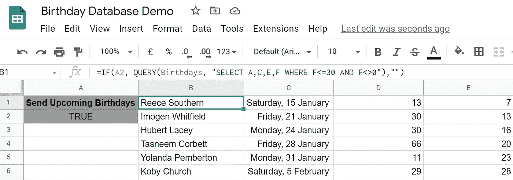

使用查询获取即将到来的生日

**步骤 9:** 创建最后一个变量来计算查询输出的行数。我们将在我们的应用程序脚本中使用它，从 Google Sheet 中提取正确的行数到我们的电子邮件正文中。

```
=COUNTA(B: B)
```

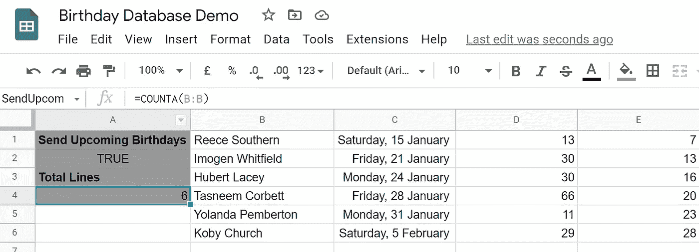

数着生日的总数。

**第 10 步:**再次创建命名范围，以引用第 7 步和第 9 步中的变量，使后面的工作变得简单一些。


创建附加命名范围

**步骤 11:** 要打开应用程序脚本编辑器，请转到扩展并选择应用程序脚本。

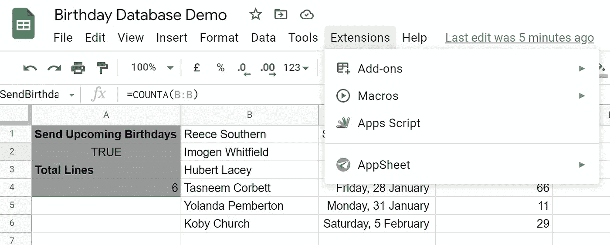

打开应用程序脚本平台

**第十二步:**在 App 脚本环境中创建两个文件。一个将包含发送电子邮件的功能，另一个将包含一些模板 HTML，我们可以在电子邮件的正文中使用。请参见下面每个中使用的代码。它归结为一个做四件重要事情的函数:

1.  对我们生日范围内的数据进行排序；
2.  从`Emails`表中获取邮件正文中需要发送的数据范围；
3.  将数据插入到我们的 HTML 模板中；
4.  发送电子邮件。

请确保将 email 变量更新为您的实际电子邮件，否则它将不起作用。

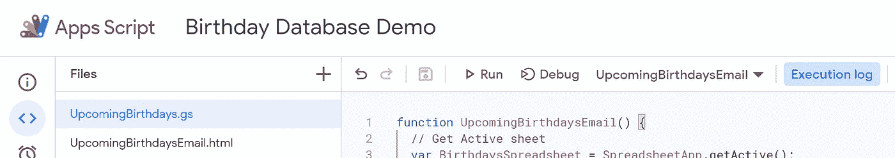

应用程序脚本平台视图

**第 13 步:**通过点击`Run`首先运行应用编辑器中的功能来测试您的代码。它会提示你允许谷歌表单使用你的电子邮件。点击`Review Permissions` *、*然后`Advanced` *、*最后`Go to` *…*

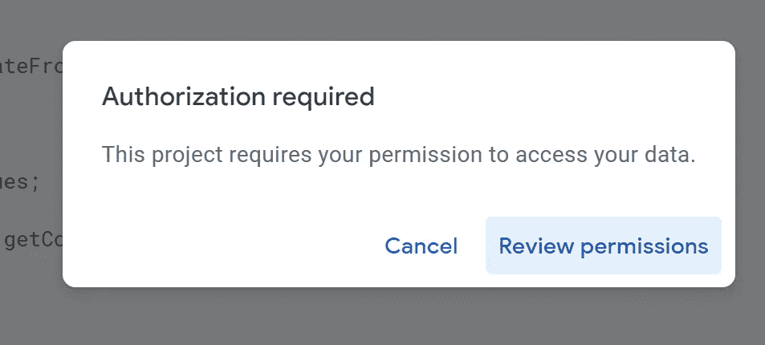

需要谷歌电子邮件认证

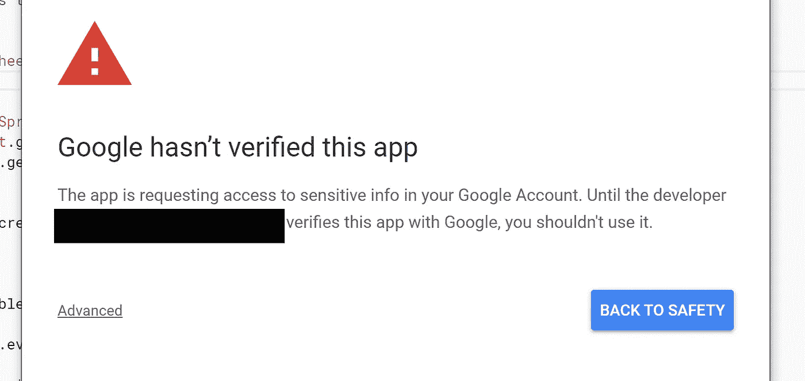

验证你的应用程序能够使用你的电子邮件帐户


最终验证步骤

**第 14 步:**如果一切顺利，你应该已经收到 Gmail 收件箱里的邮件通知了！最后要做的是添加一个触发器，每周自动启动一次该功能，并提醒您所有即将到来的生日。导航到左侧的触发器窗格，然后单击`Add Trigger`。根据需要更新字段。我设置触发器在每周一早上运行该功能。

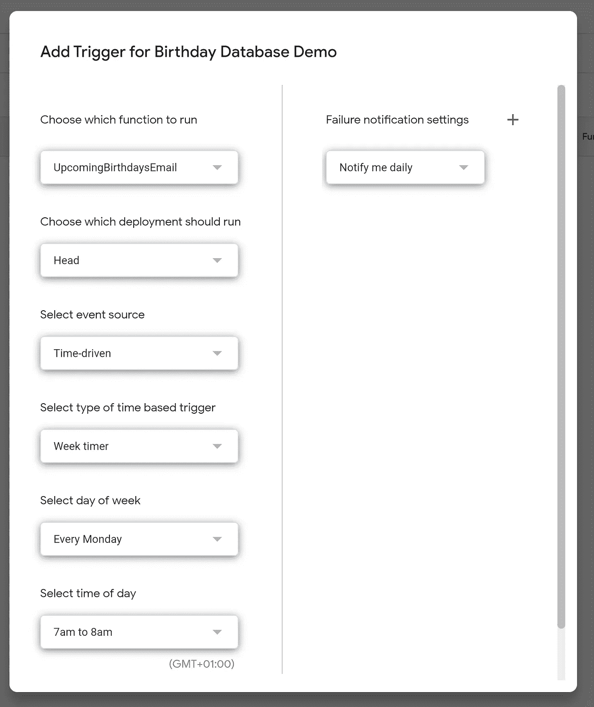

为即将到来的生日电子邮件添加触发器

# 自定义提醒

通过对上述步骤进行一些小的调整，我们可以稍微调整我们的代码，在某人生日那天触发一封电子邮件，提醒我们祝福他们。

**步骤 1:** 在电子邮件表中，重复我们之前做的相同练习，但这次使用不同的查询条件和更少的字段。

```
=IF(COUNTIF(Birthdays!F:F,0)>0,TRUE(),FALSE())=IF(F2, QUERY(Birthdays, “SELECT A, E WHERE F=0”),””)
```

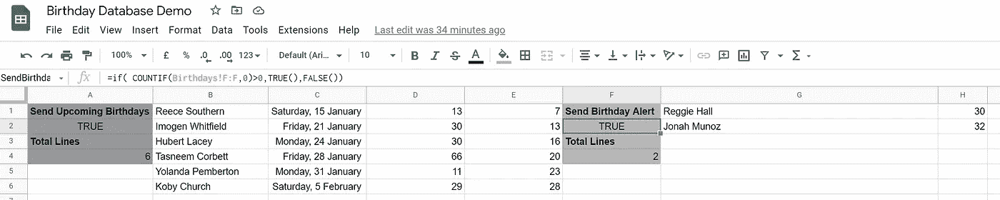

设置生日提醒字段

**步骤 2:** 再次命名这些字段，以便我们可以在代码中引用它们。

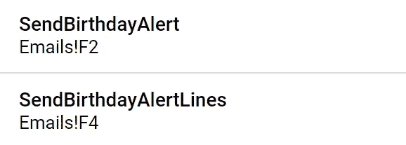

为生日提醒添加命名范围

**第 3 步:**稍微调整代码以提取不同的数据单元，并添加一个变量来显示是否需要首先发送电子邮件。另外，稍微调整一下 HTML 模板，因为这个表格只需要两列。

第四步:像之前一样添加一个触发器，但是设置为每天触发。

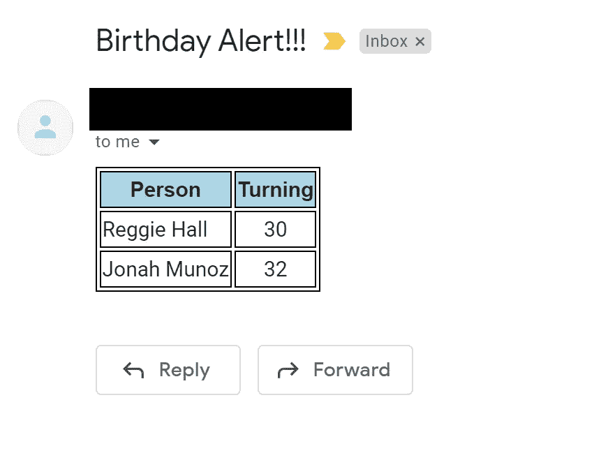

生日提醒电子邮件示例

# 包裹

我们都完成了！这是一种很酷的方式，展示了使用简单且容易获得的技术来构建很酷的东西是多么容易。

我几乎在一个下午内做了所有的事情，没有太多的准备时间。

我认为，像这样一个简单的电子邮件通知应用程序还有很多其他用途，比如提醒你的待办事项，提醒你股票价格(使用 Google Sheets 中也提供的 Google Finance 功能)，等等。

感谢阅读，保持好奇:)