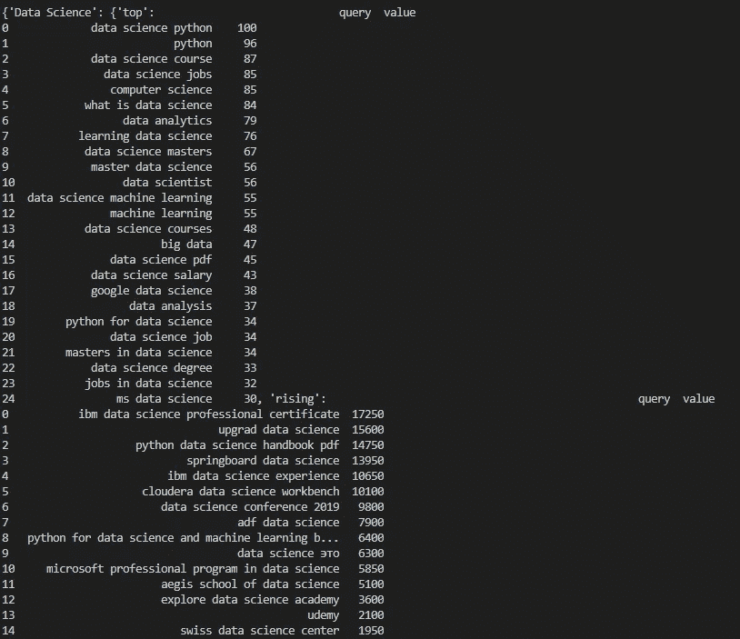
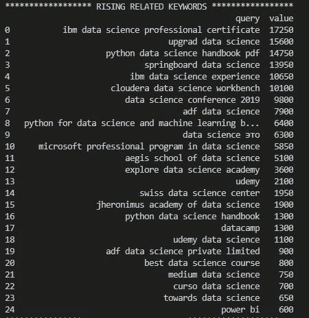
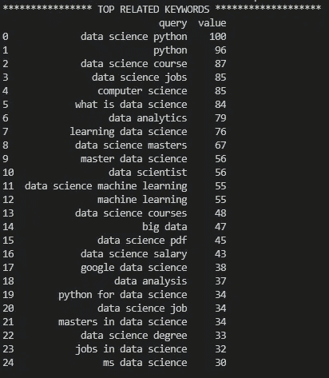

# 使用 Python 获取 Google Trends 结果

> 原文：<https://betterprogramming.pub/get-google-trends-results-using-python-a983e228209c>

## py Trends(Google Trends 的非官方 API)如何从 Google Trends 中获取上升的相关查询和热门相关查询


照片由 [Rajeshwar Bachu](https://unsplash.com/@rajeshwerbatchu7?utm_source=unsplash&utm_medium=referral&utm_content=creditCopyText) 在 [Unsplash](https://unsplash.com/s/photos/google?utm_source=unsplash&utm_medium=referral&utm_content=creditCopyText) 拍摄

谷歌趋势可以给我们一些非常有见地的数据。google trends 返回的查询可以用于数字营销、搜索引擎优化等等。下面是我们如何使用 Python 从 google trends 获取查询。

所需的库:

```
import pandas as pd
from pytrends.request import TrendReq
```

如果您尚未安装这些库，并且您使用的是 windows，则可以使用 pip 来安装这些库。只需进入终端并编写以下命令来安装它们:

```
>pip install pandas
>pip install pytrends
```

你可以在这里阅读[文档](https://pypi.org/project/pytrends/)。

转到任何 Python 编辑器或环境，开始编码。这里，我们为 API 创建了一个有效负载。我们想搜索“数据科学”的相关查询。

```
pytrend = TrendReq(hl=’en-US’, tz=360)
```

参数`hl=’en-US’`是你想要搜索的语言。`tz=360`代表时区。这里美国 CST 是“360”(注:不是-360。谷歌是这样使用时区的):

```
# Create payload and capture API tokens. Only needed for interest_over_time(), interest_by_region() & related_queries()trendy_keywords = ‘Data Science’
 kw_list = [trendy_keywords]
 kw = trendy_keywords
 pytrend.build_payload(kw_list)
```

我们将关键字保存在一个列表和一个字符串中。

`pytrend.build_payload(kw_list)`构建有效负载并接受一个列表作为参数。您还可以构建随时间变化的兴趣和按区域划分的兴趣的有效负载，如下所示:

```
pytrend.interest_over_time()
pytrend.interest_by_region()
```

我们想找出相关的查询:

```
# Related Queries, returns a dictionary of dataframesrelated_queries_dict = pytrend.related_queries()
print(related_queries_dict)
```

`pytrend.related_queries()`返回一个字典，如果我们打印，会得到如下输出:



由作者提供

这不是很有条理。因此，我们可以将 top 和 rising 的数据拆分到不同的字典中。

```
# for rising related queries
related_queries_rising = related_queries_dict.get(kw).get(‘rising’)# for top related queries
related_queries_top = related_queries_dict.get(kw).get(‘top’)print(“**************** RISING RELATED KEYWORDS **************”)
print(related_queries_rising)print(“**************** TOP RELATED KEYWORDS *******************”)
print(related_queries_top)
```



由作者提供

现在我们在不同的字典里都有数据。

这些关键词可以在谷歌广告活动中进一步使用，以找到在谷歌广告中竞价的最高和上升的关键词。每个月都可以检查查询以找到最佳关键词。这是一个获得大量关键词的简单方法。

# **结论**

通过这个 Python 库可以做很多事情。您可以访问他们的文档，了解更多令人兴奋的项目。

# 资源

*   [Pytrends](https://pypi.org/project/pytrends/)