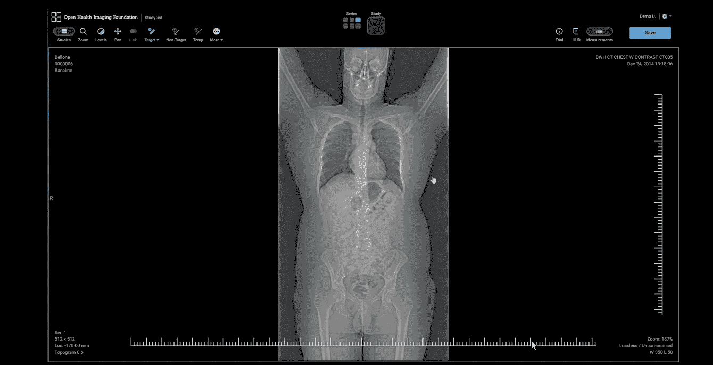
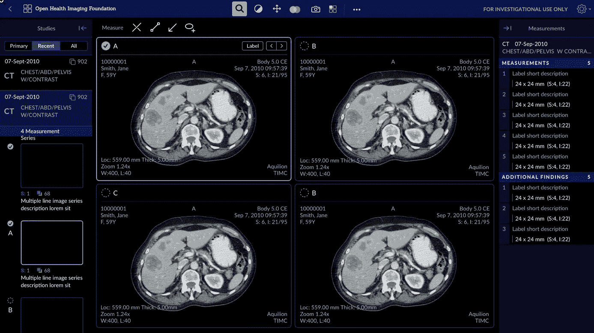
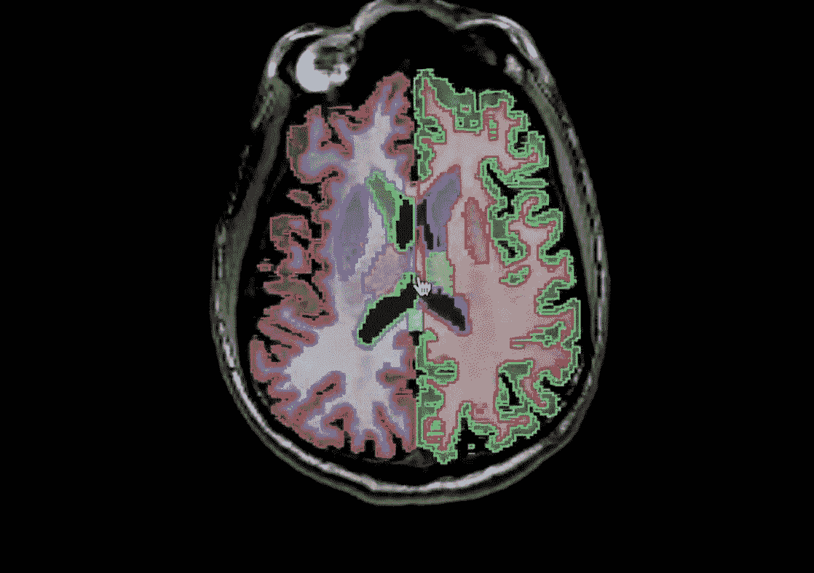

# 如何参与开源医疗保健软件

> 原文：<https://betterprogramming.pub/get-involved-open-source-healthcare-software-a5122c505ec0>

## 你一直在寻找一个开源项目来做贡献吗？

在 [Unsplash](https://unsplash.com?utm_source=medium&utm_medium=referral) 上由 [Hush Naidoo](https://unsplash.com/@hush52?utm_source=medium&utm_medium=referral) 拍摄的照片。

作为一名软件开发人员，我觉得我可以产生巨大的影响。在某种程度上，我觉得影响力被浪费在帮助一家披萨连锁店增加在线销售额或一家抵押贷款机构提高利润率上了。新冠肺炎·疫情全力以赴，我想帮助照亮一个对我来说很近很重要的项目。

# OHIF 浏览器

[OHIF 浏览器](https://github.com/OHIF/Viewers)是一款[开源](https://github.com/OHIF/Viewers)，基于网络的医学成像浏览器。维护的扩展增加了对 2D(切片)和 3D(体积)图像的查看、注释和报告的支持。

病灶标记工作流程示例。

*   它是 100%免费和开源的。
*   它主要用于临床研究和试验。
*   对于发展中国家来说，这是一个很好的选择(它可以在树莓 Pi 上运行)。
*   它通过拨款获得了一些资金(它不会明天就消失)。

# **我能帮上什么忙？**

这听起来可能有点奇怪，但是简单地添加到我们的 GitHub 库有助于我们倡导通过赠款获得额外的资金。

我们目前的拨款资助两名全职开发人员到 8 月份。我们明智地利用这段时间来完成重新设计和核心架构更改，以提高 OHIF 查看器的可扩展性，同时加强我们对肿瘤成像研究的开箱即用支持。

我们的目标草图设计为“一般查看”模式。

# React 组件库

我们有一个遵循[原子设计](https://atomicdesign.bradfrost.com/)原则的[组件库](https://github.com/OHIF/Viewers/tree/feat/ui-v2/platform/ui)。我们需要帮助来创建满足我们设计的 React 组件。它们中的大多数都是“哑”的，是为了创建示例“视图”而编写的，这些视图使用模拟数据和虚假交互来演示不同的 UI 状态。我们使用 [docz 组件库](https://www.docz.site/)(构建在 [Gatsby](https://www.gatsbyjs.org/) 之上)来完成这个任务。每一个贡献的组件、测试和一点文档都非常有助于我们朝着目标前进。

# 核心架构变化

我们的 OHIF 查看器的第一个实现是一个流线型的 meteor 应用程序，它只有一个目的。虽然它过去(现在)非常有用，但我们正在适应以支持我们社区的各种用例，并使与其他人“共享”工作流、特性和功能变得更加容易。

几乎所有这些代码都是普通的 JavaScript，不是特定于领域的。能够编写单元测试、讨论实现和满足规范的开发人员在这方面可以很好地帮助我们。

使用 react-vtkjs-viewport 的 Freesurfer 分割可视化。

# 成像、分割和 3D 可视化专业知识

这个类别不太可能适用于你们大多数人。对上述项目的任何帮助都可以释放我们有限的资源，使我们在这些项目上取得更多进展。如果您确实有专业知识，并希望做出贡献，请不要犹豫，我们可以合作。特别是，我们有 PET-CT 融合和多体积愿望清单，需要 web GL/着色器体验。

# 额外资金和资源

虽然我们目前的拨款将于 8 月到期，但我们已经申请了续约，将对两名全职开发人员的资助延长五年。如果您有兴趣为 OHIF 的关键功能提供资金，或者您想分配开发资源，但不知道如何做最好，请联系我们。

我们的赠款续期中详细列出的一些项目包括:

*   简化部署和安装。
*   支持移动分辨率和电子桌面应用程序。
*   扩展扩展和模式支持。共享“工作流”的目录
*   多得多。

# 相关项目

这一领域有许多项目。如果你知道任何伟大的项目是自由授权和响应贡献者的，请在评论中告诉他们，我会尽力更新这个列表。

## EMR/HIS

电子健康记录和健康信息系统。这些通常允许管理和查看患者的记录，并且是许多其他系统的通用集成点。例如，您可以使用 EMR 来查找患者的“成像研究”,并在 OHIF 查看器中启动查看会话。

*   医院运行:[https://hospitalrun.io/](https://hospitalrun.io/)

## 医学成像数据存储和检索

这一类的选项比较多。传统上，这些被称为 PACS(图像存档和通信系统)或图像存档。它们保存医学成像数据，并公开用于检索和存储的 API。

*   DICOM web-server:**【https://github.com/dcmjs-org/dicomweb-server】T4(js)**
*   **DICOM cloud:**[https://github.com/DICOMcloud/DICOMcloud](https://github.com/DICOMcloud/DICOMcloud)(c#)****
*   ****奥桑克:**[https://www.orthanc-server.com/](https://www.orthanc-server.com/)(c++)******
*   ******https://www.dcm4che.org/(Java)******

# ******如何伸出手******

******制造一个 GitHub 问题！******

******定期贡献者可以收到加入我们协作者 Slack 组的邀请。我们还定期与有能力投入时间和资源的个人和组织召开治理和计划会议。******