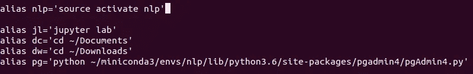

# 通过编写更好的 Python 代码提高工作效率

> 原文：<https://betterprogramming.pub/get-more-productive-by-writing-better-python-code-86c2b255572b>

## 我在 Python 中学到的每一个技巧都是为了写出更好更快的代码


由[卡尔·海尔达尔](https://unsplash.com/@carlheyerdahl?utm_source=medium&utm_medium=referral)在 [Unsplash](https://unsplash.com?utm_source=medium&utm_medium=referral) 上拍摄

# 代表长数字

很难记住某个长度之后的零或数字的数量。现在，这里有一个窍门:

```
>> digit_1 = 10_00_000
>> digit_2 = 10_12_500
```

用`_`分隔数字。这将帮助您跟踪您输入的数字或零。

# 解包值

代码可重用性是每个开发人员都必须遵循的原则，但是如果一个函数返回的值多于您实际需要的值，该怎么办呢？您可能会获取它们，但是您会不断得到关于未使用变量的警告。所以这里有些东西可能会派上用场。

```
>> a, b, _ = (1, 2, 3)
>> a
   1
```

使用`_`告诉 Python 你不需要这个变量，它不会显示任何警告。

如果你有多个返回值，但是你只对其中一个感兴趣呢？

```
>> a, *_ = (1, 2, 3, 4)
>> a
   1
```

只要在任何变量前加上`*`，它就可以接受任意数量的值。

如果您是数据科学家或机器学习实践者，您可以查看这篇文章:

# 字符串格式

Python 3.6 引入了一种新的字符串格式化方法。概念其实是从 JavaScript 买的。

```
>> lst = [1,2,3]
>> print(f"List = {lst}")
```

字符串格式化的另一种方式是:

```
>> lst = [1, 2, 3]
>> print("List = {}".format(lst))
```

# 编写单行 If 语句

在一行中编写`if`语句是干净代码的标志。

```
# BAD CODE
>> status = False
>> if status:
>>    # dosomething
>> else:
>>    # dosomething
```

你实际上应该做的是:

```
# GOOD CODE
>> status = False
>> c = dosomething if status else dosomething
```

这段代码看起来可读性更好。

# 列表理解

列表理解是 Python 中一个非常流行的概念。

```
# BAD CODE
>> digit_list = [1, 2, 3]
>> for item in digit_list:
>>     digit_list[digit_list.index(item)] = item*2
>> digit_list
   [2, 4, 6]
```

现在，让我们来看看更好的方法:

```
# GOOD CODE
>> digit_list = [1, 2, 3]
>> digit_list = [item*2 for item in digit_list]
```

# 命令的别名

别名是某物的不同名称。当你需要输入很长的命令时，它就派上了用场。

示例:

```
$ nlp
```

这个命令的背后是:

```
$ source activate nlp
```

以下是我日常使用的最喜欢的别名列表:

```
$ nlp (my nlp conda environment)
$ root (my default conda environment)
$ pg (postgres installed via pip)
$ jl (jupyter lab)
```

要设置这些别名，请在终端中键入以下内容:

```
$ sudo nano ~/.bashrc
```

并添加如下别名:



别名

# 结论

这里还有一些资源可供你参考:

[](https://medium.com/@gaganmanku96/make-your-python-code-bug-free-ce917d0705b5) [## 让您的 Python 代码摆脱 Bug

### 类型检查如何帮助我减少 90%的生产级错误。

medium.com](https://medium.com/@gaganmanku96/make-your-python-code-bug-free-ce917d0705b5) 

快乐学习！