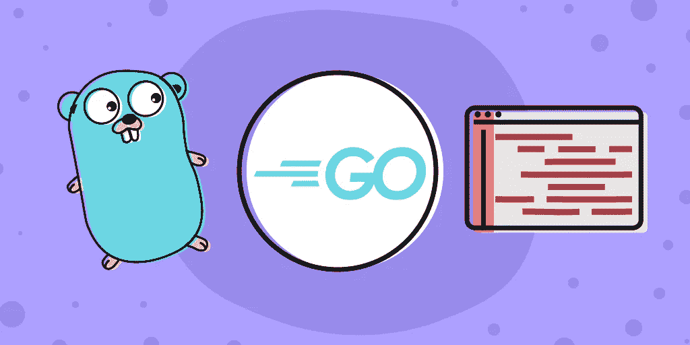
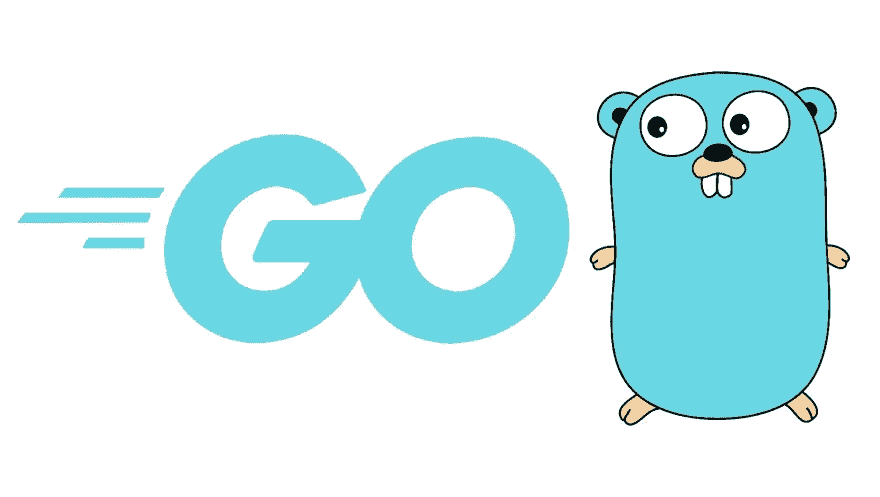
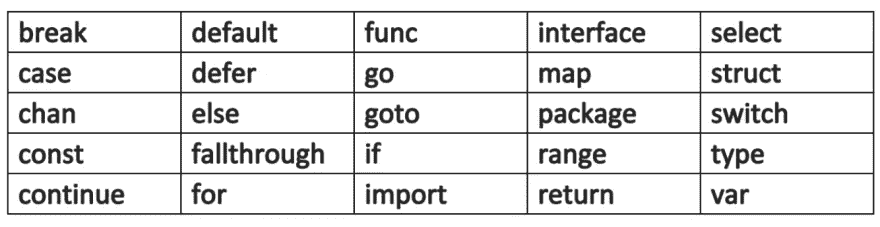
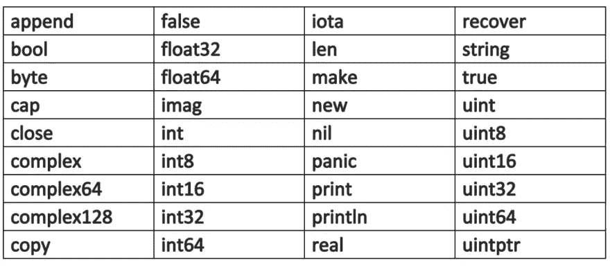
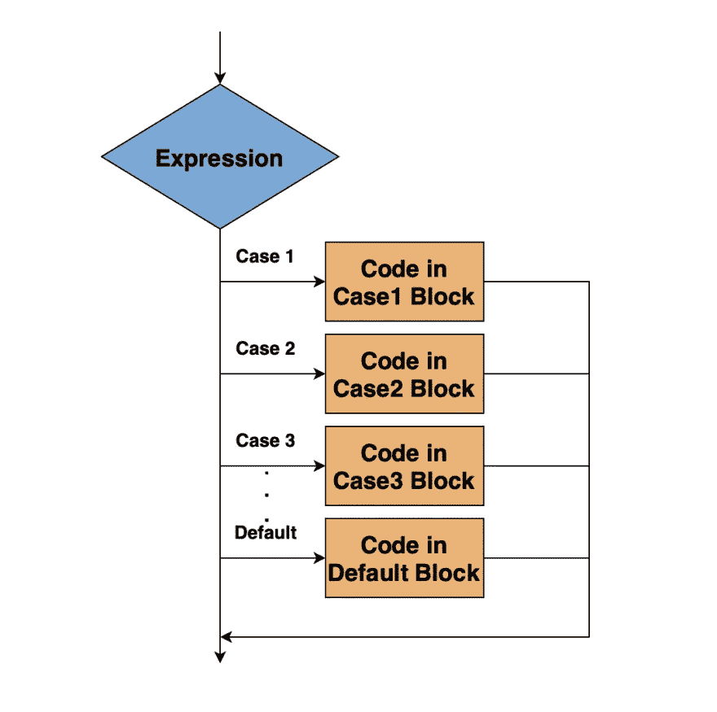
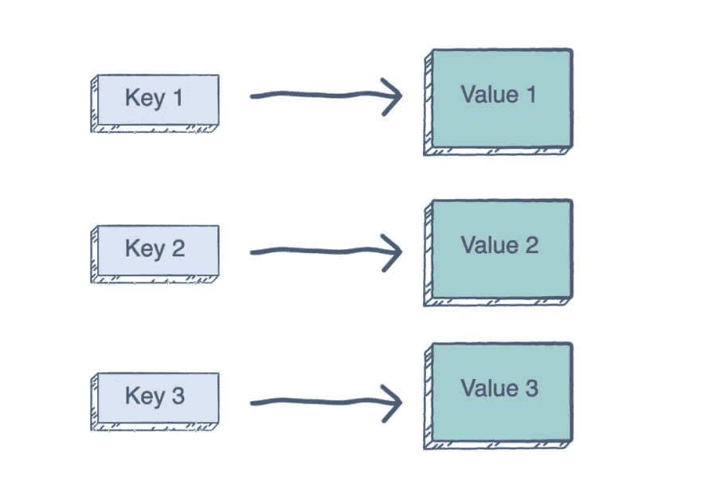
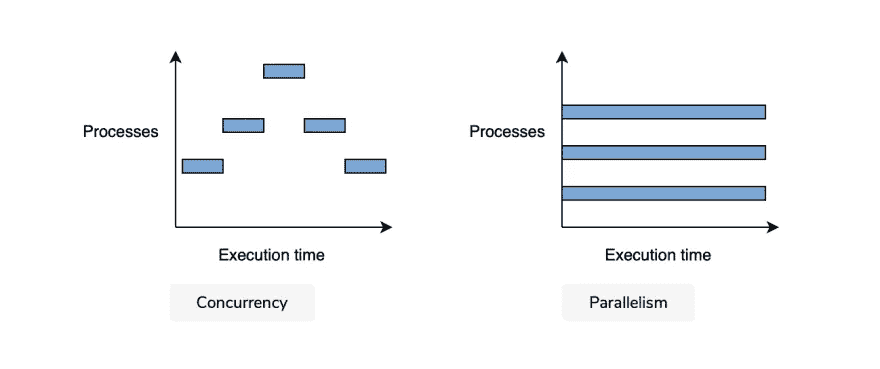
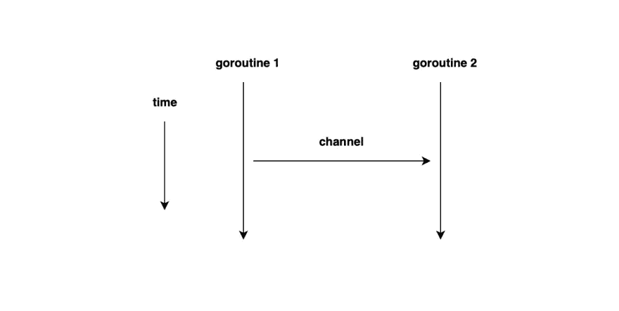

# Golang 入门

> 原文：<https://betterprogramming.pub/get-started-with-golang-fb75e3b180db>

## 初学者指南—立即学习围棋！



Golang 也称为 Go，是一种开源编程语言，由 Google 开发人员 Robert Griesemer、Ken Thompson 和 Rob Pike 在 2007 年创建。它是为了易于使用而创建的，许多开发人员称赞它构建了简单、可靠的程序。

自发布以来，Golang 越来越受欢迎。在 2009 年和 2016 年，英语被选为年度语言。它在 2018 年排名第 10 位，并继续进入[主要组织](https://hub.packtpub.com/why-golan-is-the-fastest-growing-language-on-github/)。

这种语言有很多优点。任何想在谷歌工作的人都应该知道这一点。今天，我要给你一个关于 Go 编程语言的深度教程。

今天我们将讨论:

*   [Golang 功能概述](#d680)
*   [围棋中的基本术语和概念](#4c71)
*   [围棋中的中级概念](#e1b8)
*   [围棋中的高级概念](#5832)
*   [资源](#a1af)



# Golang 功能概述

这种通用编程语言包含了其他编程语言的许多优秀特性。它是编译的、简单的、并发的、静态类型的、高效的。Go 改进了编程语言的这些方面，简化了开发人员的工作环境。

Go 本质上是一种支持并发概念的命令式语言。它带来了面向对象编程的一些优秀特性，比如接口，但是忽略了一些缺陷。Go 被有意设计为排除 OOP 的更多重要特性。

在这方面，Go 是混合的，包括了许多语言的最好的特性，有一个清晰的，有表现力的类型系统，同时保持了轻量级和易学性。

Go 可用于各种软件开发解决方案，如系统编程语言、通用编程语言或通用支持。它可以处理大量以服务器为中心的 web 服务、文本处理问题和大量分布式应用程序。

## 为什么要学 Golang？

**熟悉又易学。Go 属于 C 家族，所以它与 Java 和 C++等语言有许多相似之处。但是 Go 提供了更简洁的语法，所以更容易学习和阅读。与 Python 和 Ruby 类似，它也集成了动态编程的许多特性。**

**满足开发者需求。** Go 试图满足开发者面临的一些常见需求。它加速了软件开发过程，而不影响效率。Go 旨在通过网络通信、内存管理和速度来支持发展中的市场。

**服务器端的简单性。** Go 使你的代码的服务器端工作变得容易。标准的 Go 库提供了标准的 HTTP 协议。

现在我们已经了解了围棋是什么，以及它能给我们带来什么，让我们进入基础部分。今天，我们将向您介绍 Go 编程语言的主要概念和核心构造。和往常一样，你需要一个更强大的课程来教你所有的细节。

让我们跳进来吧！

# 围棋基础术语和概念

## 文件名、关键字、标识符

**Go 源代码**存储在`.go`文件中。所有文件名都是小写，可以用`_`分隔多个单词。与大多数文件名一样，不能使用空格或特殊字符。

**Go 中的关键字**功能与大多数编程语言类似。这些是保留字，在您的代码中使用时具有特殊的含义。与 Java 或 C++不同，Go 的关键字少得多，更容易使用和学习。这些关键字是:



**标识符**类似于关键字，但是你是作为程序员来做的。您可以为变量、模板等元素指定名称。和大多数编程语言一样，标识符是区分大小写的。它们必须以字母或下划线开头，后跟数字。空白标识符`_`可以在声明或变量赋值中使用。还有 36 个预先声明的标识符，它们是:



## 基本结构

Go 中的程序是由关键字、运算符、类型、函数和常量组成的。代码由语句构成，但它不需要像许多其他 C 系列语言那样以`;`结尾。如果多条语句写在一行，你必须用`;`把它们分开。

Go 使用与其他语言类似的标点符号，包括`.` `,` `;` `:`和`...`。Go 在其代码中使用了三个分隔符:`( )` `[ ]`和`{ }`。

## 数据类型和变量

像许多编程语言一样，**变量**包含不同类型的数据，这些数据定义了一组值或可以作用于这些值的操作。在 Go 中，您可以使用四种主要的数据类型:

*   初级(又名。原语):`int`、`float`、`bool`、`string`
*   结构(又名。复合):`struct`、`slice`、`map`、`array`、`channel`
*   接口:描述类型的行为

在 Go 中，结构化类型没有固有值，而是默认值`nil`。

变量是在执行过程中可以改变的值。为了声明一个变量，我们使用了`var`关键字。

```
var identifier type = value
```

在这个例子中，`identifier`是变量的名称，`type`是类型。与其他 C 系列语言不同，我们将`type`写在变量`identifier`之后。当我们在 Go 中声明一个变量时，内存被初始化。我们还必须使用`=`操作符给变量赋值。这个过程叫做给变量赋值。

还有一种声明变量的简写方式:

```
f := "fruit"
    fmt.Println(f)
}
```

## 经营者

与许多编程语言一样，**运算符**是执行逻辑或数学运算的内置符号。Golang 中有三种类型的运算符:算术、逻辑和按位。

**逻辑运算符**类似于其他编程语言。然而，Go 对可比较的值非常严格。这些操作符包括:

*   等式运算符`==`
*   不等运算符`!=`
*   小于运算符`<`
*   大于运算符`>`
*   小于等于运算符`<=`
*   大于等于运算符`>=`

**位操作符**处理位模式长度相等的整数变量。一些按位运算符是:

*   按位 AND 运算符`&`
*   按位或运算符`|`
*   按位异或运算符`^`
*   位清零操作符`&^`
*   按位补码运算符`^`

**算术运算符**包括`+` `/` `%`和`*`。

这些执行常见的算术运算，甚至还有一些快捷方式。举个例子，

```
b = b + a
```

可以缩短为

```
b += a
```

## 用线串

**字符串**实现操作 UTF-8 编码字符串的功能。它们是默认编码的，所以它们可以包含任何语言的字符。这些定义在双引号`“ “`之间，可以包含一系列可变宽度的字符，并且是不可变的。

Go 字符串通常比其他语言中的字符串更好，因为它们使用更少的内存，并且由于 UTF-8 标准，您不需要解码它们。

Golang 中有两种字符串文字，解释的和原始的。解释后的字符串用引号括起来，原始字符串用反斜线括起来。

要声明一个字符串，我们使用`string`关键字。看看下面的例子，看看它是如何做到的:

```
package main
import "fmt"func main() {
  var s string = "Hello, World"
  fmt.Printf(s)
}
```

**输出:**你好，世界

您可以循环访问字符串中的字符来访问单个元素。我们使用`for`循环，我们将在后面详细讨论。

```
package main
import "fmt"func main() {
  var s string = "Hello, World" for index, character := range(s){
    fmt.Printf("The character %c is in position %d \n", character, index)
  }
}
```

**输出:**
字符 H 在位置 0

字符 e 在位置 1

字符 l 在位置 2

字符 l 在位置 3

字符 o 在位置 4

字符在位置 5

角色在位置 6

字符 W 在位置 7

字符 o 在第 8 位

您也可以使用 string 从一部分字节值形成一个字符串。看看这个例子，看看是怎么做到的:

```
package main
import "fmt"func main() {
  myslice := []byte{0x48, 0x65, 0x6C,  0x6C, 0x6f} 
  mystring := string(myslice)   fmt.Printf(mystring)
}
```

**输出:**你好

## 时间和日期

在 Golang 中，包`time`提供了测量和显示时间的能力。比如我们可以用`time.Now( )`显示当前时间，用`t.Day ( )`获取更小的部分。Go 的`time`包有很多有用的特性，比如函数`Since(t Time)`，返回从`t`开始经过的时间。你也可以制作自己的时间格式。

```
t := time.Now()
fmt.Printf("%02d.%02d.%4d\n", t.Day(), t.Month(), t.Year()) // e.g.: 29.10.2019
```

关于 Go 的`time`包的更多信息，请查看[文档](http://golang.org/pkg/time/)。

# 围棋的中级概念

## 控制结构

控制结构和 C 语言类似，但是它们通常更简单和灵活。没有`do`或`while`回路。相反，Go 使用灵活的`for`和`switch`循环。

还有新的控制结构，比如 a 型开关和`select`。我们不使用括号，并且主体是用括号分隔的。让我们更深入地看看 Go 控制结构。

这个构造测试一个条件语句，逻辑的或者布尔的。如果语句是`true`，则执行{ 0 }之间的正文。如果是`false`，则忽略这些语句，执行`if`之后的语句。请记住，即使主体中只有一个语句，大括号也是必需的。

`switch-case`:这个结构用来代替比较变量和值的长`if`语句。这个语句使得在你的代码中转移执行流变得容易。



`switch`一般比其他语言更灵活。它的一般形式如下:

```
switch var1 {
case val1:
...
case val2:
...
default:
...
}
```

像`if`构造一样，`switch`也可以包含初始化语句:

```
switch initialization; {
case val1:
...
case val2:
...
default:
...
}
```

`select`:这句话的意思是我们可以等待多通道操作，我们将在后面详细讨论。

`for-range`:在 Go 中，这个语句允许我们迭代一个计算为数组、切片、映射、字符串或通道的表达式。基本语法如下:

```
for index, value := range mydatastructure {
        fmt.Println(value)
    }
```

*   `index`:我们要访问的值的索引。
*   `value`:每次迭代的值。
*   `mydatastructure`:保存我们在循环中访问其值的数据结构。

请记住，这个例子是一个概括。要了解更多有关具体案例的示例，请查看 `*for-range*` *循环* [*上的 EdPresso 镜头，此处为*](https://www.educative.io/edpresso/what-is-the-for-range-loop-in-golang) *。*

## 功能

**函数**是 Golang 的基本构建块，因为它拥有函数式语言的许多特性。正如我之前提到的，函数是数据，因为它们有值和类型。围棋程序是由几个函数组成的。最好从`main( )`函数开始，按照调用或逻辑顺序编写它们。

函数将问题分解成更小的任务，使我们能够重用代码。Go 中有三种类型的函数，当它们执行完`}`之前的最后一条语句或执行一条返回语句时，所有函数都结束:

*   使用标识符的普通函数
*   匿名或 lambda 函数
*   方法

我们使用以下语法编写函数:

```
func g() { // VALID
 ...
}
```

我们用这种通用格式来称呼它们:

```
pack1.Function(arg1,arg2,...,argn)
```

这里`function`是`pack1`中的函数，`arg1`是自变量。当我们调用一个函数时，它复制参数，这些参数被传递给被调用的函数。

让我们来看一个函数的例子，看看 Go 的运行情况。在这里，我们将深入探讨 Golang 中的`printf( )`功能。`print`功能允许您打印格式化数据。它需要一个包含我们将要格式化的文本的模板字符串和一些告诉`fmt`函数如何格式化的注释动词。

```
fmt.printf("Sample template string %s",Object arg(s))
```

转换字符告诉 Golang 如何格式化数据类型。一些常见的说明符有:

*   v-以默认格式格式化值
*   d-格式化十进制整数
*   g-格式化浮点数
*   b —格式化基数为 2 的数字

假设我们想打印一个字符串。在模板字符串中可以使用`%s`对话字符来打印字符串值。看看下面的代码。
我们还可以在许多其他情况下使用打印功能。要了解更多信息，请查看 [Golang 打印功能](https://www.educative.io/edpresso/how-to-use-the-printf-function-in-golang)上的 EdPresso 镜头。

```
package main
import "fmt"func main() {
  var mystring = "Hello world"
  fmt.Printf("The string is %s", mystring)
}
```

**输出:**字符串是 Hello World

## 地图

**Maps** ，在其他编程语言中也称为 hashes 或 dicts，是 Go 内置的数据类型。这个名字解释了它们的用途:映射*将*键映射到值。可以把映射看作是存储键值对的一种方式。



您可以使用这些来基于键快速查找、检索或删除数据。

我们使用以下语法声明一个映射:

```
var m map[KeyType]ValueType
```

*   `m`是地图变量的名称。
*   `KeyType`是映射中键的选项数据类型。这也可以在初始化时声明。
*   `ValueType`是键值对中值的数据类型。

在声明时不需要知道映射的长度，所以它可以动态增长。未初始化映射的值是`nil`。

让我们来看一个具体的 Golang 地图示例，看看它们是如何制作的:

**输出:** 在“一”处的地图文字为:1
在“二”处创建的地图为:3.141590
在“二”处分配的地图为:3
在“十”处的地图文字为:0

## 数组和切片

Go 中的数组类似于 Python，但是它们在 Go 代码中并不常见，因为它们不灵活并且有固定的大小。相反，**切片**要常见得多，能提供更大的功率。Go 中的切片构建了数组，因为它们是 Go 数组类型的抽象。

要声明数组，我们使用以下语法:

```
var identifier [len]type
```

数组的大小是固定的，因为它的长度是其类型的一部分。例如，`[5]int`表示由五个整数组成的数组。切片允许我们克服数组的一些挑战，并在不使用额外内存的情况下处理类型化数据序列。

切片是对数组的连续部分的引用，称为基础数组。切片的大小是动态变化的，非常灵活。它是在我们指定两个索引时形成的，用冒号隔开。我们使用类型规范`[ ]T`。t 是切片中元素的类型。我们使用以下语法声明一个切片:

```
letters := []string{"a", "b", "c", "d"}
```

要声明带有切片的变量的类型，我们使用带有切片元素类型的`[ ]`:

与数组不同，切片在执行过程中会发生变化。此外，切片带有内置的`append`，它可以返回包含一个或多个新值的切片。`append`方法的语法是:

```
slice = append(slice, elem1, elem2, ...)
```

看看这是怎么做到的:

**输出:**
长度=0 容量=0 []
长度=1 容量=1 [0]
长度=2 容量=2 [0 1]
长度=5 容量=6 [0 1 2 3 4]

现在我们已经了解了一些中级围棋概念，让我们继续来看看 Golang 带来的一些高级东西。请记住，还有很多东西需要学习。其他一些中间概念包括:

*   递归函数
*   高阶函数
*   结构和方法
*   接口和反射

# 围棋中的高级概念

## 错误处理

Go 没有异常处理机制。我们使用内置的接口类型`error`。它的零值是`nil`，所以如果它返回`nil`，我们知道没有错误。处理错误最常见的方法是返回`error`类型，作为检查`nil`的函数调用的最后一个返回值。

让我们来看看一些代码，看看它是如何做到的。

**输出:**不能被 0 除！

## 戈鲁廷斯

Go 内置了对并发应用的支持。这些程序同时执行不同的代码。构造并发程序的基本构件是 [**goroutines**](https://tour.golang.org/concurrency/1) 和 [**通道**](https://tour.golang.org/concurrency/2) 。

与 Java 不同的是，并发支持是通过特定的类型(chan)、关键字(`go`、`select`)和构造(goroutines)嵌入到语言中的。Go 强调并发性而不是并行性，因为 Go 程序在默认情况下可能不是并行的。无论 goroutines 是否运行，Go 程序都只使用一个内核或处理器。



那么，什么是 goroutines？它们是与其他方法或函数一起运行的方法或函数。它们取决于我们如何称呼它们。可以把它们想象成线程，但是更容易，更轻量级。

我们使用关键字`go`来创建一个 goroutine，所以当我们调用带有那个前缀的函数或方法时，一个 goroutine 就会被执行。

如果你想更好地了解 Goroutines，请查阅 Go 中的文章[剖析 goroutines。](https://medium.com/rungo/anatomy-of-goroutines-in-go-concurrency-in-go-a4cb9272ff88)

您可以使用变量`GOMAXPROCS`告诉运行时可以执行多少个 goroutines。`GOMAXPROCS`必须设置为大于缺省值 1，否则所有的 goroutines 将共享同一个线程。

让我们看一个例子:

**输出:** In main()
关于睡眠 in main()
开始 longWait()
开始 shortWait()
结束 shortWait()
结束 longWait()
结束 main()

这里，程序表示程序所处的执行阶段的一部分。功能`main( )`、`shortWait( )`和`longWait( )`作为独立的处理单元启动，然后并发工作。

通道与 goroutines 一起使用，以实现它们之间的*通信*。这些是传输数据的类型化消息队列。可以把它们想象成可以发送类型值的管道。这样，我们可以避免在 goroutines 之间共享内存。一个通道可以传输一种数据类型，但是我们可以为任何类型传输它们。



要声明通道，我们使用以下格式:

```
var identifier chan datatype
```

通道也是一个引用类型，所以，为了分配内存，我们使用了`make( )`函数。请参见下面的如何声明字符串通道及其实例化:

```
var ch1 chan string
ch1 = make(chan string)
```

## 标准库和包

Go 发行版包括 250 多个内置包，所有系统的 API 都是一样的。每个软件包都为您的 Go 代码引入了不同的功能。在这里见文档[。](https://golang.org/pkg/#stdlib)

让我们看看它能提供什么。

*   `os/exec`:这提供了运行外部操作系统命令和程序的可能性。
*   这是一个底层的外部包，它为底层操作系统的调用提供了一个原始接口。
*   `archive/tar`和`/zip – compress`:它们包含压缩(解压)文件的功能。
*   `fmt`:包含格式化输入输出功能。
*   `io`:这提供了基本的输入输出功能，主要作为操作系统功能的包装。
*   `bufio`:这环绕 io 以提供缓冲的输入输出功能。
*   `path/filepath`:这个包含了操作目标操作系统的文件名路径的例程。
*   `strconv`:将字符串转换成基本数据类型。
*   `unicode`:这个特殊函数用于 Unicode 字符。
*   `regexp`:这是字符串模式搜索功能。

也有外部第三方 Go 包可以用`go get`工具安装。您需要验证`GOPATH`变量已设置，否则，它将被下载到`$GOPATH/src`目录中。看看这里的。

有 500 多个有用的项目可以介绍到你的围棋程序中。当向现有项目引入新功能时，最好加入一个预先存在的 Go 库。这需要了解库的 API，API 约束了调用库的方法。一旦你知道了 API，调用库函数并开始。

让我们看看导入外部库的完整代码:

现在我们对围棋中的一些高级概念有所了解。还有很多东西需要学习，包括:

*   接口和反射
*   误差测试
*   匿名通道关闭
*   网络、模板和网络应用
*   最佳实践和缺陷

# 资源

Golang 是一种令人兴奋的语言，它可以加快开发速度，满足您的现实需求。幸运的是，有许多有用的资源可以学习、练习和与世界分享围棋。

## 课程

*   [**要走的路:**](https://www.educative.io/courses/the-way-to-go) 通过实践学习围棋核心概念和技术的权威场所
*   [**围棋编程入门:**](https://www.educative.io/courses/introduction-to-programming-in-go) 初学者详细说明
*   [**掌握围棋中的并发:**](https://www.educative.io/courses/mastering-concurrency-in-go) 适合希望提高技能的中级围棋学习者

## 文档和指南

*   [**围棋之旅:**](https://tour.golang.org/welcome/1) 官方围棋教程
*   [**Golang 官方文档:**](https://golang.org/doc/) 深入代码
*   [**GitHub Go boot camp:**](https://github.com/GoBootcamp/clirescue)边练边学，适合初学者

## 向其他开发者学习

*   [**2020 年为什么要学围棋**](https://medium.com/@meeusdylan/why-you-should-learn-go-in-2020-6ce975b66d47)
*   [**使用 Go from FreeCodeChamp**](https://www.freecodecamp.org/news/here-are-some-amazing-advantages-of-go-that-you-dont-hear-much-about-1af99de3b23a/) 的优势
*   [**使用围棋的利弊**](https://hackernoon.com/should-i-go-the-pros-and-cons-of-using-go-programming-language-8c1daf711e46)