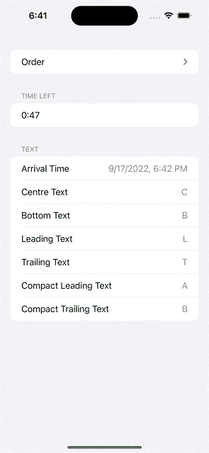

# iOS 16.1 中的动态岛和直播活动入门

> 原文：<https://betterprogramming.pub/get-started-with-live-activities-and-the-dynamic-island-in-ios-16-f23d4f704128>

## 给用户提供大量信息并不需要太多代码


照片由 [Zunnoon Ahmed](https://unsplash.com/@zunnu?utm_source=medium&utm_medium=referral) 在 [Unsplash](https://unsplash.com?utm_source=medium&utm_medium=referral) 上拍摄

苹果的文档告诉你如何开始使用动态岛，它将围绕 iPhone 14 Pro 的新分离相机槽口的信息动画化。

为了构建这个项目，您至少需要运行 Xcode 版本 14.1 beta。这个例子大部分来自于苹果的文档，但是这个例子给了你更多的控制发送到动态岛中的`Activity`的数据。

有 2 个紧凑视图和 4 个扩展视图，如下所示:



作者 GIF

创建一个新的 iOS 项目，并从左侧面板的项目导航器中选择项目本身。

单击项目设置的*信息*选项卡，将鼠标悬停在最后一个条目上，然后单击+按钮添加新属性。这个新属性应该叫做`NSSupportsLiveActivities`，值应该是布尔类型，值应该是`YES`。

重要的是，这是在您的应用程序目标的`info.plist`中，而不是它的任何扩展中。

# 我们开始吧

我将创建一个`Form` `Section`来控制未来我希望我的实时活动发生的时间。

下一个视图显示了我希望用户能够改变的实时活动。动态岛的每个部分都将被赋予一个自定义的字符串，尽管我建议尽量保持简短，因为它们中的许多都被设计成小图标。

表情符号会起作用😀

这也改变了我的类型，使其符合`ActivityAttributes`协议。我不再像[苹果的示例代码](https://developer.apple.com/documentation/activitykit/displaying-live-data-with-live-activities)那样存储关于披萨递送的数据，因为我真正关注的是什么文本将显示在动态岛上的什么位置。

这是我在当前实时活动创建后用来显示它的内容。

请注意，我使用了一个名为*的`Section`剩余时间*，它将一个`timerInterval`传递给一个`Text`。如果你不知道，这是一个新的简单的方法，只使用一个`Text`和一个`ClosedRange<Date>`来显示计时器。这个日期范围的创建将在稍后完成，但是如果您想要在动态岛或锁屏小部件中使用计时器，您可能需要使用它。

我将所有数据存储在我的`ContentView`类型中，但是它还不符合`View`协议。`createActivity`函数使用新的`MyActivityAttributes`类型创建一个带有用户选择的细节的`Activity`。

现在我要给`View`协议添加一致性。

`createActivity`功能现在将被添加为`Form`中`Button`的动作，它将折叠具有`Activity`设置的`DisclosureGroup`，以便在`ActivityDetailsView`中显示活动的详细信息。然后`TimeSliders`和`ActivityTextFields`将被隐藏，但如果需要，可以再次打开`DisclosureGroup`以创建另一个`Activity`。

# 创建小部件

现在我需要创建小部件。

转到*文件>新建>目标……*并创建一个小部件扩展，我称之为我的`DynamicIslandWidget`。

这个例子很容易理解，我没有用一个合适的锁屏小部件。这个`Text("N/A")`会显示在锁屏下方，不过你想怎么改都可以。

请注意，必须返回主屏幕才能看到最小化到动态岛的应用程序。

轻按一次将再次打开应用程序，但长按它将打开扩展视图。

显然，在这里传递比字符串更复杂的东西是可能的，但你可以选择你想在什么地方出现什么。

```
**Want Daily Coding Tips like these?**This is based on tips that previously appeared in my newsletter [Type Safely](https://typesafely.substack.com/).
```