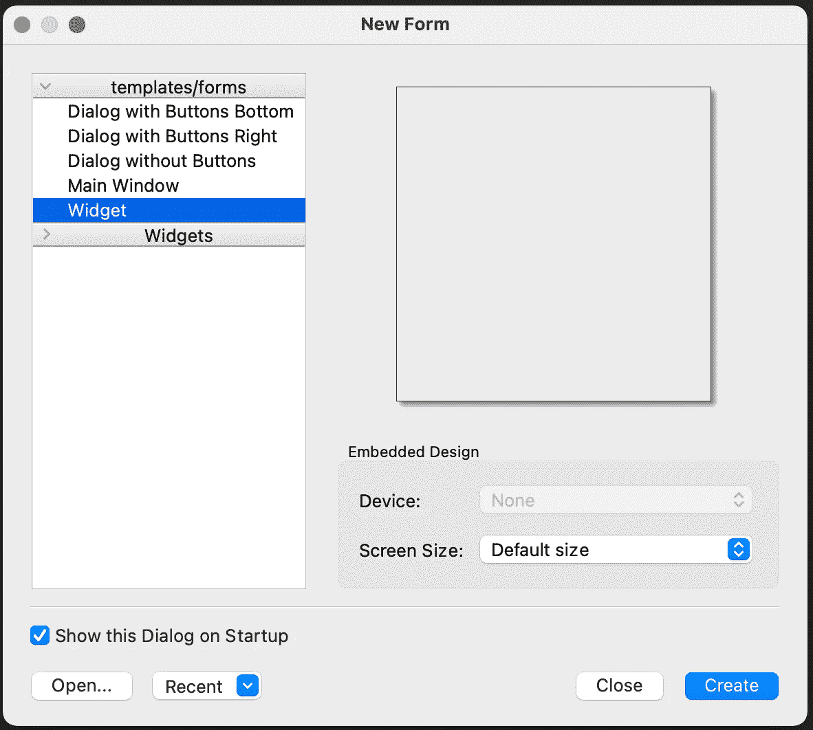
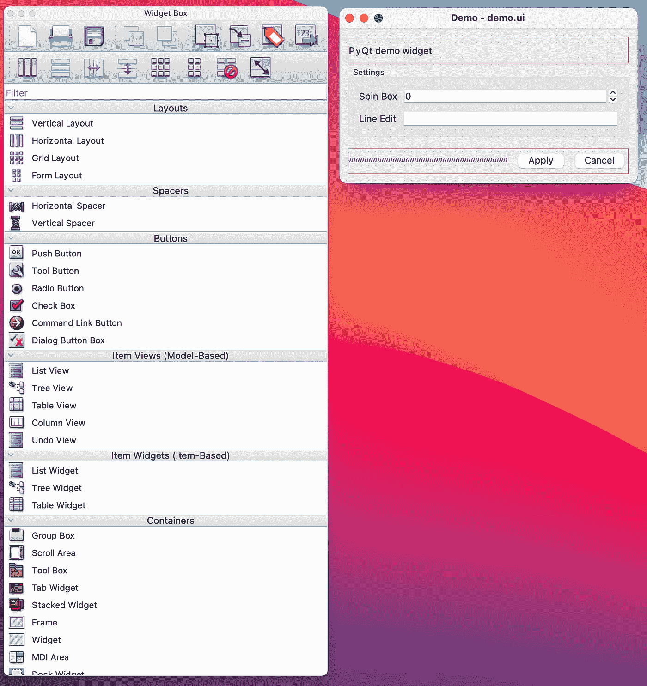
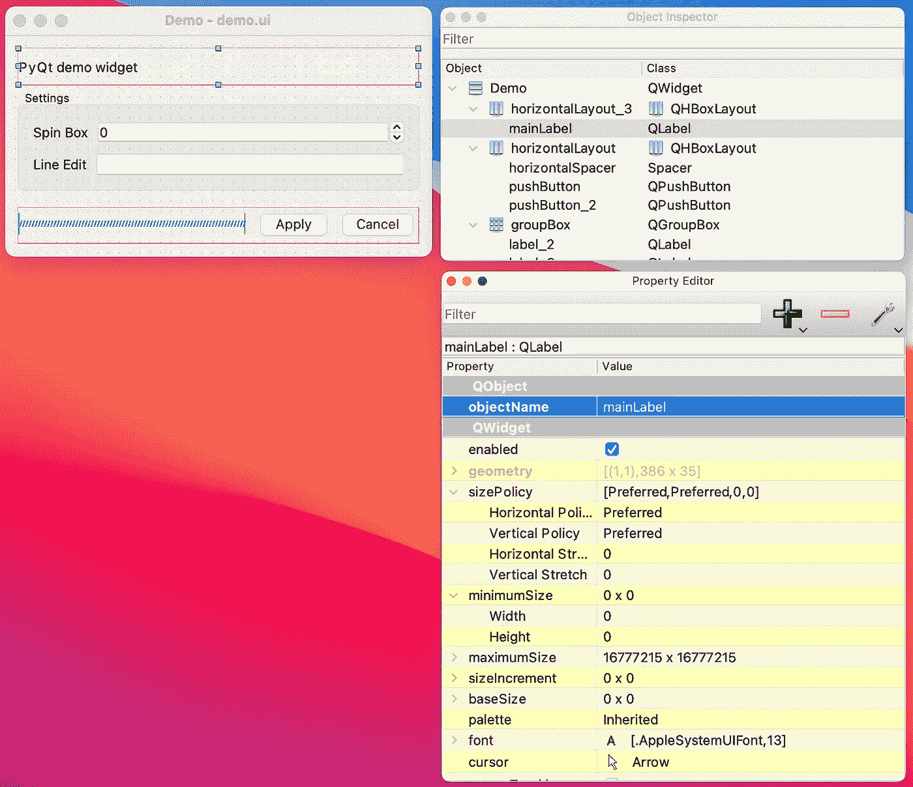

# PyQt 和 Qt 设计器入门

> 原文：<https://betterprogramming.pub/get-started-with-pyqt-and-qt-designer-63955a129cf7>

## 用 PyQt 和 Qt Designer 构建自定义用户界面


由[凯利·西克玛](https://unsplash.com/@kellysikkema?utm_source=medium&utm_medium=referral)在 [Unsplash](https://unsplash.com?utm_source=medium&utm_medium=referral) 上拍摄的照片

PyQt 是一组 Python 绑定，允许开发人员用 Python 创建高度可定制的图形用户界面(GUI)。PyQt 建立在 C++ [Qt](https://medium.com/r?url=https%3A%2F%2Fwww.qt.io%2F) 库的基础上，该库用于为各种多平台应用程序开发 GUI。

PyQt 小部件可以通过各种方式创建，这取决于所需的定制级别。Qt Designer 是一个 Qt 工具，用于使用所见即所得编辑器设计和构建 GUI。使用这种用户友好的工具构建小部件允许开发人员在查看即时反馈的同时快速迭代设计。这篇文章将逐步讲解如何使用 Qt Designer + Python 创建 PyQt 小部件。

# 1.安装 PyQt

第一步是安装 PyQt，如果它还没有安装的话。在 MacOS 上，PyQt 可以使用 homebrew 或 pip 安装。

**自制软件安装:**

```
> brew install pyqt5
```

如果用自制软件安装，pyqt5 designer 应该会自动安装。

**Pip 安装:**

```
> pip install pyqt5
# Install the developer tools
> pip install pyqt5-tools
```

# **2。在 Qt Designer 中创建 UI**

下一步是打开 Qt Designer。在 Mac OS 上，可以通过在终端中运行以下命令来打开 Qt designer:

```
> open -a Designer
```

**创建一个 Qt 小部件**

文件->新建->小部件



Qt 设计器—创建新表单

从这里可以将小部件从小部件框拖到表单中，并且可以根据需要更新每个小部件的属性。要查看可用的微件，请转到`View -> Widget Box`。下面的`demo.ui`示例包含 QHboxLayout、QPushButton、QLabel、QSpinBox、QLineEdit 等类型的小部件。



Qt 设计器—构建一个小部件

记得保存。布局完成后的 ui 文件。

# 3.用 python 初始化 Qt 小部件

为了加载和初始化在 Qt Designer 中创建的 Qt 小部件，需要在 Python 中创建一个 QWidget 类。下面是启动主要小部件所需的最少代码。

从 Python 启动 QWidget

# 4.将 UI 组件连接到代码

既然主要的小部件是从 python 类初始化的，我们可能需要直接与组件交互，以设置默认值或从输入字段查询值。

将从 python 代码中访问的每个组件都需要有一个标识符名称。在 Qt Designer 中，转到`View -> Property Editor`打开属性编辑器。选择每个小部件组件，并通过修改`objectName`字段来更新名称。这个名称将在 python 代码中用来引用相关的小部件。



在上面的例子中，QLabel 被命名为 **mainLabel** 。现在可以通过调用以下代码在代码中更新标签的文本:

```
self.mainLabel.setText("Updated Text")
```

# 5.将 UI 操作连接到代码

当用户与小部件组件交互时，应用程序可能需要做出响应。信号和插槽是 Qt 回调机制的核心。事件发生时会发出 UI 信号。表示为指定函数的槽将被调用以响应特定的信号。有两种方法可以将 UI 动作连接到自定义函数。

**选项 1** :将功能连接到信号

点击 q 按钮`applyButton`将调用`self.click`功能。

```
self.applyButton.clicked.connect(self.click)
```

**选项 2:** 使用 [**pyqtSlot**](https://doc.bccnsoft.com/docs/PyQt5/signals_slots.html) 装饰器指定插槽

另一种风格的回调是使用 **pyqtSlot** 装饰器为给定的信号指定插槽。

```
[@](http://twitter.com/QtCore)pyqtSlot(name="on_applyButton_clicked")
def click(self):
    print("CLICKING")
```

完整示例:

Qt 演示

# 结论

这篇文章包含了使用 PyQt 和 Qt Designer 创建第一个小部件的分步说明。

Qt Designer 是快速创建任何 UI 基础的好方法，尽管需要注意的是使用 Qt 的可能性并不局限于 Qt Designer。

PyQt 提供了丰富的 API，允许开发人员定制外观和用户体验。可能性是无限的！