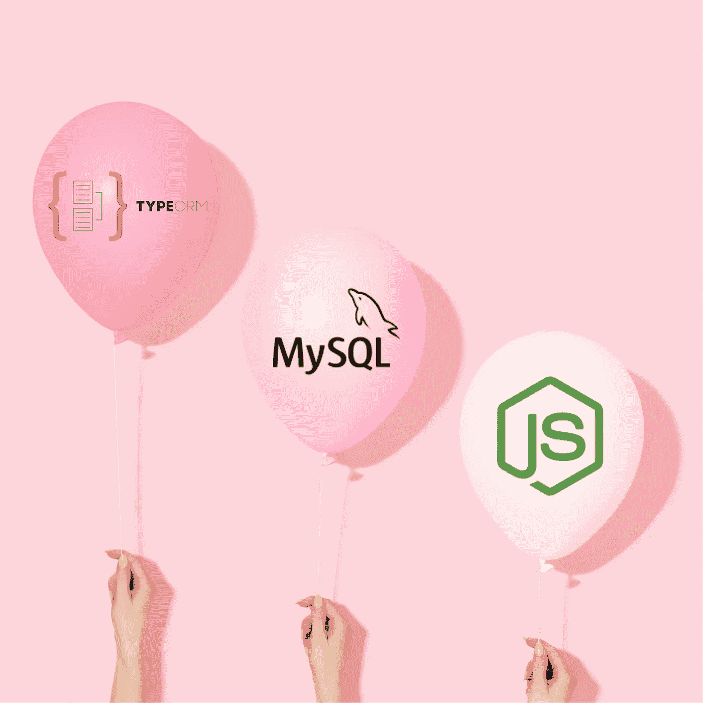
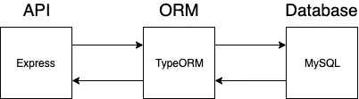
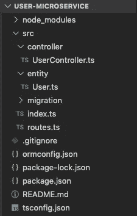
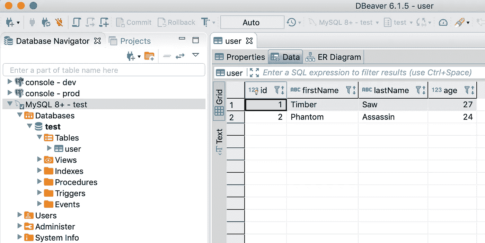

# 如何使用一个命令在 Node.js 上用 TypeORM CLI 创建 RESTful APIs

> 原文：<https://betterprogramming.pub/get-started-with-typeorm-mysql-and-express-js-653270a6a078>

## 开始使用 TypeORM、MySQL 和 Express.js



[Amy Shamblen](https://unsplash.com/@amyshamblen?utm_source=medium&utm_medium=referral) 在 [Unsplash](https://unsplash.com?utm_source=medium&utm_medium=referral) 上的原图。由[song tham Tungkitkancharoen](http://www.songthamtung.com)修改。

TypeORM 将应用程序连接到数据库。在本文中，我将向您展示如何快速创建一个新的 RESTful API microservice on Express(NodeJS ),它使用 TypeORM 与 MySQL 集成。



ORM 是 API 和数据库之间的桥梁

如果您已经熟悉 ORM 的使用，让我们跳到一个命令行。

## 概述

1.  定义
2.  先决条件
3.  一个内衬
4.  测试

# 定义

*   **TypeORM**——根据他们[网站](https://typeorm.io/#/)，“type ORM 是一种可以在 NodeJS、Browser、Cordova、PhoneGap、Ionic、React Native、NativeScript、Expo、Electron 平台运行的 ORM，可以和 TypeScript、JavaScript (ES5、ES6、ES7、ES8)一起使用。”
*   **对象关系映射(ORM)** —将应用程序连接到数据库。你可以把它想象成使用应用程序级别的代码来执行查询。
*   MySQL —一个流行的开源关系数据库。
*   **Express**—NodeJS 的 web 框架。
*   **RESTful API** —参见“ [WTF 是 API？](https://read.acloud.guru/tech-talk-api-74075a21d1ef)”

# 先决条件

*   NPM
*   关系型数据库
*   Docker(如果你没有 MySQL)

# 一个内衬

## 1.安装类型

```
npm install typeorm
```

## 2.初始化

```
typeorm init --name user-microservice --database mysql --express
```

**解释:**该命令创建一个名为`user-microservice`的新 TypeORM 项目，并移植必要的代码以使用 Express 和 MySQL。



轻松点。我们刚刚创建了一个 Node.js 项目，其中包括路由、控制器和实体

**解释:** `routes.ts`是 API 的入口点。**`UserController.ts`是路线和实体之间的协调者。`User.ts` 是为数据库定义表模式的实体。**

**暂停一分钟，看看每个文件中的代码，看看每个部分是如何相互连接的。注意到什么模式了吗？**

## **3.安装软件包**

```
cd user-microservice
npm install
```

## **4.数据库配置**

**如果你已经有了 MySQL，运行它的一个本地实例，并在`ormconfig.json`中更新连接设置。**

**否则，使用以下 Docker 命令:**

```
docker run --name songtham-mysql -e MYSQL_ROOT_PASSWORD=test -e MYSQL_USER=test -e MYSQL_PASSWORD=test -e MYSQL_DATABASE=test -p 3306:3306 -d mysql:latest --default-authentication-plugin=mysql_native_password
```

****解释:**这个 Docker 命令抓取最新的 MySQL 版本，并在你的计算机上本地运行。注意:如果你运行这个，你不需要对`ormconfig.json`做任何改变，因为它已经被映射到默认的配置文件。**

## **5.开始**

```
npm start
```

# **测试**

**如果您做的一切都正确，您应该会看到以下消息:**

> **Express server 已在端口 3000 上启动。打开[http://localhost:3000/users](http://localhost:3000/users)查看结果**

## **得到**

**导航到 [http://localhost:3000/users，](http://localhost:3000/users)您将在页面上看到:**

```
[{"id":1,"firstName":"Timber","lastName":"Saw","age":27},{"id":2,"firstName":"Phantom","lastName":"Assassin","age":24}]
```

****

**您可能想知道，“这些用户是如何出现在数据库中的？”**

**如果您查看一下`index.ts`、**、**内部，您可以看到启动服务器使用以下代码行创建用户:**

> **//插入新用户进行测试**
> 
> **等待 connection . manager . save(connection . manager . create(User，{**
> 
> **名字:“木材”，**
> 
> **姓氏:“锯子”，**
> 
> **年龄:27 岁**
> 
> **}));**
> 
> **等待 connection . manager . save(connection . manager . create(User，{**
> 
> **名字:“幻影”，**
> 
> **姓氏:“刺客”，**
> 
> **年龄:24 岁**
> 
> **}));**

## **邮政**

**要向 users 表添加新记录，请运行以下 CURL 命令:**

```
curl -d ‘{“firstName”:”Bob”, “lastName”:”Ross”, “age”:”52"}’ -H “Content-Type: application/json” -X POST [http://localhost:3000/users](http://localhost:3000/users)
```

**如果操作正确，您应该在数据库中获得一个新条目，如果您转到[http://localhost:3000/users](http://localhost:3000/users)，您会看到相同的条目。**

```
[{"id":1,"firstName":"Timber","lastName":"Saw","age":27},{"id":2,"firstName":"Phantom","lastName":"Assassin","age":24},{"id":3,"firstName":"Bob","lastName":"Ross","age":52}]
```

# **关闭**

**TypeORM 是一个易于使用的 ORM，只需一行代码就可以搭建连接到数据库的新应用程序。您可以使用它来快速创建新项目和/或微服务。**

**本指南涵盖了使用 CLI 初始化新应用程序、将其连接到 MySQL 以及执行 GET 和 POST API 请求的基础知识。还有更高级的特性，比如[迁移](https://medium.com/better-programming/typeorm-migrations-explained-fdb4f27cb1b3)、固定装置和实体关系，我将在以后的文章中介绍。敬请关注。**

**感谢阅读！**

# **资源**

*   **[www.typeorm.io](http://www.typeorm.io)**
*   **[www.mysql.com](https://www.mysql.com/)**
*   **[www.docker.com](http://www.docker.com)**
*   **[www.npmjs.com](https://www.npmjs.com/)**
*   **[www.expressjs.com](https://expressjs.com/)**