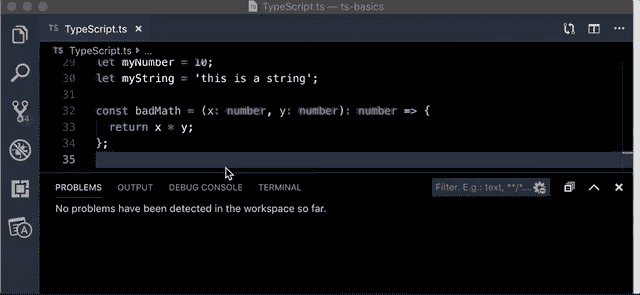

# TypeScript 入门—第 1 部分

> 原文：<https://betterprogramming.pub/get-started-with-typescript-part-1-440d2ec9e59>

## 关于使用 TypeScript 的简单介绍和教程

[亚历山大·奈特](https://unsplash.com/photos/j4uuKnN43_M)在 [Unsplash](https://unsplash.com/photos/j4uuKnN43_M) 上拍照

这是我将发布的关于 TypeScript 基础的系列文章的第一部分。如果您是 TypeScript 的新手，并且不知道从哪里开始，那么您已经找到了正确的页面。

带上您的 JavaScript 知识，准备好接受启发，准备好自己学习更多内容。

我们将慢慢来，从讨论 TypeScript 的基础开始。在本系列的第二部分中，我们将设置 VS 代码和我们的编码环境来使用 TypeScript，并应用本文中的一些知识。我们还将讨论一些附加的基本类型。

在这篇文章中，除了一些例子之外，我们真的不会写任何代码，但是我们会介绍基本类型，并为下一课做好准备，在下一课中，我们*将*写一些代码。

当我们讨论什么是 TypeScript 以及它如何工作时，我将从初学者的角度在需要知道的基础上讨论这个问题。换句话说，我不会给你过多的信息。

学习一门新语言最困难的事情之一是理解什么是相关的，以及如何以一种有用的方式应用它。因此，我们将只讨论一些介绍性的概念来帮助您开始您的 TypeScript 之旅。我将在第三和第四部分讨论更高级的主题。

让我们开始吧。

# 飞行前清单

正如我上面所说的，我们不会在这篇文章中写任何严肃的代码，但是如果你想继续，你可以安装 VS 代码，如果你还没有安装的话。我们将在本系列接下来的课程中使用它，VS 代码支持基本的 TypeScript 功能。

要在你的电脑上安装 VS 代码，请前往[微软官方下载页面](https://code.visualstudio.com/)并为你的操作系统安装**稳定版本**。

你有必要具备一些 JavaScript 编程的基础知识来理解 TypeScript。我不会深究 JavaScript 如何工作的细节，也不会解释变量、函数或类如何工作的复杂性，除非是关于它们在 TypeScript 中如何工作。

我将介绍 TypeScript 中的关键概念，以及它们如何特别适用于刚刚开始学习这种语言的人。但是，有很多内容我无法在几篇文章中涵盖，所以我鼓励您[阅读文档](https://typescriptlang.org)。

# 什么是 TypeScript？

这是一个有内涵的问题。只要谷歌一下，你就会看到很多复制粘贴的答案，大多数非常(可疑地)接近[stack overflow](https://stackoverflow.com/questions/12694530/what-is-typescript-and-why-would-i-use-it-in-place-of-javascript)的这个答案:

> TypeScript 是 JavaScript 的超集，主要提供可选的静态类型、类和接口。其中一个很大的好处是使 ide 能够提供一个更丰富的环境，以便在您键入代码时发现常见错误。”
> ——保罗·迪克逊谈栈溢出和几乎所有关于打字稿的教程

好吧，好吧，那很好。但是从现有 JavaScript 开发人员的角度来看，真正的问题是，*“我为什么要关心这个？”*也有也许，*“我如何用它来提高我的 JavaScript 技能？”*这个答案并没有真正解决这些问题，除非你已经知道一些关于 TypeScript 和静态类型的知识。

我个人发现，当我第一次开始学习 TypeScript 时，我遇到的许多答案更加令人困惑和不快。他们似乎是为了让用户回答起来比他们实际知道的更多。这对任何学科的初学者都没有帮助，更不用说编程语言了。

我不打算把这个包装成一个整洁的小蝴蝶结，并试图把一个流行词驱动的定义硬塞给你，因为它对学习毫无用处。相反，我会尽我所能让它变得更加平易近人。

# 为什么我们会关心类型？

先说 JavaScript 中有哪些类型。一个类型实际上意味着一个 ***数据类型****—**也称为一个 ***原始数据类型****—**，其值描述了其他东西包含的数据类型。我将用简单的术语将它分解成几个定义:**

*   **Primitive —不是对象且没有方法的数据。*原语*这个词指的是这些是数据最底层的基本面；和原始人一样，他们是最简单的形态。**
*   **数据—变量、对象或方法的值(这是有意通用的)。这几乎可以是任何东西。我们都知道什么是数据，让我们不要把它复杂化。**
*   **类型——代表数据种类的原始数据描述符。这是指当我们描述一条数据实际上*是什么* —一条`string`、`number`等。稍后会有更多的介绍。**

**类型存在于 JavaScript 中，但是你很少会真正感觉到你在和它们交互，除非你在检查`typeof`什么，比如验证它是一个数字而不是一个字符串。类型发生的大部分事情都是在后台进行的。**

**请允许我用一些代码来说明这个问题。**

**正如我们在上面的代码中看到的，当我们检查一个变量的`typeof`值，而这个变量的`data`是一个`string`时，我们的`if else`语句将记录“这是一个数字”这是因为`myNumber`的值确实是一个数字。**

**但是我们通常不会在 JavaScript 中这样做，不是吗？我们不会为每一行代码编写单元测试；效率低，不现实。一定有更好的办法。**

**我们引入了一个可能的错误，这个错误可能会在 JavaScript 中悄无声息地失败(我们的代码会运行，但不会像预期的那样工作)。在 JavaScript 中，我们可能没有发现这个错误。`NaN`是一个*有效数据值*，即使它不是我们想要的。**

**虽然我们的代码没有给我们提供有用的值，但事实是在大多数情况下，它甚至不会导致我们的应用程序失败，我们也不会知道。**

**这就是 TypeScript 的用武之地。**

**如果我们在使用 TypeScript 时编写了`badMath(myNumber, myString)`，我们的代码编辑器会告诉我们它会有错误，并且`myString`不是一个数字。**

**这是第一点，也是最重要的一点，你应该了解 TypeScript 的价值:有了 TypeScript，我们可以在运行时之前看到这些错误。我们可以在编写代码时发现代码中的错误，避免数小时的故障排除和挫折。**

**现在我们来讨论一些基本类型及其含义。**

# **基本类型及其含义**

**我们将在本系列的后续部分更详细地讨论这一点。不过现在，作为使用 JavaScript 的一部分，你需要知道的类型应该已经知道了。然而，当你使用它们的时候，你可能不会真的想太多。我将在这里概述这些以及一些基本的定义。**

*   **`string` —这实际上是引号中的任何内容，尽管[模板文字](https://developer.mozilla.org/en-US/docs/Web/JavaScript/Reference/Template_literals)(又名模板**字符串**)也是字符串的有效值。**
*   **这是一个数字。任何在 JavaScript 中有效的数字都是有效的类型，比如整数、浮点等等。**
*   **`boolean`—`boolean`是精确计算为`true`或精确计算为`false`的任何值。有效的布尔值总是关键字`true`或关键字`false`。**
*   **`Array` —数组是一组值。TypeScript 中的数组非常类似于 JavaScript 中的数组，但是您必须为您的数组提供一个类型，该类型指示数组包含的值的`type`。例如，`Array<string>`表示一个字符串数组。我们将在本系列的下一部分深入探讨。**
*   **`void`和`undefined` —这些值通常用于具体表示某事物将`return`无价值或字面上`undefined`。这个话题最好留给我们的下一课。**
*   **`any` —这实际上是任何和所有类型的可能性。例如，当你开始输入一个新的对象并且还没有确定所有的类型时，你通常会分配`any`。经验法则是你可能不应该永久地使用它。**

**如果你浏览了 TypeScriptLang.org 的文档，你可能会注意到有更多的类型被列为“基本”我并不是有意在这里讨论这些，以集中我们的努力，同时避免混乱。不要害怕，我们会在适当的时候到达那里。**

**现在我们已经知道了一些类型，让我们讨论一下我们所说的“静态类型”是什么意思**

# **静态类型与动态类型**

**你可能听说过有人将 JavaScript 描述为动态类型的。这意味着 JavaScript 解释器(通常也称为 JavaScript“引擎”)负责在运行时推断和分配类型。这实质上意味着我们的代码在执行之前没有硬编码的类型。**

**TypeScript 虽然与 JavaScript 极其相似且明显相关，但实际上却是动态类型的对立面；它是*静态类型的*，所以类型在编译时被检查和赋值。**

**但是，对于 TypeScript 和 VS 代码，这只是部分正确。**

**正如我们将在下一课学习到的，当我们配置 VS 代码使用 TypeScript 时，我们实际上可以在编写代码时进行类型检查，而不用先编译！这让我们在犯错误的时候就能看到错误。**

****

**没有代码，没有问题。**

**如果你曾经使用 Chrome JavaScript 控制台(也称为“web dev”控制台)来快速测试一些 JavaScript，你就会看到这种行为。当您键入代码时，控制台几乎会立即显示任何错误。在 Chrome 中，这仅限于您已经创建的函数和赋值，但这在方式上类似于 VS 代码对 TypeScript 的处理。**

# **工作中的打字稿**

**我们将从前面使用的代码中查看我们的变量和`badMath`函数，但是使用类型来编写，以便让我们了解这对我们非常有用，并帮助我们编写更好的代码。**

**让我们来分解一下上面看到的错误:**

*   **错误 TS2345 —不要担心这个问题；这是一个与我们遇到的特定类型的错误相关的错误代码。虽然它们作为读取错误的快捷方式可能是有用的，但是当您第一次开始使用 TypeScript 时，您不太可能使用它。**
*   **“字符串类型的参数”——这是指我们传递给`badMath`函数的`myString`参数。TypeScript 中没有告诉我们引用了哪些参数，但是当我们设置 VS 代码时，我将向您展示一些工具，它们至少可以帮助您隔离抛出这个错误的函数。**
*   **“…不可赋给“number”类型的参数”——TypeScript 告诉我们“string 类型的参数”对于它应该传递的**参数**无效(我们的原始参数是`x`和`y`，我们将其静态类型化为`numbers`)。换句话说，TypeScript 是在说，“当你写这个函数的时候，你说你会带两个**参数**并且那些会是数字，但是你给了我一个`string`——这是怎么回事？”**

**每当我们在 TypeScript 中遇到一个错误，我们就在学习如何更准确、更高效地编写代码。正如我们在上面的代码要点中看到的，即使是最简单的函数在 JavaScript 中也会有错误。当我们用 TypeScript 重写相同的代码时，我们已经避免了编写那个 bug。**

**重要的是要明白，我们甚至在运行代码之前就可以看到这些错误**。TypeScript 可以帮助我们在运行时之前发现错误，这是非常重要的。****

# **TypeScript 是编译语言吗？**

**到现在为止，您可能已经听说过 TypeScript 是编译过的，尽管有些人会争论这一点。这不是我们需要详细讨论的主题，但要知道，您的 TypeScript 在执行之前会被转换为 JavaScript。正是在这个过程中，TypeScript 执行其类型检查，这就是神奇之处。**

**VS Code 能够近乎实时地对你的代码进行类型检查，就像你之前在 GIF 中看到的那样，那时它还没有被编译。在下一课中，我们将了解如何利用这一点，使这一功能更加强大。**

# **再说一遍，什么是打字稿？**

**让我们再问一次这个问题，并思考一下你现在是否能自己回答它——什么是 TypeScript？**

**这是一个漏洞捕捉器，它是一个工具带，帮助我们验证我们传递的数据类型确实是我们想要的和期望的。这也是通过让我们思考如何处理数据来让我们成为更好的程序员的一种方式。具体来说，它允许我们通过有效地将 JavaScript 转换成静态类型语言来减少错误和 bug。**

**对于这个例子，我们仅仅触及了皮毛，但是我希望您已经看到了 TypeScript 的强大之处。**

# **下一步是什么？**

**我们只是浏览了一下表面，对 TypeScript 进行了一万英尺的观察。**

**在下一课中，我们将从在 VS 代码中配置项目以使用 TypeScript 开始。我们还将在 VS 代码中配置一些设置和扩展，使 TypeScript 编码体验更加流畅，更有利于学习。我想你会惊喜地发现 TypeScript 能给你的编码体验增加多少。**

**我们还将深入挖掘基本类型，并以一种有意义的方式应用它们，这样您就可以对 TypeScript 的核心原则有一个坚实的理解。我们将练习使用基本类型，并开始讨论一些更高级的主题。我将为您提供一些建议，告诉您在哪里可以学到更多关于 TypeScript 的知识，以及如何避免作为一名语言新手可能会遇到的一些麻烦。**

# **结论**

**我希望这是对 TypeScript 的一个相对简单且内容丰富的介绍。下一课还有更多的内容。但是现在，看看你能否自己深入了解我们在这里讨论的内容。**

**提示:你只需要 VS 代码并改变你的文件类型来使用`.ts`作为扩展名。还有很多，但是从这里开始，试着输入一些基本的变量和函数。**