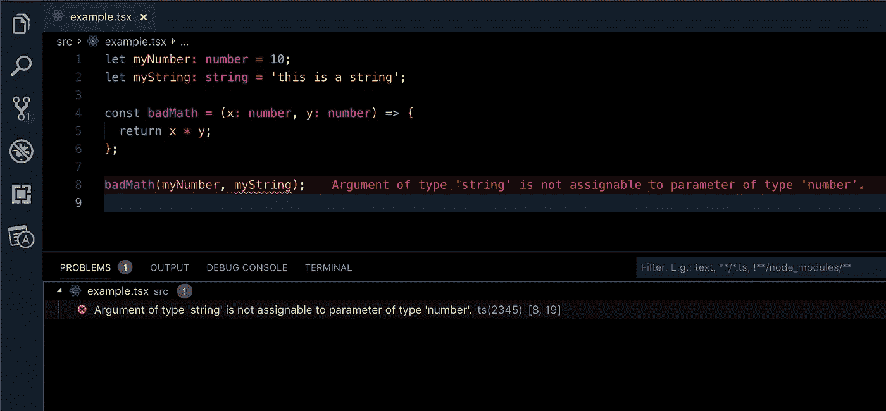
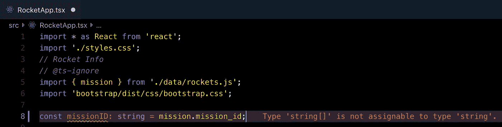
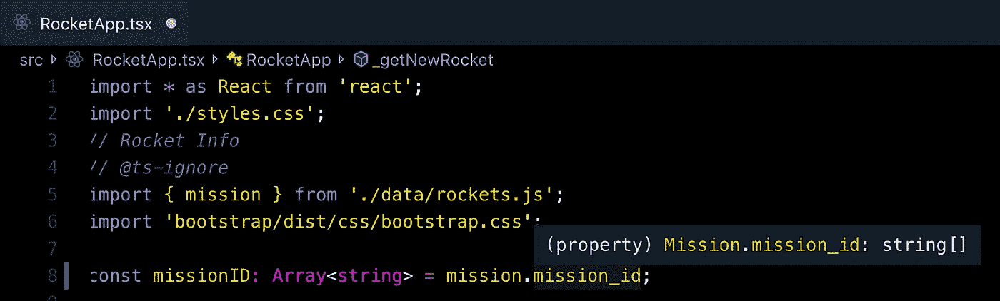

# TypeScript 入门—第 2 部分

> 原文：<https://betterprogramming.pub/get-started-with-typescript-part-2-46cbdd858f69>

## 设置 VS 代码和使用基本类型


这是正在进行的学习 TypeScript 系列的第二部分。如果你没有看过第一部分，[从这里开始](https://medium.com/better-programming/get-started-with-typescript-part-1-440d2ec9e59)。我们将使用前一篇文章中讨论过的一些概念，所以您需要先熟悉这些概念。

我们之前讨论过 TypeScript 在问题发生之前通过在运行时之前在我们的代码编辑器中向我们显示我们的错误是多么有用。在本文中，我们将通过一些扩展和其他设置来设置 VS 代码，以实现这一点。

我们还将看看一个还没有类型的应用程序——我们将添加我们自己的类型，开始应用我们的 TypeScript 知识。该应用程序是使用 React 构建的，但不要担心——你不需要成为 React 专家。我们不会关注 React，而是关注如何向传入数据添加类型。

让我们开始吧。

# 设置 VS 代码

如果你还没有安装 VS 代码，你可以通过访问[微软官方下载页面](https://code.visualstudio.com/?source=post_page---------------------------)来安装。为你的操作系统安装*稳定版本*。

VS 代码支持现成的 TypeScript，但是为了最大限度地利用 TypeScript 开发，您需要添加一些扩展来增强体验。

我将在下面描述这些扩展，并提供 Visual Studio Marketplace 的链接来安装它们。或者，您也可以只在 VS 代码中搜索扩展名。

单击要重定向到下载页面的扩展名。

*   TSLint —这个扩展将通过实时分析我们的类型脚本来帮助识别和标记代码中的错误。 ***更新*** : ESLint 现在是 TypeScript 的官方 linter。这个插件仍然支持最新的 TypeScript，并且对于本教程的目的来说会工作得很好，但是建议迁移到 ESLint。
*   [最新的 TypeScript 和 Javascript 语法](https://marketplace.visualstudio.com/items?itemName=ms-vscode.typescript-javascript-grammar) —这有助于主题中的语法突出显示和 VS 代码内部使用的其他语言特性。
*   [Error Lens](https://marketplace.visualstudio.com/items?itemName=usernamehw.errorlens) — Error Lens 与 TSLint 结合使用，向我们显示错误，尤其是打字错误，就在文件中引起问题的实际代码行旁边。*小心下载正确的版本* ，因为有两个扩展名名称相似。这个扩展是由一个叫亚历山大的人完成的。(是*不是*错误镜头:注意空格。)

虽然这三个扩展都是非常宝贵的，但在学习 TypeScript 时，误差透镜无疑是最重要的。为了说明它是如何工作的，我将使用我们在【TypeScript 入门—第 1 部分中的例子中使用的一些代码。

在下面的截图中应该很清楚，Error Lens 向我们显示的错误与我们的问题窗口中的错误相同。但是，并不是所有错误镜头突出的问题都会出现在问题中。这也释放了您的底部窗口分区用于您的终端。



Error Lens 在与违规代码相同的行上突出显示错误。

当我们深入研究 TypeScript 如何工作时，我们将更多地使用这个特性。它确实有助于快速找到错误，并在第一次就正确地编写代码，但这确实需要一点时间来适应。

如果您在编码时发现这令人讨厌或打扰，请记住您也可以在问题窗口中看到这些错误。如果你不喜欢这个扩展，就禁用或卸载它。然而，我鼓励你在我们讨论添加类型的时候尝试一下，因为我发现它在我自己的编程中是一个非常有价值的工具。

# 艰难地编译打字稿

默认情况下，TypeScript 编译器要求您手动运行它。当我们进入下面的示例应用程序时，我们不会这样做，你可能也不会在现实世界中这样做。然而，对幕后发生的事情有一些了解是很重要的。

让我们来演示一下。在一个空文件夹中创建以下内容。注意文件扩展名`.ts`。

```
index.ts
tsconfig.json
```

将以下代码放入您的`tsconfig.json`中。我们将更详细地讨论这个文件的确切用途:

tsconfig.json 的最低要求。

在你的`index.ts`中放置下面的代码。这只是几个变量和函数，返回一个组合这些变量的字符串。如果你读了前一篇文章，应该很清楚这些类型的用途。

用 TypeScript 编写的简单函数

现在我们已经有了一些类型脚本，我们可以运行编译器来构建我们的 JavaScript 文件。在 VS 代码中，按下`Cmd + Shift + b`，编译器会在底部的终端窗口中显示它正在运行。

您会注意到现在有了一个新的 JavaScript 文件，`index.js`，它包含了与我们的 TypeScript 文件非常相似的代码，但是没有类型。这个文件是由 TypeScript 编译器根据您的`index.ts`文件中的代码创建的。

看起来似乎与 TypeScript 文件没有太大的不同。情况往往如此；代码可能看起来相对相同。然而，当您更深入地应用类型时，当编译成 JavaScript 时，TypeScript 通常会创建更复杂的代码版本。这是为了加强你已经创建的类型，并最终得到比没有类型脚本更好的*JavaScript*。

虽然知道这是如何工作的很重要，但我在本文中的重点是*学习如何应用基本类型*，而不是 TypeScript 编译过程的后端如何工作。您可能想自己尝试一下，以便更加熟悉，但是您不需要了解更多关于手动使用编译器来使用 TypeScript 的知识。

# 以最简单的方式编译 TypeScript

你可能会看到，如果我们不得不一直这样做，编译过程会多么低效。在编写 TypeScript 时，您几乎总是会使用框架或其他工具来完成这一过程。

我在编写 vanilla TypeScript 时使用 package，它为我处理编译。关于包裹的入门指南，请看我的文章[Parcel . js——简单的 JavaScript 捆绑](https://medium.com/better-programming/parcel-js-easy-javascript-bundling-ecddac0783f7)。我们的示例应用程序已经在使用 Parcel，所以从现在开始我们不需要担心编译器。

# 下载示例应用程序

我已经模拟了一个示例应用程序的开始，我们将使用它来练习添加类型。现在就去下载吧。

请注意，如果您使用的是 VS 代码，您可以按`Ctrl + ~`打开终端并在那里运行命令来克隆 repo，安装节点模块并将其作为我们的 VS 代码工作目录打开。

```
git clone [https://github.com/methodbox/ts-rocket-example](https://github.com/methodbox/ts-rocket-example)
cd ts-rocket-example
npm install
code -r .
```

正如我前面提到的，它内置在 React 中，但是如果您不熟悉 React，也不用担心。我们将专注于向应用程序提供的数据中添加类型。我将在需要的地方给出 React 特定项目的高级概述，以便清楚我们正在做什么。你不需要任何反应知识来掌握这些概念。

顺便提一下，这个应用程序是使用我在文章 [Parcel.js 中介绍的相同步骤开始的——简单的 JavaScript 捆绑](https://medium.com/better-programming/parcel-js-easy-javascript-bundling-ecddac0783f7)。

# 什么是 tsconfig？

一旦你下载了这个应用程序，你会看到一些文件，包括扩展名为`.tsx`的文件和一个名为`tsconfig.json`的文件，类似于我们之前创建的文件。`tsconfig`文件用来告诉 VS 代码的类型脚本解释器我们想如何使用类型脚本。它可以用来使我们的规则更严格或更宽松，指定我们在其中使用 TypeScript 的文件类型，甚至指定我们所针对的 JavaScript 的特定版本。这是 TypeScript 在您的项目中正确工作所需的*文件。*

我包含的文件可以与 React 一起工作，但是如果您使用的是，例如，像我们前面所做的那样，只使用 TypeScript 和`.ts`文件扩展名，则需要进行一些更改。当使用 React 的 JSX HTML-in-JavaScript 语法时，我们告诉 TypeScript 这就是我们正在做的事情。深入理解这一点并不重要，重要的是理解我们可以将该设置指定给 TypeScript，这样它就知道发生了什么。

如果你想了解更多关于`tsconfig`的设置，看看微软的官方文档[。](https://www.typescriptlang.org/docs/handbook/tsconfig-json.html)

# 为状态创建新类型

先说一下`state`是怎么工作的。在 VS 代码里面，打开`RocketApp.tsx`文件，四处看看。我们将关注`state`属性对象，它位于`RocketApp class`内部。如果您没有经常使用 React，状态可能不是一个非常熟悉的概念，但是，正如我所说的，您不需要了解 React 就能理解。

你现在需要知道的关键事情是，当`state`发生变化时，我们的应用程序中显示的数据也会发生变化，因此 React 会相应地更新我们的网页(无需刷新)。

我们不会玩太多 React `state`的魔法，但重要的是要知道，因为`state`正在管理我们的数据，我们知道这将在某个时候改变，同样重要的是要知道我们正在发送和接收正确的`type`数据。

让我们通过创建一个名为`State`的新类型来开始我们的输入过程。注意大写——这不是必需的，但这是*接受的惯例*,即新的、自定义的`type names`是*大写的*。

我知道，我们应该把重点放在基本类型上，对吗？这正是我们要做的——我们将把一些基本类型分配给一个新类型`State`,这样我们就可以把这些类型分配给我们已经在`state`对象中找到的值。我们从这里开始，因为你经常会有一个装满数据的 T4，你需要为这些数据赋值。

打开文件`RocketApp.tsx`。在文件的顶部，注释的下面，添加一个状态类型，如下面的要点所示。现在，使用语法`type [type name] = {}`，它只是一个空对象。

在我们的`RocketApp class`中，再看一下`state`属性。它有一堆`data`值，有些比较空，但是*都有我们可以赋值的类型* 。让我们首先将`state`的括号`{}`之间的所有内容复制到新的`type State`中。一定要以分号*结束每一行，因为这在定义类型时是必需的。*

你的新`State`类型应该看起来像下面的要点。但是我们还没有完成——我们需要添加我们的类型。

# 向我们的新状态类型添加类型

现在我们有很多类型属性，但是它们都没有类型。这在技术上是错误的类型脚本语法，但是我让你这么做的原因是考虑这些属性和与它们的类型相关的当前数据值。

如果我们对此进行分解，只需查看值并考虑我们有哪些类型的数据，就应该很清楚要分配哪些类型。我们有一些空的`strings`，几个`false boolean`值，几个`numbers`和一个`Array`。

尝试自行分配`types`。只需将你看到的值替换为类型的名称，并以分号结尾，就像这样:`appTitle: string;`。

我再给你一个关于`Array`的提示。TypeScript `Array`语法如下:`Array<type>`其中`type`是数组内容的实际类型。你也可以用`type[]`来表示那个`type`的数组，但是我更喜欢第一个，因为它清晰地显示出一个`Array`。在我们的例子中，我们的`ships`属性将保存船舶的*名称—* 您希望在`Array<type>`中使用哪种类型？

完成后，将代码与下面的要点进行比较。

# 使用你的新类型

这里有另一种方法来检查你的答案。这就是 VS 代码真正展示威力的地方。回头向下看`RocketApp class`，再次将光标悬停在`state`属性上。VS 代码实际上会*推断*类型是什么。它会向您展示代码中基本上所有的元素。推理并不总是正确的，但通常是正确的，如果您不确定如何继续，尝试开始输入代码是一个好方法。

然而，这只是*推断*类型——我们实际上还没有将我们的类型绑定到`state`属性。为此，将您的新`State`类型分配给`state`属性，就像您将您的类型分配给`State`类型属性一样。

您还需要将`State`类型分配给该类。用单词`State`替换`React.Component`后的第二个空对象。我们不会详细讨论这个问题，因为我们今天只关注基本类型，但是现在只要注意这是你在使用`classes`时使用`types`的方式。

当你将`State`类型赋给你的`state`属性并更新了类类型后，你的代码应该看起来像这样。

# 引入一些数据

让我们快速看一下我们的应用程序实际上做了什么，以及我们现在使用默认数据看到了什么。在您的终端中，使用`npm start`启动应用程序，它将在您的浏览器中打开。您可以按下“获取启动数据”按钮来查看应用程序的运行情况。我们得到了一个漂亮的图片，但没有太多其他的，因为我们有很多空值。


为了获取一些火箭发射任务数据，让我们从更新我们的`_getNewMission`方法开始。再次从您的`state`属性中复制值，但是这次将它们放在`this.setState`函数内的对象中。请注意，`launchImg, missionLogo, and isShowingMissionData`值已经存在；不要重复它们。

完成后，`_getNewMission`方法应该与下面的代码相匹配。

我在项目中的`data`文件夹中包含了一个名为 rockets 的文件，该文件包含了`mission`对象，该对象又被导入到`RocketApp.tsx`的顶部。`mission`对象具有从 [SpaceX API](https://docs.spacexdata.com/?version=latest) 中提取的实际数据。为了这个例子的简单，我们使用静态数据，但是你可以很容易地从一个活动的 API 中提取。

查看一下`mission.tsx`文件中的`data`文件夹。您将看到我已经创建了一个与我们的`State`类型相似的自定义`Mission type`。下面是`mission`对象，它又被分配给我们的`Mission type`。

我会给你一个属性列表，我想让你分配给`_getNewMission`方法的`setState`函数，这里我们刚刚引入了`state`属性。继续并相应地更新`setState`函数中的对象。

*仔细考虑*每条数据的类型，它在`mission`对象中的表示方式，以及我们在应用程序中分配的`types`。我们已经设置了我们的类型，这意味着我们期望得到那种类型的数据，事实上——我们正在*要求*我们得到那种类型的数据。我们一会儿将对此进行实验。现在，试着在`RocketApp.tsx`文件旁边查看`data/mission.tsx`文件，看看我们分配的类型是否有意义。

*提示:*你可以通过点击顶部的文件标签来使用 VS Code 的“右分割”功能，并排查看两个文件。

根据以下更新要点，使用这些值并替换当前在`setState`功能对象中使用的值:

保存后，您可以再次尝试点击“Get Launch Data”按钮，您将看到我们现在有了一些非常棒的发布数据。如果你点击按钮几次，图像将使用上面的`Math.floor`方法随机选择。

这里要指出的另一个重要事实是，虽然我们并没有根据我们的`type`赋值将`strings`放入需要`strings`的值中，但是我们*将*放入评估这些类型的`expressions`。这在 TypeScript 中完全有效；聪明到明白`new Date(mission.launch_date_unix * 1000).toDateString()`函数会返回一个`string`。

# 让我们打破一些东西

到目前为止，我们已经分配了我们的类型，一切都工作得天衣无缝，这很好，但没有展示 TypeScript 最强大的一面——在错误发生之前发现它们。

为了演示这一点，让我们试着创建一个新变量来保存我们的`mission`对象中的一个值。我们将使用`mission_id`值。不用看，我可能会认为这是一个`string`。我碰巧知道任务 ID 通常是一个*字母数字*名称，所以我知道它是*而不是*一个`number` 并且我知道它不是一个数组。所以字符串是一个很好的猜测——它只是碰巧是错的。

但是不管怎样，让我们试着把它分配给一个类型为`string`的`const`。你会马上看到 TypeScript 发现了一些错误，我们的错误镜头扩展使这个*变得非常*明显。



Error Lens 和 VS Code 正在施展他们的魔法来识别我们的打字错误。

如果您将鼠标悬停在我们在`setState`中分配的任何值上，它将向您显示我们之前看到的推断的`type`。在这种情况下，类型是一个*原语*(因为它是`Array`的基本类型)，正如我们在第 1 部分中讨论的。如果一个类型是原语，而不是自定义类型，你可以肯定 VS 代码是正确的。它告诉我将这个赋值为`string[]`或`Array<string>`。

当我更正输入时，我看到错误已经清除。你可以删除这个变量，因为我们不会在这个例子之外使用它。



我们的类型赋值现在匹配 VS 代码的推断类型。

我强烈建议您多试验一下这个特性——创建您自己的变量，并给它们赋值，然后给它们分配类型。试着产生错误并理解它们为什么会发生。

# 继续打字，继续实验

本教程的目标是向您介绍如何分配基本类型，了解如何确定分配给数据的正确类型，以及如何识别和纠正错误。

我们才刚刚起步，但是你现在可以开始使用 TypeScript 了。尝试示例 rocket 应用程序，或者自己编写一些代码并尝试分配类型。创建一个具有不同类型属性的对象，并创建一个新的类型来分配它，然后对照 VS 代码显示的内容来检查它。

使用 VS 代码来识别你的对象的类型并相应地分配它们，但是先不要偷看。

# 结论

我无法在一篇文章中介绍关于 TypeScript 的所有知识，但是我希望这篇教程能够帮助您熟悉基本类型。

我们将在下一部分继续这一旅程。在那之前，继续尝试使用 TypeScript。