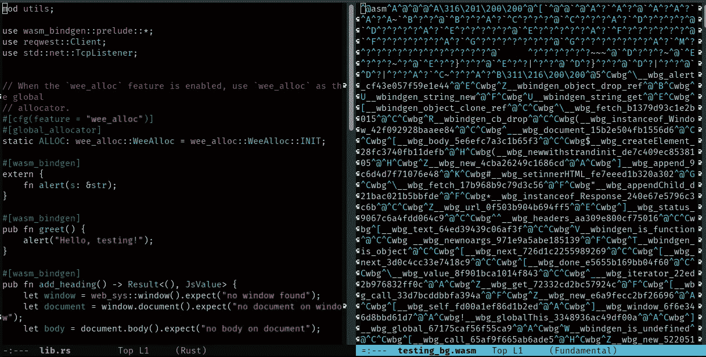
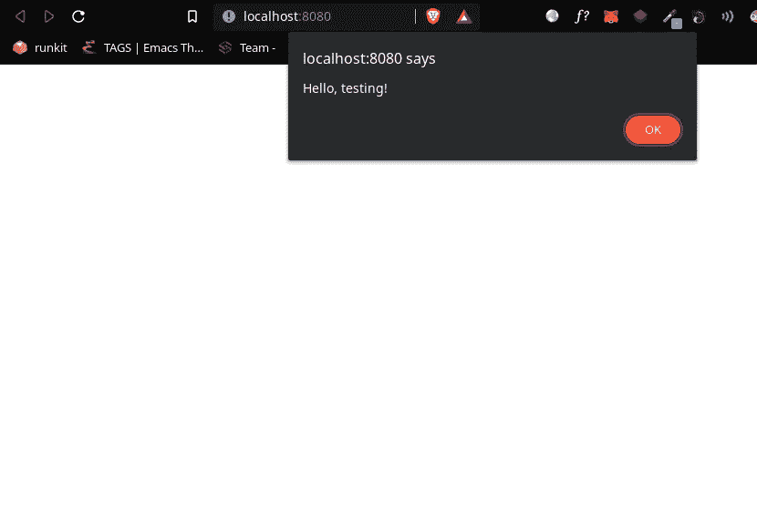

# 从《铁锈》中的 WASM 开始

> 原文：<https://betterprogramming.pub/get-started-with-wasm-in-rust-2347056bab4>

## 你未来发展的第一步，在 JS 中获得性能、强类型等等



自推出以来，WASM 已经成为开发社区中的一项重要技术。一些开发人员可能倾向于避免使用它，坚持使用 JavaScript 和 TypeScript，这对于大多数用例来说是完全有效的设置。然而，WebAssembly 为前端世界带来了无与伦比的性能和类型安全(不仅如此)。

WebAssembly(或 WASM)是一种二进制语言，可以通过浏览器有效地转换成机器代码，这比 JavaScript 运行起来要高效得多。WASM 允许像 C、Rust 和 Zig 这样的语言在浏览器中执行它们的代码(显然是沙箱化的)。

WebAssembly 不只是针对浏览器的。事实上，例如，Stellar 正在构建自己的智能合同环境，以便在线执行 WASM。这意味着网络组装将在各个行业扮演重要角色。

速度是创建 WASM 的驱动因素，黑客将恶意的 JavaScript 代码注入易受攻击的网站，以加载 wasm 编写的代码，并执行繁重的计算，直接从网站访问者的 CPU 中挖掘加密，这证明了 WebAssembly 的性能与 JavaScript 相比完全处于另一个水平。

尽管我很想谈谈 wasm 给游戏带来的潜在安全威胁，特别是因为我一直对做一些网络安全研究感兴趣并参与其中，这值得单独写一篇文章，但这篇文章不是。

今天，我们将介绍使用 Rust 构建 WASM 的基础知识，并从任何 JavaScript 代码中执行它(不需要捆绑器)。

这篇文章要么是写给那些了解 Rust 基础知识并想看看它在浏览器上的功能有多强大的人，要么是写给那些好奇的 JS 开发人员，他们愿意改变他们的工具箱并学习 WASM 的基础知识。

# 设置

您将需要标准的 Rust 设置，如果您已经使用过该语言，我假设您的机器上已经有了这个设置。

此外，我建议安装 cargo-generate，只需按几个键就可以在您的目录中设置基本的 rustwasm:

```
cargo install cargo-generate
```

您还需要安装 wasm-pack 来从 Rust 构建(而不仅仅是)WebAssembly。命令如下:

```
curl https://rustwasm.github.io/wasm-pack/installer/init.sh -sSf | sh
```

现在，您已经具备了开始工作所需的一切，让我们来创建我们的项目:

```
cargo generate --git [https://github.com/rustwasm/wasm-pack-template](https://github.com/rustwasm/wasm-pack-template)
```

这将要求您输入项目名称。选择你认为更合适的。对于这篇文章，我决定用“测试”

# 在 JS 中导入您的第一个 Rust 函数

您会注意到我们项目的结构看起来像大多数货物项目。`src/lib.rs`文件(我们项目的根文件)是我们将编译到 WASM 的文件。然后，我们使用众所周知的`Cargo.toml`文件来管理依赖关系、设置、元数据等等。

打开`lib.rs`，让我们看看它目前的代码。

这是一个简单的启动模板，使用`wasm-bindingen`导入 JavaScript 的 alert 函数，然后定义 JS 将来要调用的(public) `greet`函数。如果启用了`wee_alloc`特性，我们可以忽略将 elfin 分配器设置为全局分配器的行。

现在我们想做两件事:

1.  将 rust 代码编译成 wasm
2.  从`index.html`页面导入 wasm 并调用`greet`函数。

## 用铁锈代码建造 WASM

因为许多开发人员喜欢使用不同的捆绑器，所以我决定在本文中不使用捆绑器，这样读者就可以用一个简单的 HTML 文件来跟进。为此，我们将在使用`wasm-pack`构建 WASM 时使用`--target web`标志。

在板条箱的目录中，运行以下命令:

```
wasm-pack build --target web
```

这将在`./pkg`文件夹中生成一些文件。在这些文件中，有 wasm 二进制文件(`projectname_bg.wasm`)和一个 js 文件(`projectname.js`)，为在 JavaScript 中加载 WASM 函数提供了一个方便的 API。

## 运行问候功能

在项目的根目录下，创建一个`index.html`文件，并导入`./pkg/projectname.js`文件。这将允许您初始化 wasm API 并调用`greet()`函数。HTML 文件应该如下所示:

如果您现在服务于`index.html`文件(我使用的是 snowpack，所以`snowpack dev`在根目录中)，您将看到由`greet()`函数调用的警告弹出:



# 修改 DOM

> 本节假设您已经阅读了上一节。

以上部分提供了在浏览器中加载 Rust 所需的几乎所有内容。您可能还想知道如何直接从 Rust 修改 DOM。在这一段中，我将快速向您展示如何操作。

为此，将 web-sys 依赖项添加到您的`Cargo.toml`文件中:

```
[dependencies.web-sys]
version = "0.3.4"
features = [
  'Document',
  'Element',
  'HtmlElement',
  'Node',
  'Window',
]
```

现在我们必须添加一个函数，使用`web-sys`来调用浏览器窗口，然后访问 DOM 并添加标题到主体。

我们带有新功能的`lib.rs`将如下所示:

如果您现在重建板条箱(`wasm-pack build --target web`，您将能够从您的`index.html`文件导入`add_heading`功能:

再次提供 HTML，您将看到标题。

鉴于围绕 WASM 的主题数量众多，本文将是一个系列的开始，尤其是在讨论优化与 WebAssembly 接口的应用程序以更好地适应 wasm 线性内存模型时。

我希望这篇文章能帮助你开始使用 Rust 和 WASM，或者至少对尝试这项技术感到好奇。最终，我认为 WebAssembly 做出的承诺足以抓住我的注意力，并且可能会抓住你的注意力。谈到 wasm，它还允许用 Rust 编写 Cloudflare workers，实现了最快的无服务器体验之一。

鉴于我对 Cloudflare workers 的兴趣，请继续关注我计划写的这篇文章[。](/create-and-deploy-your-first-javascript-serverless-worker-e234f3f69cea)

感谢您的阅读！