# SwiftUI 手表连接入门

> 原文：<https://betterprogramming.pub/get-started-with-watch-connectivity-with-swiftui-51722324b6f6>

## 用一个简单的示例应用程序说明连接性

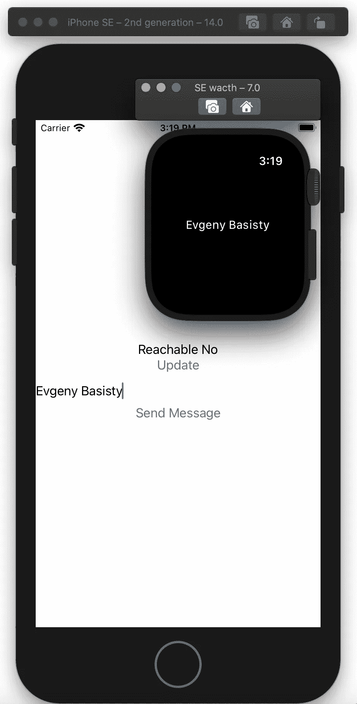

[Watch Connectivity](https://developer.apple.com/documentation/watchconnectivity) 是一个框架，它实现了 iOS 应用程序与其配对的 watchOS 应用程序之间的双向通信。有几种方法可以将数据从 iPhone 传输到 watchOS(或从 watch OS 传输回来)，包括 CloudKit。根据我的经验，手表连接在某些情况下更稳定，因为:

*   它不依赖于网络连接
*   如果用户的 iCloud 存储空间已满，则没有任何问题
*   它对数据传输模式和时间有更多的控制

有关于手表连接和样本项目的教程，包括一个来自苹果公司的教程。这是一个很好的例子，但是对于初学者来说有点难以理解。

我写这篇文章是为了提供一个教程，使用最少的代码和 SwiftUI 的用户界面开始手表连接。

通过完成本教程，您将创建一个应用程序，该应用程序:

*   在 watchOS 和 iPhone 之间建立连接
*   指示 watchOS 是否可以接收来自 iPhone 的信息
*   可以从 iPhone 向 watchOS 发送简单的信息

你可以一步一步地阅读这个指南，或者[下载](https://github.com/Basistiy/ConnectivitySwiftUI.git)完整的应用程序，自己弄清楚它是如何工作的。

# 入门指南

首先，让我们用 Watch App 项目创建一个新的 iOS 应用程序。选择 SwiftUI 作为用户界面。

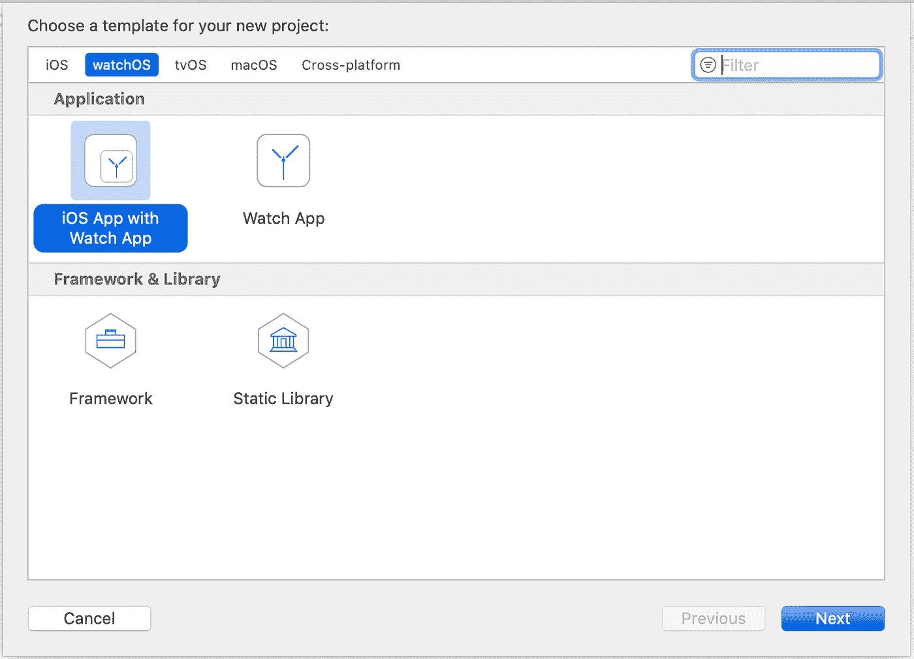

创建新的 Swift 文件。在这个文件中，我们将创建一个视图模型，它还将管理我们与 watchOS 的连接。

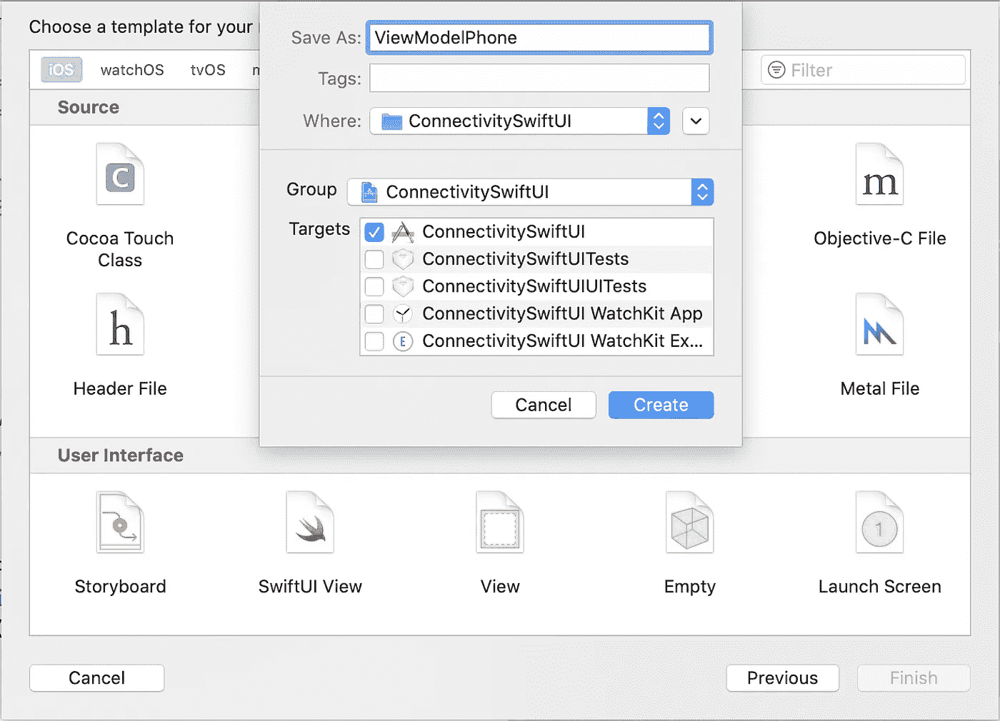

将手表连接框架导入文件。

模型类必须符合两个协议:`NSObject`和`WCSessionDelegate`。为了符合`WCSessionDelegate`，该类必须实现三个方法:

```
func session(_ session: WCSession, activationDidCompleteWith activationState: WCSessionActivationState, error: Error?)func sessionDidBecomeInactive(_ session: WCSession)func sessionDidDeactivate(_ session: WCSession)
```

这些方法暂时先放一放。

苹果建议你应该尽快启动 watchOS 和 iPhone 之间的连接会话，因为你可能想要在应用视图加载之前执行一些操作。但是为了简单起见，我们将从`ContentView`开始会话。

在`ContentView`中从`ViewModelPhone`类创建一个新对象。

`WCSession`有几个属性，指示手表应用程序是否已安装，或者手表此时是否可达。我们将使用这些属性来确保手表和 iPhone 之间的连接已经建立。

在`ContentView`中的`VStack`内创建一个`TextField`和一个`Button`。

按钮动作将触发一段代码来检查`WCSession`的`.isReachable` 属性并更新`TextField`。

接下来，我们必须编写一些代码来实现手表端的连接。

在`WatchKit Extension`文件夹中，创建一个名为`ViewModelWatch`的新 Swift 文件。确保文件在目标中启用了`WatchKit Extension`:

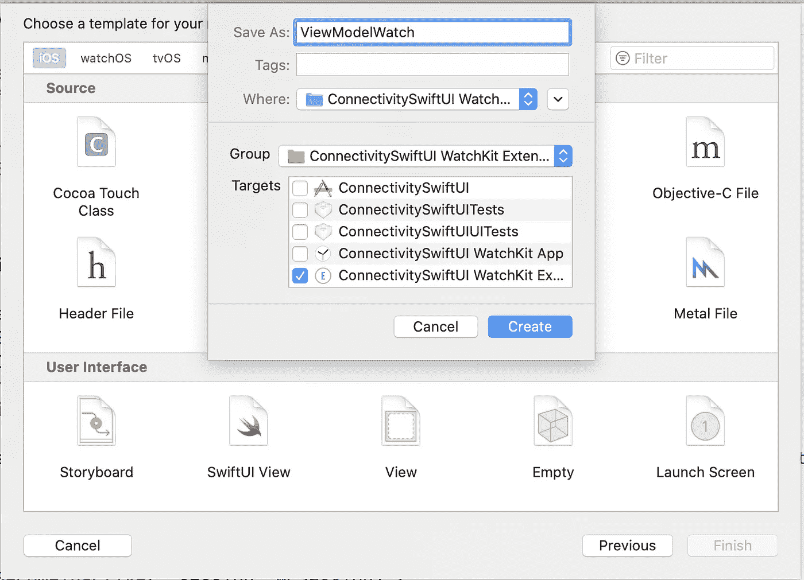

在文件内部，创建一个符合`NSObject`的名为`WCSessionDelegate`的类。它类似于 iPhone 的类。但是对于手表，不需要实现`sessionDidBecomeInactive`和`sessionDidDeactivate`方法。

接下来，在`WatchKitExtension`的`ContentView`内部创建一个`ViewModelWatch`类的对象。

# 测试您的应用

是时候测试应用程序是否如预期的那样在模拟器上运行了。

1.  将手机模拟器与手表配对。从 Xcode 中运行和停止按钮附近的下拉菜单中点击`Add Additional Simulators`。

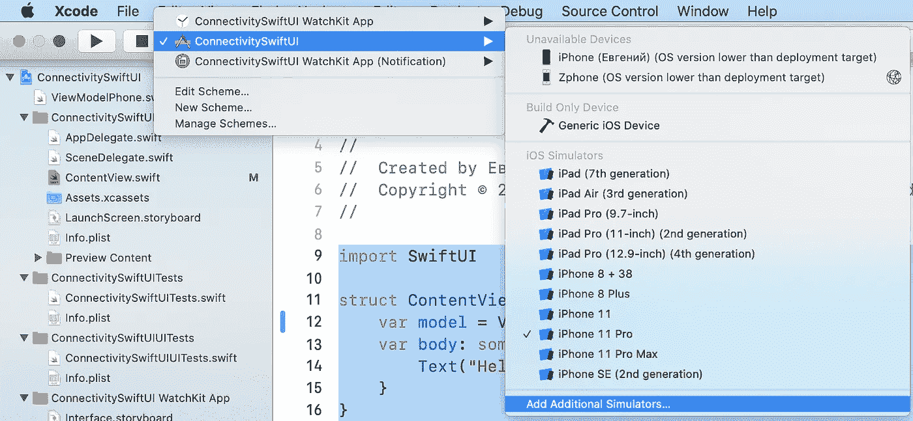

单击 iPhone 模拟器，然后按加号按钮。然后，选择您想要配对的手表模拟器。

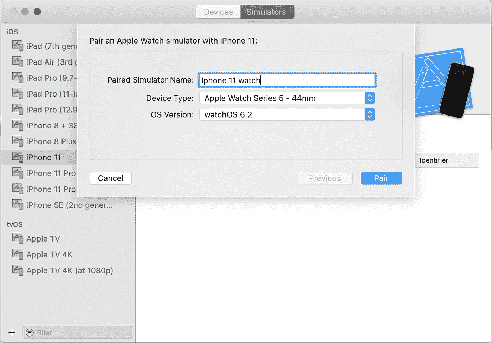

2.启动 iPhone 应用程序。

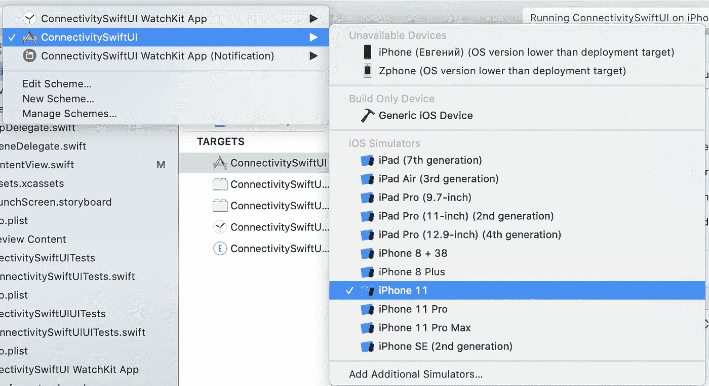

3.启动手表应用程序。

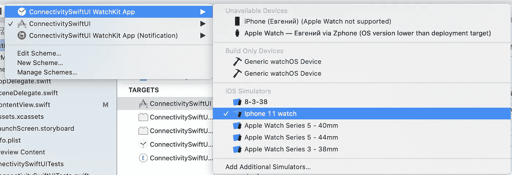

4.按下更新按钮。如果一切正常，标签`Reachable`附近的`No`将变为`Yes`。如果没有出现这种情况，请尝试停止并再次运行 iPhone 应用程序。

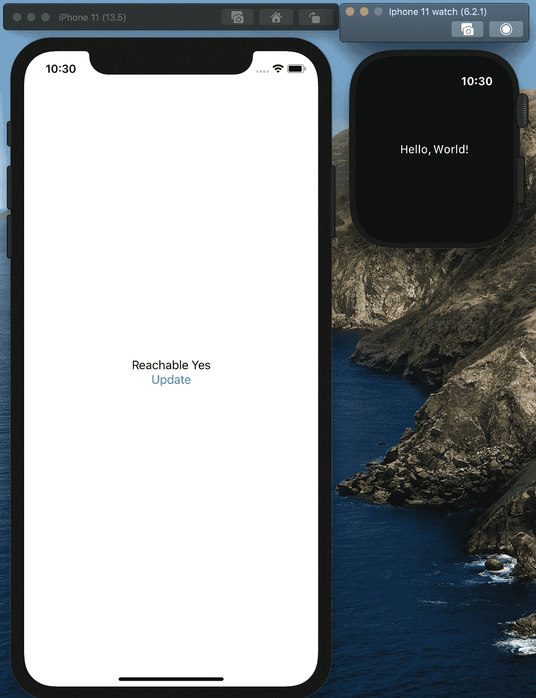

此外，当您检查`Reachable`属性时，请确保手表应用程序正在前台运行。你可以将手表应用放在后台进行实验:

1.  按手表模拟器上的数字按钮(主页按钮)。
2.  此时如果您按下更新按钮，`Yes`将变为`Reachable`标签附近的`No`。

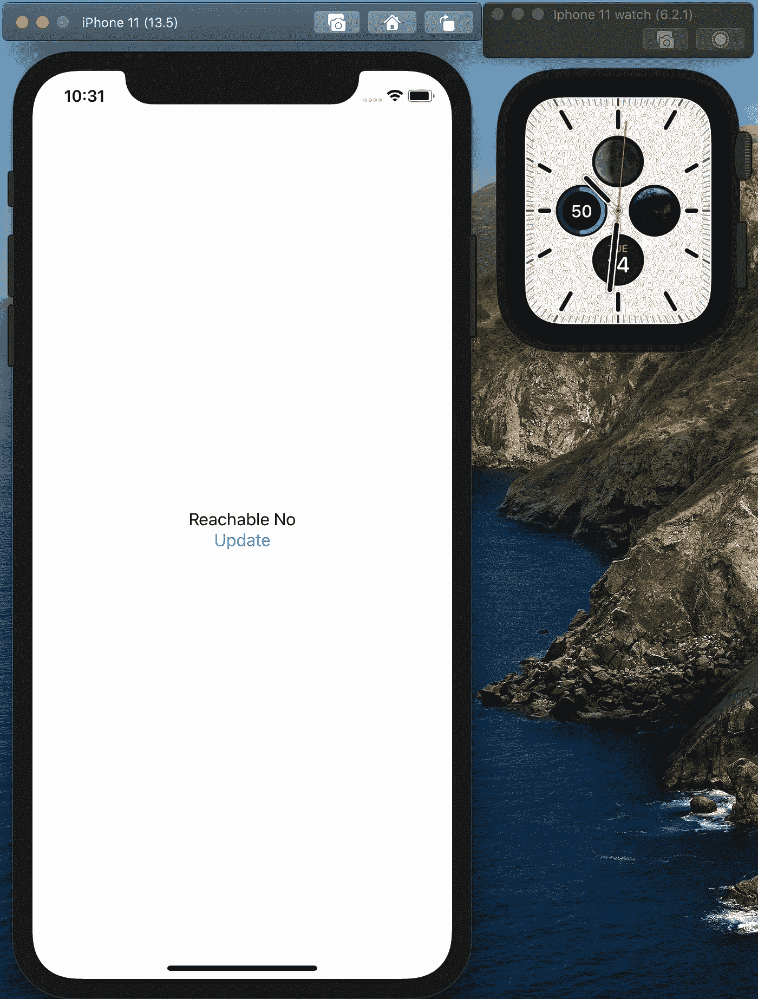

# 使应用程序能够在 iOS 和 watchOS 之间发送简单的信息

在 iOS 应用程序的`ContentView`中，创建一个文本字段和一个按钮:

按下按钮将触发动作`self.model.session.sendMessage([“message” : self.messageText], replyHandler: nil) { (error) in print(error.localizedDescription) }`。

因此，这里我们使用 session 对象的`sendMessage`方法，该方法接受一个字典`[String : Any]`，该字典带有一个作为键的字符串(在我们的例子中是`“message”`)和一个属性列表数据类型(在我们的例子中是来自`TextField`的字符串)的值[。此方法在几种情况下会引发错误。最常见的有:](https://developer.apple.com/library/archive/documentation/General/Conceptual/DevPedia-CocoaCore/PropertyList.html)

*   您试图发送一个不是属性列表数据类型的值
*   当手表无法[到达](https://developer.apple.com/documentation/watchconnectivity/wcsession/1615687-sendmessage)时，你尝试从 iPhone 向 watchOS 发送信息

接下来，我们需要创建一个负责接收和解码消息的方法。

1.  使`ViewModelWatch`类符合`ObservableObject`协议。
2.  用`Published`属性创建新的空字符串`messageText`。我们将使用这个字符串在监视屏幕上显示消息内容。
3.  创建`session(_ session: WCSession, didReceiveMessage message: [String : Any])`方法。此方法由接收消息触发。
4.  在这个方法中，设置`messageText`的值等于接收到的消息的值。您需要在`DispatchQueue.main.async`上完成，因为`messageText`有一个`Published`属性；否则，在执行过程中会出现错误。

5.更新手表侧的`ContentView`，以便显示`messageText`字符串，而不是`“Hello world”`:

就是这样。现在运行应用程序，确保你的信息从你的 iPhone 传到你的手表上。

1.  启动你的 iPhone 和手表模拟器。
2.  在 iPhone 上的`TextField`中键入您的消息，然后点击发送消息按钮。
3.  手表屏幕现在应该显示您的消息。

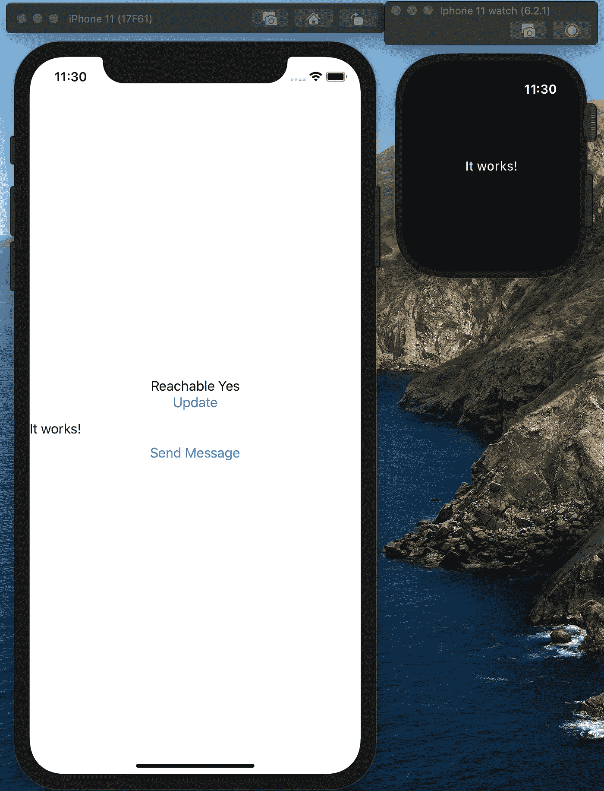

# 结论

我希望这个例子对你来说一切顺利。现在，您已经准备好向示例代码中添加更多的特性，以满足您的项目需求。

通过手表连接会话发送和接收数据有几种[方法](https://developer.apple.com/documentation/watchconnectivity/wcsession):

```
[sendMessage(_:replyHandler:errorHandler:)](https://developer.apple.com/documentation/watchconnectivity/wcsession/1615687-sendmessage)[sendMessageData(_:replyHandler:errorHandler:)](https://developer.apple.com/documentation/watchconnectivity/wcsession/1615617-sendmessagedata)[transferUserInfo(_:)](https://developer.apple.com/documentation/watchconnectivity/wcsession/1615671-transferuserinfo)[transferFile(_:metadata:)](https://developer.apple.com/documentation/watchconnectivity/wcsession/1615667-transferfile)[transferCurrentComplicationUserInfo(_:)](https://developer.apple.com/documentation/watchconnectivity/wcsession/1615639-transfercurrentcomplicationuseri)
```

您可以选择一个适合您的项目。你可以在这个[视频](https://developer.apple.com/videos/play/wwdc2015/713/)中了解更多关于他们之间的区别。

感谢阅读。我希望这有所帮助。