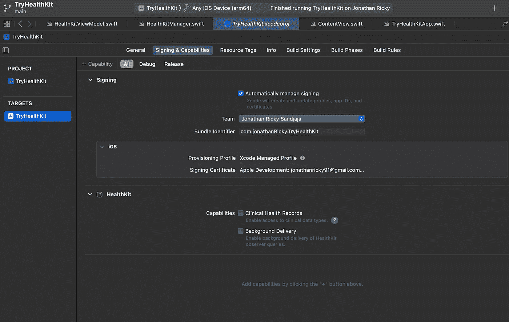

# 使用 SwiftUI 构建 HealthKit 应用程序

> 原文：<https://betterprogramming.pub/get-step-count-data-from-healthkit-b6d1a2818e73>

## 从 HealthKit 获取步数数据


照片由[布鲁诺·纳西门托](https://unsplash.com/@bruno_nascimento?utm_source=medium&utm_medium=referral)在 [Unsplash](https://unsplash.com?utm_source=medium&utm_medium=referral) 上拍摄

在我的上一个项目中，我构建了一个饮食应用程序，它需要从用户 iPhones 上的健康应用程序中获取步数。所以，我用苹果的`HealthKit`框架来完成这项工作。

想知道如何使用 HealthKit 从 Health 获取用户的计步数据？好吧，让我们开始吧！

需要执行几个步骤来获得步数，即:

*   在我们的项目中启用 HealthKit 功能
*   请求用户的健康应用程序权限
*   获取步数数据
*   检查健康授权状态
*   创建和更新用户界面

知道了步骤之后，让我们进入代码吧！

# **1。在我们的项目中启用 HealthKit 功能**

要在我们的应用程序中启用 HealthKit 功能，请打开您的项目，进入签名和功能，单击右上角的加号按钮，然后选择 HealthKit。

如果您需要访问用户的临床记录和后台交付，您可以检查临床健康记录，以便能够实时观察数据变化。

这里就不多点了，因为计步不是病历，不需要实时计步数据。



向项目添加 HealthKit 功能

之后，进入信息选项卡，我们需要添加一个密钥来使用 HealthKit。我们需要的关键是`NSHealthShareUsageDescription`和`NSHealthUpdateUsageDescription`。


在信息标签中添加健康工具包密钥

# 2.请求用户的健康应用程序权限

在获取步数之前，我们需要获得用户的许可来访问他们的健康应用程序。

为此，我创建了一个名为`HealthKitManager`的新文件，其中包含一个`HealthKitManager`类。

别忘了顶部的`import HealthKit`，然后创建一个名为`setupHealthRequest`的函数。

```
func setUpHealthRequest(healthStore: HKHealthStore, readSteps: @escaping () -> Void) {
    if HKHealthStore.isHealthDataAvailable(), let stepCount = HKObjectType.quantityType(forIdentifier: HKQuantityTypeIdentifier.stepCount) {
        healthStore.requestAuthorization(toShare: [stepCount], read: [stepCount]) { success, error in
            if success {
                readSteps()
            } else if error != nil {
                // handle your error here
            }
        }
    }

}
```

所以，上面的函数是这样做的:

*   第一行`HKHealthStore.isHealthDataAvailable()`检查设备是否可用。
*   然后，使用`HKObjectType.quantityType(forIdentifier: HKQuantityTypeIdentifier.stepCount)`指定我们想要获取的数据——即步数，并使用`if let`展开它。
*   在我指定数据之后，我们调用函数`requestAuthorization()`。这将触发健康应用程序权限弹出窗口，要求您给予许可。我们还指定步数作为要读写的数据。之后，如果用户允许，我们将读取步数，否则，处理错误。

# 3.获取步数数据

现在我们已经创建了`setupHealthRequest()`方法，让我们设置获取用户步数的方法— `readStepCount()`:

```
func readStepCount(forToday: Date, healthStore: HKHealthStore, completion: @escaping (Double) -> Void) {
    guard let stepQuantityType = HKQuantityType.quantityType(forIdentifier: .stepCount) else { return }
    let now = Date()
    let startOfDay = Calendar.current.startOfDay(for: now)

    let predicate = HKQuery.predicateForSamples(withStart: startOfDay, end: now, options: .strictStartDate)

    let query = HKStatisticsQuery(quantityType: stepQuantityType, quantitySamplePredicate: predicate, options: .cumulativeSum) { _, result, error in

        guard let result = result, let sum = result.sumQuantity() else {
            completion(0.0)
            return
        }

        completion(sum.doubleValue(for: HKUnit.count()))

    }

    healthStore.execute(query)

}
```

*   首先，我将`stepQuantityType`指定为我们想要从`HealthKit`中读取的数据。
*   第二件事是准备一个日期作为谓词来读取今天的步数数据。在我指定日期之后，我添加了一个带有选项`.strictStartDate`的谓词，这意味着我读取的数据必须在指定的时间范围内，这样我就可以获得今天的精确步数数据。
*   接下来是一个查询，我使用选项`.cumulativeSum`来计算一天中记录的所有步骤的总和，因为如果您打开 Health 并进入 steps，您可以看到步骤是按小时记录的，因此我们需要对所有步骤求和来获得总步骤数。
*   在解包结果值之后，我返回完成结果，其中步骤计数的总和被转换为 double 值。
*   最后，使用`healthStore.execute(query)`执行查询。

我们的函数已经准备好了，现在该执行它了。我创建了一个名为`HealthKitViewModel`的新 Swift 类，它符合`ObservableObject`协议，初始化了以下四个变量:

```
private var healthStore = HKHealthStore()
private var healthKitManager = HealthKitManager()
@Published var userStepCount = ""
@Published var isAuthorized = false
```

*   `healthStore`是`HKHealthStore`的实例
*   `healthKitManager`是具有授权和获取数据方法的`HealthKitManager`类的实例
*   `userStepCount`是我们获取的步数的变量
*   `isAuthorized`为了检查用户是否授予了健康访问权限，我将`userStepCount`和`isAuthorized`都标记为`Published`。

现在，让我们在类中设置`healthRequest`方法:

```
func healthRequest() {
    healthKitManager.setUpHealthRequest(healthStore: healthStore) {
        self.changeAuthorizationStatus()
        self.readStepsTakenToday()
    }
}
```

以`healthStore`为参数，在`healthKitManager`上调用`setupHealthRequest`。在完成处理程序中，我们调用了`changeAuthorizationStatus()`和`readStepsTakenToday()`方法。这样，在用户授予访问权限后，数据会自动提取。

下面是`readStepsTakenToday()`方法的代码:

```
func readStepsTakenToday() {
    healthKitManager.readStepCount(forToday: Date(), healthStore: healthStore) { step in
        if step != 0.0 {
            DispatchQueue.main.async {
                self.userStepCount = String(format: "%.0f", step)
            }
        }
    }
}
```

完成模块将检查步长是否不等于零，然后用格式化的零十进制数将其分配给`userStepCount`。

我们使用`DispatchQueue.main.async`是因为封闭函数运行在后台线程上，我们需要从主线程更新值。

# 4.检查健康授权状态

接下来，我们需要检查授权状态来更新 UI。为此，我创建了一个名为`changeAuthorizationStatus()`的方法。

```
func changeAuthorizationStatus() {
    guard let stepQtyType = HKObjectType.quantityType(forIdentifier: .stepCount) else { return }
    let status = self.healthStore.authorizationStatus(for: stepQtyType)

    switch status {
    case .notDetermined:
        isAuthorized = false
    case .sharingDenied:
        isAuthorized = false
    case .sharingAuthorized:
        isAuthorized = true
    @unknown default:
        isAuthorized = false
    }
}
```

我将`stepCount`指定为数据，因为我们想要检查它的授权状态。然后，我们为步数变量定义了`authorizationStatus`,如果用户允许访问，它将返回`.sharingAuthorized`。

注意:我们需要在`setupHealthRequest()` 方法中将步骤计数指定为一个变量，因为将其设置为只读类型(`let`)会返回一个`.sharingDenied`状态。我在 StackOverflow 上找到了这个，你可以在这里阅读更多关于那个[的内容。](https://stackoverflow.com/a/29128231)

# 5.创建用户界面

我们所有的方法都设定好了！现在让我们来创建 UI。

这是一个简单的界面。如果用户没有授权，我们将显示一个`Text`，上面写着“请授权健康！”以及用于触发授权方法的`Button`。否则，它将在屏幕上显示步数。

```
import SwiftUI

struct ContentView: View {
    @EnvironmentObject var vm: HealthKitViewModel

    var body: some View {
        VStack {
            if vm.isAuthorized {
                VStack {
                    Text("Today's Step Count")
                        .font(.title3)

                    Text("\(vm.userStepCount)")
                        .font(.largeTitle)
                        .fontWeight(.bold)
                }
            } else {
                VStack {
                    Text("Please Authorize Health!")
                        .font(.title3)

                    Button {
                        vm.healthRequest()
                    } label: {
                        Text("Authorize HealthKit")
                            .font(.headline)
                            .foregroundColor(.white)
                    }
                    .frame(width: 320, height: 55)
                    .background(Color(.orange))
                    .cornerRadius(10)
                }
            }

        }
        .padding()
        .onAppear {
            vm.readStepsTakenToday()
        }
    }
}
```

当视图出现时，我还调用了`readStepsTakenToday()`方法，因此新数据将被自动获取。

现在让我们在模拟器上运行它。


获取数据的应用程序演示

我们成功地获取并显示了步数数据。但是请注意，当我退出应用程序并再次打开它时，我需要点击视图的 authorize 按钮来更新获取计数。

为了解决这个问题，我们将调用`ViewModel`的`init`方法中的`changeAuthorizationStatus()` 方法。

```
init() {
    changeAuthorizationStatus()
}
```

现在，如果我们再次运行应用程序，我们之前发现的错误将会得到修复。


修复错误后的应用程序演示

就是这样！我们成功地完成了所有 5 个步骤。

对于已完成的项目，你可以查看我的 GitHub 库[这里](https://github.com/joricky91/TryHealthKit)。

要了解更多关于你可以用 HealthKit 做什么，你可以在这里阅读文档。

你可以用 HealthKit 做更多的事情，从获得用户的性别到获得睡眠分析甚至锻炼。

谢谢你，我希望这篇文章有所帮助！