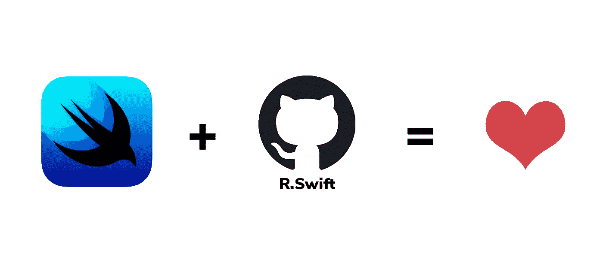

# 为 SwiftUI 获取强类型、自动完成的资源

> 原文：<https://betterprogramming.pub/get-strong-typed-autocompleted-resources-for-the-new-swiftui-framework-3d8764d5e5a6>

## 与 r .斯威夫特；不再有应用崩溃，不再有属性猜测

在 iOS 应用程序开发中使用资源的绝佳组合

# **1。什么是 R.swift？**

R.swift 是由 Mathijs kadi JK[创建的开源项目，它使开发人员能够在 swift 项目中获得强类型、自动完成的资源，如图像、字体和序列。](https://github.com/mac-cain13)

GitHub 上的 7k+ stars 证明了使用 R.swift 的好处，因为它创建的代码使用了以下资源:

*   完全类型化——减少了对方法返回内容的强制转换和猜测。
*   编译时检查-不再有错误的字符串，使您的应用程序在运行时崩溃。
*   自动完成—再也不用猜图像名称了。

这有助于改变这些线条:

变成这几行:

然而，由于 R.swift 还不支持 SwiftUI，所以是时候让我们编写一些有趣的代码来扩展这个库了。

# 2.如何将当前版本的 R.swift 扩展到 SwiftUI？

SwiftUI 是在 2019 年 WWDC 奥运会上推出的强大框架。它让我们在每个苹果平台上以声明的方式设计应用。

在 SwiftUI 中，我们有一个需要手动输入的组件列表。例如:

看着眼熟？是的，它是！我们可以扩展 R.swift，使我们的代码更安全、更好。这个怎么样？

如果您在 swift 项目中尝试过 R.swift，您将会看到由库生成的`R.generated.swift`文件。让我们深入了解一下。

现在很清楚，我们需要扩展这些对，`ImageResource`和`Image`，`FontResource`和`Font`，以及`ColorResource`和`Color`。

图像和图像资源扩展

颜色和颜色资源扩展

字体和字体资源扩展

就是这样！我们不需要为我们的资源记住任何名字。它还帮助我们避免潜在的打字错误，以便我们可以专注于使用 SwiftUI 构建漂亮的 iOS 应用程序。

感谢阅读！