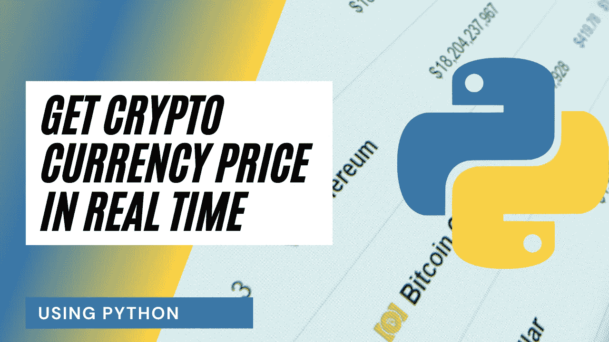
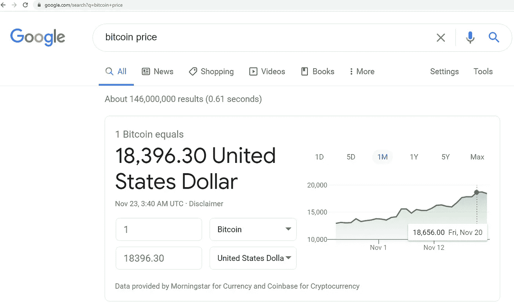
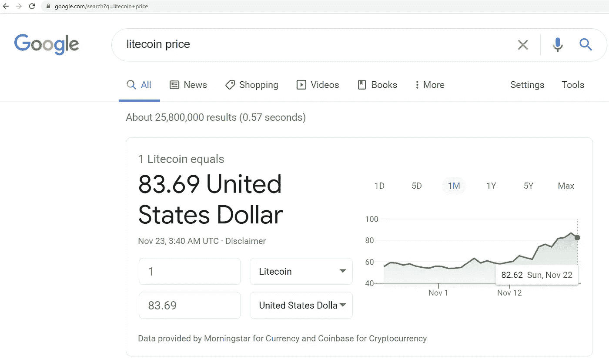
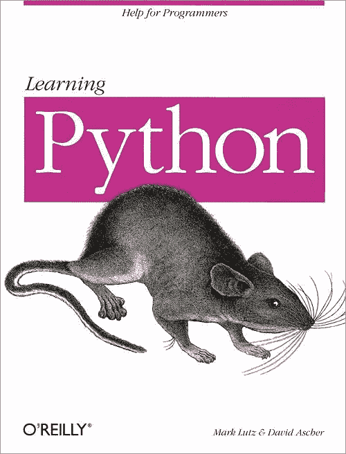
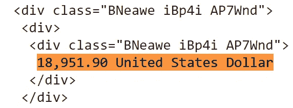
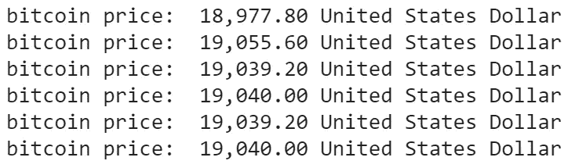

# 如何使用 Python 实时获取加密货币的价格

> 原文：<https://betterprogramming.pub/get-the-price-of-cryptocurrencies-in-real-time-using-python-cdaf07516479>

## 网络抓取获取各种加密货币的价格



作者照片。

*注意:本文仅供娱乐和教育之用。它不打算作为财务建议。*

在本文中，我将向您展示如何使用 Python 编程语言实时获取加密货币的价格。比特币、莱特币和以太币等加密货币是数字资产，旨在作为广泛分布的数据库上的交换媒介，不属于某个特定的个人或公司。

网上有许多免费的可用 API，您可以使用它们作为获取加密货币价格的替代方法，但在本文中我们不会使用这些免费 API。

# 在编写代码之前理解概念

首先，我需要在互联网上找到一个定期更新加密货币价格的网站。通过在谷歌上搜索，这很简单。当搜索“比特币价格”时，我得到的是价格和这个网址:【https://www.google.com/search?q=bitcoin+price】T2。



当搜索“莱特币价格”时，我得到莱特币的价格和这个网址:【https://www.google.com/search?q=litecoin+price】T5
。



我注意到两个 URL 之间唯一的区别是硬币名称(例如比特币和莱特币)。这意味着我可以简单地将硬币名称附加到 URL，它应该会产生加密货币的价格。所以，我将使用 Google 来实时获取加密货币的价格，并使用 Python 来抓取文本！

如果你更喜欢这篇文章的视频，你可以看看下面的视频。它详细介绍了本文中的所有内容，将有助于您轻松开始编程。或者两者都可以作为学习的辅助材料！

如果你有兴趣阅读更多关于 Python——许多公司和计算机科学部门使用的发展最快的编程语言之一——那么我推荐你看看马克·卢茨的书 [*学习 Python*](https://www.amazon.com/gp/product/1449355730) 。



图片来自[亚马逊](https://www.amazon.com/gp/product/1449355730)。

# 编程；编排

我想做的第一件事是在评论中创建一个程序描述:

```
#Description: This program gets the price of crypto currencies in real time
```

接下来，我将导入该程序所需的库:

```
#Import the libraries 
from bs4 import BeautifulSoup 
import requests 
import time
```

现在，我想创建一个函数来获取加密货币的价格。该函数将接受一个加密货币名称，并返回该硬币的价格。

为了让这个函数正常工作，我需要获取硬币(加密货币名称)并将其附加到 URL。然后我需要向网站发出请求来获取数据。接下来，我需要使用 HTML 解析器解析文本。最后但同样重要的是，我需要找到并提取包含价格的文本并将其返回。

*注意:文本/加密货币价格位于两个* `*<div>*` *标签下。这两个标签都有一个等于* `*BNeawe iBp4i AP7Wnd*` *的类。这意味着我所要做的就是使用类找到那些* `*div*` *标签并提取文本。*



显示价格/文本位置的图像。

现在，我想创建一个 main 函数来持续显示我想要的任何加密货币的价格。我也希望这个程序只显示价格，如果它已经改变了。

所有这些都可以通过创建一个变量来保存最近的价格，并且只在该变量不同于当前价格时打印新的价格来轻松实现。

此外，我可以创建一个无限循环来不断获取加密货币的价格。将创建一个变量来保存加密货币名称，并将作为之前创建的获取当前价格的函数的输入。我会延迟三秒钟，这样我就有时间更新价格，这样我就不会对网站要求太高。

最后，我可以通过执行主函数来运行程序:

```
main()
```



该图显示了加密货币的更新价格。

感谢阅读这篇文章，我希望它对你们所有人都是有趣的！如果你喜欢这篇文章，并发现它很有帮助，请留下一些掌声，以示感谢。如果你还不是 Medium 的[会员，那么考虑成为会员吧，如果不是为了我的文章，也是为了这个网站上所有其他了不起的文章&作者。使用此处](https://randerson112358.medium.com/membership)的链接[可以轻松成为 Medium 的会员。继续学习，如果你喜欢金融、计算机科学或编程，请访问并订阅我的](https://randerson112358.medium.com/membership) [YouTube](https://www.youtube.com/channel/UCaV_0qp2NZd319K4_K8Z5SQ) 频道([randers 112358](https://www.youtube.com/channel/UCaV_0qp2NZd319K4_K8Z5SQ)&[计算机科学](https://www.youtube.com/channel/UCbmb5IoBtHZTpYZCDBOC1CA))。

如果你想开始一个投资组合，那么使用这个[链接](https://act.webull.com/kol-us/share.html?hl=en&inviteCode=LR6VIpFiAkPe)与 [WeBull](https://act.webull.com/kol-us/share.html?hl=en&inviteCode=LR6VIpFiAkPe) 注册，存款 100 美元或更多，就可以额外获得价值高达 1600 美元的两只免费股票！这是免费的股票，你可以出售，玩或创建自己的交易策略。