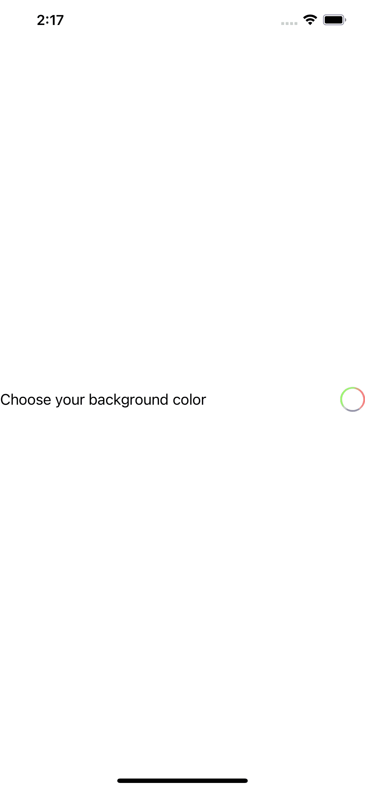
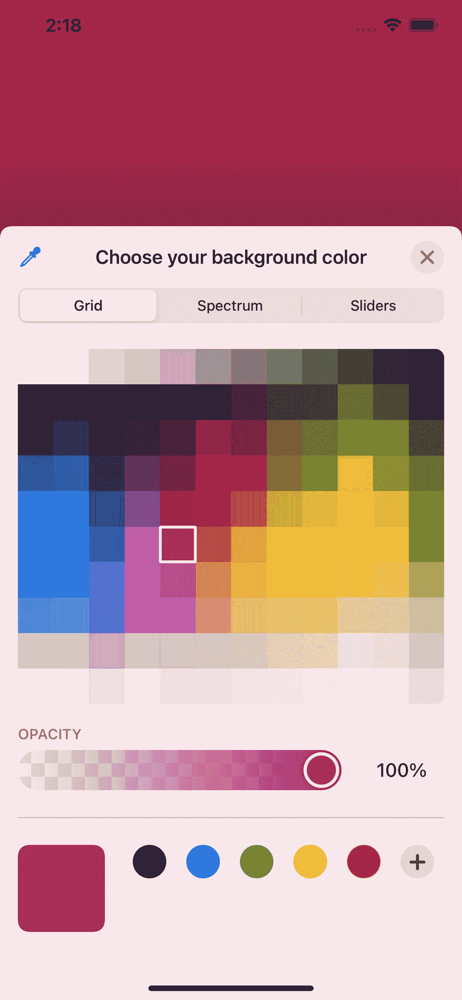
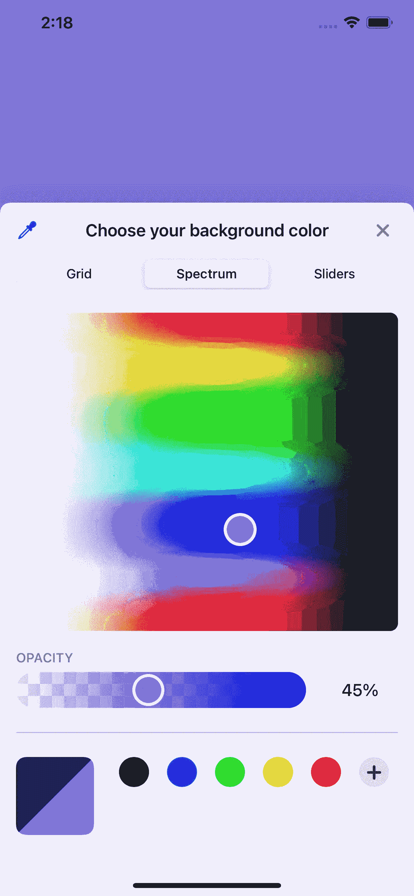
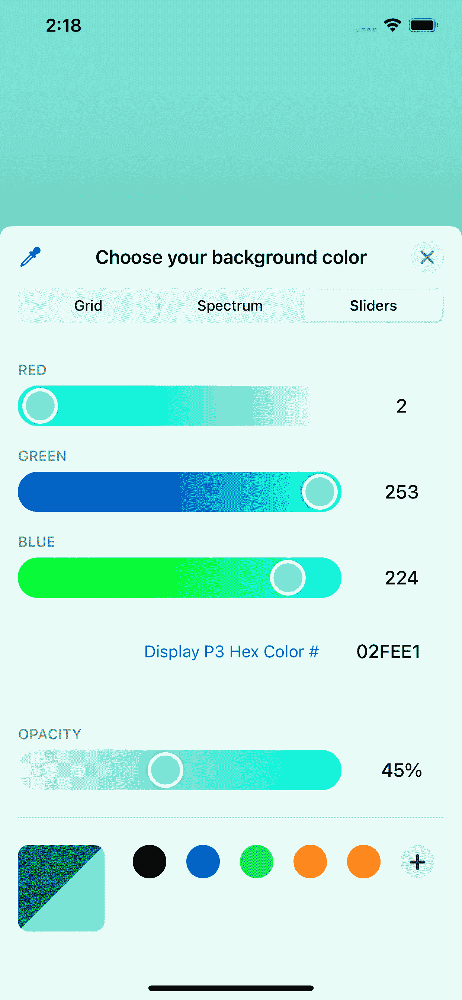
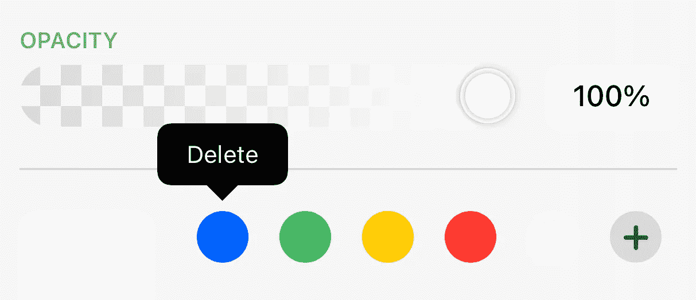
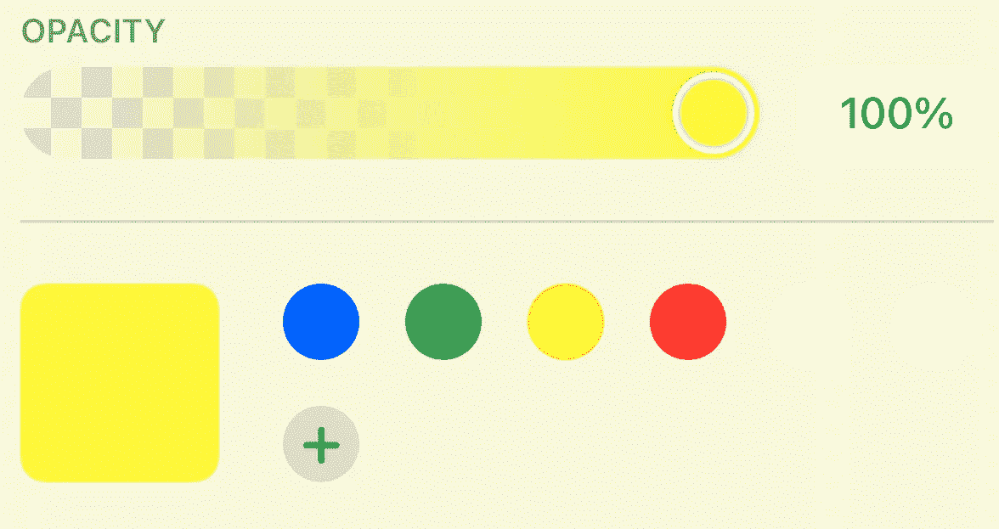
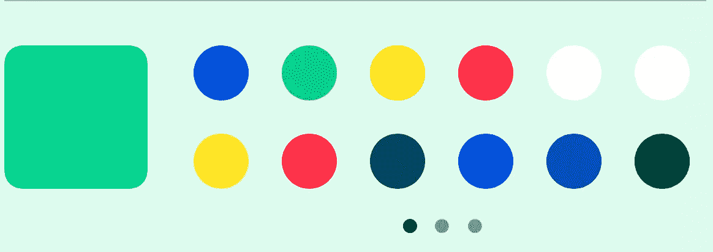
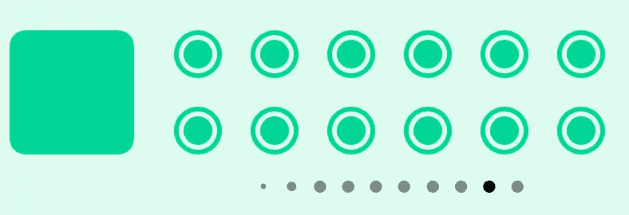

# 了解 SwiftUI 2 的颜色选择器

> 原文：<https://betterprogramming.pub/get-to-know-swiftui-2s-colorpicker-f51eee66e48e>

## 让您的用户能够以全新的方式在您的应用程序中设置颜色


罗伯特·卡茨基在 [Unsplash](https://unsplash.com?utm_source=medium&utm_medium=referral) 上拍摄的照片

在最近的 WWDC 2020 中，苹果推出了`ColorPicker`，你可以让用户选择一种颜色。

如果你的应用程序允许用户为文本、背景等选择颜色，这可能会非常有用。除此之外，我仍然想不出你为什么需要实现这个。

## 先决条件

要学习本教程，您需要了解以下方面的一些基本知识:

*   对 Swift 的基本熟悉
*   至少 Xcode 12+
*   仅支持 iOS 14+

# ColorPicker 入门

首先，您需要创建一个`State`,在这里您可以存储所选颜色的值。

```
@State private var backgroundColor = Color.white
```

基本上，整个计划就是将背景颜色改为用户选择的颜色。当`ColorPicker`第一次发布时，有一个常见的 bug，当颜色选择器屏幕出现时，用户不能忽略它。现在看一下，似乎苹果已经修复了这个 bug。

接下来，将`ColorPicker`嵌入`VStack`中。

```
VStack {
    ColorPicker("Choose your background color", selection: $backgroundColor)
}
.frame(maxWidth: .infinity, maxHeight: .infinity)
.background(backgroundColor.edgesIgnoringSafeArea(.all))
```

默认情况下，背景颜色将是白色，如上所述。使用`.edgesIgnoringSafeArea(.all)`，背景颜色将显示在安全区域。您的屏幕应该如下所示:



光是点击`ColorPicker`就有这么多功能，你会很快爱上它。其中一些是:

## 格子

使用 Grid，您可以选择已经预设的颜色。通过点击颜色，你的背景颜色瞬间改变。不透明度甚至可以调整。最后，你可以点击加号按钮保存你喜欢的颜色。



如果你不知道选择什么颜色，想根据屏幕选择一种颜色，你可以试着点击左上角的图标。这样，你就有了一个放大镜，用它你可以找到你想要的颜色。一旦你的放大镜落在一种颜色上，颜色就会立即改变。


## 范围

接下来是光谱，你可以在颜色周围拖动光标。像往常一样，你可以设置不透明度，并用加号图标保存你的颜色。



## 滑块

最后，滑块允许你玩 RGB 值，甚至十六进制颜色。和往常一样，你甚至可以调整不透明度和保存颜色。



默认情况下，它已经保存了五种不同的颜色。要删除颜色，您可以按住颜色直到出现删除按钮。



令人惊讶的是，你可以有多种相同的颜色，在这种情况下，是两种白色。



当你有超过 12 种颜色时，它会创建一个额外的页面，你可以滑动以访问更多的颜色。



如果寻呼指示器超过 10 个，最左边或最右边的寻呼指示器将变小。此时，大约有 14 页，每页 12 种颜色，加起来节省了 168 种颜色。

