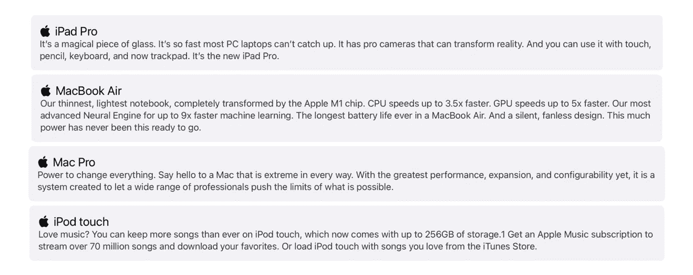
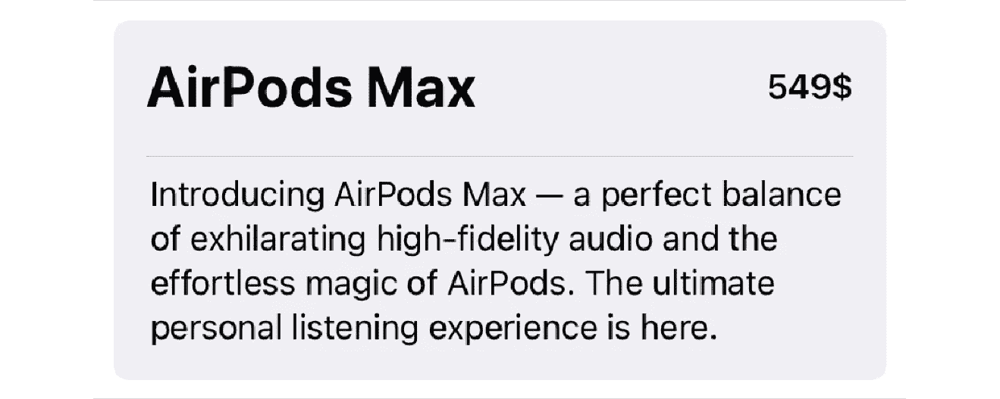
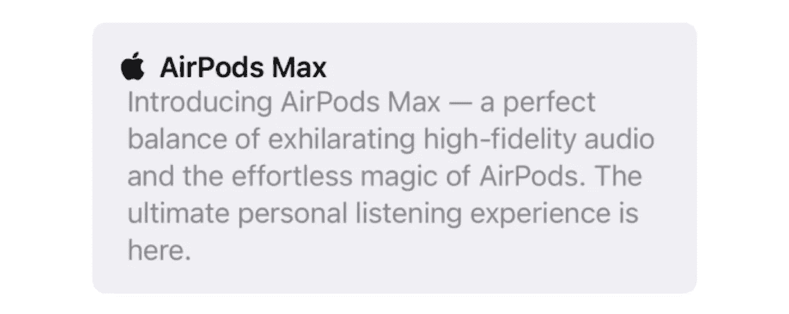
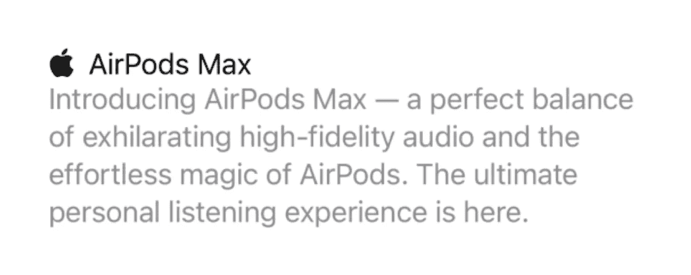
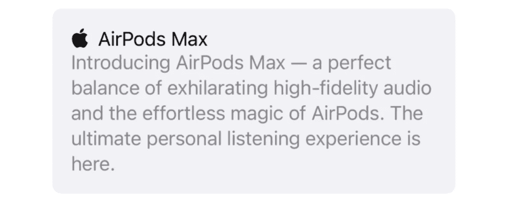

# 了解 SwiftUI 的 GroupBox

> 原文：<https://betterprogramming.pub/get-to-know-swiftuis-groupbox-c33ee71ff895>

## GroupBox 是 SwiftUI 2 中的新功能


作者照片。

包含在 SwiftUI 2.0 中的`GroupBox`元素是一个新元素，目前只包含少数几个特性。尽管如此，这还是很酷。事实上，`GroupBox`元素看起来非常类似于`List`元素。当您将一个`List`元素的样式设为`InsetGroupedListStyle`时，其中的元素将被包含在一个盒子中。当您将元素添加到`GroupBox`元素中时，这些元素将以同样的方式进入一个框中。他们甚至看起来几乎一样。

在本文中，我们将学习什么是`GroupBox`元素以及如何使用它。

# 什么是 GroupBox？

让我们来了解一下`GroupBox`直接来自苹果的是什么:

> "带有可选标签的风格化视图，该标签与内容的逻辑分组相关联."— [苹果开发者](https://developer.apple.com/documentation/swiftui/groupbox)

也许一个`GroupBox`元素唯一做的事情就是将 UI 元素存储在一个盒子里。当然，因为我们可以按照自己的意愿来样式化`GroupBox`元素，所以我们可以按照自己的意愿来改变这些 UI 元素的外观。

例如，可以用`GroupBox`制作类似苹果的表格视图单元格:



在接下来的章节中，我们将探索如何使用`GroupBox`来创建这样的界面元素。

# 基础

我们可以说`GroupBoxes`分为两种。第一种是完全独立的`GroupBox`。比如 UI 元素按照你的意愿分散在一个盒子里。这就是我们如何编写该类型的 GroupBox 实例:

```
**struct** ContentView: View { // MARK: - UI Elements
    **var** body: **some** View {
        GroupBox {
            VStack {
                HStack {
                    Text("AirPods Max")
                        .font(.title)
                        .bold()

                    Spacer()

                    Text("549$")
                        .font(.headline)
                }

                Divider()

                Text("Introducing AirPods Max — a perfect balance of exhilarating high-fidelity audio and the effortless magic of AirPods. The ultimate personal listening experience is here.")
            }
        }
        .padding()
    }
}
```



第二种`GroupBox`类型是带有标签的风格化视图，该标签与内容的逻辑分组相关联。iOS 的默认样式是一张简单的卡片，上面有标题和内容。我们可以用下面的代码制作这样一个`GroupBox`元素:

```
GroupBox(
    label:
        Label("AirPods Max", systemImage: "applelogo")
            .foregroundColor(.black)
    ) {
        Text("Introducing AirPods Max — a perfect balance of exhilarating high-fidelity audio and the effortless magic of AirPods. The ultimate personal listening experience is here.")
            .foregroundColor(.secondary)
}
.padding()
```



如您所见，与第一个元素相比，我们通过编写非常少的代码创建了第二个元素。而且这个元素的设计语言就像苹果的设计语言。

目前，`GroupBox`元素只能在 iOS、iPadOS 和 macOS 平台上的应用程序中使用。所以你不能在 watchOS 和 tvOS 应用中使用这个元素。

现在让我们看看如何给一个`GroupBox`元素添加新的样式，并创建更复杂的`GroupBox`元素。我们也可以通过创建新的`GroupBox`样式来改变默认`GroupBox`元素中我们不想要的部分。例如，如果上面的`Text`元素中的文本只有一行，那么该文本将居中而不是前导。

# 式样

SwiftUI 为我们提供了`GroupBoxStyle`协议，允许我们完全改变任何`GroupBox`实例的外观。由于这个协议，我们可以为任何我们需要的用例创建不同的风格。例如，我不需要背景、圆角半径，我想改变`Label`之外的元素的对齐方式。为此，我可以编写一个如下所示的样式:

```
**struct** ListGroupBoxStyle: GroupBoxStyle {
    **func** makeBody(configuration: Configuration) -> **some** View {
        VStack(alignment: .leading) {
            configuration.label
            configuration.content
        }
    }
}
```

创建自己的`GroupBox`风格所需要做的就是创建一个符合`GroupBoxStyle`协议的结构。您必须创建一个接受`Configuration`类型的实例并返回新视图的`makeBody`函数。

configuration 元素允许您通过将`GroupBox`元素分成两部分来以任何方式管理`GroupBox`元素:`label`和`content`。你明白这两个元素代表什么。我在这里使用`VStack`的原因是为了确保所有元素都是前导对齐的。

我们可以在我们的`GroupBox`元素中使用这种样式，如下所示:

```
**struct** ContentView: View {
    **var** body: some View {
        GroupBox(
            label:
                Label("AirPods Max", systemImage: "applelogo")
                    .foregroundColor(.black)
        ) {
            Text("Introducing AirPods Max — a perfect balance of exhilarating high-fidelity audio and the effortless magic of AirPods. The ultimate personal listening experience is here.")
                .foregroundColor(.secondary)
        }
        .groupBoxStyle(ListGroupBoxStyle())
        .padding()
    }
}
```

如你所见，我们使用`groupBoxStyle`修饰符来使用`ListGroupBoxStyle`。SwiftUI 将使用环境在视图层次结构的所有子视图间共享它。你可以在下面看到我们的元素可以改变多少:



最后，让我们创建一个`GroupBoxStyle`结构来解决`GroupBox`元素的对齐问题。为此，稍微改变一下`ListGroupBoxStyle`结构就足够了:

```
**struct** CardGroupBoxStyle: GroupBoxStyle {
    **func** makeBody(configuration: Configuration) -> **some** View {
        VStack(alignment: .leading) {
            configuration.label
            configuration.content
        }
        .padding()
        .background(Color(.systemGroupedBackground))
        .clipShape(RoundedRectangle(cornerRadius: 8, style: .continuous))
    }
}
```

我只是额外使用了`background`和`clipShape`方法。方法允许我们改变元素的背景颜色。方法允许我们改变元素的形状。



如您所见，我们的元素看起来像一个真正的`GroupBox`元素。当然这个元素有更好的对齐性。

# 结论

在过去，我通常会尝试将自己应用程序的表格视图单元格作为`GroupBox`元素。现在我可以用`GroupBox`写更少的代码来做同样的工作。这真的很好。希望在 SwiftUI 3.0 中，`GroupBox`会有进一步的改进。

我希望你现在理解了`GroupBox`元素。如果你有任何问题，请在下面的评论中提问。

```
**My Other Articles** -[Build a TextField for Numbers in SwiftUI](/build-a-textfield-for-numbers-in-swiftui-21030b58a41)
- [Programmers Should Learn How to Learn](/programmers-should-learn-how-to-learn-51800061ae12)
- [Getting Started With the FileManager in Your iOS App](/getting-started-with-the-filemanager-in-your-ios-app-acd81b171f7d)
```

如果你想见我或有关于 iOS 开发等问题。你可以在这里和我进行一对一的会谈[。](https://superpeer.com/canbalkya)