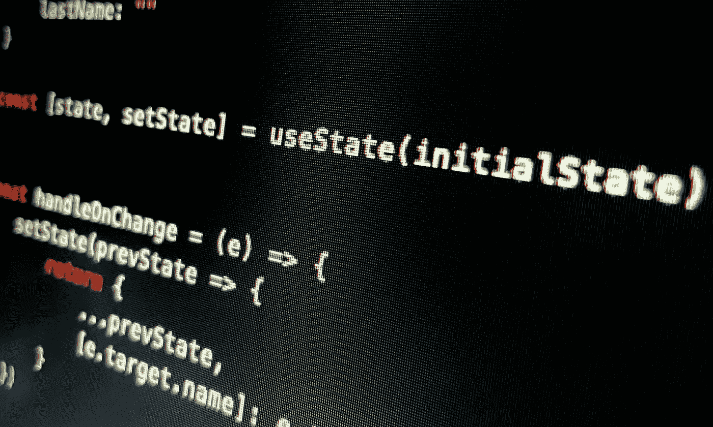
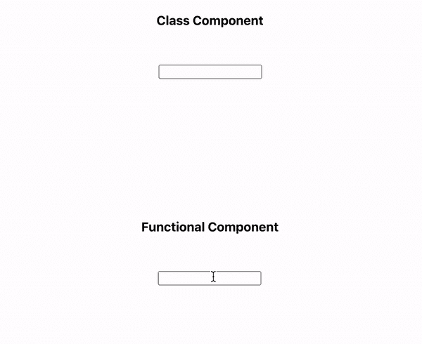
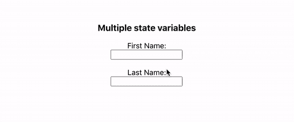

# 了解 React.js 中的 UseState 钩子

> 原文：<https://betterprogramming.pub/get-to-know-the-usestate-hook-in-react-js-d87797cb5a7>

## 因为功能组件很牛逼



作者照片。

今天，我们来看看 React 中的`useState`钩子。本文将是 React Hooks 系列文章的第一部分。本文中使用的演示回购的链接可以在下面找到:

[](https://github.com/jonathanbrierre/hooks-demo) [## jonathanbrierre/hooks-演示

### 下面的应用程序是我用 React Hooks 创建的博客系列的演示。您可以找到相关的…

github.com](https://github.com/jonathanbrierre/hooks-demo) 

# **假设**

*   您了解 React 中的基本状态功能。
*   您了解基本的 JavaScript 事件处理。
*   你了解基本的函数式编程。

# 我们开始吧！

下面是两个受控输入字段之间的比较。一个是使用类状态，另一个是使用带有`useState`钩子的函数状态。



如果您不熟悉如何在 React 中控制输入字段，或者为什么控制它们是必要的，请随意查看我以前的文章[关于构建一个简单的受控表单。](https://levelup.gitconnected.com/building-a-simple-controlled-form-in-react-js-b7e28236bf2e)

当我们查看类组件时，您可以看到它非常简单:

在我们的`render`方法中，我们有控制输入字段的`name`状态。

现在让我们看看我们的功能组件:

正如你所看到的，我们的状态现在使用`useState`钩子减少到一行。让我们把这个再拆开一些！

```
const [name, setName] = useState("")
```

当我们调用`useState`函数时，它会把我们的初始状态值作为参数。在这种情况下，我们的默认参数是一个空字符串。

然后这个函数返回一个包含组件状态和状态设置函数的数组。我们通过析构被调用的`useState`钩子的返回值来访问状态和状态设置器。在这种情况下，当我们进行析构时，我们将返回值命名为`name`和`setName`。如果您不熟悉 JavaScript 中的析构，请查看下面的文档！

[](https://developer.mozilla.org/en-US/docs/Web/JavaScript/Reference/Operators/Destructuring_assignment) [## 解构分配

### 析构赋值语法是一个 JavaScript 表达式，它使得从数组中解包值成为可能，或者…

developer.mozilla.org](https://developer.mozilla.org/en-US/docs/Web/JavaScript/Reference/Operators/Destructuring_assignment) 

当我们控制表单时，设置新值可以像将新的状态值传递给我们的 setter 函数一样简单:

```
const handleOnChange = (e) => {
  setName(e.target.value) // the setter function defined from hook
 }
```

就这样，我们的形式被控制了！

# **多个状态值**

如果我们想用`useState`控制多个值怎么办？

用一个类组件这样做很简单，只需添加更多的状态变量，并确保所需的输入字段连接到它们。

我们能对`useState`做同样的事情吗？是的，我们可以！

下面是一个新组件，它有两个由单个`useState`钩子控制的输入字段:



让我们看看代码，看看这是如何工作的:

## **创建我们的状态**

在这种情况下，由于我们想要一个单独的`useState`钩子来管理状态变量，我们将像在类组件中那样定义我们的状态——用一个组件范围的`initialState`变量引用一个对象。我们将把我们的`initialState`对象作为初始值传递给我们的`useState`钩子。记住，我们传递给钩子的值成为析构钩子调用的第一个返回值。这包括对象。

当我们想要引用状态中的不同变量时，我们会调用`state.firstName`或`state.lastName`。在我们的输入字段中定义`value`属性时，您可以看到这种情况发生:

```
<input type="text" value={state.firstName} onChange={handleOnChange} name="firstName"/><input type="text" value={state.lastName} onChange={handleOnChange} name="lastName"/>
```

## **改变我们的状态**

下一部分是用一个函数动态改变状态的小技巧。如果您阅读了我关于受控表单的文章，您会发现这个功能与我为类组件实现的功能非常相似:

钩子的 setter 方法可以接受一个回调作为参数。这个回调接收的参数是对期望的更改发生之前的状态(在本例中为`prevState`)的引用。

为了不改变状态，我们将返回一个新对象，它将成为我们的新状态。在这个新的状态对象中，我们将在`previousState`对象上使用 JavaScript 的 ES2015 `…` spread 操作符。通过这样做，我们可以保存不受期望的状态变化影响的值。我们可以根据作为参数传递给`onChange`事件处理程序中的`handleOnChange`回调的事件对象来更改我们想要的值。如果您想了解关于 spread 操作符的更多信息，可以查看下面的文档:

[](https://developer.mozilla.org/en-US/docs/Web/JavaScript/Reference/Operators/Spread_syntax) [## 扩展语法(...)

### 扩展语法(...)允许诸如数组表达式或字符串的可迭代对象在零或…

developer.mozilla.org](https://developer.mozilla.org/en-US/docs/Web/JavaScript/Reference/Operators/Spread_syntax) 

# **结论**

`useState`钩子是管理功能组件状态的一种简洁而通用的方法。如果你想看看我用来创建这个演示的回购，请查看以下内容:

[](https://github.com/jonathanbrierre/hooks-demo) [## jonathanbrierre/hooks-演示

### 下面的应用程序是我用 React Hooks 创建的博客系列的演示。您可以找到相关的…

github.com](https://github.com/jonathanbrierre/hooks-demo) [](https://reactjs.org/docs/hooks-state.html) [## 使用状态钩子-反应

### 钩子是 React 16.8 中的新增功能。它们允许您使用状态和其他 React 特性，而无需编写类。的…

reactjs.org](https://reactjs.org/docs/hooks-state.html) 

编码快乐！