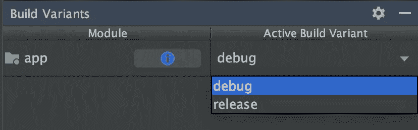
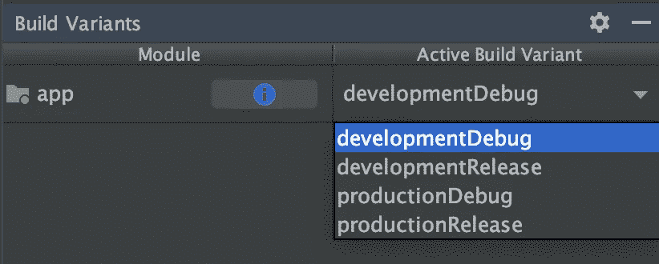
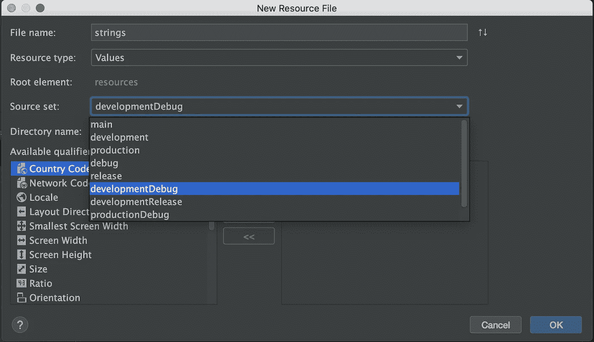
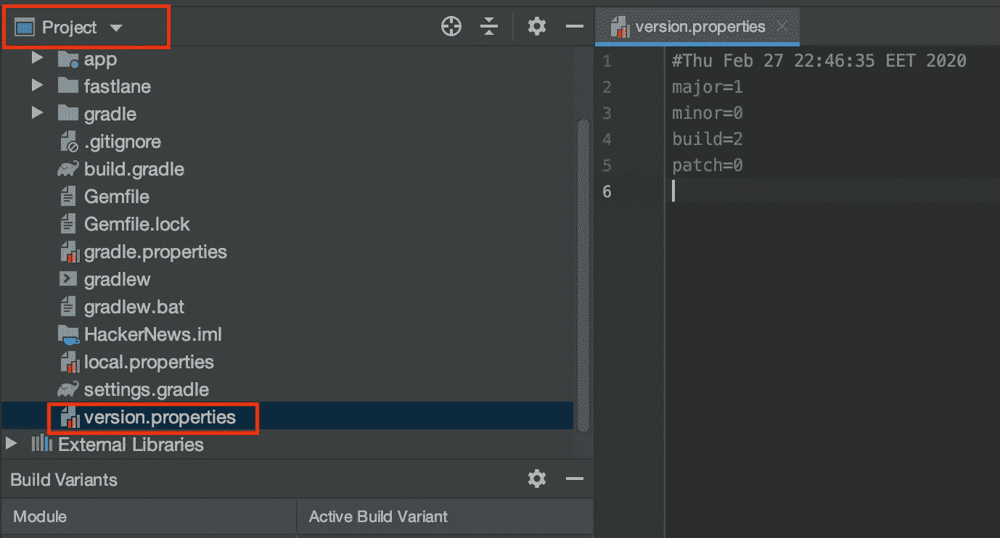

# 让您的 Android 项目走上快车道

> 原文：<https://betterprogramming.pub/get-your-android-project-on-the-fastlane-279bc88f8d8c>

## 自动化耗时的 Android 任务，如构建和分发应用程序


罗伯特·都德在 [Unsplash](https://unsplash.com?utm_source=medium&utm_medium=referral) 上的照片

顾名思义，这篇文章是关于用 fastlane 自动化你的 Android 开发工作流程的。

你可能会想，“但是，嗯，自动化是通用的，几乎适用于你能想到的任何东西，尤其是在构建软件的时候。所以你能更准确一点吗？”

嗯，我实际上指的是以下几点:

*   使用构建变体来指示您的应用程序是运行在测试端点上还是生产端点上
*   为每个变体分配一个签名配置
*   使用版本控制方案和工具自动执行版本控制
*   使用 fastlane 运行测试；通过 Firebase 应用程序分发来构建和分发我们的应用程序

不幸的是，最后一部分将只对 Mac OS 和 Unix 用户可用，因为 fastlane 还不正式支持 Windows OS。

# 构建变体

构建变体是 Android 的一个强大特性，它允许我们为我们的构建拥有不同的配置。构建变体由构建类型和风格组合而成。我建议你多读一些关于[构建变体](https://developer.android.com/studio/build/build-variants)的文章，如果你还没有的话。

我使用 Android 的经验告诉我，对于一个简化的开发环境，除非企业另有规定，否则至少需要四个版本——例如，高级和免费应用程序版本。我们要实现的构建变体如下:

*   为了我们的日常发展
*   `productionDebug`:在极端(或不那么极端)的情况下，我们需要用生产数据检查一个 bug
*   `developmentRelease`:该变种将通过 Firebase Crashlytics 分发给我们的 QA 团队。它将是我们 Play Store 版本的复制品——除了它将使用我们的测试服务器。
*   `productionRelease`:播放商店版本

此外，每个构建版本都有自己独特的`applicationId`，这意味着您可以将所有四个构建版本作为不同的应用程序同时安装在您的设备上。为了识别哪个是哪个，我将向您展示如何更改它们的名称，这也可以应用于拥有不同的启动器图标。

## 构建类型

当我们创建一个新的 Android 项目时，我们默认得到两种构建类型，`debug` 和`release` *。*如果你检查你的 app 模块的`build.grade`，调试被省略。

默认生成类型

但是如果您检查可以在 View > Tool Windows 下找到的构建变体，并选择 Active Build Variant 下拉菜单，您将会看到两个变体。Android 默认提供`debug`构建类型。



默认构建变体

我喜欢冗长，所以首先，我们将在 Gradle 文件中显式定义`debug`构建类型。您的文件应该如下所示:

在第 4 行，我们还提供了一个`applicationIdSuffix`。因此，我们的`debug`构建将以`.debug`为后缀，这意味着如果我们的应用程序 ID 是`com.example.myapp`，那么调试构建将是 `com.example.myapp.debug`。

## 构建风味

构建风格是构建类型的(可选)兄弟。我们将使用两种风格来反映我们的服务器:`development`和`production`。所以回到你的应用程序的构建 Gradle，在我们之前添加的`buildTypes`块之前添加以下内容(顺序在这里很重要)。

产品风味

在第 1 行，我们定义了一个新的维度，`server`，它被用作我们的`development`和`production`风格的维度。我们还为口味定义了`applicationIdSuffix`。

接下来，执行 Gradle sync，并再次检查构建变体。您应该看到这样的内容:



构建变体

## **应用名称**

既然我们已经有了构建变体集，如果我们为每个变体取一个稍微不同的名字会更方便。所以继续添加三个新的字符串资源文件(右键单击> New > Android Resource File)，每个文件对应一个额外的变体。我们将使用我们的`productionRelease`变体的主源集。在显示的对话框中，从源集合下拉列表中选择变体，如下所示:



该操作将创建适当的源集合，并将新创建的`strings.xml`添加到每个源集合中。

# 签名配置

在构建和发布阶段之前，让我们的签名自动化也很重要。为此，我们将使用属性文件来保存关于密钥库文件路径、密钥库密码、密钥别名和密钥密码的信息。该文件的格式如下。

**警告:**不要在你的 Git 中添加这些文件，尤其是如果你决定保留你的 Play Store 证书的话。

我们只需要签署我们的`releaseDevelopment`变体，它将通过 Firebase 应用程序分发交付给我们的测试团队。现在类似于版本控制部分，我们需要一个函数来解析这些文件中的签名属性。

解析签名属性

为了使用这个，我们需要定义一个新的签名配置。仍然在您的 Gradle 文件中，在 Android 块内，添加下面的`signingConfigs`块。

签名配置

最后，用以下内容更新发布版本类型:

带签名配置的发布开发

在第 4 行，我们显式地设置了用于`developmentRelease`变体的 Frebase 签名配置。

# 版本控制

Android 版本控制非常简单，但它根本不是自动化的。为了更新您的`versionCode`和`versionName`，您必须编辑您的应用程序的`build.gradle`并设置所需的值。事实上，这项任务必须由人一次又一次地完成，这使得它很容易出错。对于这个例子来说，版本名称的版本化方案是`major.minor.patch`,版本代码的版本号是递增的。

打开您的构建 Gradle 文件，并在 dependencies 块下添加以下函数:

阅读版本

简而言之，`readVersion`将尝试打开位于根目录中的`version.properties`文件，并读取其中的主要、次要、修复和代码属性。如果文件不存在或者属性不存在，则默认为 major=1，minor=0，patch=0，code=1。`readVersion`的结果用于`readVersionName`和`readVersionCode`。

现在继续更新您的`versionCode`和`versionName`属性。在默认配置中，替换它们的值以匹配以下内容:

默认配置

好了，到目前为止，我们可以从版本属性中读取我们的版本名称和代码，但是为了自动更新它，我们需要能够编写。还添加了以下功能:

增加构建版本和分级任务

这里提供的代码声明了一个函数`incrementBuildVersion`，给定一个参数，它将增加适当的属性并保存到我们的文件中。此外，我们将这个函数封装成四个不同的任务，这样我们就可以通过终端来使用它。

打开一个终端并键入`./gradlew doBuildNumberIncrement`将会触发后面的任务运行，而后者又会调用`incrementBuildVersion`。切换到项目视图，您将看到新创建的文件。



版本属性

# 测试、构建和分发

## 快车道

fastlane 是一个开源的自动化工具，正如其网站上所说，“处理繁琐的任务，这样你就不用做了。”由于它最初是为 iOS 和 Mac OS 应用程序中的几个任务的自动化而开发的，fastlane 附带了 Android 的基本功能。作为补偿，它的 API 是开放的，你可以写自己的代码。

安装 fastlane 有几种方法，我会选择通用的方法。fastlane 是一块宝石(这意味着它是用 Ruby 编写的，因此 Ruby 是您唯一的依赖)。所以打开一个终端键入`sudo gem install fastlane -NV`，然后回车。要检查您的安装是否一切正常，键入`fastlane — version`，您应该会看到可执行文件的路径和版本。

最后，我们需要为我们的项目初始化快车道。为此，你所要做的就是`cd to/your/project/directory`，键入`fastlane init`，然后按回车键。快车道会问你一些问题，你不妨全部跳过。我们会写自己的球道。

## Firebase 应用程序分发

但是在写我们自己的球道之前，还有一件事。实际上是两个。第一个是 Firebase CLI，可以通过键入`curl -sL [https://firebase.tools](https://firebase.tools) | bash`并将其输入到您的终端来安装。

接下来，我们需要安装 Firebase 插件，因此移动到您的项目目录并键入`fastlane add_plugin firebase_app_distribution`，然后点击 enter。

仍然在您的终端中，键入`firebase login`。它将打开您的默认浏览器，并要求您登录您的帐户。我们快到了。

除了登录之外，您必须在 Firebase 控制台中设置一个项目和您的应用程序。如果你还没有，现在是一个好时机。在分发步骤中，我们需要这个应用 ID。

对于 CI/CD 构建，您应该使用`firebase login:ci`，它将返回一个刷新令牌，您可以稍后在`firebase_app_distribution action`中使用它。

## **测试、构建和分发**

终于，我们到了。让我们写我们的车道，分发我们的应用程序。打开您的快速文件，并替换其内容以匹配以下内容:

快速文件

现在让我解释一下我们创造的东西。首先在项目目录中打开一个终端，然后键入`fastlane lanes`。您应该会看到如下所示的内容:

```
--------- android---------
----- **fastlane android test**
Runs all the tests----- fastlane android firebase
Submit a new build to firebase app distribution
Usage:
**fastlane firebase**
Params:
versionChange:"minor|major|patch" to explicitly increase version
notes:"Release notes about the build"
branch:"branch_name" If specified will commit version.properties file and push it to track remote branch
```

我强调了我们感兴趣的两个部分。这是我们的两条路线——第一条是我们运行测试的路线。如果我们键入`fastlane test`，我们将看到我们的应用程序正在构建，我们的测试将最终运行。

如果我们的测试执行没有任何错误，我们得到一个`fastlane.tools finished successfully 🎉`消息，我们就可以开始了。在极少数情况下，我们的测试失败了，除了许多其他日志之外，我们得到一个很好的输出来指示失败的测试，如下所示。

```
com.max.hackernews.ExampleUnitTest > addition_isCorrect FAILED
    java.lang.AssertionError at ExampleUnitTest.kt:151 test completed, 1 failed
```

后一个领域，Firebase，是另一个故事。一步一步地分解，我们注意到，在第一步，我们通过使用我们在版本控制部分定义的任务，在第 37-45 行增加了构建号。如果为`versionName` param 提供了 minor、major 或 patch 值中的任何一个，那么版本化方案的等效部分将会改变。

在版本更新之后，第 47-51 行包含构建步骤。在这里，我们指定构建类型和将要构建的风格，并调用 assemble 任务。输出的`.apk`文件可以在`app/build/outputs/development/release`目录下找到。

第 53 行负责我们的发布说明，关于将到达我们的 QA 团队的构建。如果指定了 notes 参数，这将是发行说明消息；否则，它会退回到我们最近的提交。

我们有我们的构建工件，我们有我们的发布说明——剩下的就是把它们全部上传到 Firebase。这就是我们在第 55-59 行所做的。

在通道的第一部分，我们增加了版本号；因此我们修改了`version.properties`。第 61–68 行，如果给定了分支名称，自动与远程分支同步。

# 摘要

尽管众所周知，拥有像 Jenkins 这样的 CI/CD 工具来运行这些任务是最理想的情况，但是在本地运行这个管道将会令人满意地完成工作。当您获得 CI/CD 基础结构时，您可以立即将它与这个管道结合起来。

当我们第一次在我目前工作的地方开始我们的开发团队时，几乎有五个月我们没有 Jenkins，fastlane 为我们节省了很多时间——它很容易设置，维护根本不是问题。