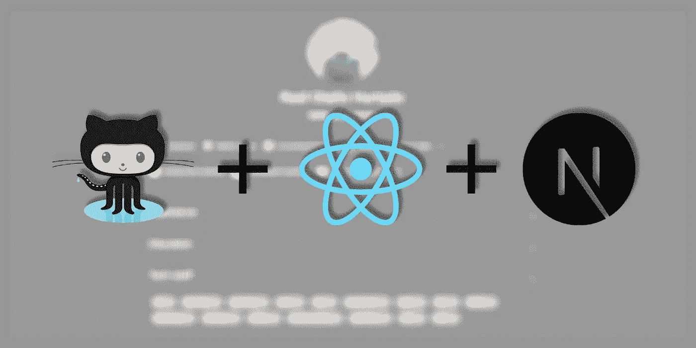
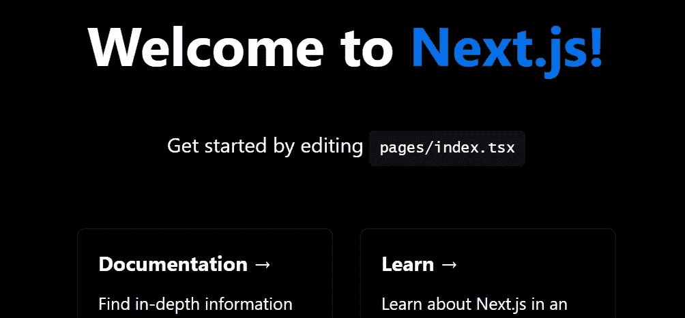

# 使用 React.js 免费建立你的个人网站

> 原文：<https://betterprogramming.pub/get-your-personal-website-for-free-create-it-with-reactjs-b7e3c3c874b4>

## 并把它放在 GitHub 页面上



在这篇文章中，我想告诉你如何免费创建你的个人网站！

为此，我们将使用 [GitHub Pages](https://pages.github.com/) ，这将为我们提供托管网站的机会，甚至会给我们一个安全的(HTTPS) URL。

可选地，我们甚至可以使用我们自己的域名，在这种情况下，这是你唯一需要支付的东西。

如题，我们想用 ReactJs 创建网站。

为什么？

嗯，你可以用一种更简单的方式创建它，按照 GitHub 页面的建议。你甚至可以得到一个带有模拟数据的网站模板，你可以改变它！

但是，作为一名对 ReactJs 有所了解的软件开发人员，我想创建一个定制的个人页面，我可以在将来更改它，使用我想要的 UI 控件和库，或者其他任何东西。也许这样做有点困难，但我认为这是定制化的代价。

最后，我使用了 [MaterialUI](https://mui.com/material-ui/) 和 [NextJs](https://nextjs.org/) 库。稍后我会解释原因。

# GitHub 页面


GitHub 页面

GitHub Pages 是 GitHub 免费提供给开发者的一项服务，用于创建个人或公司网站。你只需要一个 GitHub 用户，然后创建一个名为`<yourGithubUsername>.github.io`的 GitHub 资源库。之后，您提交并推送一个文件`index.html`到您的 repo，就这样。你将有你的网站工作(可能需要几分钟)。你可以在`https://<yourGitHubUsername>.github.io`查到。

由于我们可以呈现静态网页( [GitHub pages 建议](https://docs.github.com/en/pages/setting-up-a-github-pages-site-with-jekyll)使用 [Jekyll](https://jekyllrb.com/) 来生成您的站点)，我决定使用 [NextJs](https://nextjs.org/) 来创建我的 ReactJs 应用程序。Next.js 允许 ReactJs 服务器端呈现，但它也生成一个静态 web 应用程序，我们可以将它复制到 github.io repo 中并推送。

# 为什么是 Next.js？

我们可以使用 ReactJs 创建单页应用程序(spa)，它有一个路由库(react-routes)，我们可以使用它来创建多页和更复杂和完整的应用程序。问题是我们需要一个 Node.js 应用程序来托管它。这就是我们决定使用 NextJs 的原因。

Next.js 允许我们进行服务器端渲染，这只是在将网页发送到浏览器之前创建网页，然后添加 ReactJs 和其余的 javascript 代码。这在 SEO 方面非常有用。而且，NextJs 构建并导出一个静态网站，我们只需将其复制并粘贴到您的 GitHub 页面中，就可以了。

我创建个人网站的目标是在 react 中创建一个功能性和可定制的网站，但不是使用最纯粹的 react 最佳实践，如使用 redux、react-routes、从 API 端点获取数据或使用 GraphQL…这就是为什么我从静态文件中获取数据，并且我不关心单元测试等等。

# 让我们创建我们的 GitHub 页面库

如前所述，我们需要用这个模式`<yourGitHubUsername>.github.io`创建一个新项目，因此，在我的例子中，回购名称是`rulyotano.github.io`。之后，您可以将您的回购克隆到您的本地机器上，并创建一个包含一些内容的`index.html`文件。将更改推送到 GitHub 后，您应该会在`https://<yourGitHubUsername>.github.io`中看到一些东西，可能需要几秒钟。

在这一点上，知道你可以使用[化身](https://docs.github.com/en/pages/setting-up-a-github-pages-site-with-jekyll/about-github-pages-and-jekyll#about-jekyll)到[来生成你的网站](https://docs.github.com/en/pages/setting-up-a-github-pages-site-with-jekyll/creating-a-github-pages-site-with-jekyll)是有好处的。这是 GitHub 页面推荐的选项。他们这样描述它:

> Jekyll 是一个静态站点生成器，内置了对 GitHub 页面的支持和简化的构建过程。Jekyll 采用 Markdown 和 HTML 文件，并根据您选择的布局创建一个完整的静态网站。Jekyll 支持 Markdown 和 Liquid，这是一种在站点上加载动态内容的模板语言。

如果你不想使用 Jekyll，你可以创建自己的静态网站。这基本上就是我们在这里要做的事情。

这里另一个重要的事情是，你可以在你的网站上启用 HTTPS[，但是你也可以使用](https://docs.github.com/en/pages/getting-started-with-github-pages/securing-your-github-pages-site-with-https)[你的自定义域名](https://docs.github.com/en/pages/configuring-a-custom-domain-for-your-github-pages-site/about-custom-domains-and-github-pages)。我建议遵循指南，因为它们解释得很清楚。但是基本上，你需要去你的 GitHub 库- >设置标签- >页面(在代码和自动化部分下)。您可以在这里配置两者。此外，您可能需要添加一些记录到您的域提供商配置，并且，为了验证您拥有这个网站，您将需要包括一个 CNAME 文件在您的代码与您的域名为值。

# 让我们创建我们的网站项目和存储库

我们不需要为这个项目创建另一个存储库。我们可以直接更新我们的 GitHub Pages repo，但是由于我们要创建一个 Next.js + React.js 项目，所以需要构建并发布它，输出是我们可以复制到我们的 Pages repo 中的内容。如果我们不创建这个回购，我们以后就不能更新我们的网站，或者至少我们将不得不直接在输出中这样做，并且会失去 ReactJs 的好处。

首先，我们需要创建新的 GitHub 存储库，名称并不重要。我只是把它命名为 [mui-profile](https://github.com/rulyotano/mui-profile) (因为我用的是 Material-Ui)。之后，只需将其克隆到您的本地。

然后让我们创建 Next.js 应用程序。在继续之前，如果你想了解更多关于 NextJs 的信息，就来看看这个:[next . js 是什么？](https://nextjs.org/learn/foundations/about-nextjs/what-is-nextjs)，你也可以在这里找到([入门|下一个](https://nextjs.org/docs/getting-started))。js)启动和配置它的完整分步指南。

我们需要安装 node . js(12 . 22 . 0 或更高版本)，在我的例子中，我将使用`yarn`(您可以安装`yarn`作为另一个全局 npm 包)。正如指南所说，只需运行这个命令来创建它:`yarn create next-app --typescript`。我想使用 typescript，所以我添加了选项`--typescript`。安装完所有的依赖项后，您将拥有一个完整的、准备就绪的 NextJs 项目。

> **注意:**运行上面的命令后，NextJs 将把他的文件创建到另一个以你选择的项目名命名的目录中，这将增加一个额外的深度级别。我建议避免这种情况，并将所有文件和目录移动到根文件夹。

现在运行应用程序:

```
cd ./your-project-name
yarn dev
```

就是这样。如果你的端口 3000 是免费的，你应该能够在浏览器中打开 [http://localhost:3000](http://localhost:3000) 并看到你的全新应用。



HTTP://本地主机:3000

## 让我们定制我们的网站

现在我们已经准备好了 React.js 应用程序，现在就看你的了。如果你去`pages`目录，你会发现那里是定义页面的地方(目前只有索引)。

```
└───📁 pages/
    ├───📁 api/
    │   └───...
    ├───📄 index.tsx
    └───📄 _app.tsx
```

`_app.tsx`文件就像所有页面的父文件。您可以在这里包含所有页面的通用代码。它从基本上是子页面的道具接收一个`Component`。我用它来添加所有常见的东西，比如样式、标题等等。

从这里开始，我将只给你一些提示，基于我在用 Material-UI 定制我的网站时遇到的问题。

我们需要配置的第一件事是我们想要使用的库，以便在进行服务器渲染时能够正常工作。为此，我们可以使用[【自定义文档】](https://nextjs.org/docs/advanced-features/custom-document)，并在那里进行设置。在最新版本的 MUI [中，这里是](https://mui.com/material-ui/guides/server-rendering/)为了配置它我们需要做的事情。在我的例子中，我使用的是 MUI 4 . x 版本，但由于前端库运行速度很快，我现在看到的是 5.x 版本，它带来了一些突破性的变化。我的情况是这样的:

我的文档. tsx 文件

关键是我们在`.getInitialProps`函数内部做了什么。为了在生成 HTML 之前执行定制的 js 库，我们做了我们需要做的一切，这取决于您想要使用的库和版本。

我发现的另一个问题是 MUI javascript 和 ccs 与服务器端生成的 HTML 中已经存在的重叠。为了解决这个问题，我从 html 主体中删除了这些 javascript 文件。为此，我在`_app.tsx`文件中添加了以下挂钩:

```
React.useEffect(() => {
  const jssStyles = document.querySelector('#jss-server-side');
  if (jssStyles) {
    jssStyles.parentElement.removeChild(jssStyles);
  }
}, []);
```

## 有好几页

要拥有几个页面，你需要做几件事。首先，您需要将其添加到`pages`目录中。例如，如果您将`articles.tsx`添加到您的`pages`目录中，这将创建一条`/articles`路线。

此外，为了正确处理服务器端呈现，我需要在`next.config.js`文件的`exportPathMap`方法中添加一个条目:

```
exportPathMap: function () {
  return {
    '/': { page: '/' },
    '/articles': { page: '/articles' },   // <---- add this
  };
}
```

您可以添加更复杂的路线，例如动态路线。我推荐阅读 [NextJs 路由文档](https://nextjs.org/docs/routing/imperatively)。

## 来说说内容吧

我只是想避免在这个项目中使用数据库和 API 请求。这就是为什么我刚刚把它添加到一个`.json`文件中。你可以做你喜欢的事。

您可以将图像存储在`public/`目录中，然后添加一个本地引用到它们:`href="/img/yourimage.png"`或您的数据源中。

但在我的例子中，我只是做了一个我发现的使用`Google Photos`作为图像源的技巧。我喜欢它是因为:

1.  不要通过暴露存储库或 web 服务器来使它们过载。
2.  我可以很容易地请求我想要的大小的图像。

程序如下:

1.  创建 google 相册。
2.  通过创建公共链接来共享它。
3.  现在，您可以将想要从网站获取的图片添加到相册中。
4.  在匿名网络浏览器中打开您在步骤 2 中创建的相册链接。
5.  打开任何图像，右键单击并复制您可以在内容中使用的图像 URL。

现在，谷歌为我们做的有趣的部分来了。您可能会注意到图像 URL 以类似于`=w1239-h929-no`的东西结尾，这是我想要得到的图像的大小。所以，如果我只想在列表项中显示一个小图片，我更喜欢用`w30`(宽度 30px)来代替。

所以，我所做的就是在我的静态内容数据中保存没有该部分的图像。然后我创建了一个 js-helper 来在渲染之前获得我想要的图像大小:

然后使用它来获得最终的图像 url:

```
const imageWithSize = useMemo(() => getGoogleImageWithSize(image, 100), [image]);
===================
<CardMedia component="img" alt={title} height="100" image={imageWithSize} title={title} className={classes.image} />
```

# 构建并部署到 GitHub 页面

在你准备好你的站点(或者至少是第一个版本)之后，你可以在你的终端上做`yarn build`。这将生成一个`out`目录，您的网站可以复制到您的 GitHub 页面。将内容复制到您的`github.io`项目中(您应该删除之前所有的内容，或者至少覆盖它)，提交并推送它。几分钟后，您应该可以在您的网站上看到新的变化。

这里有几件事我需要做。第一个是在输出目录(网站的根目录)创建一个空的`.nojekyll`文件。这是 javascript 代码正常工作所必需的。也许这在最新版本中改变了，至少我有这个问题。

下一件事，我需要做的，是添加一个 CNAME 文件到网站的根，以验证域名。这个文件的内容应该是你的域名。

为了在终端中运行我们的`yarn build`命令时自动完成这项工作，我只是稍微修改了一下这个命令。转到您的`package.json`文件，在`scripts`部分用以下内容覆盖`build`条目(用您的域名更改`rulyotano.com`):

```
"build": "next build && next export && echo ''> ./out/.nojekyll && echo rulyotano.com > ./out/CNAME",
```

这应该够了吧！但是，为了更新我的个人资料网页，我需要更新并提交和推送两个存储库吗？在下一节中，我将解释如何自动完成这个过程。

## 使用 GitHub 动作自动化您的部署

如题，没错，我们要用 GitHub Actions 来构建，测试，复制文件到`github.io` repo，推送。我不知道你是否熟悉 GitHub Actions，如果不熟悉，我只想说它是 GitHub 创建的一种机制，用来自动化你的项目中的事情。我们可以用它来实现我们的 CD/CI 管道(持续部署/持续集成)。

首先，我们需要创建一个 GitHub 令牌来授权外部流程在我们的 GitHub 存储库中进行更改。为此，进入你的 GitHub 设置页面(右上角菜单>`Settings`)，然后进入`Developer settings`，最后进入`Personal access tokens`(或者你可以通过[这个链接](https://github.com/settings/tokens)进入)。在这里生成新的访问令牌并保存值。请小心，因为当您离开此页面时，您将不会再次看到该值。

你将把这个令牌添加到你的 ReactJs 网站 repo 的秘密中。转到项目页面，然后转到`Settings` > `Secrects` > `Actions`并点击`New repository secret`。复制您的个人访问令牌并添加一个名称，我用的是`API_TOKEN_GITHUB`。

下一步是创建动作管道。在同一个 repo 中，只需在这个位置`.github/workflows`创建一个`.yml`文件。然后，您可以从以下文件中复制内容，并根据您的需要进行修改:

之后，如果一切正常，每次你的总分行更新时，你也将更新你的`github.io`回购和你的网站。这样，您将只需要更新一个存储库，这就变得容易多了。

# 摘要

因此，从本文中，我们将获得一个 React.js 网站，由 GitHub pages 托管，我们可以通过接受 PR 或进行推送来轻松更新该网站。我希望你能从这里得到些什么。以下链接是我创建的项目和最终结果(我的个人网站),以防你想用它们作为指导:

*   [我的 GitHub 页面库](https://github.com/rulyotano/rulyotano.github.io)
*   [我的个人资料网页储存库](https://github.com/rulyotano/mui-profile)
*   [我的个人网站](https://rulyotano.com/)