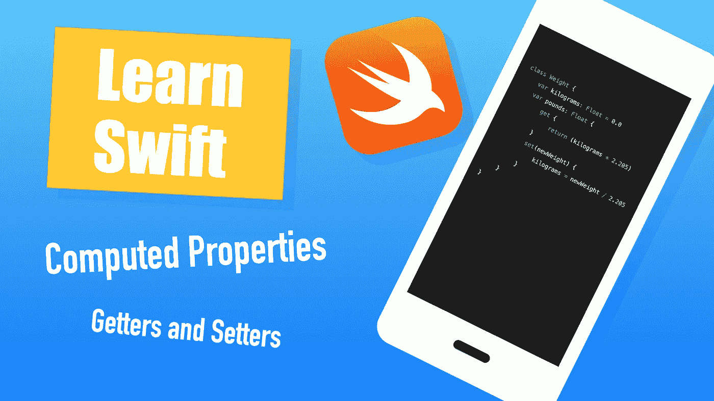

# Swift 简化了 Getters 和 Setters

> 原文：<https://betterprogramming.pub/getters-and-setters-made-simple-in-swift-ee8b56beb66>

## 了解如何以及何时按需计算属性



作者照片。

在 Swift 中，最常见的属性是存储属性和计算属性。

*   存储属性存储一个值供以后使用(例如，属于类实例的变量)。
*   计算属性不存储值。相反，它只在被请求时才进行计算。

从语法上来说，访问计算属性看起来就像访问任何属性一样。例如，访问权重实例的计算属性`kilos`:

```
weight.kilos
```

# 在 Swift 中使用计算属性

为了创建计算属性，Swift 为您提供了一个 getter 和(可选的)setter 方法。

*   getter 方法用于在请求时执行计算。
*   setter 方法是可选的方法。它可用于修改相关属性。

为了更好地理解 setter，假设您有一个可以称之为`weight.kilograms`和`weight.pounds`的权重。然而，在更新权重时有一个问题:

```
weight.pounds = 150 
```

现在，`weight.kilograms`不再是最新的，因为只有`pounds`得到了更新。

这就是 setter 方法有用的地方。您可以使用它来修改相关属性。在 setter 方法的帮助下，调用`weight.pounds = 150`会自动更新`weight.kilograms`。

# Swift 中计算属性的简单示例

假设您正在使用砝码，并且希望轻松地在千克和磅之间进行转换。

在编写任何代码之前，让我们想象一下代码应该如何工作:

```
**let** weight = Weight()    // Initialize a weightweight.kilograms = 100   // Set the weight in kilos
print(weight.pounds)     // Kilos as poundsweight.**pounds** = 315      // Assign a new weight in **pounds**...
print(weight.kilograms)  // ...and also update **kilos** automatically
```

简而言之，您希望能够用一次赋值来指定一个新的重量(千克或磅),以便自动更新这两个重量。

为了实现这一点，让我们利用计算属性:

让我们更仔细地检查一下上面的代码。`Weight`是一个类，而`kilograms`只是一个属于类实例的常规变量。那里没什么特别的。

`pounds`变量是“神奇”发生的地方:

*   `pounds`是一个计算属性。它的值仅在被请求时计算。
*   `get`块执行按需计算:当您调用`weight.pounds`时，`kilograms`属性被转换为磅。
*   当重量以磅为单位改变时，`set`模块负责更新千克。注意 setter 中的`newWeight`参数。它只是指您分配给`pounds`的新权重。

干得好！现在，代码就像您希望的那样工作:

```
**let** weight = Weight()weight.kilograms = 100
print(weight.pounds)        // The getter method is invokedweight.pounds = 315         // The setter method is invoked
print(weight.kilograms) 
```

输出:

```
220.5
142.85715
```

恭喜你。现在您知道了什么是计算属性，以及如何自己创建一个计算属性。

# 什么时候应该使用计算属性？

您可能已经注意到，没有什么可以阻止您用方法替换计算属性。对于何时应该或不应该使用计算属性，没有正确或错误的答案，但这里有一些建议:

在下列情况下，计算属性很有用:

*   该属性依赖于其他属性(就像前面的权重示例一样)。
*   您正在定义一个[扩展](https://medium.com/codex/swift-basics-introduction-to-extensions-47c7c96b1e7a)中的属性。

如果计算出的属性满足以下条件，则选择该属性上的方法:

*   需要论据。计算属性不能接受参数。
*   需要执行计算量大的任务。
*   抛出错误。

# 结论

在 Swift 中，计算属性不存储值，而是在尝试访问时按需计算。

计算属性的一个常见用例是从另一个相关属性中派生一个值(例如，从千克到磅)。

在 Swift 中使用计算属性时，您可以使用 getter 方法来计算属性。可选的 setter 方法也可以用来更新相关的属性(例如，`weight.kilograms = 100`自动更新`weight.pounds`)。

感谢阅读。我希望你觉得这有用！

# 进一步阅读

[](https://www.codingem.com/swift-interview-questions/) [## 50 个 Swift 面试问答- Codingem

### 这里列出了 50 个 Swift 面试问题和答案。这些问题侧重于 Swift 编程和 iOS 应用程序…

www.codingem.com](https://www.codingem.com/swift-interview-questions/) 

# 资源

 [## Swift.org

### 您可以将此页面上的资源用作 Swift 语言的文档。苹果公司拥有额外的资源…

swift.org](https://swift.org/documentation/)