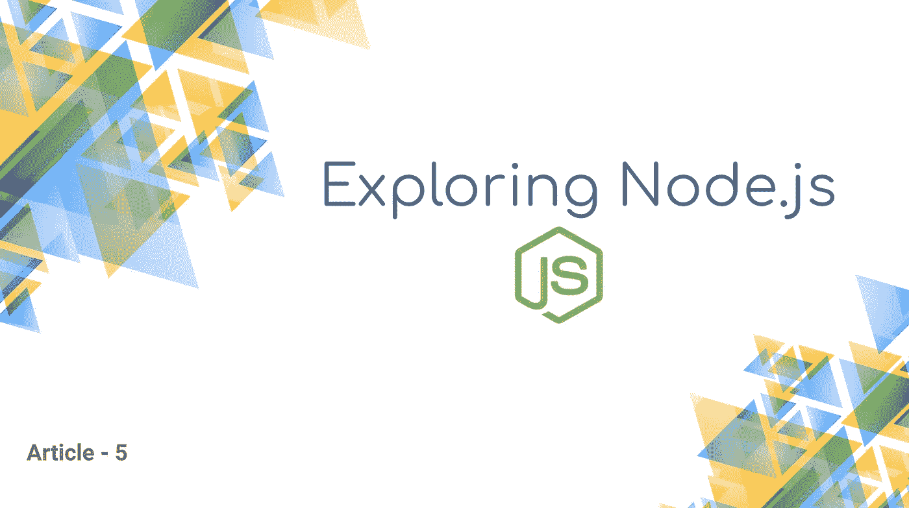
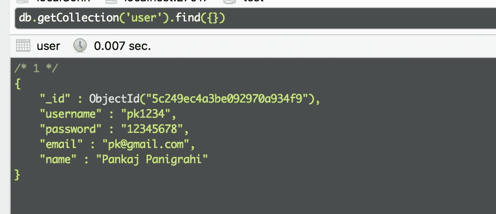
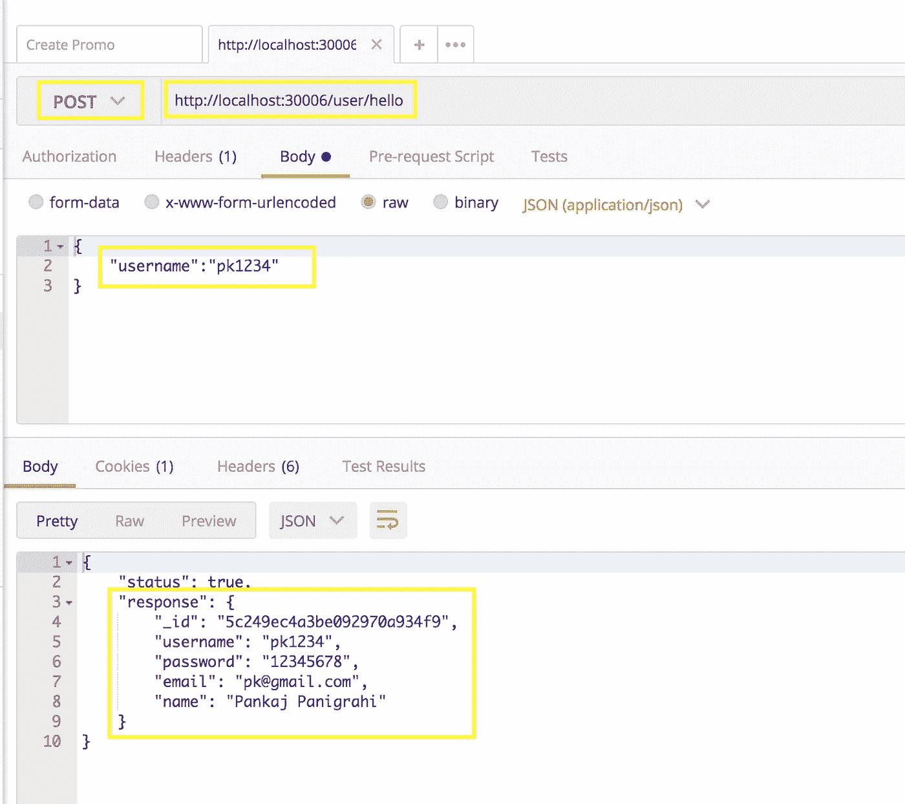
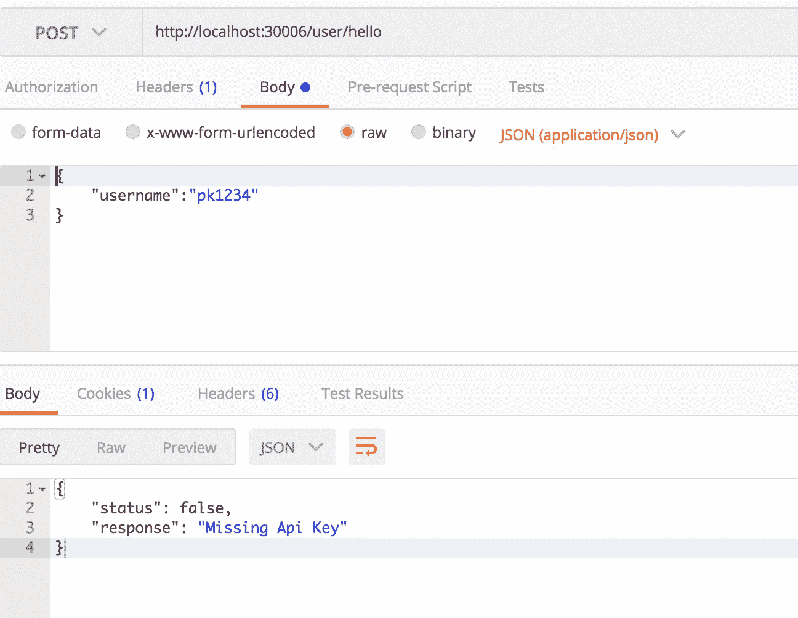
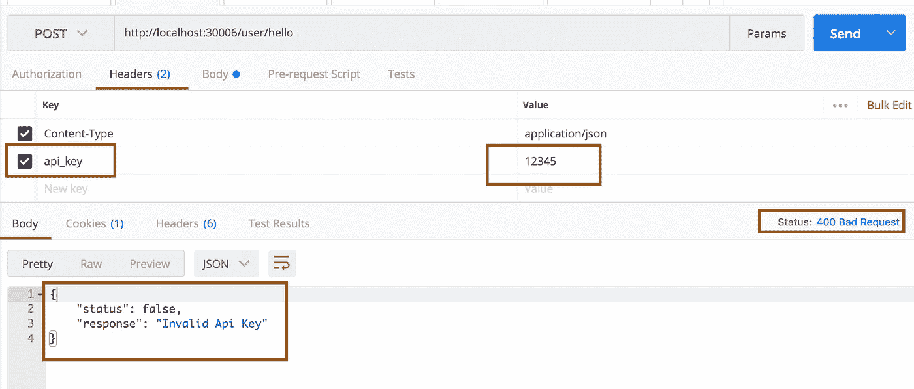
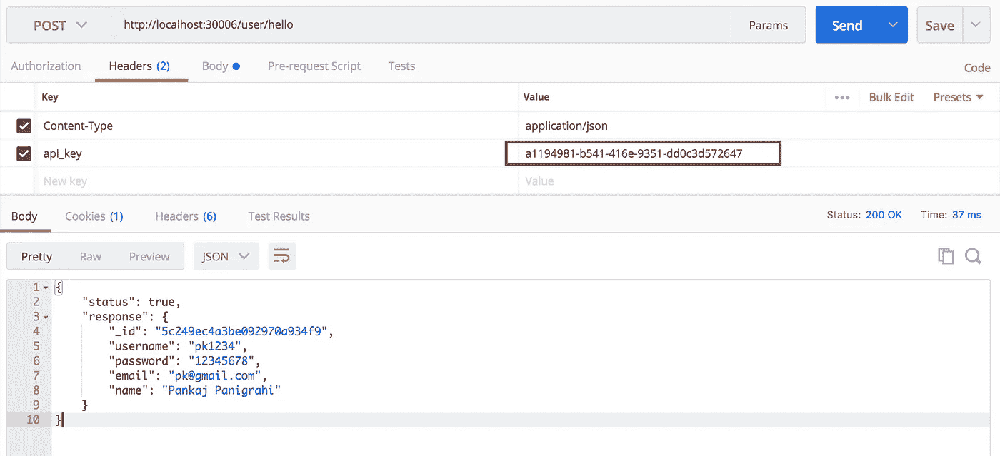

# 从 MongoDB 获取数据&在 Express 中创建 API 密钥验证中间件

> 原文：<https://betterprogramming.pub/getting-data-from-mongodb-creating-an-api-key-validation-middleware-in-express-944382205d3e>



本文是[系列文章](https://medium.com/@pankaj.panigrahi/list-of-node-js-articles-ededa6dd304b)的第 5 篇，它将帮助您掌握 Node.js 背后的不同概念，并使您能够创建生产就绪的应用程序。

这篇文章期望读者了解巴别塔以及如何设置它。如果你需要知道如何做，请阅读这篇文章。

在本文中，我们将学习使用官方的 [Node.js](https://nodejs.org/) 驱动程序， [MongoDB](https://www.npmjs.com/package/mongodb) 从 Mongo 数据库获取数据。

首先安装驱动程序。

```
npm install mongodb --save
```

现在，根据官方文档，这是我们连接到实例的方式:

在每条路线中，我们现在都可以连接到数据库并获取数据。但是这种方法效率很低。对于路由，我们必须打开一个连接，然后关闭它。这会使我们的 API 变慢。

从上一篇文章中学习，让我们编写一个中间件函数，它将在请求对象中为我们提供 DB 连接。

让我们使用与上次相同的项目，并编辑`app.js`文件。将此代码放在文件的顶部:

这里我们导入 Mongo 客户端，并将数据库连接设置为一个全局变量`mongoClient` *。*

然后注入一个中间件函数来修改请求对象以拥有 DB 实例。

```
app.use((req,res,next)=>{
   req.db = mongoClient.db('test');
   next();
})
```

当我们的 API 停止时，我们需要关闭 DB 连接。在底部添加以下代码:

我们的`app.js`长这样:

在`services`文件夹*内创建一个文件`UserService.js`。*在文件中写下下面的代码。

这里我们导出一个函数`getUserDetails`，它带有两个参数`db`和`username`，并返回一个`promise`，其中用户记录与用户名相匹配。

现在我们将修改旧的`routes/user.js` 文件，代码如下*。*

在 route 方法中，我们将 DB 实例和用户名传递给服务方法，然后在响应数据中设置用户详细信息。

我们的数据库中有以下记录。



让我们运行代码，并使用 Postman 调用 API。我们将尝试在 API 响应中从 MongoDB 检索显示的数据。



恭喜你。我们刚刚制作了第一个从 MongoDB 获取数据的 API。

现在，我们将向 express API 添加客户端 API 密钥验证中间件。为什么我们需要这样的中间件？在一个真实的项目中，我们可能有 50-60 个 API 执行不同的任务。但是每个 API 可能都需要一些通用的功能，比如客户端 API 密钥验证、认证检查、用户角色验证等。

在本教程中，我们将看到如何添加客户端 API 密钥验证。这将确保我们的 API 可以被那些已经获得唯一 API 密匙的人调用。这也有助于限制来自客户端的请求数量，并为特定客户端创建 API 命中分析。

首先，在`services`文件夹中创建另一个服务文件`ClientService.js`，并编写以下代码:

它类似于我们之前写的`getUserDetails`方法。它搜索带有匹配 API 键的客户记录，并返回一个承诺。

在`common`文件夹中创建一个文件`authUtils.js`。

在这里导入`getClientDetails`方法。

```
import {getClientDetails} from '../services/ClientService';
```

创建一个中间件函数，如图所示。这个函数有三个参数:`req`、`res`、`next`。

```
export const clientApiKeyValidation = async (req,res,next) => {
   let clientApiKey = req.get('api_key');
}
```

我们使用`express`给出的`req.get()`方法得到头`api_key` 。让我们为缺失的`api_key`添加一个验证。即使`res.send()` 结束了流，我们也编写`return res.send()`来避免任何进一步的代码执行。

```
if(!clientApiKey){
   return res.status(400).send({
      status:false,
      response:"Missing Api Key"
   });
}
```

现在，一旦我们在头中传递了`api_key`，我们将调用之前导入的`getClientDetails`方法。

如果我们尝试获取`clientDetails`——在成功的查询中，我们通过调用`next()`、来允许流程继续进行，否则我们停止 API 流程并发送`invalid API key`响应。

我们的`common/authUtils.js`文件应该是这样的:

现在，将这个中间件注入到我们的 express 对象中。打开`app.js`文件，导入上述方法。

```
import {clientApiKeyValidation} from './common/authUtils';
```

在 Mongo 客户端实例之后注入方法，因为我们需要 Mongo 实例。

```
app.use((req,res,next)=>{
   req.db = mongoClient.db('test');
   next();
});app.use(clientApiKeyValidation);
```

运行代码，打 API 没有任何`api_key`。



我们得到了缺失的验证响应

尝试用不正确的 API 键点击 API。



最后，使用正确的 API 密钥:



这就是我们编写自定义中间件方法的方式。在 express 中构建 API 时，这是一个非常强大的工具。我们可以使用相同的方法进行授权检查并创建响应处理程序。

我希望你喜欢这篇文章！在下一篇文章中，我们将看到如何使用 Redis 和自定义授权模块实现身份验证。

# 密码

[https://github.com/pankaj805/medium-05_mongo_client](https://github.com/pankaj805/medium-05_mongo_client)

如果你喜欢这篇文章，请留下评论并与他人分享。