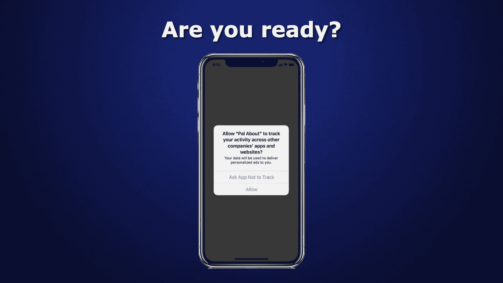
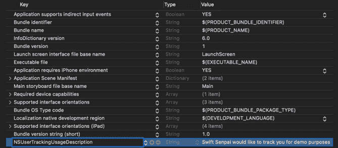

# 为 iOS 14.5 中的应用程序跟踪透明度做好准备

> 原文：<https://betterprogramming.pub/getting-ready-for-app-tracking-transparency-d3b78d062114>

## 请求允许以正确的方式使用 IDFA



回到 2020 年 6 月，在 WWDC20 期间，苹果宣布，从 iOS 14 开始，开发者在跟踪用户之前需要获得用户的许可。换句话说，除非获得授权，否则应用程序无法访问设备的 IDFA(广告商的标识符)。

2020 年 9 月，[苹果推迟了这一变化](https://developer.apple.com/news/?id=hx9s63c5)，以便开发者和发行商有更多的时间来适应。

本月早些时候(2021 年 4 月)，苹果发布公告，要求所有开发者[为](https://developer.apple.com/news/?id=8h0btjq7) `[AppTrackingTransparency](https://developer.apple.com/news/?id=8h0btjq7)`做好准备，表明苹果将在他们即将发布的 iOS 公开版(iOS 14.5)中全面执行追踪授权。

作为一名开发人员，我们的工作是确保我们的应用程序在公开发布时能够顺利运行。如果你的应用程序正在使用 IDFA，并且你想了解如何让你的应用程序符合`AppTrackingTransparency`标准，请继续阅读。

# 了解 IDFA

在深入研究代码之前，让我们快速地看一下 IDFA 是什么。

首先，确保你没有混淆 IDFA 和 IDFV(供应商的标识符)，苹果只是在 IDFA 上执行授权。换句话说，如果您的应用程序只使用 IDFV，则不需要进行任何更改。

IDFA 是一个字母数字字符串，对于每个设备都是唯一的。它主要用于广告定位、频率上限、广告欺诈检测、活动测量等。以下是 IDFA 的一个例子:

```
CE3BB49C-0F44-4DB9-9F6D-B2025A8A4FF7
```

IDFA 具有以下行为:

*   每个设备都有自己独特的 IDFA。
*   它是一个设备级别的标识符，这意味着安装在同一设备上的不同供应商的应用程序将具有相同的 IDFA。
*   删除应用程序*不会*重置/更改 IDFA(因为它是设备级标识符)。
*   禁用并重新启用设备的应用程序跟踪将重置其 IDFA。

> ***亲提示*** *:*
> 
> *在 iOS 14 中，你可以通过进入*设置 *>* 隐私 *>* 追踪 *>关闭*“允许应用请求追踪” *>* 要求应用停止追踪来禁用应用追踪。

# 请求追踪许可

在 iOS 14.5 之前，您可以使用以下代码不受限制地轻松获得 IDFA:

```
let idfa = ASIdentifierManager.shared().advertisingIdentifier
```

与此同时，在 iOS 14.5 中，如果你试图在未经用户许可的情况下访问 IDFA，它将被清零。

```
Zeroed out IDFA: 
00000000-0000-0000-0000-000000000000
```

为了获得用户权限，必须先将`NSUserTrackingUsageDescription`键添加到`info.plist`中。密钥的值是一个用法描述字符串，告诉用户为什么应用程序请求跟踪用户或设备的权限。



将 NSUserTrackingUsageDescription 添加到 info.plist

准备就绪后，您现在可以使用`AppTrackingTransparency`框架来显示一个系统权限警告请求:

在上面的代码中，您需要注意三件事:

*   只有当 app 的跟踪授权状态为`.notDetermined`时，`requestTrackingAuthorization(completionHandler:)`功能才会显示系统权限提示。一旦设置了授权状态，调用该函数只会触发完成处理程序，而不会显示警告。
*   如果在系统隐私设置中关闭了*“允许应用程序请求跟踪”*，将不会显示系统权限提醒。
*   完成处理程序是*而不是*在主线程上被触发。因此，如果您在完成处理程序中更新 UI，则需要分派到主线程。

> ***注:***
> 
> *在撰写本文时，iOS 模拟器中有一个*[*bug*](https://developer.apple.com/forums/thread/124604)*IDFA 总是被清零。在真实设备上测试您的代码，以避免任何意外行为。*

最后，您还可以使用下面的代码来确定应用程序的当前跟踪授权状态:

```
let status = ATTrackingManager.trackingAuthorizationStatus
```

# 拒绝处理访问

现在，您已经知道如何请求应用程序跟踪权限，如果用户拒绝您访问 IDFA 会怎样？

处理这种情况的一种方法是提供设置的快捷方式，以便用户可以轻松地更改跟踪权限。下面是如何做到这一点:

另一种处理方式是根本不使用 IDFA。但是，这种方法只适用于当你使用 IDFA 纯粹是为了运动测量。我这么说是什么意思？

苹果有一个验证广告驱动的应用安装的类— `[SKAdNetwork](https://developer.apple.com/documentation/storekit/skadnetwork)`。它是一个广告网络 API，帮助广告商衡量广告活动的成功，同时维护用户隐私。你可以在这篇[文章](https://adtechexplained.com/skadnetwork-explained/)中了解更多。

# 包扎

苹果再次加强了产品生态系统中的隐私控制。我真的很喜欢这个变化，这再次表明苹果真的很关心他们用户的隐私。

作为开发者，我们有责任确保我们的应用程序始终符合苹果隐私政策，以便我们的用户在使用我们的应用程序时感到安全和有保障。

如果你喜欢读这篇文章，请随意查看我的其他 iOS 开发文章。你也可以在[推特](https://twitter.com/Lee_Kah_Seng)上关注我。

感谢阅读！