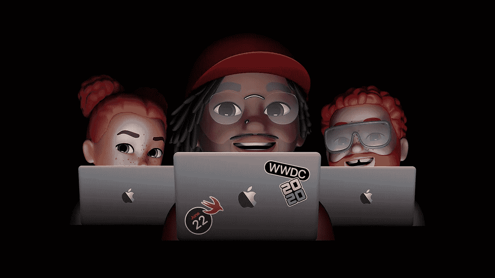
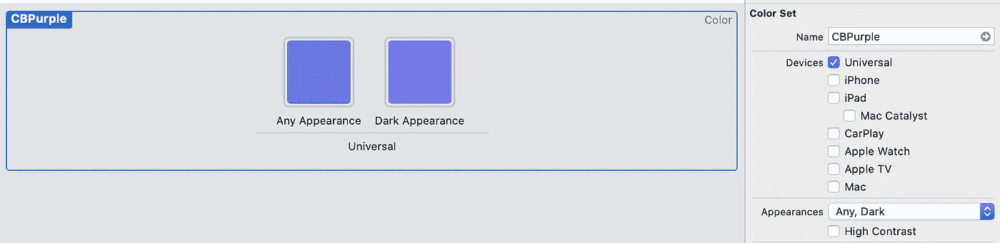
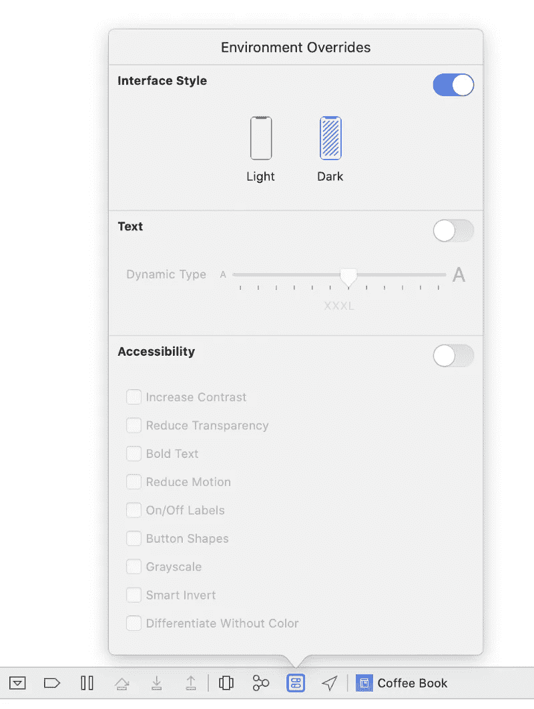
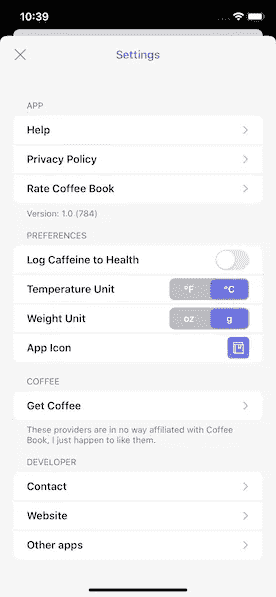
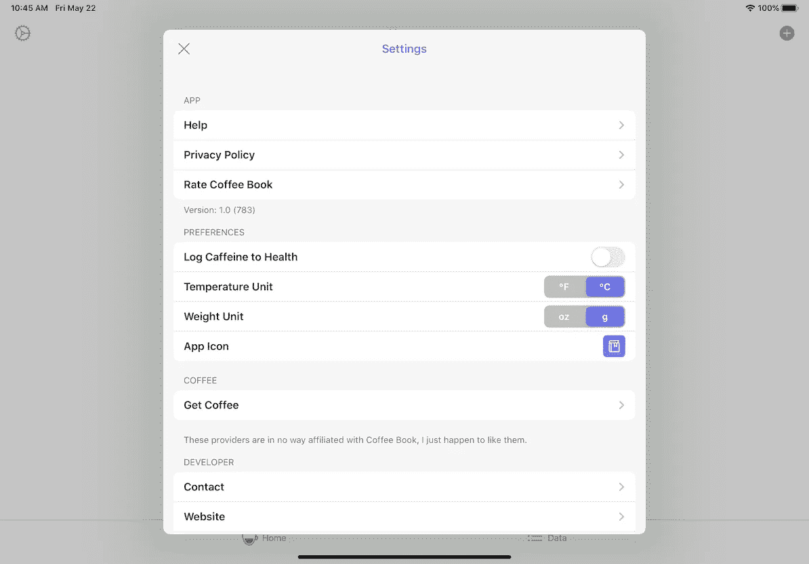

# 为 iOS 14 准备好您的应用

> 原文：<https://betterprogramming.pub/getting-ready-for-ios-14-7cffcf198239>

## 让你的用户界面和你的用户为今年 WWDC 的到来做好准备



图片由苹果公司提供

随着 WWDC20 于 6 月 22 日发布，以及下一代操作系统的测试版，现在是做好准备的时候了。我们只能猜测苹果可能会在 iOS 14 中添加的各种东西，但这并不意味着我们不能为它找到一个好位置。

这里有几件事是你应该做的，以便获得最佳职位，以及你该如何去做。

# **黑暗模式**

黑暗模式是我们看到的最大的面向用户的变化，带来了一个全系统的外观，满足了我们中间的夜猫子。实现它可以非常容易，它给你一个机会来完善你的资产，删除重复的颜色，因为你可以做出新的系统界面模式。



实现黑暗模式的最简单方法是在资产目录中显示您的颜色。

为此，只需转到您通常添加新图像的位置(资产列表底部的加号)，然后选择新颜色。将颜色设置为你想要的光模式颜色，打开右边的属性检查器。将外观选项设置为“任何，暗”，你会看到第二种颜色出现。将它设置为你希望你的颜色在黑暗模式下看起来的样子，通常是比正常外观稍微浅一点的颜色。

要在代码中使用这些颜色，您只需:

```
let color = UIColor(named: “’CBPurple”)
```

并且这些将自动响应接口状态的变化。确保浏览你的应用程序，将各种文本颜色设置为与黑暗模式相对应的新颜色，因为用户将无法阅读你的文本。你确实有很多系统颜色可供选择(假设你把你的部署目标设置为 iOS 13)，所有这些颜色都能很好地适应黑暗模式。要看到这一点，设置一些东西到`.systemRed`，并在明暗模式下看它。你会看到红色几乎变成了粉红色，变得更加易读。

**快速提示:**不用在模拟器中跳转到开发者设置或者使用你的手机并更改你自己的设置，你可以在 Xcode 中使用界面覆盖来轻松模拟黑暗模式。运行应用程序时选择环境覆盖切换，并在两种模式之间快速调整。



更多信息，请查看去年的 [WWDC 会议](https://developer.apple.com/videos/play/wwdc2019/214/)。

# **模态展示风格**

一旦你使用 iOS 13 中的系统应用程序，或者任何经过优化的应用程序，你就会注意到模态现在呈现出一点点不同。

这是因为默认的表示风格已经从`UIModalPresentationFullScreen`变成了`UIModalPresentationAutomatic`，它会根据上下文发生变化。自动的默认演示风格是`UIModalPresentationPageSheet`。



iPhone 上的页面演示文稿

iPhone 上的页面演示为你提供了一个免费的交互式拖放功能，以及一个让底层屏幕变小的华丽动画。

在 iPad 上，你可以在屏幕中央看到一个模态，你可以再次拖动它来关闭。当在一个紧凑的环境中，例如最小的多任务窗口，它会恢复到 iPhone 风格的演示。



iPad 上的页面演示

你应该在整个应用程序中注意这些，确保如果你有用户不能忽略的东西，比如一个登录表单，你要么改变显示风格，要么禁用忽略。

为了阻止用户关闭，覆盖视图控制器上的属性`isModalInPresentation`，并将其设置为`true`。这将禁用交互式消除，直到您以编程方式更改属性或消除视图控制器。

你可以用这些做很多事情，我建议查看关于这个话题的 [WWDC 视频](https://developer.apple.com/videos/play/wwdc2019/224/)来了解更多。大约 15 分钟后，你会看到关于模态展示的详细信息，包括一些新的委托方法，可以帮助你发现解散。

# **场景委托**

iOS 13 带来了全新的`SceneDelegate`和对多窗口的支持。你应该考虑你的应用程序是否会从中受益——通过允许用户在 Mac 和 iPad 上打开多个实例，大多数生产力应用程序都会有很大的改进。看看笔记在你的 iPad 上的表现，允许你并排打开两个。

如果您创建了一个新的应用程序，场景代理现在是默认的。现在我们有了场景委托，应用程序委托的角色略有不同。它应该只用于一次性设置，例如初始化您的数据库或注册推送通知。

场景代理具有您习惯于从应用程序代理获得的所有生命周期挂钩，包括:

*   连接(启动)
*   断开连接(停止)
*   变得活跃
*   主动辞职
*   进入前景
*   输入背景

您可以使用所有这些来重新创建您过去在应用程序代理中拥有的功能，只是现在您已经为多窗口做好了准备。如果你确保一个场景处于活动状态时，它的所有数据源都是最新的，你应该没有什么工作要做。

为了在你的应用程序中打开一个新窗口，你必须利用一个现有的 API 来响应试图打开一个窗口的用户。一个很好的例子是集合视图有一个新的…

```
collectionView(_collectionView: UICollectionView, itemsForBeginning session: UIDragSession, at indexPath: IndexPath)
```

…暴露给`UICollectionViewDragDelegate`的方法。如果您过去支持拖放操作，您可能已经符合这一点了——在这种情况下，您只需使用新方法来添加整个新窗口。

在提供的示例中，您可以看到整个生命周期:设置一个`NSUserActivity`，将其注册到一个项目提供者，然后从该提供者创建一个拖动项目。

如果你这样做，用户可以从你的收藏视图中拖动项目，为你的应用程序创建一个新窗口，而你所做的只是遵从这个委托，并在你的新场景中响应用户活动——几乎毫不费力！

```
func collectionView(_ collectionView: UICollectionView, itemsForBeginning session: UIDragSession, at indexPath: IndexPath) -> [UIDragItem] { 
    var dragItems = [UIDragItem]()
    let selectedPhoto = photo(at: indexPath) if let imageToDrag = UIImage(named: selectedPhoto.name) { let userActivity = selectedPhoto.openDetailUserActivity let itemProvider = NSItemProvider(object: imageToDrag) itemProvider.registerObject(userActivity, visibility: .all) let dragItem = UIDragItem(itemProvider: itemProvider) dragItem.localObject = selectedPhoto dragItems.append(dragItem) } return dragItems}
```

仅在这个话题上，苹果就有一个[伟大的指南](https://developer.apple.com/documentation/uikit/app_and_environment/scenes/supporting_multiple_windows_on_ipad)。

# **折旧**

做好准备时要记住的最重要的事情可能是你在应用程序中使用的被否决的 SDK 特性。

当我们访问新的 SDK 时，这些警告中的任何一个都可能突然变成错误——所以去掉它们吧

这里有几个需要注意的。

## **' uinavigationbar . appearance()'**

旧的`UINavigationBar.appearance`API 在 iOS 13 上已经不起作用了。您应该考虑实现`UINavigationBarAppearance`。这是以类似的方式使用，但更具定制性。

```
**let** navigationBarAppearance = UINavigationBarAppearance()navigationBarAppearance.backgroundColor = UIColor(named: “purple”)navigationController?.navigationBar.scrollEdgeAppearance = navigationBarAppearancenavigationController?.navigationBar.compactAppearance = navigationBarAppearancenavigationController?.navigationBar.standardAppearance = navigationBarAppearance
```

一定要在所有不同的外观下测试你的导航条——例如，iPhone 上的横向呈现为`compactAppearance`。你可能想要定制每一个外观来更好地适应它的使用，可能改变一些东西，比如字体颜色或者工具条背景。

## **“状态条样式”**

状态栏定制已经过调整，可以更好地与新的`UIWindowScene`API 配合使用。

`UIApplication.shared.statusBarStyle = .lightContent`

你不能再简单地在整个应用程序上设置`statusBarStyle`。你必须在每个 V `iewController`的水平上做这件事，使用像下面这样的东西。如果您在导航控制器上这样做，它将为导航堆栈中的每个视图显示您想要的方式——消除了覆盖每个视图控制器的需要。

```
**override** **var** preferredStatusBarStyle: UIStatusBarStyle { **return** .lightContent}
```

## **“ui webview”**

嗯，这是一个大问题。

商店中将不再允许引用`UIWebView`的应用。对于新的应用程序来说，这已经是事实了——所以你真的没有选择。
记住，如果你用`UIWebView`替换`WKWebView`，苹果也有[新规定](https://developer.apple.com/app-store/review/guidelines/#design)你的应用程序的主要功能是网络视图，所以要小心。

要警惕你的豆荚可能还会引用`UIWebView`，即使你没有。这在任何内置了某种形式网络的老式 pod 中都很常见，比如 [AFNetworking](https://github.com/AFNetworking) 。

如果你的应用不完全基于`UIWebView`，你应该很容易就能通过非常相似的 API 进行移植。在这里，您可以完全免费地获得很多性能改进。

 [## WKWebView

### 声明重要从 iOS 8.0 和 OS X 10.10 开始，使用 WKWebView 向你的应用添加网页内容。不要使用…

developer.apple.com](https://developer.apple.com/documentation/webkit/wkwebview) 

## **“关键窗口”**

由于添加了场景委托，我们可能已经习惯的应用程序的某些属性已经被移除。您仍然可以访问它们，但是它们可能不会像您预期的那样运行。

`UIApplication.shared.keyWindow`将向您显示错误:

> "`keyWindow`在 iOS 13.0 中已被弃用:不应用于支持多个场景的应用程序，因为它会在所有连接的场景中返回一个关键窗口。"

苹果在 WWDC19 上推荐的解决方案是简单地手动跟踪你的窗口。这样你就可以跟踪应用程序中的初始窗口，然后在运行过程中添加其他窗口。

这使得在整个窗口上呈现东西变得再一次微不足道，因为你可以确保你在正确的窗口上呈现，而不是随便一个窗口。想象一下，如果你在第二个窗口中做的事情在第一个窗口中出现了错误，这不是一个好的用户体验。

如果你真的要抓取关键窗口，你可以迭代`UIApplication.shared.windows`，寻找第一个`.isKeyWindow`返回`true`的窗口。

这里有一个方便的向后兼容的扩展来做到这一点:

```
 extension UIWindow {
    static var key: UIWindow? {
        if #available(iOS 13, *) {
        return UIApplication.shared.windows.first { $0.isKeyWindow }
        } else {
        return UIApplication.shared.keyWindow
        }
    }
}
```

# 结论

虽然这看起来像是相当多的工作——但当你完成一个为下一个最好的事情做好准备的项目时，这是值得的！